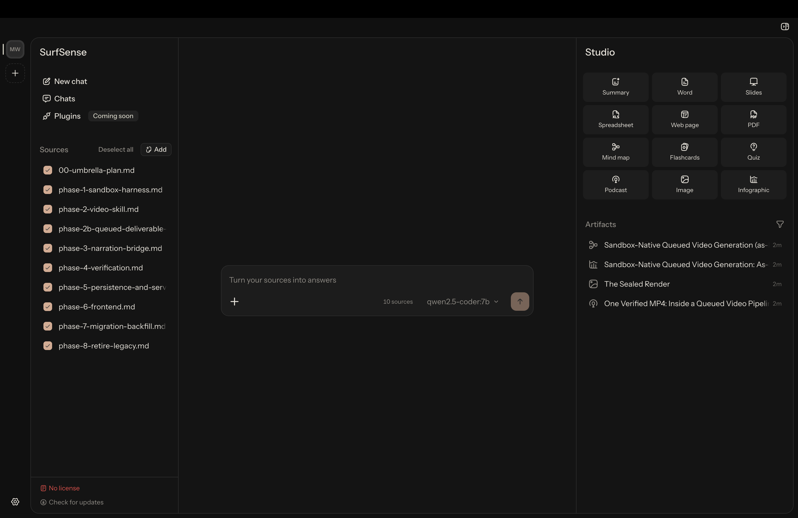

<!--
  ملاحظة الإيقاف محدودة بزمن. احذفها في 18 أكتوبر 2026 عند إغلاق نافذة
  التصدير، مع رابط «الاستيراد من التطبيق المستضاف» في الأسفل.
  هذا الملف يتابع README.md قسمًا بقسم.
  مسوغ هذه الصفحة: plans/community-local/seo/06-repo-readme.md
-->

  

  <h1>SurfSense</h1>

  

    <b>بديل NotebookLM المفتوح المصدر، المعزول عن الشبكة.</b>
     
    المستندات التي لا يمكن رفعها تصير إحاطات وعروض شرائح وتقارير وأدلة دراسة وبودكاست، بالكامل على الجهاز نفسه.
  

  

    <a href="https://www.surfsense.com/downloads"><b>تنزيل</b></a> ·
    <a href="https://www.surfsense.com/docs">التوثيق</a> ·
    <a href="#ما-يصنعه-surfsense">ما يصنعه</a> ·
    <a href="#كيف-يقارن-surfsense">المقارنة</a> ·
    <a href="https://www.surfsense.com/pricing">الأسعار</a> ·
    <a href="https://discord.gg/ejRNvftDp9">Discord</a>
  

  

  

    <a href="README.md">English</a> | العربية | <a href="README.de.md">Deutsch</a> | <a href="README.es.md">Español</a> | <a href="README.fr.md">Français</a> | <a href="README.hi.md">हिन्दी</a> | <a href="README.ja.md">日本語</a> | <a href="README.ko.md">한국어</a> | <a href="README.pt-BR.md">Português</a> | <a href="README.ru.md">Русский</a> | <a href="README.zh-CN.md">简体中文</a>
  

  

SurfSense تطبيق سطح مكتب مجاني ومفتوح المصدر للمستندات الموجودة أصلًا. تُلقى في التطبيق، وتُطرح الأسئلة، وتأتي الإجابات مع ذكر المصدر، ثم تصير المستندات نفسها إحاطة أو عرض شرائح أو تقريرًا أو دليل دراسة أو بودكاست. كل ذلك يجري على الجهاز: الفهرس يقيم على القرص، والنموذج يُختار هناك، والتطبيق لا يرفع شيئًا. لا حساب يُنشأ.

**للبدء.** يُنزَّل برنامج التثبيت المناسب للجهاز، ثم يُؤتى بمفتاح نموذج خاص أو يُترك للتطبيق جلب نموذج محلي.

| المنصة | التنزيل |
|---|---|
| **Windows** x64 | [SurfSense-Setup.exe](https://github.com/MODSetter/SurfSense/releases/latest/download/SurfSense-Setup.exe) |
| **macOS** Apple Silicon | [SurfSense-arm64.dmg](https://github.com/MODSetter/SurfSense/releases/latest/download/SurfSense-arm64.dmg) |
| **Linux** x64 (AppImage) | [SurfSense.AppImage](https://github.com/MODSetter/SurfSense/releases/latest/download/SurfSense.AppImage) |
| **Linux** x64 (deb) | [SurfSense.deb](https://github.com/MODSetter/SurfSense/releases/latest/download/SurfSense.deb) |

كل رابط دائم ويشير إلى أحدث إصدار. يمكن أيضًا الاختيار من [surfsense.com/downloads](https://www.surfsense.com/downloads) أو تصفح [كل الإصدارات](https://github.com/MODSetter/SurfSense/releases). يحدّث AppImage نفسه تلقائيًا، وdeb لا يفعل.

> [!NOTE]
> **هل استُخدم تطبيق الويب المستضاف؟** يجري إيقافه. يُفتح مرة واحدة لتصدير مساحات العمل، ثم تُستورد الحزمة إلى تطبيق سطح المكتب. تنتقل المستندات والمجلدات والعناوين وسلاسل المحادثة كلها. تغلق نافذة التصدير في 18 أكتوبر 2026. التفاصيل في [صفحة الإيقاف](https://www.surfsense.com/sunset).

## ما يصنعه SurfSense

تُختار بضعة مستندات وصيغة. التطبيق يكتب الناتج من المصادر المختارة، على الجهاز.

| الصيغة | الناتج | يلزم |
|---|---|---|
| **ملخص** | إحاطة منظمة للمصادر المحددة | نموذج توليد |
| **بطاقات** | مجموعة تفاعلية، بطاقة واحدة في كل مرة | نموذج توليد |
| **اختبار** | أسئلة اختيار من متعدد مع الإجابات | نموذج توليد |
| **خريطة ذهنية** | Markmap تُكبَّر وتُطوى | نموذج توليد |
| **شرائح** | ملف `.pptx` قابل للتحرير، لا صورة لعرض | نموذج توليد |
| **مستند** | تقرير `.docx` قابل للتحرير | نموذج توليد |
| **جدول** | ملف `.xlsx` للجداول المستخرجة من المصادر | نموذج توليد |
| **صفحة ويب** | صفحة HTML مكتفية بذاتها | نموذج توليد |
| **PDF** | PDF منضّد | نموذج توليد |
| **بودكاست** | حوار صوتي بين مضيفين، بصوت Kokoro-82M من دون شبكة | نموذج توليد + نموذج صوت |
| **صورة** | رسم توضيحي للمادة | نموذج صور + نموذج توليد |
| **إنفوجرافيك** | ملخص بصري في لوحة واحدة | نموذج صور + نموذج توليد |

بعض المهام تحتاج أكثر من صيغة. دليل الدراسة ملخص ومجموعة بطاقات واختبار على مجموعة المصادر نفسها، وإحاطة العميل في العادة هي العرض الذي يُقدَّم منه مع الملخص الذي يُرسل بعده. عروض الفيديو لم تُبنَ بعد.

## كل شيء يبقى على الجهاز نفسه

يُوجَّه هذا إلى أوراق القضايا، وأوراق عمل العملاء، وتفريغات المقابلات، والمواصفات الداخلية، والبحث غير المنشور، وملاحظات محاضرات فصل دراسي كامل. يمكن السؤال عبر ذلك كله، وكل إجابة تذكر المصدر الذي جاءت منه. التطبيق لا يرفع شيئًا منه.

- **الفهرس محلي.** يجري التحليل والتقسيم إلى مقاطع والتضمين على الجهاز، في SQLite تحت `~/.surfsense`. لا يحتفظ SurfSense بنسخة منه ولا بسجل لما طُرح من أسئلة.
- **كل دور يمكن أن يعمل محليًا.** محلّل المستندات ونموذج الاسترجاع وصوت البودكاست داخل برنامج التثبيت. المحادثة وتوليد الصور يأتيان كخوادم محلية تُنزَّل أوزانها مرة واحدة، فيصير إنتاج النص والصوت والصور ممكنًا بلا حساب وبلا مفتاح API. نختبر ذلك بإدخال PDF والشبكة معطّلة.
- **الاتصالات الصادرة مطفأة افتراضيًا.** لوحة الاتصالات الخارجة تسرد كل وجهة يستطيع التطبيق بلوغها، ويُفعَّل منها ما يُراد.
- **لا تتبّع للاستخدام ولا تقارير أعطال.** لا شيء يرسل بيانات إلى الخارج، فلا يوجد خيار إيقاف يجب العثور عليه.

لا يستطيع SurfSense أن يقول إن كان هذا يستوفي لائحة بعينها. ذلك يتوقف على الضوابط القائمة وعلى الجهة الرقابية. كل ما يستطيع التطبيق قوله هو على أي جهاز تقع المستندات.

## كيف يقارن SurfSense

ثلاثة أنواع من المنتجات تُدعى «NotebookLM المحلي»، وهي تجيب عن أسئلة مختلفة. لا أداة منها سيئة. ما يبقى في اليد في النهاية مختلف.

**مقابل Jan وAnythingLLM وOpen WebUI وLM Studio.** هذه تشغّل نموذجًا محليًا وتتيح مكانًا للحديث معه. SurfSense يجيب عن السؤال التالي: كيف يخرج مستند جاهز؟ يمكن الجمع بينها بتوجيه SurfSense إلى أي نقطة اتصال متوافقة مع OpenAI، بما فيها نقطة منها.

**مقابل RemNote وQuizlet وNoteGPT وStudyFetch وGamma.** هذه تنتج مخرجات، وبعضها يبدو أفضل من مخرجاتنا. المقابل هو مصير المادة: تُرفع، ويُدفع كل شهر، وتبقى الملفات في حساب طرف آخر.

**مقابل Google NotebookLM.** هو يقدّم أصلًا بطاقات واختبارات وخرائط ذهنية وعروضًا صوتية، فالطرفان ينتجان أشياء متقاربة جدًا. الفرق هو جهاز من يقوم بالعمل، وأي نموذج يمكن توجيهه إليه.

| | Google NotebookLM | SurfSense |
|---|---|---|
| يعمل بلا اتصال / معزول عن الشبكة | لا | **نعم** |
| المستندات تغادر الجهاز | نعم | **لا** |
| الحساب مطلوب | حساب Google | **لا حساب** |
| مفتوح المصدر | لا | **Apache-2.0** |
| السعر | المستوى المجاني; Pro $19.99 في الشهر; Ultra $249.99 في الشهر | **التطبيق مجاني** |
| النماذج | Gemini فقط | أي API متوافقة مع OpenAI، أو نموذج محلي |
| حدود المصادر | 50 إلى 600 مصدر، 500,000 كلمة لكل منها | ما يتسع له القرص |
| العروض الصوتية والمرئية | نعم، وأفضل | الصوت نعم، بلا شبكة; الفيديو ليس بعد |

يتفوق NotebookLM في جودة الصوت، ولديه فيديو. إن كان بقاء المصادر على خوادم Google مقبولًا، فالاستخدام له. وإن لم يكن مقبولًا، فهذه الأداة من النوع نفسه بلا رفع.

## بداية سريعة

لا حاجة إلى Docker ولا إلى طرفية ولا إلى GPU ولا إلى ملف Compose.

1. **تنزيل برنامج التثبيت** من الجدول أعلاه. هو موقّع، لذلك لن يخاصم نظام التشغيل.
2. **اختيار نموذج.** يجلب التطبيق نموذجًا محليًا (Qwen3 في ستة أحجام، من 0.5 GB) أو يُلصق عنوان أساس ومفتاح لأي API متوافقة مع OpenAI. يتحقق المنتقي من قدرة الجهاز على تشغيل النموذج قبل عرضه، وأي مفتاح يُعطى يُخزَّن مشفّرًا، والسر في سلسلة مفاتيح نظام التشغيل.
3. **إلقاء المستندات.** التطبيق يحلّل ملفات PDF وملفات Office والصور على الجهاز.
4. **طرح الأسئلة.** كل إجابة تذكر المصدر الذي جاءت منه.
5. **فتح Studio،** اختيار صيغة، وأخذ الملف.

التنزيل هو الجزء البطيء، لأن برنامج التثبيت يحمل المحلّل ونموذج الاسترجاع وصوت البودكاست وخوادم النماذج المحلية، فيعمل التطبيق من دون شبكة.

## التوثيق والمجتمع

التطبيق مجاني، وتحديثاته مجانية. الترخيص يضيف إضافات ودعمًا بأولوية ولا يغلق غير ذلك، فالترخيص المنتهي يُبقي التطبيق وكل تحديث لاحق. التفاصيل في [الأسعار](https://www.surfsense.com/pricing).

حزمة Docker في هذا المستودع (`surfsense_backend`, `surfsense_web`, ملفات Compose) تبقى مفتوحة المصدر وقابلة للتثبيت، وهي **بدعم المجتمع: بلا اتفاقية مستوى خدمة وبلا خدمة مستضافة وراءها.** تطبيق سطح المكتب هو المسار المدعوم للمستخدمين الجدد.

- [التوثيق](https://www.surfsense.com/docs) للتثبيت والنماذج وصيغ Studio والاستضافة الذاتية
- [الاستيراد من التطبيق المستضاف](https://www.surfsense.com/sunset)
- [خادم MCP](./surfsense_mcp) لواجهة API الكشط المستضافة
- [Discord](https://discord.gg/ejRNvftDp9) للمساعدة والأفكار، و[Discussions](https://github.com/MODSetter/SurfSense/discussions) للاتجاه، و[Issues](https://github.com/MODSetter/SurfSense/issues) للأعطال القابلة لإعادة الإنتاج
- **نجمة للمستودع** لمن يتابع إلى أين يمضي هذا

## المساهمة

طلبات السحب مرحّب بها، و[CONTRIBUTING.md](CONTRIBUTING.md) يشرح المسار كله. باختصار:

- **إيجاد عمل:** بلاغ بوسم [`good first issue`](https://github.com/MODSetter/SurfSense/labels/good%20first%20issue) أو [`help wanted`](https://github.com/MODSetter/SurfSense/labels/help%20wanted)، أو سطر من قائمة Known gaps (الفجوات المعروفة) في نهاية كل مستند ضمن [`docs/architecture/`](docs/architecture/overview.md).
- **قراءة طريقة العمل أولًا:** [`docs/`](docs/README.md) يشرح كل ميزة ولماذا بُنيت هكذا، و[`docs/ROADMAP.md`](docs/ROADMAP.md) يُظهر ما يعمل عليه المشرفون.
- **فتح طلب سحب على `dev`.** إصلاح الأعطال والتوثيق لا يحتاجان نقاشًا قبل ذلك. الميزة الجديدة تبدأ بمقترح تصميم قصير. تطبيق سطح المكتب يعيش في [`surfsense_local/`](./surfsense_local)، وملف README هناك يغطي حلقة التطوير.

شكرًا لكل Surfers لدينا:

  

## تاريخ النجوم

  <a href="https://www.star-history.com/#MODSetter/SurfSense&Date">
    <picture>
      <source media="(prefers-color-scheme: dark)" srcset="https://api.star-history.com/svg?repos=MODSetter/SurfSense&type=Date&theme=dark" />
      <source media="(prefers-color-scheme: light)" srcset="https://api.star-history.com/svg?repos=MODSetter/SurfSense&type=Date" />
      
    </picture>
  </a>

## الرخصة

Apache-2.0. التفاصيل في [LICENSE](LICENSE).
