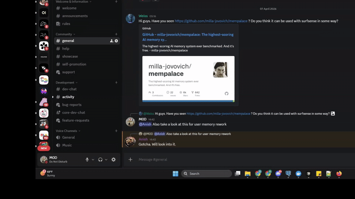
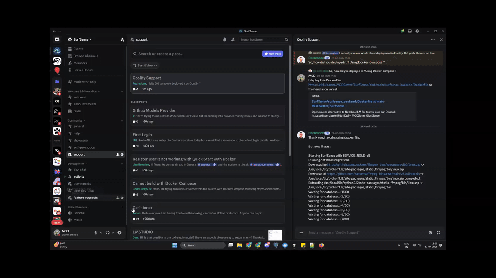
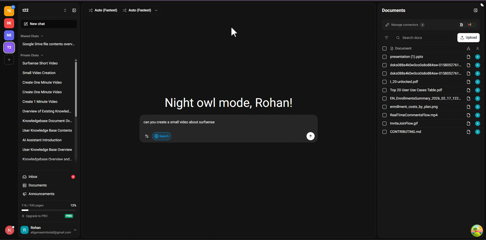
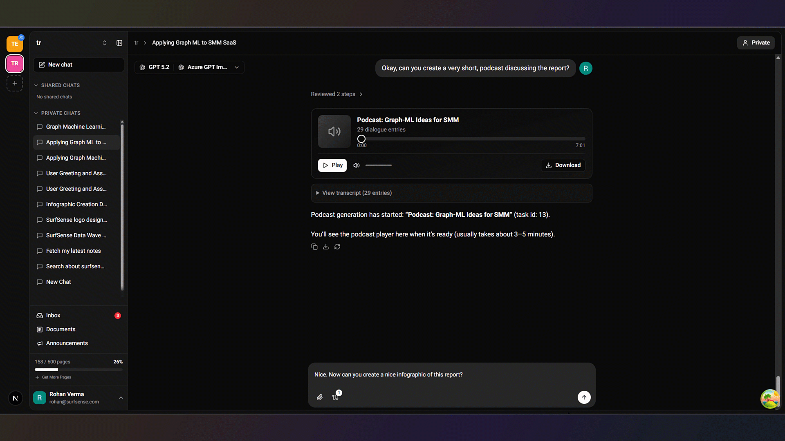
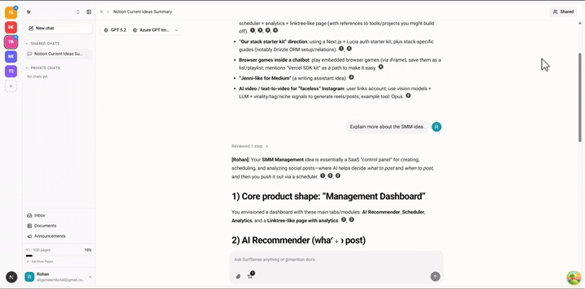

<a href="https://www.surfsense.com/"></a>


<div align="center">
<a href="https://discord.gg/ejRNvftDp9">

</a>
<a href="https://www.reddit.com/r/SurfSense/">

</a>
</div>

<div align="center">

[English](README.md) | [Español](README.es.md) | [Português](README.pt-BR.md) | [हिन्दी](README.hi.md) | [简体中文](README.zh-CN.md)

</div>
<div align="center">
<a href="https://trendshift.io/repositories/13606" target="_blank"></a>
</div>

# SurfSense

NotebookLM वहाँ उपलब्ध सबसे अच्छे और सबसे उपयोगी AI प्लेटफ़ॉर्म में से एक है, लेकिन जब आप इसे नियमित रूप से उपयोग करना शुरू करते हैं तो आप इसकी सीमाओं को भी महसूस करते हैं जो कुछ और की चाह छोड़ती हैं।

1. एक notebook में जोड़े जा सकने वाले स्रोतों की मात्रा पर सीमाएं हैं।
2. आपके पास कितने notebooks हो सकते हैं इस पर सीमाएं हैं।
3. आपके पास ऐसे स्रोत नहीं हो सकते जो 500,000 शब्दों और 200MB से अधिक हों।
4. आप Google सेवाओं (LLMs, उपयोग मॉडल, आदि) में बंद हैं और उन्हें कॉन्फ़िगर करने का कोई विकल्प नहीं है।
5. सीमित बाहरी डेटा स्रोत और सेवा एकीकरण।
6. NotebookLM एजेंट विशेष रूप से केवल अध्ययन और शोध के लिए अनुकूलित है, लेकिन आप स्रोत डेटा के साथ और भी बहुत कुछ कर सकते हैं।
7. मल्टीप्लेयर सपोर्ट की कमी।

...और भी बहुत कुछ।

**SurfSense विशेष रूप से इन समस्याओं को हल करने के लिए बनाया गया है।** SurfSense आपको सक्षम बनाता है:

- **अपने डेटा प्रवाह को नियंत्रित करें** - अपने डेटा को निजी और सुरक्षित रखें।
- **कोई डेटा सीमा नहीं** - असीमित मात्रा में स्रोत और notebooks जोड़ें।
- **कोई विक्रेता लॉक-इन नहीं** - किसी भी LLM, इमेज, TTS और STT मॉडल को कॉन्फ़िगर करें।
- **25+ बाहरी डेटा स्रोत** - Google Drive, OneDrive, Dropbox, Notion और कई अन्य बाहरी सेवाओं से अपने स्रोत जोड़ें।
- **रीयल-टाइम मल्टीप्लेयर सपोर्ट** - एक साझा notebook में अपनी टीम के सदस्यों के साथ आसानी से काम करें।
- **डेस्कटॉप ऐप** - Quick Assist, General Assist, Screenshot Assist और लोकल फ़ोल्डर सिंक के साथ किसी भी एप्लिकेशन में AI सहायता प्राप्त करें।

...और भी बहुत कुछ आने वाला है।


## वीडियो एजेंट नमूना

https://github.com/user-attachments/assets/012a7ffa-6f76-4f06-9dda-7632b470057a


## पॉडकास्ट एजेंट नमूना

https://github.com/user-attachments/assets/a0a16566-6967-4374-ac51-9b3e07fbecd7


## SurfSense का उपयोग कैसे करें

### Cloud

1. [surfsense.com](https://www.surfsense.com) पर जाएं और लॉगिन करें।

<p align="center"></p>

2. अपने कनेक्टर जोड़ें और सिंक करें। कनेक्टर्स को अपडेट रखने के लिए आवधिक सिंकिंग सक्षम करें।

<p align="center"></p>

3. जब तक कनेक्टर्स का डेटा इंडेक्स हो रहा है, दस्तावेज़ अपलोड करें।

<p align="center"></p>

4. सब कुछ इंडेक्स हो जाने के बाद, कुछ भी पूछें (उपयोग के मामले):

   - डेस्कटॉप ऐप — General Assist

   <p align="center"></p>

   - डेस्कटॉप ऐप — Quick Assist

   <p align="center"></p>

   - डेस्कटॉप ऐप — Screenshot Assist

   <p align="center"></p>

   - डेस्कटॉप ऐप — Watch Local Folder

   <p align="center"></p>

   - वीडियो जनरेशन

   <p align="center"></p>

   - बेसिक सर्च और उद्धरण

   <p align="center"></p>

   - दस्तावेज़ मेंशन QNA

   <p align="center"></p>
   <p align="center"></p>

   - रिपोर्ट जनरेशन और एक्सपोर्ट (PDF, DOCX, HTML, LaTeX, EPUB, ODT, सादा टेक्स्ट)

   <p align="center"></p>

   - पॉडकास्ट जनरेशन

   <p align="center"></p>

   - इमेज जनरेशन

   <p align="center"></p>

   - और भी बहुत कुछ जल्द आ रहा है।


### सेल्फ-होस्टेड

पूर्ण डेटा नियंत्रण और गोपनीयता के लिए SurfSense को अपने स्वयं के बुनियादी ढांचे पर चलाएं।

**आवश्यकताएँ:** [Docker Desktop](https://www.docker.com/products/docker-desktop/) इंस्टॉल और चालू होना चाहिए।

#### Linux/MacOS उपयोगकर्ताओं के लिए:

```bash
curl -fsSL https://raw.githubusercontent.com/MODSetter/SurfSense/main/docker/scripts/install.sh | bash
```

#### Windows उपयोगकर्ताओं के लिए:

```powershell
irm https://raw.githubusercontent.com/MODSetter/SurfSense/main/docker/scripts/install.ps1 | iex
```

इंस्टॉल स्क्रिप्ट दैनिक ऑटो-अपडेट के लिए स्वचालित रूप से [Watchtower](https://github.com/nicholas-fedor/watchtower) सेटअप करती है। इसे छोड़ने के लिए, `--no-watchtower` फ्लैग जोड़ें।

Docker Compose, मैनुअल इंस्टॉलेशन और अन्य डिप्लॉयमेंट विकल्पों के लिए, [डॉक्स](https://www.surfsense.com/docs/) देखें।

### डेस्कटॉप ऐप

SurfSense एक डेस्कटॉप ऐप भी प्रदान करता है जो आपके कंप्यूटर पर हर एप्लिकेशन में AI सहायता लाता है। इसे [नवीनतम रिलीज़](https://github.com/MODSetter/SurfSense/releases/latest) से डाउनलोड करें।

डेस्कटॉप ऐप में ये शक्तिशाली सुविधाएं शामिल हैं:

- **General Assist** — एक ग्लोबल शॉर्टकट से किसी भी एप्लिकेशन से तुरंत SurfSense लॉन्च करें।
- **Quick Assist** — कहीं भी टेक्स्ट चुनें, फिर AI से समझाने, फिर से लिखने या उस पर कार्रवाई करने को कहें।
- **Screenshot Assist** — स्क्रीन पर एक क्षेत्र चुनें और उसे चैट में जोड़ें, ताकि उत्तर आपकी नॉलेज बेस पर आधारित रहें।
- **Watch Local Folder** — एक लोकल फ़ोल्डर को वॉच करें और फ़ाइल परिवर्तनों को स्वचालित रूप से अपनी नॉलेज बेस में सिंक करें। **Pro tip:** इसे अपने Obsidian vault पर पॉइंट करें ताकि आपके नोट्स SurfSense में सर्च करने योग्य रहें।

सभी सुविधाएं आपके चुने हुए सर्च स्पेस पर काम करती हैं, ताकि आपके उत्तर हमेशा आपके अपने डेटा पर आधारित हों।

### रीयल-टाइम सहयोग कैसे करें (बीटा)

1. सदस्य प्रबंधन पेज पर जाएं और एक आमंत्रण बनाएं।

   <p align="center"></p>

2. टीममेट जुड़ता है और वह SearchSpace साझा हो जाता है।

   <p align="center"></p>

3. चैट को साझा करें।

   <p align="center"></p>

4. आपकी टीम अब रीयल-टाइम में चैट कर सकती है।

   <p align="center"></p>

5. टीममेट्स को टैग करने के लिए कमेंट जोड़ें।

   <p align="center"></p>

## SurfSense vs Google NotebookLM

| विशेषता | Google NotebookLM | SurfSense |
|---------|-------------------|-----------|
| **प्रति Notebook स्रोत** | 50 (मुफ़्त) से 600 (Ultra, $249.99/माह) | असीमित |
| **Notebooks की संख्या** | 100 (मुफ़्त) से 500 (सशुल्क योजनाएं) | असीमित |
| **स्रोत आकार सीमा** | 500,000 शब्द / 200MB प्रति स्रोत | कोई सीमा नहीं |
| **मूल्य निर्धारण** | मुफ़्त स्तर उपलब्ध; Pro $19.99/माह, Ultra $249.99/माह | मुफ़्त और ओपन सोर्स, अपनी इंफ्रा पर सेल्फ-होस्ट करें |
| **LLM सपोर्ट** | केवल Google Gemini | 100+ LLMs OpenAI spec और LiteLLM के माध्यम से |
| **एम्बेडिंग मॉडल** | केवल Google | 6,000+ एम्बेडिंग मॉडल, सभी प्रमुख रीरैंकर्स |
| **लोकल / प्राइवेट LLMs** | उपलब्ध नहीं | पूर्ण सपोर्ट (vLLM, Ollama) - आपका डेटा आपका रहता है |
| **सेल्फ-होस्ट करने योग्य** | नहीं | हाँ - Docker एक कमांड या पूर्ण Docker Compose |
| **ओपन सोर्स** | नहीं | हाँ |
| **बाहरी कनेक्टर्स** | Google Drive, YouTube, वेबसाइटें | 27+ कनेक्टर्स - सर्च इंजन, Google Drive, OneDrive, Dropbox, Slack, Teams, Jira, Notion, GitHub, Discord और [अधिक](#बाहरी-स्रोत) |
| **फ़ाइल फ़ॉर्मेट सपोर्ट** | PDFs, Docs, Slides, Sheets, CSV, Word, EPUB, इमेज, वेब URLs, YouTube | 50+ फ़ॉर्मेट - दस्तावेज़, इमेज, वीडियो LlamaCloud, Unstructured या Docling (लोकल) के माध्यम से |
| **सर्च** | सिमैंटिक सर्च | हाइब्रिड सर्च - हायरार्किकल इंडाइसेस और Reciprocal Rank Fusion के साथ सिमैंटिक + फुल टेक्स्ट |
| **उद्धृत उत्तर** | हाँ | हाँ - Perplexity शैली के उद्धृत उत्तर |
| **एजेंट आर्किटेक्चर** | नहीं | हाँ - [LangChain Deep Agents](https://docs.langchain.com/oss/python/deepagents/overview) द्वारा संचालित, योजना, सब-एजेंट और फ़ाइल सिस्टम एक्सेस |
| **रीयल-टाइम मल्टीप्लेयर** | दर्शक/संपादक भूमिकाओं के साथ साझा notebooks (कोई रीयल-टाइम चैट नहीं) | मालिक / एडमिन / संपादक / दर्शक भूमिकाओं के साथ RBAC, रीयल-टाइम चैट और कमेंट थ्रेड |
| **वीडियो जनरेशन** | Veo 3 के माध्यम से सिनेमैटिक वीडियो ओवरव्यू (केवल Ultra) | उपलब्ध (NotebookLM यहाँ बेहतर है, सक्रिय रूप से सुधार हो रहा है) |
| **प्रेजेंटेशन जनरेशन** | बेहतर दिखने वाली स्लाइड्स लेकिन संपादन योग्य नहीं | संपादन योग्य, स्लाइड आधारित प्रेजेंटेशन बनाएं |
| **पॉडकास्ट जनरेशन** | कस्टमाइज़ेबल होस्ट और भाषाओं के साथ ऑडियो ओवरव्यू | कई TTS प्रदाताओं के साथ उपलब्ध (NotebookLM यहाँ बेहतर है, सक्रिय रूप से सुधार हो रहा है) |
| **डेस्कटॉप ऐप** | नहीं | General Assist, Quick Assist, Screenshot Assist और लोकल फ़ोल्डर सिंक के साथ नेटिव ऐप |
| **ब्राउज़र एक्सटेंशन** | नहीं | किसी भी वेबपेज को सहेजने के लिए क्रॉस-ब्राउज़र एक्सटेंशन, प्रमाणीकरण सुरक्षित पेज सहित |

<details>
<summary><b>बाहरी स्रोतों की पूरी सूची</b></summary>
<a id="बाहरी-स्रोत"></a>

सर्च इंजन (SearXNG, Tavily, LinkUp, Baidu Search) · Google Drive · OneDrive · Dropbox · Slack · Microsoft Teams · Linear · Jira · ClickUp · Confluence · BookStack · Notion · Gmail · YouTube वीडियो · GitHub · Discord · Airtable · Google Calendar · Luma · Circleback · Elasticsearch · Obsidian, और भी बहुत कुछ आने वाला है।

</details>


## फ़ीचर अनुरोध और भविष्य


**SurfSense सक्रिय रूप से विकसित किया जा रहा है।** हालांकि यह अभी प्रोडक्शन-रेडी नहीं है, आप प्रक्रिया को तेज़ करने में हमारी मदद कर सकते हैं।

[SurfSense Discord](https://discord.gg/ejRNvftDp9) में शामिल हों और SurfSense के भविष्य को आकार देने में मदद करें!

## रोडमैप

हमारे विकास की प्रगति और आने वाली सुविधाओं से अपडेट रहें!  
हमारा सार्वजनिक रोडमैप देखें और अपने विचार या फ़ीडबैक दें:

**रोडमैप चर्चा:** [SurfSense 2026 Roadmap](https://github.com/MODSetter/SurfSense/discussions/565)

**कानबन बोर्ड:** [SurfSense Project Board](https://github.com/users/MODSetter/projects/3)


## योगदान करें

सभी योगदान स्वागत योग्य हैं, स्टार और बग रिपोर्ट से लेकर बैकएंड सुधार तक। शुरू करने के लिए [CONTRIBUTING.md](CONTRIBUTING.md) देखें।

हमारे सभी Surfers को धन्यवाद:

<a href="https://github.com/MODSetter/SurfSense/graphs/contributors">
  
</a>

## Star इतिहास

<a href="https://www.star-history.com/#MODSetter/SurfSense&Date">
 <picture>
   <source media="(prefers-color-scheme: dark)" srcset="https://api.star-history.com/svg?repos=MODSetter/SurfSense&type=Date&theme=dark" />
   <source media="(prefers-color-scheme: light)" srcset="https://api.star-history.com/svg?repos=MODSetter/SurfSense&type=Date" />
   
 </picture>
</a>

---
---
<p align="center">
    
</p>

---
---
