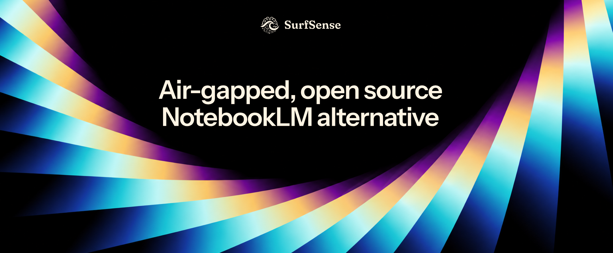

<!--
  Rationale: plans/community-local/seo/06-repo-readme.md. Anything added replaces
  something (AGENTS.md). Ship the agent copy only with the first release whose
  installer carries the agent; v2.1.0 does not.
  The format table is checked against origin/dev c5ff7938a; re-check each cell before a release.
  The demo video under the header is a GitHub upload, not a file in the repo. To replace it, drag an
  MP4 under 10 MB into any comment box in this repo, copy the user-attachments link and swap the URL.
  Every README.<locale>.md follows this file section for section; change them together.
  Time-boxed: delete the sunset callout on 18 October 2026, here and in every README.<locale>.md.
-->

  

  <h1>SurfSense</h1>

  

    <b>The air-gapped, open-source NotebookLM alternative.</b>
     
    The AI agent that researches, transforms and edits your documents, on your machine.
  

  

    <a href="https://www.surfsense.com/downloads"><b>Download</b></a> ·
    <a href="#what-it-does-with-each-format">Formats</a> ·
    <a href="#quick-start">Quick start</a> ·
    <a href="#how-it-compares">Compare</a> ·
    <a href="https://www.surfsense.com/pricing">Pricing</a> ·
    <a href="https://discord.gg/ejRNvftDp9">Discord</a>
  

  

  

    English | <a href="README.ar.md">العربية</a> | <a href="README.de.md">Deutsch</a> | <a href="README.es.md">Español</a> | <a href="README.fr.md">Français</a> | <a href="README.hi.md">हिन्दी</a> | <a href="README.ja.md">日本語</a> | <a href="README.ko.md">한국어</a> | <a href="README.pt-BR.md">Português</a> | <a href="README.ru.md">Русский</a> | <a href="README.zh-CN.md">简体中文</a>
  

https://github.com/user-attachments/assets/88326b9d-e763-46db-9635-75f9df9e8682

SurfSense is a free, open-source desktop app for documents you can't upload. A privacy-focused, NotebookLM-style AI agent that researches, transforms and edits your documents, on your machine. The index stays on your disk, you pick the model, local or remote, and there is no account.

| Platform | Download |
|---|---|
| **Windows** x64 | [SurfSense-Setup.exe](https://github.com/MODSetter/SurfSense/releases/latest/download/SurfSense-Setup.exe) |
| **macOS** Apple Silicon | [SurfSense-arm64.dmg](https://github.com/MODSetter/SurfSense/releases/latest/download/SurfSense-arm64.dmg) |
| **Linux** x64 | [AppImage](https://github.com/MODSetter/SurfSense/releases/latest/download/SurfSense.AppImage) · [deb](https://github.com/MODSetter/SurfSense/releases/latest/download/SurfSense.deb) |

> [!NOTE]
> **Used the hosted web app?** Export your workspaces before 18 October 2026 and import them here. See [the sunset page](https://www.surfsense.com/sunset).

## Quick start

1. Install SurfSense and do the initial onboarding setup.
2. Drop your files or folders in your sources.
3. Ask the agent to search or extract or edit your files.

## What it does with each format

| Format | Research (cited answers) | Create | Edit (as a copy) | Transform |
|---|---|---|---|---|
| **PDF** | ✓ scanned pages too³ | ✓ | Fill and flatten forms; stamp watermarks, page numbers, headers, footers | Merge, split, extract, rotate, reorder pages |
| **Word** `.docx` | ✓ | ✓ or from your own `.docx` as a template | ✓ body text, as tracked changes and comments | To PDF¹ |
| **Excel** `.xlsx` | ✓ the agent also reads formulas | ✓ with formulas and native charts | ✓ cell values and formulas | Analyse with pandas, chart the results |
| **PowerPoint** `.pptx` | ✓ | ✓ or from your own `.pptx` as a template | Replace text on slides and notes; delete or duplicate slides | To PDF¹ |
| **CSV** | ✓ | — | — | Analyse with pandas, chart the results |
| **Images** PNG, JPEG, TIFF, BMP, WebP | ✓ text read by OCR³ | Images and infographics² | — | Place in new documents |
| **Markdown**, plain text | ✓ | ✓ Markdown | — | — |
| **HTML** | ✓ | ✓ web page | — | — |
| **Podcast** (audio) | — | ✓ with a transcript, voiced on your machine by default | — | — |
| **Mind maps, flashcards, quizzes** | — | ✓ in the app | — | — |

¹ With Office support (LibreOffice), turned on in Settings; it is never in the installer. ² Needs an image model, local or remote; none is chosen by default. ³ OCR reads Latin, Chinese and Japanese script.

Edits, conversions and PDF tools always make a new file; your original is never changed. PDF, Word and Excel do the most today, and support for the other formats keeps improving.

## How it compares

| | NotebookLM (now Gemini Notebook) | SurfSense |
|---|---|---|
| Runs offline / air-gapped | No | **Yes** |
| Your documents leave your machine | Yes | **No**, unless you pick a remote model |
| Can edit your files | No | **Yes** |
| Open source | No | **Apache-2.0** |
| Models | Gemini only | Any OpenAI-compatible API, or a local one |

## Community

- [Discord](https://discord.gg/ejRNvftDp9) for help, [Issues](https://github.com/MODSetter/SurfSense/issues) for bugs, [Discussions](https://github.com/MODSetter/SurfSense/discussions) for ideas.
- **Contributing:** PRs go against `dev`; see [CONTRIBUTING.md](CONTRIBUTING.md) and [`surfsense_local/`](./surfsense_local) for the dev loop. How it works is in [`docs/`](docs/README.md).

## Star history

  <a href="https://www.star-history.com/#MODSetter/SurfSense&Date">
    <picture>
      <source media="(prefers-color-scheme: dark)" srcset="https://api.star-history.com/svg?repos=MODSetter/SurfSense&type=Date&theme=dark" />
      <source media="(prefers-color-scheme: light)" srcset="https://api.star-history.com/svg?repos=MODSetter/SurfSense&type=Date" />
      
    </picture>
  </a>

## License

Apache-2.0. See [LICENSE](LICENSE).
