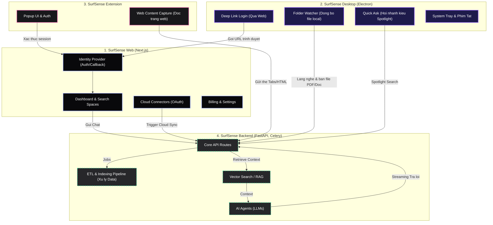

# SurfSense: Sơ đồ Macro User Flow Toàn Hệ Thống

Sau khi đào thật sâu vào toàn bộ source code của dự án, em phát hiện ra SurfSense không chỉ là một Web App đơn thuần. Đây là một **Hệ sinh thái đa nền tảng (Macro Ecosystem)** bao gồm 4 khối lớn làm việc chặt chẽ với nhau: `surfsense_web`, `surfsense_desktop`, `surfsense_browser_extension`, và `surfsense_backend`.

Đây là sự liên kết luồng thao tác của người dùng xuyên suốt toàn bộ các nền tảng của hệ thống:

## Các phám phá cốt lõi (Deep Dive Findings)

1. **Local-First Synchronization với Desktop App (`surfsense_desktop`)**
   - Ứng dụng Desktop không chỉ để dùng web. Nó chứa module `folder-watcher.ts` liên tục quét thư mục trên máy tính người dùng và tự động đẩy dữ liệu (PDF, Docs) lên hệ thống để AI đọc. Đây là luồng ingest data hoàn toàn ngầm mà user không cần thao tác upload thủ công trên giao diện web.
   - Nó cũng chứa module `quick-ask.ts`, cho phép user dùng tổ hợp phím gợi Spotlight Bar để hỏi đáp AI nhanh mà không cần mở app.

2. **Cánh tay nối dài Browser Extension (`surfsense_browser_extension`)**
   - Luồng lưu trữ nội dung web: User đọc bài báo ở các tab, bấm vào extension để Capture và đưa thẳng nội dung đó vào "Search Space".

3. **Backend Pipeline khổng lồ (`surfsense_backend`)**
   - Đằng sau API là một dây chuyền công nghiệp: Nhận file -> `celery` chia việc -> `etl_pipeline` xử lý văn bản -> `indexing_pipeline` tự động cắt đoạn và lưu vector DB. 
   - Phần trả lời là do module `agents` và `retriever` đảm nhiệm (chuẩn RAG).

**Phân tích UX:** 
Nhờ việc kiểm tra chéo này, em nhận ra UX của Web App không cần quá nhấn mạnh vào nút "Upload File" khổng lồ như các app khác, vì SurfSense đã giải quyết vấn đề nhập liệu ngầm thông qua **Desktop Folder Watcher** và **Browser Extension/Cloud Connectors**. 

Do đó, UI Web app (`The Scholar` direction) chỉ cần tối tưu cho việc **Hiển thị, Tra cứu và Trí tuệ (Chat Layout)**.

Anh thấy sự móc nối sinh thái đa nền tảng này đã mô tả đúng tầm nhìn kiến trúc của SurfSense chưa ạ?
