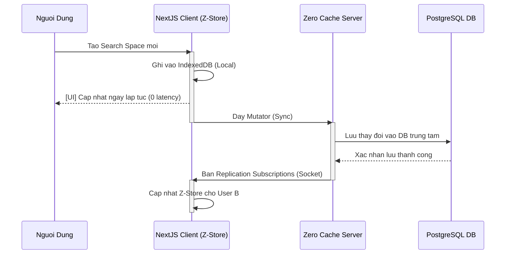
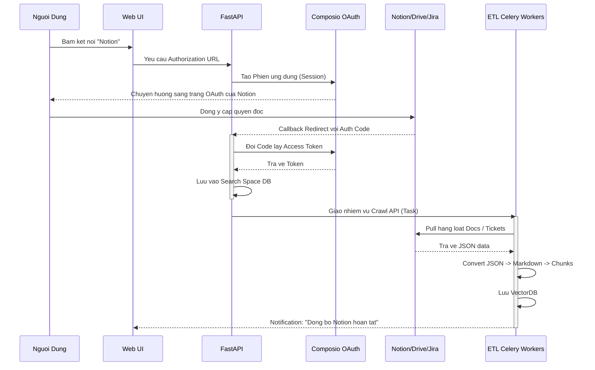
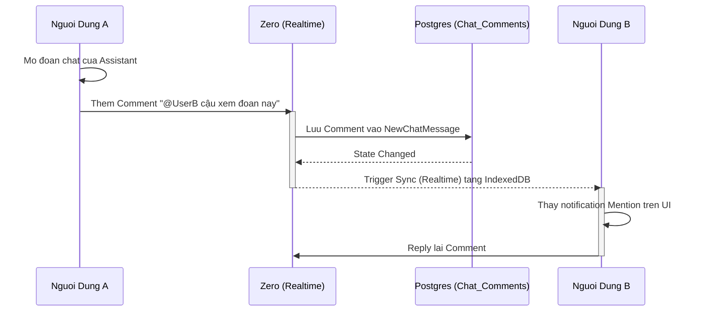
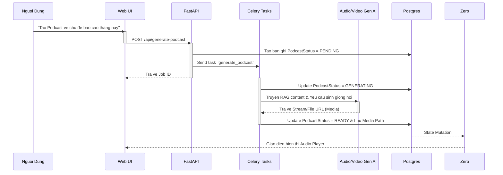

# SurfSense: Sơ đồ chi tiết các Luồng Ẩn (Triển khai Sâu)

Dựa trên việc kiểm tra sâu cấu trúc database (`db.py`) và kiến trúc API, đây là các Luồng Vi mô (Micro Flows) diễn ra bên dưới bề nổi bổ sung thêm cho 4 luồng cơ bản ban đầu. Đây là các Flow cấu thành sức mạnh hệ sinh thái nền tảng của SurfSense.

---

## 5. Luồng Đồng bộ Thời gian thực & Local-first (RociCorp Zero)
Giao diện của SurfSense đạt được tốc độ phản hồi tính bằng mili-giây (Instant UI) nhờ vào công nghệ Local-first từ Zero.

---

## 6. Luồng Uỷ quyền và Nuốt Dữ liệu từ App Thứ 3 (Third-Party Connectors)
Quy trình nhập liệu từ các nền tảng SaaS (Notion, Google Drive, Jira...) sử dụng Composio và Custom Extractors.

---

## 7. Luồng Giao tiếp Cộng tác & Bình luận (Collaboration / Chat Comments)
Mỗi Search Space trong SurfSense là một "Phòng làm việc chung". Các đoạn Chat AI có thể được bình luận, chia sẻ.

---

## 8. Luồng Phát sinh Nội dung Đa phương tiện từ RAG (Podcast / Video)
Trình độ tổng hợp kiến thức của SurfSense không dừng ở đoạn text, mà còn mở rộng ra Audio, Podcasts, Video Presentation dựa trên DB Models.

