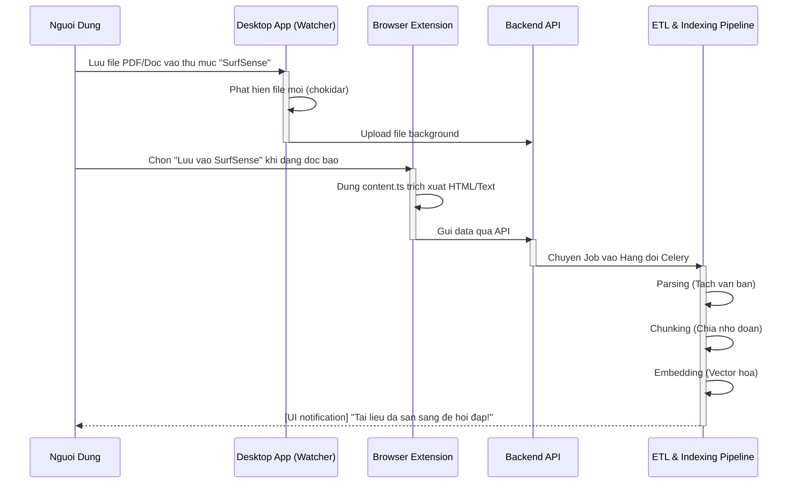
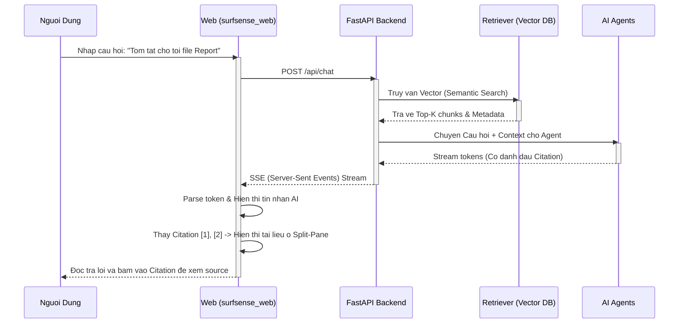
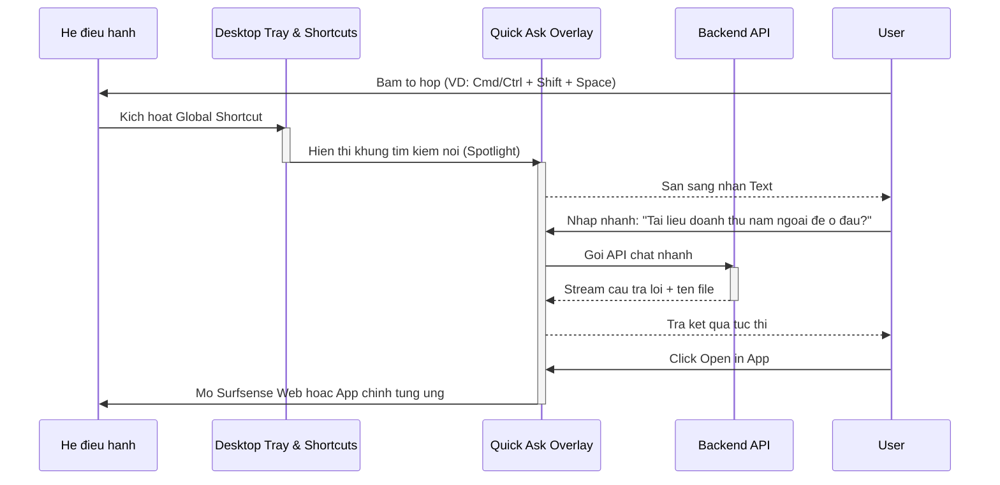
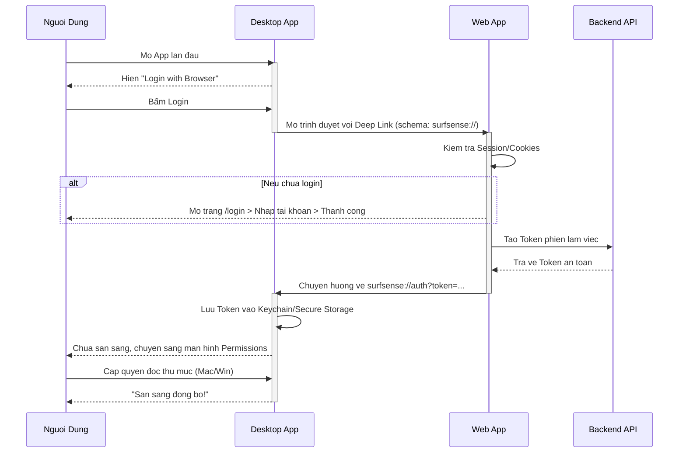

# SurfSense: Chi tiết Micro User Flows

Dưới đây là sơ đồ chi tiết (Micro Flows) phân tách sâu vào 4 tính năng lõi quan trọng nhất của hệ thống, bao phủ cả trải nghiệm người dùng lẫn luồng dữ liệu ngầm phía sau. 

---

## 1. Luồng Tự động Nhập dữ liệu (Local-First Ingestion)
Đây là "vũ khí bí mật" của SurfSense. Thay vì bắt user bấm nút upload thủ công, hệ thống sử dụng Desktop App và Extension để tự động hóa việc đưa tài liệu vào ngữ cảnh của AI.

---

## 2. Luồng Trò chuyện & Truy xuất (Core Analytical Chat - RAG)
Đây là tính năng tương tác chính trên Website, nơi người dùng đặt câu hỏi và AI tìm kiếm bối cảnh từ dữ liệu cá nhân của user. 

---

## 3. Luồng Hỏi Đáp Thần Tốc (Desktop Quick Ask)
Một tính năng nổi bật giúp SurfSense gắn chặt vào thói quen hàng ngày của User. Bất kể đang mở app nào, user chỉ cần bấm tổ hợp phím là có thể truy vấn mọi tài liệu.

---

## 4. Luồng Chuyển giao Xác thực (Cross-Platform Auth)
Vì Web đóng vai trò là Hub chính, Desktop App cần cơ chế mượn xác thực từ Web một cách mượt mà và an toàn.

---

*Ghi chú: Toàn bộ biểu đồ đã được biên dịch không chứa dấu tiếng Việt bên trong logic sơ đồ để đảm bảo khả năng tương thích hiển thị tuyệt đối.*
