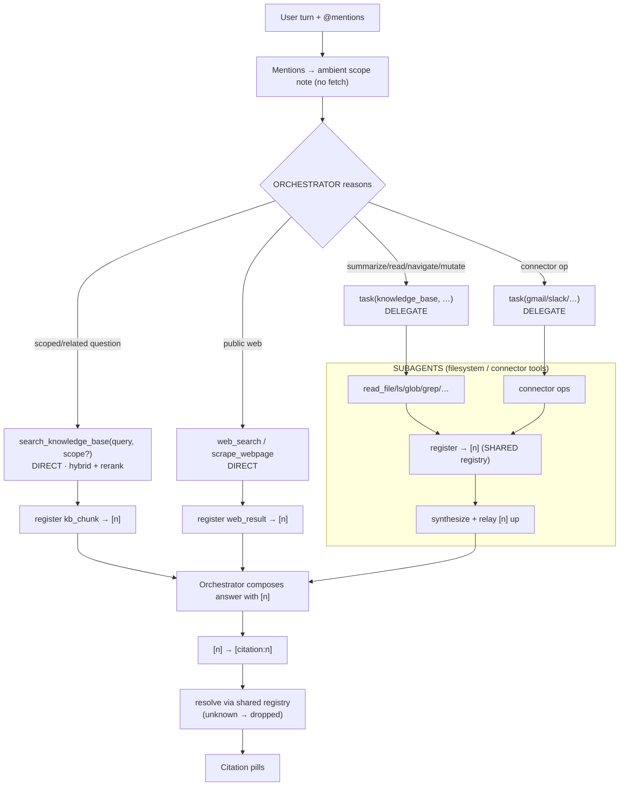

# ADR 0001 — RAG, Citation, and Context Architecture

- **Status:** Proposed
- **Date:** 2026-06-24
- **Owners:** SurfSense core
- **Supersedes:** the pre-agent KB priority/planner injection path

---

## 1. Context & problem

SurfSense answers questions over a user's indexed knowledge base (documents,
chats, connectors, web results). The current pipeline causes the model to
**hallucinate citations and answers**. Root causes identified during review:

- **Content/ID split.** The model is asked to author or copy complex identifiers
  (`chunk_id`, raw URLs, free-text titles) that sit far from the content they
  label. LLMs reliably corrupt nearby digits — so citations point at the wrong
  source or at nothing.
- **Pre-agent work.** A planner LLM call + embedding + hybrid search runs in
  `before_agent` on every turn (`KnowledgePriorityMiddleware`), plus an eager
  `fetch_mentioned_documents` whose chunks are then **discarded**. This adds
  latency and context noise before the agent even reasons.
- **Mentions are mismanaged.** An `@document` mention forces a wasted full-chunk
  fetch, points at the doc **twice** (inline backtick path + `<priority_documents>`
  entry), and still requires a read round-trip — then dumps the **whole** doc
  regardless of the question.
- **Retrieval quality.** Search retrieves on chunks but collapses to documents,
  chunks have **no overlap**, and the reranker exists (`RerankerService`) but is
  **not wired** into the agent path.
- **Context bloat.** The workspace tree (up to 4000 tokens) and priority lists are
  injected into the durable `messages` list every turn, causing context
  distraction/confusion.

This ADR defines the target architecture. It is the **single source of truth**;
implementation issues should reference section numbers here.

---

## 2. Principles

1. **The model cites tiny numbers `[n]`, never identifiers.** The server owns the
   mapping from `[n]` to a real source. There is nothing for the model to invent.
2. **Retrieval is pull-based, behind tools.** Nothing retrieves before the agent
   runs. The agent calls a tool when it needs information.
3. **A mention is scope, not a retrieval trigger.** Mentioning a thing tells the
   model the thing exists and gives it a filter it *may* apply — it does not fetch.
4. **Ambient context is not conversation.** Transient per-turn context (tree,
   mention scope, memory) is rendered via the system prompt, not appended to the
   durable `messages` trajectory.
5. **All complexity lives server-side** (resolver, retriever), so the model's job
   stays trivial: read passages, echo the number next to the one you used.

---

## 3. Citation architecture (the spine)

Everything hangs off this. Build it first.

### 3.1 What is citable

Anything that is *information retrieved from a source*. Each source type has a
natural **citable unit**:

| Source | Citable unit | Entry locator | Enters context via |
|---|---|---|---|
| `kb_chunk` | chunk | `document_id` + `chunk_id` | `search_knowledge_base` |
| `kb_document` | document | `document_id` | `read` (whole doc) |
| `connector_item` | item | `connector_id` + `external_id` | connector tool |
| `web_result` | url | `url` | web search / crawl |
| `chat_turn` | turn | `thread_id` + `message_id` | `@chat` / referenced chat |
| `anon_chunk` | chunk | `session/doc` + `chunk_id` | uploaded anonymous doc |

**Not citable** (control/pointer — never gets a number): workspace tree, mention
scope notes, `report_context`, the priority/registry listing itself.

### 3.2 The citation entry (the truth)

A registered entry is the durable identity of a citable unit:

```python
class CitationEntry(TypedDict):
    n: int                      # the tiny label shown to the model
    source_type: str            # "kb_chunk" | "kb_document" | "connector_item"
                                # | "web_result" | "chat_turn" | "anon_chunk"
    locator: dict[str, Any]     # source-specific identity (see table 3.1)
    display: dict[str, Any]     # title, source label, url, date — for the UI pill
```

### 3.3 The registry (the bookkeeping)

Lives in agent **state** so it survives across turns and across orchestrator +
subagents.

```python
class CitationRegistry(TypedDict):
    by_n: dict[int, CitationEntry]      # n -> entry  (resolve direction)
    by_key: dict[str, int]              # source_key -> n  (dedup / find-or-create)
    next_n: int                         # monotonic counter
```

- **`source_key`** is a stable string derived from `(source_type, locator)`, e.g.
  `"kb_chunk:42:880"`, `"web_result:https://…"`, `"chat_turn:7:1190"`.
- **Numbering is per-conversation and monotonic.** A given `[n]` never changes
  meaning within a conversation.
- **Dedup:** registering an already-seen unit returns its existing `n`.

### 3.4 The two operations

```python
def register(registry, source_type, locator, display) -> int:
    """Find-or-create. Returns the [n] for this unit."""
    key = make_key(source_type, locator)
    if key in registry["by_key"]:
        return registry["by_key"][key]
    n = registry["next_n"]
    registry["next_n"] += 1
    registry["by_n"][n] = {"n": n, "source_type": source_type,
                           "locator": locator, "display": display}
    registry["by_key"][key] = n
    return n

def resolve(registry, n) -> CitationEntry | None:
    """Map a model-emitted [n] back to its source. Unknown n -> None (drop)."""
    return registry["by_n"].get(n)
```

### 3.5 Lifecycle

```
source yields item
   → register(entry)            # source_type + locator + display  → assign/reuse [n]
   → render passage with [n]    # the number sits INLINE next to the content
   → model writes "...March 10 [n]"
   → resolver: [n] → entry      # server-side, on the streamed answer
   → frontend renders citation pill
```

The model only ever **echoes** a number that was printed next to the content it
used. Unknown/garbled numbers resolve to nothing and are dropped (abstention by
construction).

### 3.6 Presentation format (`<retrieved_context>`)

`[n]` must be the **only** citable integer adjacent to each passage. No
`chunk 4 of 19`, no raw ids near the text. Grouping by document is allowed; the
`[n]` is per passage.

```
<retrieved_context>
Excerpts retrieved from the user's knowledge base for this query.
Cite a passage with its [n].

Document: "Q3 Launch Notes" (Slack · #launch · 2026-03-02)
  [1] We agreed to push launch to March 10.
  [2] Marketing will be notified next week.
Document: "Timeline" (Notion · 2026-02-28)
  [3] Dates floated were Mar 10 and Mar 17.
</retrieved_context>
```

### 3.7 Reconciliation with the existing token format

The frontend and evals already parse **`[citation:ID]`**
(`surfsense_web/lib/citations/citation-parser.ts`,
`surfsense_evals/src/surfsense_evals/core/parse/citations.py`).

**Decision:** keep the wire token `[citation:ID]` where `ID = n`. The model is
instructed to emit `[n]`; a thin normalization step rewrites `[n]` →
`[citation:n]` on the streamed output before it reaches the existing parser, OR
the model is instructed to emit `[citation:n]` directly. Either way `ID` is now a
**small ordinal from the registry**, not a `chunk_id`/url/title. The resolver maps
`n` → `CitationEntry` → the frontend citation object the UI already expects.

> **Decided (§8.8):** the model emits `[n]` (smallest surface for the model to
> get right); the server normalizes `[n]` → `[citation:n]` before the existing
> parser.

---

## 4. Retrieval architecture (pull-based)

### 4.0 Execution channels (verified against the codebase)

The orchestrator (main agent) does **not** own the virtual filesystem. It has a
small fixed toolset; everything else is delegated via `task(<specialist>, …)`.
Verified in `main_agent/tools/index.py` and `subagents/builtins/knowledge_base`.

| Capability | Owner | Reached via |
|---|---|---|
| `search_knowledge_base(query, scope?)` — semantic/hybrid **RAG retrieval**, read-only | **orchestrator** | direct call |
| `web_search`, `scrape_webpage` | **orchestrator** | direct call |
| `update_memory`, `create_automation`, `write_todos`, `task` | **orchestrator** | direct call |
| virtual filesystem: `read_file`, `write_file`, `edit_file`, `ls`, `glob`, `grep`, `list_tree`, `rm`, `rmdir`, `move_file` | **knowledge_base subagent** | `task(knowledge_base, …)` |
| connector ops (gmail/slack/jira/…) | **connector subagents** | `task(<connector>, …)` |

Consequences for citations:

- The **dominant RAG path is orchestrator-direct** (`search_knowledge_base`), so
  it registers `[n]` exactly where the answer is composed — **no relay**.
- The **shared registry** (§8.9) is load-bearing only for the **delegated** lanes
  (whole-doc reads via `knowledge_base`, connector reads): the subagent registers
  into the shared registry and relays `[n]` upward.
- `search_knowledge_base` is **semantic RAG**, distinct from filesystem search
  (`grep`/`glob`), which belongs to the subagent. `routing.md` conflates these and
  omits `search_knowledge_base` from its direct-tools list — that prompt is stale
  and must be corrected (see §7).

### 4.1 The two retrieval operations

| Operation | Tool | Owner | For |
|---|---|---|---|
| **search** | `search_knowledge_base(query, scope?)` → chunks, each registered → `[n]` | orchestrator (direct) | "related / scoped question" — RAG |
| **read** | `read_file(path)` (whole object) | knowledge_base subagent (`task`) | "summarize / translate / rewrite / navigate this" |

The agent chooses based on the query. No server-side intent classifier; the query
semantics decide (summarize ⇒ delegate a `read`; related ⇒ direct `search`).

### 4.2 `scope` — the mention→retrieval bridge

`scope` is an **optional typed filter** restricting the search haystack:

```python
scope = {
    "document_ids": [42],
    "folder_ids": [],
    "connector_ids": [],
}
```

- Becomes `WHERE` constraints on the chunk search (`document_id IN (...)`, etc.).
- **Agent-controlled, not automatic.** "in this doc" → agent passes scope; "related"
  → agent omits it.
- Spans only **KB-indexed** references (doc/folder/connector). Chats are **not**
  KB-indexed (no `CHAT` document type; they live in `NewChatThread` /
  `NewChatMessage`, not `Document`/`Chunk`), so `@chat` never appears in `scope` —
  it uses the separate read channel in §5.
- **How it reaches the retriever depends on the channel:**
  - direct `search_knowledge_base` → `scope` is a **structured tool arg** the
    orchestrator passes (new arg to add — current tool has no `scope`).
  - delegated `read` / browse → the orchestrator expresses scope in the **task
    prompt** (path + ids); the subagent translates it into its filesystem calls.

**Decision:** even when `scope` pins a single doc, `search_knowledge_base` still
runs full hybrid ranking *within* that doc (a large doc still needs its relevant
passages surfaced) — it does not return raw chunk order.

### 4.3 Retrieval quality fixes (folded into this work)

- Return at **chunk granularity** with stable `chunk_id` (no collapse-to-document
  that loses the citable unit).
- **Wire the reranker** (`RerankerService`) into the `search_knowledge_base` path.
- **Chunk overlap** in the indexing pipeline (config in `app/config/__init__.py`,
  `RecursiveChunker` currently has no overlap).
- Add the `scope` arg to `search_knowledge_base`.

### 4.4 End-to-end pipeline



### 4.5 Tradeoffs: pull vs push (and perceived latency)

We chose **pull** (the agent reads/searches via tools when needed) over **push**
(eagerly injecting referenced content into context). Rationale and costs:

**Why pull is the default**

- Token efficiency — fetch only what the query needs, not whole docs.
- Scales to many/large mentions, folders, connectors — push cannot.
- Intent-adaptive granularity — passages for scoped Qs, whole doc for summaries.
- Context hygiene — content arrives as *evidence* (`[n]`), not ambient noise.
- Uniform across all mention types.

**Costs (and why they're acceptable)**

- **Perceived latency (TTFT).** Pull adds a tool round-trip before answer tokens.
  This is the only place push clearly wins. The mitigation is **progress
  streaming** (time-to-first-*signal*, not first-*token*): stream "Reading
  *Q3 Launch Notes*…" / "Searching your knowledge base…" so the wait feels
  productive — the pattern used by Perplexity, Claude, and Cursor.
  > **Out of scope for this ADR's rollout.** Progress streaming is a separate
  > workstream — it touches the streaming subsystem, not the retrieval/citation
  > path. Tracked as an **after-plan follow-up**. Today intermediate/subagent
  > steps are largely suppressed (`surfsense:internal`), which is what makes pull
  > *feel* slow; the follow-up promotes a curated subset of tool/subagent events
  > to user-visible progress.
- **"Cite-without-read" risk** — neutralized structurally: ambient pointers carry
  **no `[n]`**; `[n]` exists only after a tool returns evidence; invented `[n]`
  resolves to nothing and is dropped. The worst residual case degrades from a
  confident wrong citation to an uncited claim (further guarded by content-free
  pointers + a "read before you answer" policy line).
- **Delegation synthesis loss** — whole-doc reads go through the KB subagent,
  which summarizes back; mitigate by instructing it to return quotes + `[n]`.

**Conditional hybrid.** A bounded eager fast-path (inject content only when a
single *small* doc is mentioned) may be added **later, only if** latency telemetry
justifies it — not built speculatively.

---

## 5. Mention architecture (scope, not trigger)

When the user mentions anything:

1. It is recorded as **ambient scope** in the system prompt (via `dynamic_prompt`
   + `runtime.context`), e.g.:
   > Referenced this turn: doc 42 (`/documents/Launch/Q3.xml`), folder 7
   > (`/documents/Specs/`). For a scoped question call
   > `search_knowledge_base(query, scope={document_ids:[42]})`; to load the whole
   > thing delegate `task(knowledge_base, "read /documents/Launch/Q3.xml …")`.
2. **No fetch, no RAG, no `<priority_documents>` pre-injection.**
3. The agent decides: direct `search_knowledge_base(query, scope)` (scoped
   question) or delegated `task(knowledge_base, …)` read (whole-object intent).

References split into **two kinds** by whether the source is searchable:

- **Searchable references** (`@document`, `@folder`, `@connector`, anon upload) — the
  source is KB-indexed, so they become `scope` and are pulled via
  `search_knowledge_base` / delegated read. Pointer + pull.
- **Read references** (`@chat`) — the source is **not** KB-indexed, so there is
  nothing to "search". The thread is a finite, user-selected artifact; its turns are
  loaded directly (access-checked) and citable as `chat_turn`. Pointer + read.

Per mention type (note the channel — direct vs delegated):

| Mention | Ambient note | Retrieval behavior | Citation kind on use |
|---|---|---|---|
| `@document` | doc id + path | direct `search_knowledge_base(scope={document_ids:[id]})`, or delegated `task(knowledge_base, read …)` | `kb_chunk` / `kb_document` |
| `@folder` | folder id + path | direct `search_knowledge_base(scope={folder_ids:[id]})`, or delegated browse | `kb_chunk` |
| `@connector account` | connector_id + account | `task(<connector>, "… connector_id=id")` | `connector_item` |
| `@chat` | thread id + title | **read channel** (not `scope`): load thread turns directly, access-checked, via the existing `referenced_chat_context` resolver | `chat_turn` |
| anonymous upload | session doc ref | direct `search_knowledge_base(scope=anon)` / delegated read | `anon_chunk` |

---

## 6. Context plane separation

| Plane | Carries | Mechanism | Lifetime |
|---|---|---|---|
| **Ambient** | workspace tree, mention scope, memory, instructions | system prompt via `dynamic_prompt` + `runtime.context` | per-turn, not persisted in messages |
| **Evidence** | retrieved passages with `[n]` | tool results / `<retrieved_context>` | enters trajectory when a tool runs |
| **Trajectory** | user/assistant turns, tool calls | `messages` | durable, checkpointed |

The workspace tree and priority/registry listings move **out** of `messages` into
the ambient plane.

---

## 7. Cleanup (what gets removed/changed)

Remove from the hot path:

- `KnowledgePriorityMiddleware` search branch (planner LLM, embedding, hybrid
  search in `before_agent`).
- `fetch_mentioned_documents` eager chunk pull.
- `<priority_documents>` pre-injection and `KbContextProjectionMiddleware`
  priority projection.
- `kb_priority` / `kb_matched_chunk_ids` state plumbing (deleted per §8.10; add a
  dedicated `citation_registry` field instead).

Keep / add:

- `search_knowledge_base(query, scope?)` (orchestrator-direct) as the **only** RAG
  entry point, returning registered chunks with `[n]`. Add the `scope` arg.
- `read_file` (knowledge_base subagent, via `task`) for whole-object ops; cited
  reads register a `kb_document` / `kb_chunk` entry into the shared registry.
- The **citation registry** in state (shared across orchestrator + subagents).
- Reranker wired into `search_knowledge_base`; chunk overlap in indexing.
- Ambient mention note via `dynamic_prompt`.
- **Fix `routing.md`:** add `search_knowledge_base` to the orchestrator's
  direct-tools list, and clarify that "search inside the workspace goes through
  `task(knowledge_base)`" refers to **filesystem** search (`grep`/`glob`), not the
  semantic `search_knowledge_base` tool.

---

## 8. Locked decisions

1. Model cites `[n]`; server owns `[n] → source` via a registry. ✅
2. Numbering is **per-conversation, monotonic, dedup'd** (find-or-create). ✅
3. Retrieval is pull-based: orchestrator-direct `search_knowledge_base` (RAG) +
   delegated `read_file` (knowledge_base subagent); no pre-agent retrieval. ✅
4. Mention = ambient scope; `scope` is an agent-controlled `search_knowledge_base`
   filter. ✅
5. Scoped search still runs full hybrid ranking within scope. ✅
6. Ambient context (tree, mention scope) lives in the system prompt, not `messages`. ✅
7. Wire token stays `[citation:ID]` with `ID = n`. ✅
8. **Model emits `[n]`; the server normalizes `[n]` → `[citation:n]`** on the
   streamed output before the existing parser. The model's surface stays minimal. ✅
9. **Subagent retrievals register into the same conversation `citation_registry`**,
   so `[n]` is globally consistent across orchestrator + subagents. This replaces
   the Channel A/B relay entirely. ✅
10. **Delete the legacy `kb_priority` / `kb_matched_chunk_ids` plumbing**; add a
    dedicated `citation_registry` field to state rather than overloading old
    fields. ✅

## 9. Open items

1. **`@chat` read mode.** Confirmed: chats are not KB-indexed, so `@chat` is a read
   reference, not `scope`. The remaining choice is *when* the turns load:
   - **(a) Eager inject** — keep the current `referenced_chat_context` budgeted
     injection; the transcript is in context up front. Simple, already built; costs
     tokens even when the chat is only tangentially referenced.
   - **(b) On-demand read tool** — `@chat` renders as a pointer only; the model calls
     `read_chat(thread_id)` when it actually needs the conversation. Consistent with
     the pull model and context hygiene; adds a tool + a round-trip.
   Both register each surfaced turn as `chat_turn`. Decision pending.

## 10. Rollout (suggested)

1. Citation registry + resolver (state + register/resolve) — no behavior change yet.
2. `search_knowledge_base` returns registered chunks; render `<retrieved_context>`;
   normalize `[n]` → `[citation:n]`.
3. Wire reranker; add chunk overlap in indexing.
4. Convert mentions to ambient scope + `scope` arg; delete priority pre-injection.
5. Move workspace tree to ambient plane.
6. Extend registry to connector/web/chat sources.

---

## 11. After-plan follow-ups (separate workstreams)

Not part of the §10 rollout — different subsystems, tracked here so they aren't
lost:

- **Progress streaming** (streaming subsystem). Promote a curated subset of
  tool/subagent events to user-visible progress ("Reading…", "Searching…") to
  collapse *perceived* latency from pull-based retrieval. See §4.5. This is the
  mitigation for pull's only real cost, but it touches the streaming pipeline, not
  the retrieval/citation path — so it ships independently.
