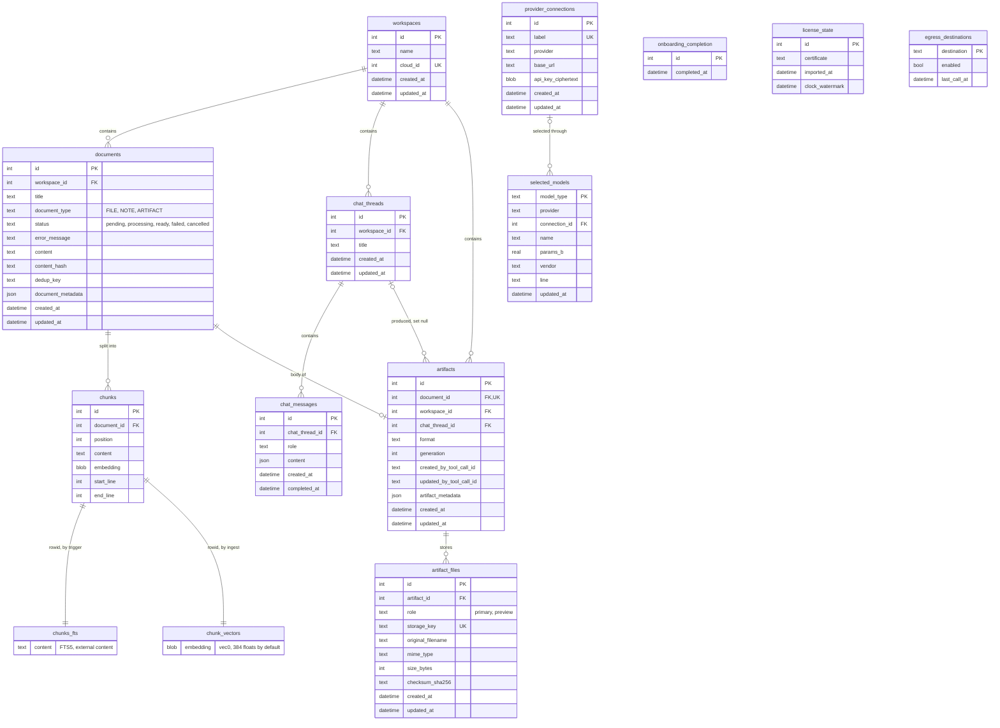

# Data model

Everything the desktop app knows lives in one SQLite file, `surfsense.db`, and in the files under `data/`; the job queues live apart in `huey.db`. The schema is a subset of the hosted SurfSense domain model, keeping the words users know (workspace, document, chunk, chat thread, artifact) and fixing the names that had drifted. The models are the source of truth, Alembic is the only thing that creates schema, and every revision is written by hand, because the database is one user's only copy.

**Code:** [`shared/db.py`](../../surfsense_local/backend/shared/db.py), [`shared/migrations.py`](../../surfsense_local/backend/shared/migrations.py), [`alembic/versions/`](../../surfsense_local/backend/alembic/versions/), the `models.py` in each folder of [`modules/`](../../surfsense_local/backend/modules/)
**Decisions:** [ADR 0005](../adr/0005-hand-written-migrations.md), [ADR 0003](../adr/0003-artifacts-as-documents.md), [ADR 0006](../adr/0006-hybrid-retrieval.md), [ADR 0007](../adr/0007-bundled-embeddings.md), [ADR 0018](../adr/0018-keychain-envelope-encryption.md)

## Principles

1. **Same domain language.** Workspace, document, chunk, artifact, chat thread and chat message mean what they mean in hosted SurfSense.
2. **Subset.** Tables and columns the desktop app does not ship are left out: users, memberships, connectors, Zero, the git knowledge base, LangGraph state.
3. **Fix on paste.** Stale `new_*` prefixes, redundant columns and JSONB status blobs become the local shapes below.
4. **No auth.** There is no users table, no memberships and no tokens.
5. **SQLite.** One file, with JSON columns only where they earn their keep: document metadata, message content, artifact metadata.
6. **Queue mechanics stay in `huey.db`.** User-visible job state is `documents.status`.

The conventions every table follows are in [`shared/db.py`](../../surfsense_local/backend/shared/db.py):

- **Enums are text behind a CHECK constraint.** SQLite has no enum type, so `text_enum()` stores the values and names a CHECK that rejects anything else.
- **Constraints are named** by a fixed naming convention, because SQLite lets them stay unnamed and Alembic's batch mode cannot drop what it cannot name.
- **Timestamps are UTC wall time.** SQLite keeps no offset; values are written in UTC and stamped UTC when read.
- **Every connection** turns foreign keys on, uses WAL and a 5-second busy timeout, loads sqlite-vec, and begins transactions with `BEGIN IMMEDIATE`.
- **Every model is imported at startup** (`import_models()`), because relationships name their targets as strings.

## Naming: keep vs fix

| Concept | Hosted | Local | Notes |
|---|---|---|---|
| Workspace | `workspaces` | `workspaces` | keep |
| Document | `documents` | `documents` | keep |
| Chunk | `chunks` | `chunks` | keep |
| Chat thread | `new_chat_threads` | `chat_threads` | drop the stale `new_` prefix |
| Chat message | `new_chat_messages` | `chat_messages` | drop the stale `new_` prefix |
| Message to thread | `thread_id` | `chat_thread_id` | explicit on `chat_messages` and `artifacts` |
| Document status | JSONB `{"state": ...}` | `status` text | `pending`, `processing`, `ready`, `failed`, `cancelled` |
| Dedup key | `unique_identifier_hash` | `dedup_key` | a SHA-256 of the file's bytes, not of its name |
| Body text | `content` and `source_markdown` | `content` | one markdown body |
| Artifact sidecar | `artifacts` | `artifacts` | keep, in the ADR 0003 shape |
| Artifact metadata | a column named `metadata` | `artifact_metadata` | no alias |

## Tables

### `workspaces`

| Column | Notes |
|---|---|
| `id`, `name`, `created_at`, `updated_at` | a name is 1 to 200 characters after trimming |
| `cloud_id` | nullable, unique: the hosted workspace an import came from, so re-importing the same bundle reuses the row ([`import.md`](import.md)) |

The API seeds one workspace, "My Workspace", at startup when none exists. Deleting a workspace cascades its documents, threads and artifacts.

### `documents`

| Column | Notes |
|---|---|
| `id`, `workspace_id` | foreign key to `workspaces`, cascading |
| `title` | at most 500 characters when set through the document routes |
| `document_type` | `FILE` (uploaded or imported), `NOTE` (written in the app), `ARTIFACT` (a Studio body) |
| `status` | `pending` by default; `cancelled` arrived in `0011` |
| `error_message` | why a job failed, at most 500 characters; cleared by retry and by a later success |
| `content` | the markdown body: extracted text, the note itself, or an artifact's body |
| `content_hash` | declared but never written |
| `dedup_key` | SHA-256 of an uploaded or imported file's bytes; null for notes and artifacts |
| `document_metadata` | JSON: `mime_type`, `size_bytes`, `suffix` for files; import adds `folder_path`, `source` and the hosted ids |
| `created_at`, `updated_at` | |

`documents_workspace` indexes `workspace_id`. `documents_workspace_dedup_key` is unique on `(workspace_id, dedup_key)` where `dedup_key IS NOT NULL`, so dedup is per workspace and rows without a key stay out of it. Routes and behaviour are in [`documents.md`](documents.md).

### `chunks`

| Column | Notes |
|---|---|
| `id`, `document_id` | foreign key to `documents`, cascading |
| `position` | order within the document; unique with `document_id` |
| `content` | the passage text |
| `embedding` | float32 BLOB, kept so the vector table can be rebuilt without re-embedding |
| `start_line`, `end_line` | the passage's line span in the markdown body, for citations |

### The index tables and their triggers

| Table | Kind | Purpose |
|---|---|---|
| `chunks_fts` | FTS5, external content over `chunks` (`content_rowid='id'`) | the BM25 keyword leg; stores no text of its own |
| `chunk_vectors` | sqlite-vec `vec0(embedding float[D])`, rowid = `chunks.id` | the nearest-neighbour leg |

Three triggers on `chunks` keep the keyword index in step. `chunks_after_insert` adds the text to `chunks_fts`; `chunks_after_update` deletes the old text and adds the new; `chunks_after_delete` deletes the text from `chunks_fts` and the row from `chunk_vectors`. An external-content table keeps no copy, so a delete must hand it the old text or it goes on matching. The triggers fire on cascade too, which is how every real delete arrives, since the user removes a document or a workspace, never a chunk. Nothing else could reach these tables: a virtual table takes no foreign key.

Ingest writes the `chunk_vectors` row itself, because only ingest holds the vector. `D` is `SURFSENSE_LOCAL_EMBEDDING_DIMENSION`, 384 for the bundled bge-small-en-v1.5, fixed when `0001` creates the table. `upgrade_to_head()` reads the declared width back from `sqlite_master` and refuses to start when it differs from the setting: vectors from another model are unrelated numbers, not merely the wrong shape, so the database has to be reindexed. How the two legs are queried is in [`search.md`](search.md).

### `chat_threads` and `chat_messages`

| Table | Columns | Notes |
|---|---|---|
| `chat_threads` | `id`, `workspace_id`, `title`, `created_at`, `updated_at` | `title` is nullable; the API defaults it to "New chat" |
| `chat_messages` | `id`, `chat_thread_id`, `role`, `content`, `created_at`, `completed_at` | `role` is `user`, `assistant` or `system`; `completed_at` arrived in `0002` |

`content` is JSON: `{"text"}` for a user turn and `{"text", "citations"}` for an assistant turn, whose text carries `[citation:<chunk_id>]` markers. The server reads only `text`, to build the model's history; the citations are for the UI. Imported user turns also carry an empty `citations` list. Messages are indexed on `(chat_thread_id, created_at)` and cascade with their thread. Visibility, authorship, cloning, turn ids, token usage and LangGraph checkpoints are left out. See [`chat.md`](chat.md).

### `artifacts` and `artifact_files`

An artifact's searchable body is a `Document` with `document_type = ARTIFACT`; `artifacts` is a sidecar that owns no title, path, body or indexing state ([ADR 0003](../adr/0003-artifacts-as-documents.md)). The tables shipped in `0001`.

| Column | Notes |
|---|---|
| `document_id` | foreign key, unique and cascading: one sidecar per document |
| `workspace_id` | foreign key, cascading |
| `chat_thread_id` | foreign key, set null: clearing a chat must not delete what it produced |
| `format` | text, not an enum |
| `generation` | integer, `CHECK (generation > 0)`, bumped by each regenerate |
| `created_by_tool_call_id`, `updated_by_tool_call_id` | provenance; a REST job passes none |
| `artifact_metadata` | JSON: the source ids, prompt and options the job was created with, and quiz or flashcard progress |

`artifacts` has no status column; its status is its document's. `artifact_files` keeps one immutable blob per role: `role` (`primary` or `preview`), `storage_key` (the path relative to the data directory), `original_filename`, `mime_type`, `size_bytes` (`CHECK > 0`) and `checksum_sha256`, unique on `(artifact_id, role)` and on `storage_key`. There is no `storage_backend` column, since there is one backend. See [`studio.md`](studio.md).

### `provider_connections`, `selected_models` and `onboarding_completion`

| Table | Columns | Notes |
|---|---|---|
| `provider_connections` | `id`, `label`, `provider`, `base_url`, `api_key_ciphertext`, timestamps | `label` unique case-insensitively; `provider` must be `openai_compatible`; the key is Fernet ciphertext since `0007` |
| `selected_models` | `model_type`, `provider`, `connection_id`, `name`, `params_b`, `vendor`, `line`, `updated_at` | one row per model type: `text_gen`, `image_gen`, `image_edit`, `video_gen` or `audio_gen` |
| `onboarding_completion` | `id`, `completed_at` | a singleton (`CHECK id = 1`) whose presence means onboarding is done |

- A CHECK on `selected_models` allows `llamacpp` and `sdcpp` only without a connection and `openai_compatible` only with one. `connection_id` cascades, so deleting a connection clears exactly the roles that used it.
- `params_b`, `vendor` and `line` (`flagship` or `small`) are the model's fingerprint, recorded when it is chosen. They feed the prompt tier, which is computed on read, so retuning a threshold needs no migration.
- Choosing a model never writes `onboarding_completion`; `POST /llm/onboarding` does, once a generation model is chosen.
- Remote `/models` answers, the local catalog, hardware profiles and fit estimates are not stored; they are recomputed or fetched live.

Connections are in [`connections.md`](connections.md); selection and onboarding in [`local-models/selection.md`](local-models/selection.md).

### `license_state` and `egress_destinations`

| Table | Columns | Notes |
|---|---|---|
| `license_state` | `id`, `certificate`, `imported_at`, `clock_watermark` | a singleton; plan and expiry are re-derived from the certificate on every read, and `clock_watermark` is the highest instant ever seen |
| `egress_destinations` | `destination`, `enabled`, `last_call_at` | one row per host; `enabled` defaults to false |

A destination is `host:<hostname>`: `host:huggingface.co` for model search and downloads, and one per remote host, shared by every connection to it; a loopback endpoint needs none. Rows under the earlier names `model_download`, `model_search` and `image_model_pull` are no longer read; revision `0012` renamed `ollama_pull` to `model_download` before that change. See [`license/app.md`](license/app.md) and [`egress.md`](egress.md).

## On-disk layout

```text
<data dir>/                       ~/.surfsense by default
├── surfsense.db
├── huey.db                       two queues, ingest and studio, in one file
└── data/
    └── workspaces/<workspace_id>/
        ├── documents/<document_id>/
        │   ├── original.<ext>    an uploaded or imported file
        │   └── extracted.md      the markdown parsed from it
        └── artifacts/<artifact_id>/
            └── primary.<ext>     the rendered file; a preview would sit beside it
```

Directories are keyed by row id; the extension is the only part of a filename that reaches the disk. An artifact's files are named by role, with an extension when the MIME type is one the Studio worker knows. Deleting a workspace removes its whole directory after the commit, and deleting a document or an artifact removes its own directory. The rest of the data directory is described in [`overview.md`](overview.md#data-directory).

## Entity graph



## Revisions

| Revision | File | Change |
|---|---|---|
| `0001` | `0001_initial_schema.py` | workspaces, documents, chunks with `chunks_fts`, `chunk_vectors` and their triggers, chat threads and messages, artifacts and artifact files, a generation-only `selected_models`, `provider_credentials` |
| `0002` | `0002_add_chat_message_completed_at.py` | `chat_messages.completed_at` |
| `0003` | `0003_add_onboarding_completion.py` | `onboarding_completion` |
| `0004` | `0004_openai_compatible_connections.py` | `provider_connections`; `selected_models` rebuilt with `connection_id`, the `image_generation` role and the cascading foreign key, keeping only Ollama generation selections; `provider_credentials` dropped |
| `0005` | `0005_workspace_cloud_id.py` | `workspaces.cloud_id`, unique |
| `0006` | `0006_license_state.py` | `license_state` |
| `0007` | `0007_encrypt_provider_api_keys.py` | plaintext `api_key` dropped, `api_key_ciphertext` added |
| `0008` | `0008_egress_destinations.py` | `egress_destinations` |
| `0009` | `0009_local_image_provider.py` | `selected_models` rebuilt so `sdcpp` may hold a role without a connection |
| `0010` | `0010_selected_model_fingerprint.py` | `params_b`, `vendor` and `line` on `selected_models` |
| `0011` | `0011_document_cancelled_status.py` | `cancelled` added to `documents.status` |
| `0012` | `0012_llamacpp_provider.py` | `selected_models` rebuilt with `llamacpp` in place of `ollama`, clearing Ollama selections rather than remapping them; an `ollama_pull` egress grant becomes `model_download` |
| `0013` | `0013_selection_by_model_type.py` | `selected_models` rebuilt keyed by `model_type`: `generation` becomes `text_gen` and `image_generation` becomes `image_gen`; downgrading drops a selection in the three types the old key cannot hold |

- Migrations run on every API start and are idempotent. Autogenerate is off: it renders a rename as a drop plus an add, which deletes a column's data silently, and `env.py` carries no `target_metadata`, so it cannot be used by accident.
- SQLite cannot alter a CHECK constraint or rename a primary key in place, so `0004`, `0009`, `0012` and `0013` copy `selected_models` into a new table.
- A revision that touches a table already holding rows should read the live schema first (`op.get_bind()`, `sa.inspect`) rather than assume its shape.
- [`tests/integration/test_migrations.py`](../../surfsense_local/backend/tests/integration/test_migrations.py) fails when the models and the migration history disagree, when a second upgrade is not a no-op, and when a failed migration leaves anything behind.

## Known gaps

- Documents have no folders: there is no `folder_id`, and import keeps the hosted folder path in `document_metadata` instead. This needs a design.
