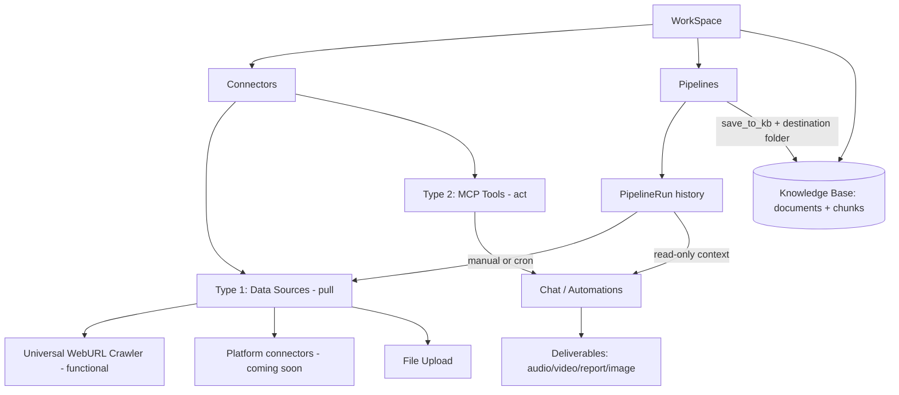

# CI Pivot MVP — Umbrella Plan

> Master roadmap for the Competitive Intelligence pivot. Each phase becomes its own subplan saved in this folder (`plans/backend/`).

This is the high-level roadmap. It is sequenced to match the agreed order: rename first, then connector restructure, then Pipelines.

> SCOPE: This umbrella currently covers the BACKEND only (`surfsense_backend`). Frontend (`surfsense_web`) and client apps (desktop, Obsidian, browser extension) will get their own umbrella/subplans LATER, once the backend is fully working as expected. Frontend-facing decisions (URL segment, TS types, i18n copy) are recorded below where relevant but are out of scope for the active phases.

## Positioning

"NotebookLM for Competitive Intelligence" — each WorkSpace acts as a workspace for setting up competitive-intelligence-optimised notebooks.

## Target architecture

## Decisions locked

- Full rename SearchSpace -> WorkSpace across DB, API, URLs, code, satellite apps.
- Canonical names (proposed defaults): DB table `workspaces`, column `workspace_id`, RBAC tables `workspace_roles` / `workspace_memberships` / `workspace_invites`, API base `/workspaces` (consolidating today's `/searchspaces` vs `/search-spaces` split), URL segment `[workspace_id]`, settings folder `workspace-settings`, TS type `Workspace`.
- Connectors get a `category` discriminator: `DATA_SOURCE` (Type 1) vs `MCP_TOOL` (Type 2). Type 1 keeps only file/cloud data sources (WebURL crawler, Google Drive, OneDrive, Dropbox, YouTube, file uploads) plus deferred platform connectors. Everything else moves to MCP. Artifacts stay in the existing `deliverables` agent system (not routed through MCP).
- Web search APIs (SearXNG, Linkup, Baidu) are repurposed as a SOURCE-DISCOVERY helper: they suggest URLs the user can add to the Universal WebURL Crawler when setting up pipelines (they are not a standalone connector type and do not index data). NOTE: Tavily and Serper are being REMOVED from the search infra and are not part of this set.
- Obsidian and Circleback (push/webhook sources) are DISABLED for the MVP.
- MCP-availability audit complete: BookStack (community MCP servers), Elasticsearch (official Elastic Agent Builder MCP), and Luma (community MCP servers) all have MCP available, so none are disabled — they migrate to Type-2.
- `Pipeline` and `PipelineRun` are new first-class tables. A Pipeline references a connector + config + schedule + KB destination. File upload creates/uses a pipeline and registers a run; uploads always save to KB.
- The chat agent gets read-only access to pipeline run history (pipelines + their recent runs/status) as context, so it can reason about what was fetched, when, and whether runs succeeded — even for data not saved to the KB.
- Deferred (post-MVP): platform scraper implementations, public pay-as-you-go API for Type-1 connectors, public MCP server exposing the KB.

## Platform connector research list (deferred build, MVP = "coming soon")

- LinkedIn — people profiles (discovery by keyword/company), company info, job listings.
- Amazon — product (ASIN), search (keyword), pricing; reviews secondary.
- Google — Web Search (organic SERP), AI Overviews, Maps/Local (discover by location).
- Instagram — profiles first, then posts; discover profiles by username/keyword.
- Zillow / Redfin — full property listings (discover by search URL/filters); Zillow price history.
- Walmart — product, search; zipcode-localized pricing premium variant.
- eBay — search by keyword/category; price-comparison/resale feeds.
- Crunchbase — company info, search by keyword (B2B lead-gen / investor research).
- TikTok / YouTube — profiles/channels, posts/videos; discover by keyword/hashtag; TikTok Shop.
- Indeed / Glassdoor — job listings (discover by keyword in location), company reviews.

## Backend phases (active — this umbrella)

### Phase 1 — Rename foundation (DB) [`subplan: 01-rename-db.md`]

- Alembic migration: rename `searchspaces` -> `workspaces`; rename `search_space_id` -> `workspace_id` on ~20 child tables; rename RBAC tables and their FKs; rename indexes/constraints (`uq_searchspace_*`, `idx_documents_search_space_id`, etc.); update Rocicorp Zero publication column lists (backend-owned `publication` definition; frontend Zero schema rename happens in the later frontend umbrella).
- Decide transition strategy: hard cutover (simplest for MVP) vs temporary API aliases for clients.
- Key files: `surfsense_backend/app/db.py`, `surfsense_backend/alembic/versions/` (new migration).

### Phase 2 — Rename backend (code + API) [`subplan: 02-rename-backend.md`]

- Rename models/schemas/services/routes/agents/tasks identifiers: `SearchSpace*` -> `Workspace*`, `search_space_id` -> `workspace_id`.
- Consolidate API to `/workspaces` and fix the `/searchspaces` vs `/search-spaces` inconsistency.
- High-touch files: `routes/search_spaces_routes.py`, `routes/rbac_routes.py`, `utils/rbac.py` (`check_search_space_access`), `schemas/search_space.py`, plus `search_space_id` threading through agents/Redis keys/storage paths (`documents/{id}/...`).

### Phase 3 — WebURL Crawler & Crawl Billing (backend) [`subplans: 03a–03d`]

The Universal WebURL Crawler is the flagship Type-1 data source (the moat). This phase hardens it on a single framework (Scrapling), generalizes proxy support, introduces pay-as-you-go crawl credits, and (deferred) adds opt-in captcha solving. It is broken into focused subplans:

- **`03a-crawler-core.md`** — Standardize the fetch layer on Scrapling. **Remove Firecrawl entirely** (no other frameworks). Define crisp per-URL success/empty/failure semantics, keep Trafilatura extraction, and expose a single billable "successful crawl" signal (one unit per URL that yields usable content, regardless of how many internal fallback tiers ran).
- **`03b-proxy-expansion.md`** — Add a BYO `CustomProxyProvider` (the only new provider — **no branded vendors**) alongside `anonymous_proxies`, selectable via a **single, app-wide** `Config.PROXY_PROVIDER`. Add bounded client-side rotation+retry via Scrapling's `ProxyRotator`/`is_proxy_error` **only** when the active provider is pool-backed (`CUSTOM_PROXY_URLS`); single-endpoint providers (incl. `anonymous_proxies`) stay the default and no-op the retry. **No per-connector/per-crawl selection** (one provider app-wide); a per-pipeline override is left as a no-op seam for Phase 5/6.
- **`03c-crawl-billing.md`** — Charge crawl credits at **$1 / 1000 successful requests = 1000 micro-USD per successful crawl**, drawn from the existing credit wallet (`credit_micros_balance`), gated by a new `WEB_CRAWL_CREDIT_BILLING_ENABLED` flag (off for self-hosted). Two surfaces: **connector/pipeline crawls** billed to the **workspace owner** via a dedicated `WebCrawlCreditService` (mirrors `EtlCreditService`'s gate → `check_credits` → `charge_credits`, **not** `billable_call`); **chat scrapes** fold their crawl cost into the chat turn's existing bill (turn accumulator). No DB migration (uses the existing free-form `web_crawl` usage_type).
- **`03d-captcha-solving.md`** *(DEFERRED — sequenced last, non-MVP-blocking)* — Covers the captcha types Scrapling does **not** (reCAPTCHA v2/v3, hCaptcha, image) via `captchatools`. `captchatools` is **itself** the provider registry (`new_harvester(solving_site=…)` across capmonster/2captcha/anticaptcha/capsolver/captchaai), so we do **not** rebuild a provider hierarchy — our layer is thin: config resolution + a StealthyFetcher `page_action` that detects the sitekey, harvests a token, and injects it. Scrapling already handles Cloudflare Turnstile (`03a`). Flags the **billing asymmetry** (solvers charge per *attempt*, `03c` bills per *success*) for resolution at build time. Requires a paid solver account.

### Phase 4 — Connector two-type restructure (backend) [`subplan: 04-connector-two-type-backend.md`]

- Add `category` (`DATA_SOURCE` / `MCP_TOOL`) to `SearchSourceConnector` (replaces ad hoc `is_indexable`): `db.py` enum/model, schema, Alembic migration + data backfill that tags existing rows.
- Adjust backend routing/indexing so only Type-1 keeps the `/index` + Celery path; Type-2 resolves via MCP tools.
- Add a backend source-discovery endpoint for the WebURL Crawler (reuses existing web-search services); UI surfacing is deferred to the frontend umbrella.
- Frontend connector UI restructure is DEFERRED.

**Type 1 — Data Sources (pull -> feed pipelines/KB).** Keep only:

- Universal WebURL Crawler (functional for MVP; from current `WEBCRAWLER_CONNECTOR`). Gets a source-discovery assist powered by the web search APIs (see below) to suggest URLs for pipelines.
- Google Drive (native + Composio) — `google_drive_indexer.py`.
- OneDrive — `onedrive_indexer.py`.
- Dropbox — `dropbox_indexer.py`.
- YouTube — promote from frontend-only/document handling to a real Type-1 connector (extra work: no backend connector today).
- File uploads.
- Platform connectors (coming soon, not built): LinkedIn, Amazon, Google, Instagram, Zillow/Redfin, Walmart, eBay, Crunchbase, TikTok, Indeed/Glassdoor.

**Type 2 — MCP Tools (act in chat/automations).** Migrate existing connectors to MCP (all audited services have an MCP available):

- Notion, GitHub, Confluence, Slack, Teams, Linear, Jira, ClickUp, Airtable, Discord, Gmail, Google Calendar. (Linear/Jira/ClickUp/Slack/Airtable already store MCP server URL + OAuth in `config`.)
- BookStack (community MCP), Elasticsearch (official Elastic Agent Builder MCP, 9.2+), Luma (community MCP) — confirmed MCP available, migrate rather than disable.
- Fix known gap: `MCP_CONNECTOR` is missing from the subagent routing map (`constants.py`) — generic MCP tools get discovered but skipped.

**Web search APIs — repurposed (not a connector type):**

- SearXNG, Linkup, Baidu become a source-discovery helper for the Universal WebURL Crawler: given a topic/competitor, suggest candidate URLs the user can add to a pipeline. Reuses the existing web-search services; backend endpoint here, UX deferred to frontend umbrella. (Tavily and Serper are removed from the search infra — see resolved log.)

**Disabled for MVP:**

- Obsidian (plugin push) and Circleback (meeting webhook) — disabled for the pivot MVP.

### Phase 5 — Pipelines data model [`subplan: 05-pipelines-model.md`]

- New tables: `pipelines` (workspace_id, user_id, connector_id, name, config JSON, schedule/cron, `save_to_kb` bool, `destination_folder_id` nullable, enabled, next_scheduled_at) and `pipeline_runs` (pipeline_id, status, trigger = manual/scheduled/upload, timestamps, doc counts, error, optional raw-result blob ref).
- Models + Pydantic schemas + Alembic migration + backend Zero publication entry.
- Pipelines API routes: CRUD + manual run trigger + list runs.

### Phase 6 — Pipeline execution + scheduling [`subplan: 06-pipelines-exec.md`]

- Run engine: pipeline run -> invoke connector fetch (WebURL crawler for MVP) -> if `save_to_kb`, route through `IndexingPipelineService` into the destination folder -> write `PipelineRun` record.
- **Crawl billing wiring (carry-over from `03c`):** `03c` meters crawls inside `webcrawler_indexer`. A pipeline run that crawls but has `save_to_kb=false` must NOT bypass billing — wire the pipeline fetch through the same `WebCrawlCreditService` (pre-check + charge on `crawls_succeeded`) regardless of the KB-save branch, ideally recording `charged_micros` on the `PipelineRun` for idempotency. Otherwise non-KB pipeline crawls are free by accident.
- Scheduling: reuse the Celery Beat meta-scheduler pattern (`schedule_checker_task.py`, `periodic_scheduler.py`) for cron + manual triggers.
- When `save_to_kb` is off, persist the raw fetch result on the run (blob via `file_storage`) so it is retrievable without indexing.
- Chat agent context: expose pipeline run history to the `multi_agent_chat` agent (read-only) — via a tool (e.g. `list_pipelines` / `get_pipeline_runs`) and/or a context middleware injection (similar to `KnowledgeTreeMiddleware`). Scope strictly to the active workspace. Gives the agent awareness of recent runs, statuses, schedules, and last-fetched timestamps.

### Phase 7 — File upload as a pipeline + KB-save-secondary [`subplan: 07-upload-pipeline-kb.md`]

- Wire file upload (`documents_routes.py` fileupload flow) to create/use an "Uploads" pipeline and register a `PipelineRun`; uploads always `save_to_kb = true`.
- Generalize KB saving to be opt-in for non-upload pipelines via `save_to_kb` + destination folder.

## Deferred — Frontend & client phases (separate umbrella, planned LATER)

These are recorded for continuity but are NOT planned in this umbrella. They start once the backend phases above are working.

- Frontend rename + i18n: route segment `[search_space_id]` -> `[workspace_id]`, `search-space-settings/` -> `workspace-settings/`, TS types, api services, Jotai atoms, components, cache keys, and "Workspace" copy across 5 locales (`messages/{en,zh,es,pt,hi}.json`), plus frontend Zero schema rename.
- Satellite/client apps + docs rename: `surfsense_desktop`, `surfsense_obsidian`, `surfsense_browser_extension`, `surfsense_evals`, README/docs.
- Connector two-type UI: restructure `connector-popup` and `connector-constants.ts` into the two labeled types.
- Pipelines UI + positioning: Pipelines section (list/create/configure/run-history/manual run), WebURL source-discovery UX, file-upload-as-pipeline surfacing, "coming soon" platform cards, "NotebookLM for Competitive Intelligence" copy.

## Open items to confirm during subplanning

- ~~Rename transition: hard cutover vs temporary API aliases~~ RESOLVED: HARD CUTOVER (see resolved log + 02-rename-backend.md). The frontend is rebuilt against the corrected backend in its own umbrella; backend is verified via tests/OpenAPI, not the old UI.
- Whether existing connector periodic-indexing config is migrated into Pipelines or coexists during MVP.
- Chat agent run-history access: tool vs middleware injection vs both (default: tool).
- Type-2 MCP migration depth: actually re-point native connectors (Notion/GitHub/Gmail/etc.) to MCP servers now, vs keep their existing native integration and just re-tag them under the MCP-Tools category for MVP.

## Resolved decisions log

- Web search APIs (SearXNG/Linkup/Baidu): repurposed as source-discovery helper for the WebURL Crawler (suggest URLs for pipelines); not a standalone connector type.
- Tavily and Serper: REMOVED from the search infra. They are dropped as search providers entirely (not repurposed). Phase 4's source-discovery endpoint must build only on the remaining providers (SearXNG, Linkup, Baidu).
- Obsidian + Circleback: disabled for MVP.
- MCP-availability audit: BookStack, Elasticsearch, Luma all have MCP available -> migrate to Type-2, none disabled.
- Rename transition policy: HARD CUTOVER of the external API (paths + JSON field names) in Phase 2 — no backward-compat aliases. Rationale: the frontend is (re)built against the corrected backend later, so there is no old client to keep alive; backend correctness is verified via the test suite + OpenAPI rather than the existing UI.
- WebURL Crawler framework: STANDARDIZE on Scrapling; **remove Firecrawl entirely** (no other scraping frameworks now or planned). Scrapling's `StealthyFetcher` handles Cloudflare; captcha-tools (deferred) covers the rest.
- Crawl billing: reuse the existing credit wallet (`credit_micros_balance`) with a new `web_crawl` usage_type. Price: **$1 / 1000 successful requests** (1000 micro-USD per success). Connector/pipeline crawls bill the **workspace owner**; chat scrapes fold their crawl cost into the already-billed chat turn. Gated by `WEB_CRAWL_CREDIT_BILLING_ENABLED` (off for self-hosted); no DB migration required.
- Billable unit: one unit per URL that returns usable extracted content, regardless of how many internal fallback tiers were attempted (not per HTTP fetch, not per URL-processed).
- Captcha solving (captcha-tools): DEFERRED to the last Phase-3 subplan (`03d`); non-MVP-blocking.
- Roadmap: WebURL Crawler & Crawl Billing inserted as the new Phase 3; connector two-type → Phase 4; pipelines → Phases 5/6/7.

## Subplan index (backend)

| Phase | Subplan file | Status |
|-------|--------------|--------|
| 1 | `01-rename-db.md` | drafted |
| 2 | `02-rename-backend.md` | drafted |
| 3 | `03a-crawler-core.md` | drafted |
| 3 | `03b-proxy-expansion.md` | drafted |
| 3 | `03c-crawl-billing.md` | drafted |
| 3 | `03d-captcha-solving.md` | drafted (deferred — last) |
| 4 | `04-connector-two-type-backend.md` | not started |
| 5 | `05-pipelines-model.md` | not started |
| 6 | `06-pipelines-exec.md` | not started |
| 7 | `07-upload-pipeline-kb.md` | not started |

Frontend & client subplans will be added under a separate umbrella later (see "Deferred — Frontend & client phases").
