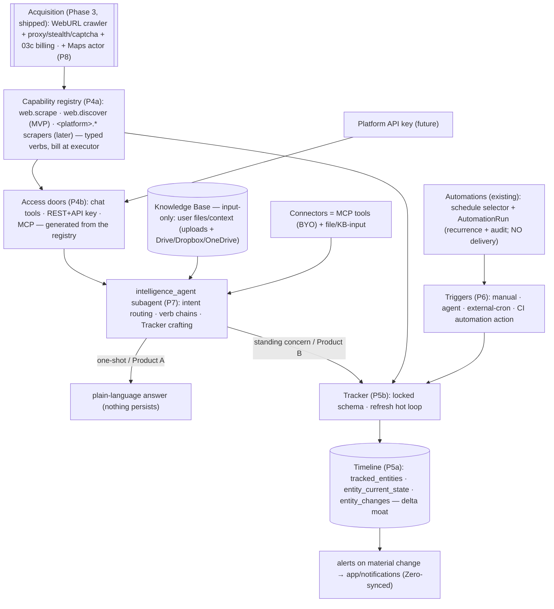
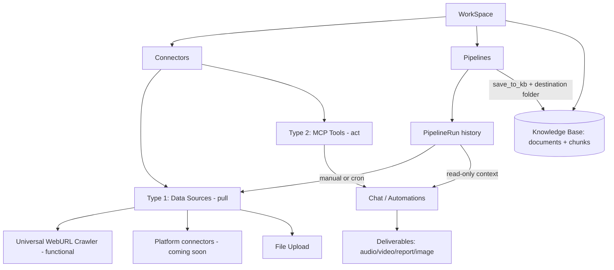

# CI Pivot MVP — Umbrella Plan

> Master roadmap for the Competitive Intelligence pivot. Each phase becomes its own subplan saved in this folder (`plans/backend/`).

This is the high-level roadmap. It is sequenced: rename first (Phases 1–2, shipped), then the WebURL crawler moat (Phase 3, shipped), then the CI product itself as **four revamped phases** — **Phase 4 Capabilities & Access**, **Phase 5 Intelligence & Timeline**, **Phase 6 Triggers**, **Phase 7 Orchestration** (canonical subplans in [`revamp phases 4-7/`](revamp%20phases%204-7/00-overview.md)). **NOTE:** the original "connectors → Pipelines" plan (old Phases 4–7) was **superseded on 2026-06-30** — see the Architecture correction below. The earlier "Phase 5′ automation-enhancements" framing is also retired (folded into Phases 4/5/6 of the revamp).

> SCOPE: This umbrella currently covers the BACKEND only (`surfsense_backend`). Frontend (`surfsense_web`) and client apps (desktop, Obsidian, browser extension) will get their own umbrella/subplans LATER, once the backend is fully working as expected. Frontend-facing decisions (URL segment, TS types, i18n copy) are recorded below where relevant but are out of scope for the active phases.

## Positioning

"NotebookLM for Competitive Intelligence" — each WorkSpace acts as a workspace for setting up competitive-intelligence-optimised notebooks.

## ⚠️ Architecture correction (2026-06-30) — Pipelines dropped; automations + input-only KB adopted

> **This supersedes the original Pipelines paradigm (Phases 5–7).** During Phase 4 discussion we concluded that the *"sync data into the KB, then operate over it"* model is wrong for competitive intelligence. Verified against `references/opencode` — a coding agent that pulls context **live** via `read`/`grep`/`webfetch`/`websearch` tools (`packages/opencode/src/tool/`) and persists **sessions**, never a scraped corpus; its `websearch` tool even live-crawls at query time (`tool/websearch.ts`). The corrected model:
>
> - **Knowledge Base = input-only** — the user's personal files/context that *enriches* the agent. Filled by file uploads + file connectors (Google Drive / Dropbox / OneDrive). **Nothing scrapes into it.** Its job is to be searchable *user-provided* context, not a dump of fetched pages.
> - **Web search + the WebURL crawler = platform-native agent tools** (already `web_search` + `scrape_webpage` on the main agent, `main_agent/tools/index.py`), always available; later exposed to developers via a platform **API key**. They are **NOT connectors and NOT pipelines**.
> - **Connectors = MCP tools** (Type-2) **+ file/KB-input connectors** (the only Type-1 that survives). All branded natives → MCP.
> - **Automations are the scheduling + run-history substrate.** An automation run already invokes the *full chat agent* (with the crawler/search tools) on a **cron/event** trigger and persists **run history** (`automation_runs`) — exactly the recurring-fetch + monitoring loop Pipelines were reinventing. You store the agent's *insight per run*, not raw snapshots.
> - **`WEBCRAWLER_CONNECTOR` is retired** — the crawler is a native tool, not a connector/data-source.
>
> **Net effect on this umbrella:** the old **Pipelines** stack (old Phases 5–7) is dropped and **Phases 4–7 are re-cast** by the canonical revamp in [`revamp phases 4-7/`](revamp%20phases%204-7/00-overview.md):
> - **Phase 4 — Capabilities & Access** (`revamp/04a` + `04b`): turn the crawler + search into **typed, callable verbs** (MVP = `web.scrape` + `web.discover`; per-platform scrapers like `maps.*`/`linkedin.*` are *later, uncommitted* drop-ins) over a single **capability registry**, exposed identically through **chat / REST+API-key / MCP** doors. Ships **Product A** (stateless utility) — revenue day one. *The old `04a-connector-category` is demoted to backward-compat hygiene; the old `04b-source-discovery` is absorbed as the `web.discover` verb.*
> - **Phase 5 — Intelligence & Timeline** (`revamp/05a` + `05b`): the `Tracker` primitive + a **3-store delta Timeline** (`tracked_entities`/`entity_current_state`/`entity_changes`, "store deltas, no change → no row"). This is the durable CI state and **the moat** — it replaces "pipelines" as the *standing concern*. Ships the **Product B** engine.
> - **Phase 6 — Triggers** (`revamp/06`): decide **when** a Tracker refreshes. `refresh(tracker)` is trigger-agnostic; recurrence is a **CI action on the existing automations** (reuse its schedule selector + `AutomationRun` — no new scheduler, no new run table). Alert **delivery is separate** (via `app/notifications/`; automations have no delivery path).
> - **Phase 7 — Orchestration** (`revamp/07`): a net-new `intelligence_agent` subagent (intent routing one-shot-vs-standing, verb chains, Tracker crafting, decision-grounded answering) so the whole product is reachable in plain language.
>
> **KB stays input-only; `WEBCRAWLER_CONNECTOR` retired; crawler/search are native tools (later a platform API key).** The three correction decisions land in their real homes: **bill crawls at the capability executor** (`revamp/04a`, works uniformly across chat/automation/REST/MCP/cron — see 03c below), **diffable run history = the Timeline delta store** (`revamp/05a`, *not* `automation_runs.output`), and **"run now" = a Trigger adapter** (`revamp/06`). Phase 8 platform scrapers re-slot as a family of **individual native endpoints** — each one a capability verb → an agent tool + a dev API-key REST endpoint — added incrementally (**none, incl. Google Maps, committed for MVP**; they're examples of the pattern), not pipeline executors.

## Target architecture (corrected + revamped)

> Full stateless/stateful end-to-end flow diagrams live in [`revamp phases 4-7/00b-pipeline-diagrams.md`](revamp%20phases%204-7/00b-pipeline-diagrams.md). Summary below.

Original (superseded) Pipelines-centric architecture

## Decisions locked

- Full rename SearchSpace -> WorkSpace across DB, API, URLs, code, satellite apps.
- Canonical names (proposed defaults): DB table `workspaces`, column `workspace_id`, RBAC tables `workspace_roles` / `workspace_memberships` / `workspace_invites`, API base `/workspaces` (consolidating today's `/searchspaces` vs `/search-spaces` split), URL segment `[workspace_id]`, settings folder `workspace-settings`, TS type `Workspace`.
- **Capabilities, not connectors, are the core of Phase 4.** The crawler + search become typed **verbs** (MVP `web.scrape` + `web.discover`; per-platform scrapers like `maps.*` are later, uncommitted drop-ins) in a single **capability registry** that generates the chat/REST/MCP doors identically (revamp `04a`/`04b`). A capability is *call → data → bill*; no `SearchSourceConnector` row, no KB write, no schedule. The **old connector two-type taxonomy is demoted to backward-compat hygiene** (kept so existing rows/KB docs stay searchable) — the one genuinely useful piece, the **`MCP_CONNECTOR` (BYO MCP) routing-gap fix**, moves into revamp `04b` (consume-user-MCP). Surviving connectors: **file/KB-input** (Google Drive native+Composio, OneDrive, Dropbox, uploads → the input-only KB) + **BYO `MCP_CONNECTOR`** (act in chat). **`WEBCRAWLER_CONNECTOR` RETIRED** (native tool); branded natives stay `MIGRATING` (off); Obsidian/Circleback `DISABLED`. Artifacts stay in the existing `deliverables` system. **~~pipeline-eligibility~~ removed.**
- Web search APIs (SearXNG, Linkup, Baidu) are repurposed as the **`web.discover` capability** (a platform-level search provider set): given a topic/competitor, suggest candidate URLs the agent (or a Tracker binding) can feed to `web.scrape`. Not a standalone connector type, does not index data. NOTE: Tavily and Serper are being REMOVED from the search infra and are not part of this set.
- **`Tracker` + Timeline are the standing-concern primitive** (replaces "pipeline"). A Tracker binds a capability + input and a locked, versioned `definition` (`field_schema`/`identity_rule`/`materiality`); its `refresh(tracker)` hot loop writes a **3-store delta Timeline** (`tracked_entities`/`entity_current_state`/`entity_changes`). **Store deltas, no change → no row.** The Timeline — not the KB, not `automation_runs` — is the only new durable CI state (revamp `05a`/`05b`).
- **Bill at the capability executor.** Each verb declares a `billing_unit`; the executor charges the workspace owner once per billable success via `WebCrawlCreditService` (03c) — so chat, automation/recurring, REST, MCP, and external-cron all meter **uniformly**. (Closes the confirmed gap where automation-run crawls billed nothing; see 03c + the Architecture correction.)
- Obsidian and Circleback (push/webhook sources) are DISABLED for the MVP.
- MCP-availability audit complete: BookStack (community MCP servers), Elasticsearch (official Elastic Agent Builder MCP), and Luma (community MCP servers) all have MCP available, so none are `DISABLED` — they're tagged `MIGRATING` (turned off for MVP like the other branded natives, pending the post-MVP MCP re-point).
- ~~`Pipeline` and `PipelineRun` are new first-class tables.~~ **SUPERSEDED** — no Pipelines. The standing-concern need is met by the **`Tracker` + Timeline** (revamp `05`), and **recurrence + audit reuse the existing automations** (schedule selector + `AutomationRun`) via a CI **action** (revamp `06`) — **no new scheduler, no new run table**. **Delivery does NOT reuse automations** (no such path; `automation_runs.output` is never written) — alerts wire to the separate `app/notifications/` system. Uploads simply populate the input-only KB (existing upload code, no pipeline wrapper).
- ~~The chat agent gets read-only access to pipeline run history~~ → the agent answers "what changed?" by reading the **Timeline** (`query_timeline`, revamp `05a`), not by re-deriving from run logs. Recurring execution audit rides `AutomationRun` (already persisted + queryable). No separate pipeline-run context tool.
- **Web search + WebURL crawler are platform-native** (agent tools now; developer platform-API-key access later). The KB is **input-only**.
- Deferred (post-MVP): platform scraper implementations (**Phase 8 — Platform actors**, public-data-only first; built in-house on the Phase-3 fetch core) surfaced as **native tools / API endpoints**, public pay-as-you-go API over the crawler/search, public MCP server exposing the KB. Logged-in/account-based scraping deferred beyond that.

## Platform connector research list (deferred build, MVP = "coming soon")

- LinkedIn — people profiles (discovery by keyword/company), company info, job listings.
- Amazon — product (ASIN), search (keyword), pricing; reviews secondary.
- Google — Web Search (organic SERP), AI Overviews, Maps/Local (discover by location).
- Instagram — profiles first, then posts; discover profiles by username/keyword.
- Zillow / Redfin — full property listings (discover by search URL/filters); Zillow price history.
- Walmart — product, search; zipcode-localized pricing premium variant.
- eBay — search by keyword/category; price-comparison/resale feeds.
- Crunchbase — company info, search by keyword (B2B lead-gen / investor research).
- TikTok / YouTube — profiles/channels, posts/videos; discover by keyword/hashtag; TikTok Shop.
- Indeed / Glassdoor — job listings (discover by keyword in location), company reviews.

## Backend phases (active — this umbrella)

### Phase 1 — Rename foundation (DB) [`subplan: 01-rename-db.md`]

> **✅ SHIPPED** (2026-06-27) · branch `feat/rename-searchspace-to-workspace` · PR [#1546](https://github.com/MODSetter/SurfSense/pull/1546) (merged to `ci_mvp` via [#1562](https://github.com/MODSetter/SurfSense/pull/1562)). Migration `170` (chains `169`, current head) does the physical rename + Zero-publication reconcile. Shipped atomically with Phase 2. As-built record + re-runnable verification live in `01-rename-db.md`. **Deploy caveat:** zero-cache replica reset (`ZERO_AUTO_RESET`) required; from-scratch `alembic upgrade head` stays pre-existing-broken (rev 23 conflict — separate baseline-squash task), only the `169→170` path is verified.

- Alembic migration: rename `searchspaces` -> `workspaces`; rename `search_space_id` -> `workspace_id` on ~20 child tables; rename RBAC tables and their FKs; rename indexes/constraints (`uq_searchspace_*`, `idx_documents_search_space_id`, etc.); update Rocicorp Zero publication column lists (backend-owned `publication` definition; frontend Zero schema rename happens in the later frontend umbrella).
- Decide transition strategy: hard cutover (simplest for MVP) vs temporary API aliases for clients.
- Key files: `surfsense_backend/app/db.py`, `surfsense_backend/alembic/versions/` (new migration).

### Phase 2 — Rename backend (code + API) [`subplan: 02-rename-backend.md`]

> **✅ SHIPPED** (2026-06-27) · branch `feat/rename-searchspace-to-workspace` · PR [#1546](https://github.com/MODSetter/SurfSense/pull/1546) (merged to `ci_mvp` via [#1562](https://github.com/MODSetter/SurfSense/pull/1562)). Symbolic rename across `app/` + `tests/` (Phase-1 shim dropped), API consolidated to `/workspaces` (legacy `/searchspaces` · `/search-spaces` · `/search-space` all retired/404). Verified (ground-truth `git grep`, 2026-06-29): every residual `search_space`/`SEARCH_SPACE` is a documented carve-out — enum values (`ConnectionScope`/`ChatVisibility.SEARCH_SPACE`), the `'SEARCH_SPACE'` CHECK literal (now paired with `workspace_id`), Celery wire names (`delete_search_space_background`, `ai_sort_search_space`), OTel key `search_space.id`, and the `SEARCH_SPACE_FORBIDDEN` error code; `alembic/versions/` untouched except `168`+`170`. Suite: `3016 passed, 1 skipped`. As-built record in `02-rename-backend.md`. **Clients are intentionally broken** until the frontend/satellite umbrellas land (hard cutover).

- Rename models/schemas/services/routes/agents/tasks identifiers: `SearchSpace*` -> `Workspace*`, `search_space_id` -> `workspace_id`.
- Consolidate API to `/workspaces` and fix the `/searchspaces` vs `/search-spaces` inconsistency.
- High-touch files: `routes/search_spaces_routes.py`, `routes/rbac_routes.py`, `utils/rbac.py` (`check_search_space_access`), `schemas/search_space.py`, plus `search_space_id` threading through agents/Redis keys/storage paths (`documents/{id}/...`).

### Phase 3 — WebURL Crawler & Crawl Billing (backend) [`subplans: 03a–03f`]

The Universal WebURL Crawler is the flagship Type-1 data source (**the moat**). This phase hardens it into an **in-house, best-effort "undetectable, captcha-bypassing" crawler** on a single framework (Scrapling): it standardizes the fetch layer, generalizes proxy support, introduces pay-as-you-go crawl credits, adds **stealth hardening** (geoip coherence, persistent profiles, headed/Xvfb, fonts, humanization, a block classifier + per-domain strategy memory), and adds **opt-in captcha solving**. All tiers plug in behind a single `FetchStrategy` seam returning `CrawlOutcome`, so callers never depend on *how* a page was fetched — that seam is what lets the moat grow (and lets a **deferred paid-unblocker tier** drop in later by config). **Strategy decision (recorded in the log):** CloakBrowser is rejected on licensing and external unblocker APIs are deferred; we hold an in-house bypass moat for ~4–6 months, then move hostile targets to a paid tier if demand/maintenance justifies it. **Logged-in/account-based bypass is out of scope** (public data only this MVP). It is broken into focused subplans:

> **Sequencing within Phase 3 (critical path vs hardening).** Only **`03a` + `03b` + `03c`** are on the **MVP critical path**. The crawler (`03a` `CrawlOutcome`) + proxy provider (`03b`) + `03c` `WebCrawlCreditService` billing seam are consumed by the **capability verbs** (revamp `04a`) that back every chat / automation / REST / MCP path (the crawler is a platform-native tool — see Architecture correction; the old "Phases 4–7 pipelines consume this" framing is superseded). **`03d` (captcha), `03e` (stealth hardening), and `03f` (test harness) are hardening/measurement that nothing downstream imports** — they tune the *same* seam behind the *same* contract, so they can land **in parallel with, or after, Phase 4** without blocking the pivot. Recommended build order: `03a → 03b → 03c` (then revamp `04a` Capabilities → `04b` Access → `05` Intelligence & Timeline), with `03e → 03d → 03f` slotted in whenever crawler robustness is prioritized.

- **`03a-crawler-core.md`** *(✅ IMPLEMENTED — `ci_mvp` @ `5c36cd3`; crawler moved to `app/proprietary/web_crawler/`, `impersonate="chrome"` + `solve_cloudflare=True` shipped)* — Standardize the fetch layer on Scrapling. **Remove Firecrawl entirely** (no other frameworks). Define crisp per-URL success/empty/failure semantics, keep Trafilatura extraction, and expose a single billable "successful crawl" signal (one unit per URL that yields usable content, regardless of how many internal fallback tiers ran).
- **`03b-proxy-expansion.md`** *(✅ IMPLEMENTED — `ci_mvp` @ `6226012`)* — Add a BYO `CustomProxyProvider` (the only new provider — **no branded vendors**) alongside `anonymous_proxies`, selectable via a **single, app-wide** `Config.PROXY_PROVIDER`. Add bounded client-side rotation+retry via Scrapling's `ProxyRotator`/`is_proxy_error` **only** when the active provider is pool-backed (`CUSTOM_PROXY_URLS`); single-endpoint providers (incl. `anonymous_proxies`) stay the default and no-op the retry. **No per-connector/per-crawl selection** (one provider app-wide); a per-capability/per-Tracker override is left as a no-op seam (revamp `04a`/`05`), not built.
- **`03c-crawl-billing.md`** *(✅ IMPLEMENTED — `ci_mvp` @ `17bdb0682`)* — Charge crawl credits at **$1 / 1000 successful requests = 1000 micro-USD per successful crawl** (config-driven via `WEB_CRAWL_MICROS_PER_SUCCESS`, retunable with no code change), drawn from the existing credit wallet (`credit_micros_balance`), gated by a new `WEB_CRAWL_CREDIT_BILLING_ENABLED` flag (off for self-hosted). Billing surfaces (**reframed** by the Architecture correction + revamp — see log): the charge moves to the **capability executor** (revamp `04a`), so **every** caller meters uniformly — chat, **automation/recurring** (the confirmed gap: `run_agent_task` establishes no turn accumulator today, so `scrape_webpage` bills nothing under automations), REST, MCP, and external-cron — billing the **workspace owner** via `WebCrawlCreditService`. The interactive **chat turn accumulator** becomes an *optional presentation fold* (so chat still shows the crawl line on the turn bill), **not** the charging mechanism. The original **connector/pipeline-indexer** billing branch (`webcrawler_indexer`) is now **vestigial** (WEBCRAWLER connector retired, no pipelines) — kept dormant, not deleted. The `WebCrawlCreditService` (mirrors `EtlCreditService`'s gate → `check_credits` → `charge_credits`) is unchanged. No DB migration (uses the existing free-form `web_crawl` usage_type).
- **`03e-stealth-hardening.md`** — The in-house "undetectable" layer on top of Scrapling's default patchright-Chromium stealth. **Geoip coherence** (match browser `locale`/`timezone_id` to the proxy's exit geo), **fingerprint flags** (`hide_canvas`/`block_webrtc`), **persistent per-domain profiles** (`user_data_dir`), **headed execution under Xvfb**, **real fonts** in the worker image, and **DIY behavioral humanization** via `page_action` (the Chromium engine has no built-in `humanize`). Adds a **block classifier** (label Cloudflare/DataDome/Kasada/captcha/empty from the response) + **per-domain strategy memory** (Redis, no migration) so the ladder learns the known-good tier per domain. Defines — but does **not** build — the **deferred paid-unblocker `FetchStrategy`** (ZenRows/ScrapFly/Bright Data) as the config-flagged escape hatch, with its own (later) billing. Honest ceiling: defeats Cloudflare + the moderate long tail, **not** top-tier behavioral fingerprinting (DataDome/Kasada/reCAPTCHA-Enterprise) — that's the deferred tier.
- **`03d-captcha-solving.md`** *(✅ IMPLEMENTED — `ci_mvp`; `captchatools` page_action + per-attempt `web_crawl_captcha` billing, off by default)* — Covers the captcha types Scrapling does **not** (reCAPTCHA v2/v3, hCaptcha, image) via `captchatools`, **opt-in + off by default**. `captchatools` is **itself** the provider registry (`new_harvester(solving_site=…)` across capmonster/2captcha/anticaptcha/capsolver/captchaai), so we do **not** rebuild a provider hierarchy — our layer is thin: config resolution + a StealthyFetcher `page_action` that detects the sitekey, harvests a token (egressing from the **same** proxy IP as the crawl), and injects it. Scrapling already handles Cloudflare Turnstile (`03a`), and `page_action` runs **after** `solve_cloudflare`, so the tiers compose. The **billing asymmetry** is now **resolved**: a **separate per-attempt** `web_crawl_captcha` unit (solvers charge per attempt regardless of crawl success), attached via a `WebCrawlCreditService` seam in `03c`. `ErrNoBalance` stops solving (no retry loop → avoids IP bans). Requires a paid solver account.
- **`03f-undetectability-testing.md`** *(✅ IMPLEMENTED + first baseline — `ci_mvp`, MANUAL-only, no CI gating; lives under `app/proprietary/web_crawler/testbench/`)* — A **manual scorecard harness** that drives the real Scrapling tiers against the industry-standard detection + sandbox sites (modeled on CloakBrowser's `bin/cloaktest` suite) to **quantify the free-stack ceiling** over time. Two labeled axes: **Suite S (stealth/anti-bot)** — browser-tier (`bot.sannysoft`, `bot.incolumitas`, CreepJS, `deviceandbrowserinfo`, FingerprintJS demo, reCAPTCHA-v3 score, `fingerprint-scan`/Castle.js, `browserscan`, **`cloudflare-challenge`** exercising `solve_cloudflare`, **`iphey`** geoip-coherence), HTTP/TLS-tier JA3/JA4 parity (`tls.peet.ws`, **informational** not a gate), and proxy/leak checks (`httpbin/ip`, WebRTC/DNS); **Suite E (extraction correctness)** — toscrape/scrapethissite sandboxes for the HTTP vs JS (DynamicFetcher) tiers. **Every detection site is auto-graded from its real DOM verdict** (parsers written against captured dumps; `INFO` reserved for TLS/IP/manual rows). Reuses `03d`'s `page_action`+closure-cell mechanism. Adopts CloakBrowser's bars as **aspirational** (sannysoft 0 fails, CreepJS ≤30%, reCAPTCHA ≥0.7) while recording **our actual numbers as the baseline** (the whole `results/` tree is **gitignored**, run-local). **First baseline (2026-06-30, headless, rotating residential, captcha OFF): Suite S 6 PASS / 4 FAIL** — PASS sannysoft, deviceandbrowserinfo, reCAPTCHA-v3 (0.9), BrowserScan, fingerprint-scan (35/100), cloudflare-challenge; FAIL CreepJS (`hasHeadlessWorkerUA` worker-UA leak → `03e` Slice-B candidate), FingerprintJS Pro (commercial ceiling), iphey ("Unreliable" → expected geoip-coherence fix), incolumitas (legacy `fpscanner WEBDRIVER` only). The scorecard is the documented **trigger** for flipping `03e`'s deferred paid-unblocker tier.

### Phase 4 — Capabilities & Access (backend) [`subplans: revamp/04a–04b`]

> **Canonical subplans:** [`revamp phases 4-7/04a-capabilities.md`](revamp%20phases%204-7/04a-capabilities.md) + [`04b-access.md`](revamp%20phases%204-7/04b-access.md). Together they ship **Product A** (stateless utility) — revenue day one. **Build `04a` first** — every later phase calls the registry.

- **`revamp/04a-capabilities.md`** — Turn Acquisition (crawler + search + a future Maps actor) into a **small set of typed, callable verbs** over a single **capability registry**. MVP verbs = **only `web.scrape(urls[])`** (array-friendly, inline-or-job) **+ `web.discover(query, top_k)`** (SearXNG/Linkup/Baidu). **Platform-specific scrapers** (Maps/LinkedIn/Amazon/… — *examples, none committed*) are a family of **individual endpoints** added later: each is just another verb → agent tool + dev API-key REST endpoint, so `04a` only ships **contract stubs** for them, not executors. Uniform result **envelope** (`completed | pending + job_id`); slow calls use a **thin job record** + existing Celery (not a resurrected `pipeline_runs`). Each verb declares a **`billing_unit`**; charging is **delegated to the billing service** (03c is the first provider) and happens **at the executor** so every door meters uniformly. New Apache-2 package `app/capabilities/`; Maps extractor stays proprietary.
- **`revamp/04b-access.md`** — Expose the registry through **three generated doors** (order: chat → REST+API-key → MCP), each the same thin adapter (`parse → validate → authn/authz → 03c meter-gate → same executor → serialize → envelope`). **Natural language is the only human-facing surface** (users never name verbs); an **intent router** classifies one-shot (Product A) vs standing-concern (Product B). Slow chat verbs reuse the shipped `deliverable_wait` poll-until-terminal + live-card path. This is where the **BYO-`MCP_CONNECTOR` routing-gap fix** (from the old `04a`) lands (consume-user-MCP).

**Locked model (MVP):**

- **Capabilities replace connectors as data sources.** `web.scrape` / `web.discover` (MVP) — and later per-platform scraper verbs — are *call → data → bill* verbs — no `SearchSourceConnector` row, no KB write, no schedule.
- **Surviving connectors = file/KB-input + BYO MCP.** File/KB-input (Google Drive native+Composio, OneDrive, Dropbox, uploads) put the user's personal files into the **input-only** KB. BYO `MCP_CONNECTOR` (act in chat) is the only functional Type-2; its routing-gap fix lands in `revamp/04b`. **`WEBCRAWLER_CONNECTOR` RETIRED.** The old connector two-type taxonomy (`04a-connector-category`) is **demoted to backward-compat hygiene**.
- **Deprecated (`MIGRATING`, off for MVP):** every branded native — indexers (Notion, GitHub, Confluence, BookStack, Elasticsearch) + act-only (Slack, Teams, Linear, Jira, ClickUp, Airtable, Discord, Gmail, Google Calendar, Luma, + Composio Gmail/Calendar). Existing rows + already-indexed KB docs stay **searchable**; new-create/`/index`/periodic/subagents off. Real MCP migration is post-MVP.
- **Disabled (`DISABLED`):** Obsidian (plugin push) and Circleback (meeting webhook).
- Web search: **drop all 5 search-API `connector_type` values** (`SERPER_API`/`TAVILY_API`/`SEARXNG_API`/`LINKUP_API`/`BAIDU_SEARCH_API`); survivors (SearXNG/Linkup/Baidu) become the `web.discover` provider set keyed by **platform env** (Linkup/Baidu keys move off per-connector `config`). Destructive migration deletes the 5 types' rows. (Absorbs the old `04b-source-discovery`.)
- The deferred "coming soon" platforms (LinkedIn, Amazon, Google, Instagram, Zillow/Redfin, Walmart, eBay, Crunchbase, TikTok, Indeed/Glassdoor) re-slot as **Phase 8 native verbs / API endpoints**, not Type-1 KB connectors.
- Frontend connector/capability UI restructure is DEFERRED (frontend umbrella).

### Phase 5 — Intelligence & Timeline (backend) [`subplans: revamp/05a–05b`]

> **Canonical subplans:** [`revamp phases 4-7/05a-timeline.md`](revamp%20phases%204-7/05a-timeline.md) + [`05b-intelligence.md`](revamp%20phases%204-7/05b-intelligence.md). Ships the **Product B engine**. **Depends on `04a`** (the verbs the loop calls). **Build `05a` (tables) before `05b` (the loop that writes them).** This *replaces* the old Pipelines Phases 5–7 — the durable CI state, and **the moat**.

- **`revamp/05a-timeline.md`** — The **3-store delta Timeline**: `tracked_entities` (stable identity, written once), `entity_current_state` (latest values + `content_hash` + `last_checked_at`, overwritten each run), `entity_changes` (append-only material deltas: `{field:{from,to}}`, `materiality`, `decided_by`, `source_ref`). **Store deltas, no change → no row** (storage ∝ rate of change). Explicitly **not the KB, not `automation_runs`, not a resurrected `pipeline_runs`.** New CI-owned Apache-2 tables + Alembic migration; write/read API for the `05b` loop and the read side. **This is where "diffable run history" actually lives** (superseding the old "structured `automation_runs.output`" idea).
- **`revamp/05b-intelligence.md`** — The `Tracker` primitive + the **hot loop** `refresh(tracker)`: crawl (call the bound verb) → **content-hash pre-check** (identical → stamp `last_checked_at`, stop, no LLM) → **fill** raw data to the locked `field_schema` (structured output; extras → `notable_signals`) → **diff** (code) → **judge — the materiality split** (deterministic numeric/clear rules in code for free; agent only on ambiguous) → **append** a change + overwrite current state, else only `last_checked_at`. Setup = an **agent-designed, human-locked, versioned schema** flow (sample-fetch → draft `definition` → review/lock). **No new run table:** recurring audit/idempotency ride `AutomationRun`, manual rides the chat job record; **billing idempotency is per-capability-call** + the hash pre-check. Optional **CI context folder** (user files uploaded in a CI chat go into the KB as normal, routed to a folder, and can feed the judge). New Apache-2 package `app/intelligence/`.

### Phase 6 — Triggers (backend) [`subplan: revamp/06-triggers.md`]

> **Canonical subplan:** [`revamp phases 4-7/06-triggers.md`](revamp%20phases%204-7/06-triggers.md) — the thinnest phase. **Depends on `05b`** (`refresh(tracker)`). Decides **when** a Tracker refreshes; Intelligence never knows which trigger fired.

- Adapters: **manual** (user "refresh now" via chat tool / REST), **agent** (the agent calls `refresh` as a tool), **external cron** (`POST /v1/trackers/{id}/refresh`, zero infra on us), and the **CI automation action** — recurrence reusing the **existing automations**: its hardened **schedule selector** (no new scheduler) + **`AutomationRun`** (no new run table). **Alert delivery is separate** — persist deltas to the Timeline, then emit an in-app notification via `app/notifications/` (automations have no delivery path; `run.output` is unwritten). Guard concurrency with a **per-Tracker lock** (the automation PENDING-gate is non-atomic). A single `refresh_tracker` action, **not** a new automation shape.
- **Decoupling preserved:** CI core (`refresh` + Timeline) runs with **zero** automations dependency (manual/agent/external-cron); automations is the **optional** in-app recurrence+alert adapter. This is the correct home for the old "wire a run-now trigger" item.

### Phase 7 — Orchestration (backend) [`subplan: revamp/07-orchestration.md`]

> **Canonical subplan:** [`revamp phases 4-7/07-orchestration.md`](revamp%20phases%204-7/07-orchestration.md) — the human-facing brain. **Build last** (atop `04`–`06`). We plug into the shipped multi-agent runtime; we don't rebuild it.

- Ship the net-new builtin **`intelligence_agent`** subagent (peer to `research`/`deliverables`): **intent routing** (one-shot vs standing concern, one clarifying question when ambiguous), **verb composition** (`web.discover → web.scrape`, `maps.search → maps.place → maps.reviews`), **Tracker crafting** (the `05b` schema-design flow in chat), and **decision-grounded answering** (read the Timeline via `query_timeline`, not chat history).
- Toolset: registry-backed capability verbs (shared with `research`) + Tracker/Timeline tools (`craft_tracker`/`lock_tracker`/`refresh_tracker`/`query_timeline`/`list_trackers`); slow verbs reuse `deliverable_wait`. Tools follow the shipped `scrape_webpage` shape (executor + door + 03c billing).

### (Future) Platform API-key + public MCP

Platform **API-key** access to the capability verbs + a public **MCP server** exposing the input-only KB — post-MVP (see Phase 8 + Deferred).

### Phase 8 — Platform actors (FUTURE — post-MVP, public data only) [`subplan: TBD`]

NOT planned in this umbrella; recorded so the Phase-3 architecture stays aimed at it. Once the hardened fetch core (Phases 3a–3e) is solid, **platform scrapers** — a family of **individual scraping endpoints** (Google Maps/Local, LinkedIn public profiles/companies, Amazon products, etc. — see "Platform connector research list"; **all examples, none committed**) — layer **on top** of it. **Each is simply another capability verb** (`revamp/04a`), so registering one automatically yields (a) an **agent tool** and (b) a **dev-callable REST endpoint behind the platform API key** — same executor, same billing, no new machinery. Each is a per-platform structured extractor built in-house "Apify-style" on the `03a` crawler core (proxies + `03e` hardening + `03d` captcha), callable by the chat agent, by automations, and by the future platform API key. Billed per call via `WebCrawlCreditService`.

- **Public data only** at first — discovery/extraction of publicly visible pages. **Logged-in/account-based bypass is explicitly deferred** beyond Phase 8's first cut; it needs sticky/static proxies + credential management (`03b` static-proxy hand-off) and is the higher-risk, later workstream.
- The **deferred paid-unblocker tier** (`03e §8`) is the fallback for any platform whose anti-bot exceeds the in-house ceiling.

## Deferred — Frontend & client phases (separate umbrella, planned LATER)

These are recorded for continuity but are NOT planned in this umbrella. They start once the backend phases above are working.

- Frontend rename + i18n: route segment `[search_space_id]` -> `[workspace_id]`, `search-space-settings/` -> `workspace-settings/`, TS types, api services, Jotai atoms, components, cache keys, and "Workspace" copy across 5 locales (`messages/{en,zh,es,pt,hi}.json`), plus frontend Zero schema rename.
- Satellite/client apps + docs rename: `surfsense_desktop`, `surfsense_obsidian`, `surfsense_browser_extension`, `surfsense_evals`, README/docs.
- Connector two-type UI: restructure `connector-popup` and `connector-constants.ts` into the two labeled types.
- CI + automations + positioning UI (**replaces the superseded "Pipelines UI"**): the CI experience (Tracker crafting/review-&-lock, Timeline/change views, "refresh now"), automation create/list/run-history, `web.discover` source-suggestion UX, input-only KB framing (uploads + file connectors), MCP connector management, "coming soon" platform cards, "NotebookLM for Competitive Intelligence" copy.

## Open items to confirm during subplanning

- ~~Rename transition: hard cutover vs temporary API aliases~~ RESOLVED: HARD CUTOVER (see resolved log + 02-rename-backend.md). The frontend is rebuilt against the corrected backend in its own umbrella; backend is verified via tests/OpenAPI, not the old UI.
- ~~Whether existing connector periodic-indexing config is migrated into Pipelines or coexists during MVP.~~ **MOOT** (Architecture correction — no pipelines). Connector periodic indexing stays as-is for file sources; there is no pipeline scheduler to coexist with.
- ~~Chat agent run-history access: tool vs middleware injection vs both (default: tool).~~ **MOOT** (Architecture correction — no pipeline runs). The agent's recurring work is automations, whose history is already persisted + queryable (`automation_runs`).
- ~~Type-2 MCP migration depth~~ RESOLVED (Phase 4): branded natives are tagged `MIGRATING` and turned OFF for MVP (not re-pointed to MCP yet); only the generic `MCP_CONNECTOR` is a functional Type-2. Real MCP re-pointing is post-MVP.
- **Revamp cross-phase forks (from `revamp/00-overview.md`, decide during subplanning):** (1) schema **review-&-lock** UX pre-frontend — pure-chat confirmation for MVP? (`05b`); (2) Timeline ORM home — `app/db.py` vs a dedicated `app/timeline/` (`05a`); (3) recurrence = CI **action** on automations (default) vs a thin CI automation **shape** (fallback) (`06`); (4) is `web.discover` metered or free (`04a`); (5) MCP-serve auth depth — OAuth 2.1 vs bearer (`04b`).

## Resolved decisions log

- **REVAMP ADOPTED as canonical (2026-06-30) — Phases 4–7 re-cast; `revamp phases 4-7/` is the source of truth.** A principal-engineer review found the flat `04a–07` files and my earlier "Phase 5′" framing had been overtaken by a more complete engineer draft in [`revamp phases 4-7/`](revamp%20phases%204-7/00-overview.md). We adopt the revamp: **Phase 4 = Capabilities & Access** (typed verbs + generated doors; old `04a-connector-category` demoted to hygiene, old `04b-source-discovery` absorbed as `web.discover`), **Phase 5 = Intelligence & Timeline** (the `Tracker` + 3-store delta Timeline — the moat), **Phase 6 = Triggers** (reuse automations via a CI action), **Phase 7 = Orchestration** (`intelligence_agent`). The three architecture-correction decisions land in their real homes and one is revised: (1) **bill at the capability executor** — a code-verified gap review confirmed `run_agent_task` (automation `agent_task`) sets up **no turn accumulator**, so today `scrape_webpage` bills nothing under automations; billing moves to the executor so chat/automation/REST/MCP/cron meter uniformly (chat turn accumulator becomes optional presentation). (2) **"diffable run history" = the Timeline delta store** (`revamp/05a`), **superseding** the earlier "structured `automation_runs.output`" decision. (3) **"run now" = a Trigger adapter** (`revamp/06`). The flat `04a/04b/05/06/07` files are retained with redirect banners; **`revamp/` filenames win** on any number collision. Build order: `04a → 04b → 05a → 05b → 06 → 07`.
- **ARCHITECTURE CORRECTION (2026-06-30) — Pipelines dropped; automations + input-only KB adopted.** The "sync into KB → operate over it" paradigm was judged wrong for CI. Verified against `references/opencode` (live tool-fetched context + persisted sessions, no scraped corpus; `tool/websearch.ts` live-crawls at query time). Decisions: (1) **KB is input-only** — user's personal files/context (uploads + Drive/Dropbox/OneDrive); nothing scrapes into it. (2) **Web search + WebURL crawler are platform-native tools** (already `web_search`/`scrape_webpage`), later a developer platform-API-key surface — NOT connectors, NOT pipelines. (3) **Connectors = MCP tools + file/KB-input connectors**; all branded natives → MCP. (4) **Automations are the scheduling + run-history substrate** (an `agent_task` run already invokes the full chat agent with the crawler/search tools on cron/event and persists `automation_runs`). (5) **`WEBCRAWLER_CONNECTOR` RETIRED.** Consequences: **Phases 5/6/7 SUPERSEDED** (docs kept with banners); **Phase 4a reframed** (drop `is_pipeline_eligible`; Type-1 = file/KB-input only; WEBCRAWLER retired); **Phase 4b stands**; new **Phase 5′** automation-enhancement workstream (bill automation-run crawls; structured `run.output`; wire "run now"); **Phase 8** actors re-slot as native tools/API. `03c` connector-indexer billing branch becomes **vestigial** (billing lives on chat-turn / automation-run / API paths).
- ~~Web search APIs (SearXNG/Linkup/Baidu): repurposed as source-discovery helper for the WebURL Crawler (suggest URLs for pipelines)~~ — still repurposed as a source-discovery helper (04b), but "for pipelines" → "for the user / the native crawler tool" (pipelines dropped); not a standalone connector type.
- Tavily and Serper: REMOVED from the search infra. They are dropped as search providers entirely (not repurposed). Phase 4's source-discovery endpoint must build only on the remaining providers (SearXNG, Linkup, Baidu).
- Obsidian + Circleback: disabled for MVP.
- MCP-availability audit: BookStack, Elasticsearch, Luma all have MCP available -> eligible for Type-2 (so deprecated as `MIGRATING`, not `DISABLED`). For MVP they are turned off pending the post-MVP MCP re-point, like the other branded natives.
- Phase 4 connector taxonomy: modeled as a STATIC code registry (`connector_type` -> category/availability), NOT a DB column — no migration in 04a; `is_indexable` is KEPT (orthogonal). Only the generic `MCP_CONNECTOR` is a functional Type-2 for MVP; all branded natives (indexers + act-only, incl. Composio Gmail/Calendar) are `MIGRATING` (new-create blocked, `/index`+periodic+their subagents off, existing KB docs stay searchable). The `MCP_CONNECTOR` subagent routing-map gap (`constants.py`) is fixed in 04a.
- Phase 4 search APIs: all 5 enum values dropped (`SERPER_API`/`TAVILY_API`/`SEARXNG_API`/`LINKUP_API`/`BAIDU_SEARCH_API`) in 04b. Survivors (SearXNG/Linkup/Baidu) become PLATFORM providers keyed by env (Linkup/Baidu keys move from per-connector `config` to env — app-wide, not per-workspace). 04b carries a destructive migration deleting the 5 connector types' rows.
- Phase 4 structure: split into 04a (taxonomy/gating/MCP-fix, no migration) and 04b (search repurposing + source-discovery endpoint, with migration); intended order 04a -> 04b (both orders safe).
- Rename transition policy: HARD CUTOVER of the external API (paths + JSON field names) in Phase 2 — no backward-compat aliases. Rationale: the frontend is (re)built against the corrected backend later, so there is no old client to keep alive; backend correctness is verified via the test suite + OpenAPI rather than the existing UI.
- Crawler code location & licensing boundary (decided during 03a impl): the WebURL crawler engine — and future Phase-8 platform actors — live under `surfsense_backend/app/proprietary/`, a **non-Apache-2 license boundary** (its own `LICENSE`, currently an all-rights-reserved placeholder; the repo root stays Apache-2). 03a's `WebCrawlerConnector` / `CrawlOutcome` / `CrawlOutcomeStatus` moved to `app/proprietary/web_crawler/` (public API re-exported from its `__init__`); the 3 Apache-2 callers (webcrawler indexer + both chat `scrape_webpage` tools) import `from app.proprietary.web_crawler import ...`. Rule: everything under `app/proprietary/**` is non-Apache-2; Apache-2 code may import *from* it but not move *into* it. Rationale: keep the moat under a clearly-bounded, swappable license.
- Proxy code placement (decided during 03b): the proxy provider package (`app/utils/proxy/` — base/registry/`anonymous_proxies`/`CustomProxyProvider`/rotation) **stays Apache-2 shared infra**, NOT proprietary. Rationale: it's consumed by Apache-2 features unrelated to the moat (YouTube transcript route + indexer, chat tools' YouTube branch), and `CustomProxyProvider` is a thin wrapper over Scrapling's *public* `ProxyRotator`. Only the crawl-ladder-coupled rotation-retry (`app/proprietary/web_crawler/connector.py::_run_tier_with_proxy_retry`) lives under the boundary. **Boundary test:** code goes in `app/proprietary/` only if used *exclusively* by the moat (applies to 03e's geoip/sticky-proxy hardening too — the bypass-specific tuning is proprietary; the generic provider plumbing is not).
- WebURL Crawler framework: STANDARDIZE on Scrapling; **remove Firecrawl entirely** (no other scraping frameworks now or planned). Scrapling's `StealthyFetcher` (patchright-Chromium as of 0.4.9 — **not** Camoufox) handles Cloudflare; `03e` stealth-hardening minimizes challenges; captcha-tools (`03d`) covers the rest. All fetch tiers sit behind a `FetchStrategy` seam returning `CrawlOutcome` (callers never depend on the tier).
- Crawl billing: reuse the existing credit wallet (`credit_micros_balance`) with a new `web_crawl` usage_type. Price: **$1 / 1000 successful requests** (1000 micro-USD per success). Connector/pipeline crawls bill the **workspace owner**; chat scrapes fold their crawl cost into the already-billed chat turn. Gated by `WEB_CRAWL_CREDIT_BILLING_ENABLED` (off for self-hosted); no DB migration required.
- Billable unit: one unit per URL that returns usable extracted content, regardless of how many internal fallback tiers were attempted (not per HTTP fetch, not per URL-processed).
- Captcha solving (captcha-tools): **ACTIVE** (no longer deferred) — sequenced last in Phase 3 (`03d`), **after** `03e` hardening, **opt-in + off by default**. Cloudflare stays in-framework (`03a`); reCAPTCHA/hCaptcha/image use `captchatools`. **Billing asymmetry RESOLVED → option (a): a separate per-attempt `web_crawl_captcha` unit** (`WEB_CRAWL_CAPTCHA_*` knobs on `WebCrawlCreditService`), since solvers charge per attempt regardless of crawl success. `ErrNoBalance` halts solving (no retry-loop IP bans).
- Crawler stealth strategy (the moat): **CloakBrowser REJECTED** (source-patched Chromium binary requires an OEM/SaaS license incompatible with our model). **External unblocker APIs DEFERRED** (ZenRows/ScrapFly/Bright Data) — pre-wired as a config-flagged `FetchStrategy` (`03e §8`) but not built. Plan: maintain an **in-house bypass moat for ~4–6 months** (Scrapling stealth + residential proxies + `03e` hardening + `03d` captcha), then move hostile/top-tier-fingerprinted targets (DataDome/Kasada/reCAPTCHA-Enterprise) to a paid tier if demand/maintenance justifies it. Realistic ceiling acknowledged: in-house beats Cloudflare + the moderate long tail, not top-tier behavioral fingerprinting.
- Authenticated/logged-in scraping: **OUT OF SCOPE this MVP** (public data only). Sticky/static proxies + credential management are deferred and paired with the future platform actors (`03b` static-proxy hand-off + Phase 8).
- Phase 3 stealth-hardening subplan `03e` ADDED: geoip locale/tz coherence, `hide_canvas`/`block_webrtc`, persistent per-domain profiles, headed+Xvfb, fonts, DIY humanization (`page_action`; Chromium engine has no built-in `humanize`), a block classifier, and per-domain strategy memory (Redis, no migration).
- Phase 3 test-harness subplan `03f` ADDED: **manual-only** (no CI/automated gating now) undetectability + extraction scorecard, modeled on CloakBrowser's `bin/cloaktest`. Two labeled axes (Suite S stealth + Suite E extraction) so they scale independently. Drives the **real** Scrapling tiers (browser + curl_cffi HTTP/TLS), reuses `03d`'s `page_action`+closure-cell for JS-object verdicts. **TLS JA3/JA4 parity = informational axis, not a hard gate.** Adopt CloakBrowser bars as aspirational; record our actual free-stack numbers as the committed baseline. The scorecard is the documented evidence/trigger for flipping `03e`'s deferred paid-unblocker tier.
- Licensing placement of 03e/03f code (decided during 03f impl, applying the §boundary test): the **stealth kwargs builder + geoip coherence** (`03e` bypass tuning) live **proprietary** at `app/proprietary/web_crawler/stealth.py`; the **block classifier** (passive telemetry, public markers) stays **Apache-2** at `app/utils/crawl/classifier.py` (direct analog of the captcha split: proprietary `captcha.py` logic + Apache-2 `app/utils/captcha/` config). The **03f scorecard harness** moved whole to `app/proprietary/web_crawler/testbench/` (run `python -m app.proprietary.web_crawler.testbench`) — it's the moat's measurement tool and can't be cleanly half-moved (a proprietary Suite S would back-import generic scaffolding from `scripts/`, a forbidden app→scripts direction). The `scripts/e2e_phase3_crawl_billing.py` billing e2e stays in `scripts/` (Apache-2) since it exercises billing, not the stealth moat.
- Roadmap: WebURL Crawler & Crawl Billing inserted as the new Phase 3; connector two-type → Phase 4; pipelines → Phases 5/6/7.
- **[SUPERSEDED — Architecture correction 2026-06-30; no pipelines]** Phase 5 pipelines data model: two new tables `pipelines` (mutable) + `pipeline_runs` (append-only), modeled on `automations`/`automation_runs`; ORM lives in `db.py` next to connectors/folders. `connector_id` nullable (NULL = Phase-7 Uploads), eligibility enforced at create via 04a's `is_pipeline_eligible`. Schedule = `schedule_cron` + `schedule_timezone` (default UTC) + `next_scheduled_at` (cron, matching automations). `pipeline_runs` pre-includes `charged_micros`/`crawls_*`/`result_blob_key` so Phase 6 needs no extra migration. Both tables published to Zero **full-row** (like folders/connectors). Routes reuse `CONNECTORS_*` permissions. Phase 5 ships the data model + API surface only; the `/run` endpoint enqueues a Phase-6 task stub.
- **[SUPERSEDED — Architecture correction 2026-06-30; uploads just populate the input-only KB]** Phase 7 uploads-as-pipeline: a **singleton "Uploads" pipeline** per workspace (`connector_id NULL`, `save_to_kb=true`), lazily get-or-created (race-safe via a partial unique index `ON pipelines(workspace_id) WHERE connector_id IS NULL`). Each `fileupload`/`folder-upload` request writes a **terminal audit `PipelineRun(trigger=upload, status=succeeded, documents_indexed=<accepted count>)`** — uploads are **route-recorded, not engine-executed** (Phase 6 fails NULL-connector runs by design; existing upload code stays the executor). Best-effort via an **inner** try/except (never 5xx the upload — the route's outer handler would otherwise 500 an already-committed upload). No crawl billing (uploads aren't crawls; `charged_micros` NULL). Per-file ETL truth stays on `Document.status`; accurate roll-up needs the deferred `documents.pipeline_run_id` provenance. Connector `save_to_kb` default stays `False` (opt-in for connectors, mandatory for uploads). Phase 7 also **guards Phase-5's generic CRUD** against the system Uploads pipeline: `POST /pipelines` rejects `connector_id=None` (supersedes Phase 5's permissive create), `/run` and schedule-`PUT` reject NULL-connector pipelines, and Phase 6's scheduler `_claim_due` filters `connector_id IS NOT NULL` as a backstop (so the Uploads pipeline can never be manually-run or scheduled into perpetually-failing runs). See `07-upload-pipeline-kb.md`.
- **[SUPERSEDED — Architecture correction 2026-06-30; automations are the run engine]** Phase 6 pipeline execution: run engine mirrors **automations** (thin Celery `run_pipeline(run_id)` → `execute_pipeline_run`; PENDING-gated, idempotent terminal no-op; `pending→running→succeeded/failed` with timing/counts/error). MVP executor = **WebURL crawler only** (other types fail cleanly). `save_to_kb=true` reuses `index_crawled_urls` extended with a `folder_id` param (lands in the destination folder); `save_to_kb=false` runs a **fetch-only** loop and persists one JSON blob via `file_storage` (`result_blob_key`). **Crawl billing is owned by the run engine** for the pipeline path (pre-check on `len(urls)` + charge `crawls_succeeded` + idempotent `charged_micros`), calling the crawler with a new `bill=False` seam (the connector `/index`+periodic paths keep `03c`'s in-indexer `bill=True`) — so non-KB runs are billed identically. Scheduler = a `pipeline_schedule_select` Beat tick modeled on the automations cron **selector** (cron + `FOR UPDATE SKIP LOCKED` + self-heal, using the existing `croniter` util), plus the **de-dup guard** (a pipeline over a connector disables that connector's `periodic_indexing_enabled`). Chat context = the `get_pipeline_runs` tool. Carries a small additive `05` amendment: a `schedule_timezone` column (cron util needs a tz). See `06-pipelines-exec.md`.

## Subplan index (backend)

| Phase | Subplan file | Status |
|-------|--------------|--------|
| 1 | `01-rename-db.md` | **SHIPPED** (2026-06-27, PR [#1546](https://github.com/MODSetter/SurfSense/pull/1546)/[#1562](https://github.com/MODSetter/SurfSense/pull/1562); migration `170`) |
| 2 | `02-rename-backend.md` | **SHIPPED** (2026-06-27, PR [#1546](https://github.com/MODSetter/SurfSense/pull/1546)/[#1562](https://github.com/MODSetter/SurfSense/pull/1562)) |
| 3 | `03a-crawler-core.md` | **IMPLEMENTED** (`ci_mvp` @ `5c36cd3`) — Firecrawl removed, Scrapling-only 3-tier `CrawlOutcome`, crawler relocated to `app/proprietary/web_crawler/` |
| 3 | `03b-proxy-expansion.md` | **IMPLEMENTED** (`ci_mvp` @ `6226012`) — `CustomProxyProvider` (BYO single/pool) + registry + bounded rotation-retry |
| 3 | `03c-crawl-billing.md` | **IMPLEMENTED** (`ci_mvp` @ `17bdb0682`) — `WebCrawlCreditService` (config-driven price) + indexer wiring + chat-turn fold; functional e2e green |
| 3 | `03e-stealth-hardening.md` | **Slice A IMPLEMENTED** (`ci_mvp`) — stealth kwargs builder + geoip coherence (**proprietary** `app/proprietary/web_crawler/stealth.py`) + additive block classifier (Apache-2 `app/utils/crawl/`; `CrawlOutcome.block_type`, incl. static-tier 4xx) + Xvfb/fonts in image; Slices B/C deferred (WebGL spoof, humanization, persistent profiles, strategy memory, paid-unblocker) |
| 3 | `03d-captcha-solving.md` | **IMPLEMENTED** (`ci_mvp`) — `captchatools` page_action (proprietary) + Apache-2 config + per-attempt `web_crawl_captcha` billing; off by default |
| 3 | `03f-undetectability-testing.md` | **IMPLEMENTED** (`ci_mvp`) — manual scorecard under the **proprietary boundary** at `app/proprietary/web_crawler/testbench/` (`python -m app.proprietary.web_crawler.testbench`); Suite S (stealth, shipped builder) + Suite E (extraction via real `crawl_url`) + scorecard JSON/MD baseline diff |
| 4 | `revamp phases 4-7/04a-capabilities.md` | **CANONICAL** · drafted — capability registry + MVP verbs `web.scrape`/`web.discover` (per-platform scrapers = later drop-ins); bill at executor. **← build next** |
| 4 | `revamp phases 4-7/04b-access.md` | **CANONICAL** · drafted — generated chat/REST/MCP doors + intent router + BYO-MCP routing fix |
| 5 | `revamp phases 4-7/05a-timeline.md` | **CANONICAL** · drafted — 3-store delta Timeline (the moat) |
| 5 | `revamp phases 4-7/05b-intelligence.md` | **CANONICAL** · drafted — `Tracker` + refresh hot loop + materiality split |
| 6 | `revamp phases 4-7/06-triggers.md` | **CANONICAL** · drafted — refresh clock; recurrence = CI action on automations |
| 7 | `revamp phases 4-7/07-orchestration.md` | **CANONICAL** · drafted — `intelligence_agent` subagent |
| — | `revamp phases 4-7/00-overview.md` · `00b-pipeline-diagrams.md` | revamp map + reconciliation + end-to-end flow diagrams |
| 4 | `04a-connector-category.md` *(flat)* | ↪ **REDIRECT** — demoted to backward-compat hygiene; superseded by `revamp/04a`+`04b` |
| 4 | `04b-source-discovery.md` *(flat)* | ↪ **REDIRECT** — absorbed as the `web.discover` verb in `revamp/04a` |
| 5 | `05-pipelines-model.md` *(flat)* | ❌ **SUPERSEDED** — replaced by `revamp/05a`+`05b` (Tracker/Timeline) |
| 6 | `06-pipelines-exec.md` *(flat)* | ❌ **SUPERSEDED** — replaced by `revamp/05b` (hot loop) + `revamp/06` (triggers) |
| 7 | `07-upload-pipeline-kb.md` *(flat)* | ❌ **SUPERSEDED** — uploads populate the input-only KB (no pipeline wrapper) |

Frontend & client subplans will be added under a separate umbrella later (see "Deferred — Frontend & client phases").
