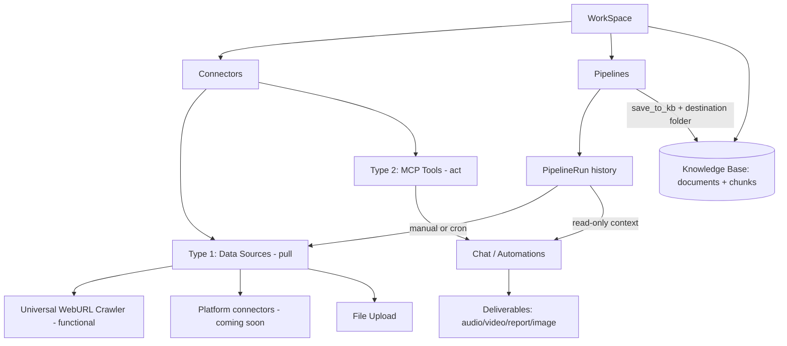

# CI Pivot MVP — Umbrella Plan

> Master roadmap for the Competitive Intelligence pivot. Each phase becomes its own subplan saved in this folder (`plans/backend/`).

This is the high-level roadmap. It is sequenced to match the agreed order: rename first, then connector restructure, then Pipelines.

> SCOPE: This umbrella currently covers the BACKEND only (`surfsense_backend`). Frontend (`surfsense_web`) and client apps (desktop, Obsidian, browser extension) will get their own umbrella/subplans LATER, once the backend is fully working as expected. Frontend-facing decisions (URL segment, TS types, i18n copy) are recorded below where relevant but are out of scope for the active phases.

## Positioning

"NotebookLM for Competitive Intelligence" — each WorkSpace acts as a workspace for setting up competitive-intelligence-optimised notebooks.

## Target architecture

## Decisions locked

- Full rename SearchSpace -> WorkSpace across DB, API, URLs, code, satellite apps.
- Canonical names (proposed defaults): DB table `workspaces`, column `workspace_id`, RBAC tables `workspace_roles` / `workspace_memberships` / `workspace_invites`, API base `/workspaces` (consolidating today's `/searchspaces` vs `/search-spaces` split), URL segment `[workspace_id]`, settings folder `workspace-settings`, TS type `Workspace`.
- Connectors split into two types via a STATIC code registry (`connector_type` → category/availability), NOT a DB column. Type 1 = `DATA_SOURCE` (pull → pipelines/KB): WebURL crawler, Google Drive (native + Composio), OneDrive, Dropbox, file uploads, plus deferred platform connectors. (YouTube is DEFERRED — no backend connector exists today.) Type 2 = `MCP_TOOL` (act in chat): only the generic `MCP_CONNECTOR` is functional for MVP. All branded natives are deprecated (`MIGRATING`, turned off) pending a post-MVP MCP re-point — they are NOT functionally moved to MCP in this MVP. Artifacts stay in the existing `deliverables` agent system (not routed through MCP). (Full model: Phase 4 below / `04a`.)
- Web search APIs (SearXNG, Linkup, Baidu) are repurposed as a SOURCE-DISCOVERY helper: they suggest URLs the user can add to the Universal WebURL Crawler when setting up pipelines (they are not a standalone connector type and do not index data). NOTE: Tavily and Serper are being REMOVED from the search infra and are not part of this set.
- Obsidian and Circleback (push/webhook sources) are DISABLED for the MVP.
- MCP-availability audit complete: BookStack (community MCP servers), Elasticsearch (official Elastic Agent Builder MCP), and Luma (community MCP servers) all have MCP available, so none are `DISABLED` — they're tagged `MIGRATING` (turned off for MVP like the other branded natives, pending the post-MVP MCP re-point).
- `Pipeline` and `PipelineRun` are new first-class tables. A Pipeline references a connector + config + schedule + KB destination. File upload creates/uses a pipeline and registers a run; uploads always save to KB.
- The chat agent gets read-only access to pipeline run history (pipelines + their recent runs/status) as context, so it can reason about what was fetched, when, and whether runs succeeded — even for data not saved to the KB.
- Deferred (post-MVP): platform scraper implementations (**Phase 8 — Platform actors**, public-data-only first; built in-house on the Phase-3 fetch core), public pay-as-you-go API for Type-1 connectors, public MCP server exposing the KB. Logged-in/account-based scraping deferred beyond that.

## Platform connector research list (deferred build, MVP = "coming soon")

- LinkedIn — people profiles (discovery by keyword/company), company info, job listings.
- Amazon — product (ASIN), search (keyword), pricing; reviews secondary.
- Google — Web Search (organic SERP), AI Overviews, Maps/Local (discover by location).
- Instagram — profiles first, then posts; discover profiles by username/keyword.
- Zillow / Redfin — full property listings (discover by search URL/filters); Zillow price history.
- Walmart — product, search; zipcode-localized pricing premium variant.
- eBay — search by keyword/category; price-comparison/resale feeds.
- Crunchbase — company info, search by keyword (B2B lead-gen / investor research).
- TikTok / YouTube — profiles/channels, posts/videos; discover by keyword/hashtag; TikTok Shop.
- Indeed / Glassdoor — job listings (discover by keyword in location), company reviews.

## Backend phases (active — this umbrella)

### Phase 1 — Rename foundation (DB) [`subplan: 01-rename-db.md`]

> **✅ SHIPPED** (2026-06-27) · branch `feat/rename-searchspace-to-workspace` · PR [#1546](https://github.com/MODSetter/SurfSense/pull/1546) (merged to `ci_mvp` via [#1562](https://github.com/MODSetter/SurfSense/pull/1562)). Migration `170` (chains `169`, current head) does the physical rename + Zero-publication reconcile. Shipped atomically with Phase 2. As-built record + re-runnable verification live in `01-rename-db.md`. **Deploy caveat:** zero-cache replica reset (`ZERO_AUTO_RESET`) required; from-scratch `alembic upgrade head` stays pre-existing-broken (rev 23 conflict — separate baseline-squash task), only the `169→170` path is verified.

- Alembic migration: rename `searchspaces` -> `workspaces`; rename `search_space_id` -> `workspace_id` on ~20 child tables; rename RBAC tables and their FKs; rename indexes/constraints (`uq_searchspace_*`, `idx_documents_search_space_id`, etc.); update Rocicorp Zero publication column lists (backend-owned `publication` definition; frontend Zero schema rename happens in the later frontend umbrella).
- Decide transition strategy: hard cutover (simplest for MVP) vs temporary API aliases for clients.
- Key files: `surfsense_backend/app/db.py`, `surfsense_backend/alembic/versions/` (new migration).

### Phase 2 — Rename backend (code + API) [`subplan: 02-rename-backend.md`]

> **✅ SHIPPED** (2026-06-27) · branch `feat/rename-searchspace-to-workspace` · PR [#1546](https://github.com/MODSetter/SurfSense/pull/1546) (merged to `ci_mvp` via [#1562](https://github.com/MODSetter/SurfSense/pull/1562)). Symbolic rename across `app/` + `tests/` (Phase-1 shim dropped), API consolidated to `/workspaces` (legacy `/searchspaces` · `/search-spaces` · `/search-space` all retired/404). Verified (ground-truth `git grep`, 2026-06-29): every residual `search_space`/`SEARCH_SPACE` is a documented carve-out — enum values (`ConnectionScope`/`ChatVisibility.SEARCH_SPACE`), the `'SEARCH_SPACE'` CHECK literal (now paired with `workspace_id`), Celery wire names (`delete_search_space_background`, `ai_sort_search_space`), OTel key `search_space.id`, and the `SEARCH_SPACE_FORBIDDEN` error code; `alembic/versions/` untouched except `168`+`170`. Suite: `3016 passed, 1 skipped`. As-built record in `02-rename-backend.md`. **Clients are intentionally broken** until the frontend/satellite umbrellas land (hard cutover).

- Rename models/schemas/services/routes/agents/tasks identifiers: `SearchSpace*` -> `Workspace*`, `search_space_id` -> `workspace_id`.
- Consolidate API to `/workspaces` and fix the `/searchspaces` vs `/search-spaces` inconsistency.
- High-touch files: `routes/search_spaces_routes.py`, `routes/rbac_routes.py`, `utils/rbac.py` (`check_search_space_access`), `schemas/search_space.py`, plus `search_space_id` threading through agents/Redis keys/storage paths (`documents/{id}/...`).

### Phase 3 — WebURL Crawler & Crawl Billing (backend) [`subplans: 03a–03f`]

The Universal WebURL Crawler is the flagship Type-1 data source (**the moat**). This phase hardens it into an **in-house, best-effort "undetectable, captcha-bypassing" crawler** on a single framework (Scrapling): it standardizes the fetch layer, generalizes proxy support, introduces pay-as-you-go crawl credits, adds **stealth hardening** (geoip coherence, persistent profiles, headed/Xvfb, fonts, humanization, a block classifier + per-domain strategy memory), and adds **opt-in captcha solving**. All tiers plug in behind a single `FetchStrategy` seam returning `CrawlOutcome`, so callers never depend on *how* a page was fetched — that seam is what lets the moat grow (and lets a **deferred paid-unblocker tier** drop in later by config). **Strategy decision (recorded in the log):** CloakBrowser is rejected on licensing and external unblocker APIs are deferred; we hold an in-house bypass moat for ~4–6 months, then move hostile targets to a paid tier if demand/maintenance justifies it. **Logged-in/account-based bypass is out of scope** (public data only this MVP). It is broken into focused subplans:

> **Sequencing within Phase 3 (critical path vs hardening).** Only **`03a` + `03b` + `03c`** are on the **MVP critical path** — Phases 4–7 (connector taxonomy, pipelines, execution) consume the `03a` `CrawlOutcome`/`FetchStrategy` contract, the `03b` proxy provider, and the `03c` `WebCrawlCreditService` billing seam. **`03d` (captcha), `03e` (stealth hardening), and `03f` (test harness) are hardening/measurement that nothing downstream imports** — they tune the *same* seam behind the *same* contract, so they can land **in parallel with, or after, Phases 4–7** without blocking the pivot. Recommended build order: `03a → 03b → 03c` (then proceed to Phase 4), with `03e → 03d → 03f` slotted in whenever crawler robustness is prioritized. The dependency notes inside `03d`/`03e`/`03f` (each requires `03a`/`03b`) still hold; this only frees them from gating Phase 4+.

- **`03a-crawler-core.md`** *(✅ IMPLEMENTED — `ci_mvp` @ `5c36cd3`; crawler moved to `app/proprietary/web_crawler/`, `impersonate="chrome"` + `solve_cloudflare=True` shipped)* — Standardize the fetch layer on Scrapling. **Remove Firecrawl entirely** (no other frameworks). Define crisp per-URL success/empty/failure semantics, keep Trafilatura extraction, and expose a single billable "successful crawl" signal (one unit per URL that yields usable content, regardless of how many internal fallback tiers ran).
- **`03b-proxy-expansion.md`** *(✅ IMPLEMENTED — `ci_mvp` @ `6226012`)* — Add a BYO `CustomProxyProvider` (the only new provider — **no branded vendors**) alongside `anonymous_proxies`, selectable via a **single, app-wide** `Config.PROXY_PROVIDER`. Add bounded client-side rotation+retry via Scrapling's `ProxyRotator`/`is_proxy_error` **only** when the active provider is pool-backed (`CUSTOM_PROXY_URLS`); single-endpoint providers (incl. `anonymous_proxies`) stay the default and no-op the retry. **No per-connector/per-crawl selection** (one provider app-wide); a per-pipeline override is left as a no-op seam for Phase 5/6.
- **`03c-crawl-billing.md`** — Charge crawl credits at **$1 / 1000 successful requests = 1000 micro-USD per successful crawl**, drawn from the existing credit wallet (`credit_micros_balance`), gated by a new `WEB_CRAWL_CREDIT_BILLING_ENABLED` flag (off for self-hosted). Two surfaces: **connector/pipeline crawls** billed to the **workspace owner** via a dedicated `WebCrawlCreditService` (mirrors `EtlCreditService`'s gate → `check_credits` → `charge_credits`, **not** `billable_call`); **chat scrapes** fold their crawl cost into the chat turn's existing bill (turn accumulator). No DB migration (uses the existing free-form `web_crawl` usage_type).
- **`03e-stealth-hardening.md`** — The in-house "undetectable" layer on top of Scrapling's default patchright-Chromium stealth. **Geoip coherence** (match browser `locale`/`timezone_id` to the proxy's exit geo), **fingerprint flags** (`hide_canvas`/`block_webrtc`), **persistent per-domain profiles** (`user_data_dir`), **headed execution under Xvfb**, **real fonts** in the worker image, and **DIY behavioral humanization** via `page_action` (the Chromium engine has no built-in `humanize`). Adds a **block classifier** (label Cloudflare/DataDome/Kasada/captcha/empty from the response) + **per-domain strategy memory** (Redis, no migration) so the ladder learns the known-good tier per domain. Defines — but does **not** build — the **deferred paid-unblocker `FetchStrategy`** (ZenRows/ScrapFly/Bright Data) as the config-flagged escape hatch, with its own (later) billing. Honest ceiling: defeats Cloudflare + the moderate long tail, **not** top-tier behavioral fingerprinting (DataDome/Kasada/reCAPTCHA-Enterprise) — that's the deferred tier.
- **`03d-captcha-solving.md`** *(ACTIVE — sequenced last in Phase 3, after `03e`)* — Covers the captcha types Scrapling does **not** (reCAPTCHA v2/v3, hCaptcha, image) via `captchatools`, **opt-in + off by default**. `captchatools` is **itself** the provider registry (`new_harvester(solving_site=…)` across capmonster/2captcha/anticaptcha/capsolver/captchaai), so we do **not** rebuild a provider hierarchy — our layer is thin: config resolution + a StealthyFetcher `page_action` that detects the sitekey, harvests a token (egressing from the **same** proxy IP as the crawl), and injects it. Scrapling already handles Cloudflare Turnstile (`03a`), and `page_action` runs **after** `solve_cloudflare`, so the tiers compose. The **billing asymmetry** is now **resolved**: a **separate per-attempt** `web_crawl_captcha` unit (solvers charge per attempt regardless of crawl success), attached via a `WebCrawlCreditService` seam in `03c`. `ErrNoBalance` stops solving (no retry loop → avoids IP bans). Requires a paid solver account.
- **`03f-undetectability-testing.md`** *(MANUAL-only — no CI gating; sequenced last)* — A **manual scorecard harness** that drives the real Scrapling tiers against the industry-standard detection + sandbox sites (modeled on CloakBrowser's `bin/cloaktest` suite) to **quantify the free-stack ceiling** over time. Two labeled axes: **Suite S (stealth/anti-bot)** — browser-tier (`bot.sannysoft`, `bot.incolumitas`, CreepJS, `deviceandbrowserinfo`, FingerprintJS demo, reCAPTCHA-v3 score, `fingerprint-scan`/Castle.js, `browserscan`), HTTP/TLS-tier JA3/JA4 parity (`tls.peet.ws`, **informational** not a gate), and proxy/leak checks (`httpbin/ip`, WebRTC/DNS); **Suite E (extraction correctness)** — toscrape/scrapethissite sandboxes for the HTTP vs JS (DynamicFetcher) tiers. Reuses `03d`'s `page_action`+closure-cell for JS-object verdicts. Adopts CloakBrowser's bars as **aspirational** (sannysoft 0 fails, CreepJS ≤30%, reCAPTCHA ≥0.7) while recording **our actual numbers as the committed baseline**; the scorecard is the documented **trigger** for flipping `03e`'s deferred paid-unblocker tier.

### Phase 4 — Connector two-type restructure (backend) [`subplans: 04a–04b`]

Split into two independently testable subplans:

- **`04a-connector-category.md`** — Connector taxonomy + availability gating + the MCP routing-gap fix. Introduce a **static registry** keyed by `connector_type` → (`category` = `DATA_SOURCE` | `MCP_TOOL`, `availability` = `AVAILABLE` | `MIGRATING` | `DISABLED`), exposed as computed fields on the connector schema/API. Keep `is_indexable` (orthogonal capability flag — still gates the real `/index` + periodic machinery; NOT replaced). Gate creation/index/subagent-build/pipeline-eligibility off the registry. Fix the `MCP_CONNECTOR` subagent routing-map gap. **No DB migration** (registry is code).
- **`04b-source-discovery.md`** — Web-search repurposing. **Drop all 5 search-API `connector_type` enum values** (`SERPER_API`, `TAVILY_API`, `SEARXNG_API`, `LINKUP_API`, `BAIDU_SEARCH_API`) + their connector paths; relocate survivors to platform/env config (SearXNG already env-based; **Linkup + Baidu keys move from per-connector `config` to platform env**); rewire the chat `web_search` tool onto platform providers; add a backend **source-discovery endpoint** suggesting candidate URLs for the WebURL Crawler. **Has a (destructive) migration** to delete the 5 connector types' rows.

**Locked model (MVP):**

- **Functional Type-1 (Data Sources — can create pipelines + feed KB):** Universal WebURL Crawler (`WEBCRAWLER_CONNECTOR`), Google Drive (native + Composio), OneDrive, Dropbox, plus file uploads. YouTube is **deferred** (no backend connector exists today — net-new work; reserve the slot). Deferred "coming soon" platforms: LinkedIn, Amazon, Google, Instagram, Zillow/Redfin, Walmart, eBay, Crunchbase, TikTok, Indeed/Glassdoor.
- **Functional Type-2 (MCP Tools — act in chat, NO pipelines):** ONLY the generic `MCP_CONNECTOR` (bring-your-own MCP server). The `MCP_CONNECTOR` routing-gap fix (04a) is what makes it work.
- **Deprecated for MVP ("migrating to MCP soon", `availability = MIGRATING`):** every branded native — current indexers (Notion, GitHub, Confluence, BookStack, Elasticsearch) AND act-only ones (Slack, Teams, Linear, Jira, ClickUp, Airtable, Discord, Gmail, Google Calendar, Luma, + Composio Gmail/Calendar). Behaviour: block new creation, disable `/index`+periodic + their chat subagents; KEEP existing rows + already-indexed KB docs **searchable** (via the always-on knowledge-base subagent). Real MCP migration is post-MVP.
- **Disabled for MVP (`availability = DISABLED`):** Obsidian (plugin push) and Circleback (meeting webhook) — distinct from MIGRATING (not MCP-bound).
- Frontend connector UI restructure is DEFERRED (frontend umbrella).

### Phase 5 — Pipelines data model [`subplan: 05-pipelines-model.md`]

- New tables: `pipelines` (workspace_id, `created_by_id` nullable SET-NULL [creator metadata, **not** owner], connector_id nullable, name, config JSONB, `schedule_cron` + `schedule_timezone` + enabled + next_scheduled_at, `save_to_kb` bool, `destination_folder_id` nullable) and `pipeline_runs` (pipeline_id, status, trigger = manual/scheduled/upload, timestamps, doc counts, `crawls_*`, `charged_micros`, error, optional raw-result blob ref).
- Models + Pydantic schemas + Alembic migration + backend Zero publication entry.
- Pipelines API routes: CRUD + manual run trigger + list runs.

### Phase 6 — Pipeline execution + scheduling [`subplan: 06-pipelines-exec.md`]

- Run engine: pipeline run -> invoke connector fetch (WebURL crawler for MVP) -> if `save_to_kb`, persist to the destination folder (the crawler writes `Document`s directly via `index_crawled_urls`, extended with a `folder_id` param; it does **not** use `IndexingPipelineService`, which is the file/Composio path) -> write `PipelineRun` record. (06 verified the crawler indexer is its own KB-write path.)
- **Crawl billing wiring (carry-over from `03c`):** `03c` meters crawls inside `webcrawler_indexer`. A pipeline run that crawls but has `save_to_kb=false` must NOT bypass billing — wire the pipeline fetch through the same `WebCrawlCreditService` (pre-check + charge on `crawls_succeeded`) regardless of the KB-save branch, ideally recording `charged_micros` on the `PipelineRun` for idempotency. Otherwise non-KB pipeline crawls are free by accident.
- Scheduling: a Celery Beat tick over `pipelines.next_scheduled_at`, modeled on the **automations** cron **selector** (`automations/triggers/builtin/schedule/selector.py` — cron + `FOR UPDATE SKIP LOCKED` + self-heal, reusing the `croniter` util), which fits `schedule_cron` better than the connector `frequency_minutes` checker. Plus the de-dup guard (a pipeline over a connector disables that connector's own periodic indexing) so the two minute-level scans never double-crawl/bill.
- When `save_to_kb` is off, persist the raw fetch result on the run (blob via `file_storage`) so it is retrievable without indexing.
- Chat agent context: expose pipeline run history to the `multi_agent_chat` agent (read-only) — via a tool (e.g. `list_pipelines` / `get_pipeline_runs`) and/or a context middleware injection (similar to `KnowledgeTreeMiddleware`). Scope strictly to the active workspace. Gives the agent awareness of recent runs, statuses, schedules, and last-fetched timestamps.

### Phase 7 — File upload as a pipeline + KB-save-secondary [`subplan: 07-upload-pipeline-kb.md`]

- Wire file upload (`documents_routes.py` `fileupload` + `folder-upload` flows) to lazily get-or-create a **singleton "Uploads" pipeline** per workspace (`connector_id = NULL`, `save_to_kb = true`) and register a `PipelineRun(trigger=upload)`; uploads always `save_to_kb = true`.
- **Key design fact:** uploads are **route-recorded, not engine-executed** — Phase 6's engine fails `connector_id IS NULL` runs, so the upload routes themselves write a terminal audit `PipelineRun` (the existing upload code stays the executor). The run is an upload-*event* record; per-file ETL outcomes stay on `Document.status` (accurate per-file roll-up needs the deferred `documents.pipeline_run_id` provenance column).
- A small migration adds a partial unique index `ON pipelines(workspace_id) WHERE connector_id IS NULL` (enforces the singleton + race-safe get-or-create).
- KB-save-secondary: the opt-in `save_to_kb` + destination folder for connector pipelines already shipped in Phases 5–6; Phase 7 only records the inverse invariant (uploads always KB) and guards the connector default stays `False`.

### Phase 8 — Platform actors (FUTURE — post-MVP, public data only) [`subplan: TBD`]

NOT planned in this umbrella; recorded so the Phase-3 architecture stays aimed at it. Once the hardened fetch core (Phases 3a–3e) is solid, **platform actors** layer **on top** of it: per-platform structured extractors (Google Maps/Local, LinkedIn public profiles/companies, Amazon products, etc. — see "Platform connector research list" above), built in-house "Apify-style" rather than via third-party paid actors. They reuse the existing machinery end-to-end: each actor is a **Type-1 data-source connector** (Phase 4 taxonomy), runs via **Pipelines** (Phases 5–6, manual/cron), saves to the **KB** (opt-in folder), and is **billed per run** (extending `03c`/`06`). They consume the `03a` `FetchStrategy` core (proxies + `03e` hardening + `03d` captcha) under their own extractors.

- **Public data only** at first — discovery/extraction of publicly visible pages. **Logged-in/account-based bypass is explicitly deferred** beyond Phase 8's first cut; it needs sticky/static proxies + credential management (`03b` static-proxy hand-off) and is the higher-risk, later workstream.
- The **deferred paid-unblocker tier** (`03e §8`) is the fallback for any platform whose anti-bot exceeds the in-house ceiling.

## Deferred — Frontend & client phases (separate umbrella, planned LATER)

These are recorded for continuity but are NOT planned in this umbrella. They start once the backend phases above are working.

- Frontend rename + i18n: route segment `[search_space_id]` -> `[workspace_id]`, `search-space-settings/` -> `workspace-settings/`, TS types, api services, Jotai atoms, components, cache keys, and "Workspace" copy across 5 locales (`messages/{en,zh,es,pt,hi}.json`), plus frontend Zero schema rename.
- Satellite/client apps + docs rename: `surfsense_desktop`, `surfsense_obsidian`, `surfsense_browser_extension`, `surfsense_evals`, README/docs.
- Connector two-type UI: restructure `connector-popup` and `connector-constants.ts` into the two labeled types.
- Pipelines UI + positioning: Pipelines section (list/create/configure/run-history/manual run), WebURL source-discovery UX, file-upload-as-pipeline surfacing, "coming soon" platform cards, "NotebookLM for Competitive Intelligence" copy.

## Open items to confirm during subplanning

- ~~Rename transition: hard cutover vs temporary API aliases~~ RESOLVED: HARD CUTOVER (see resolved log + 02-rename-backend.md). The frontend is rebuilt against the corrected backend in its own umbrella; backend is verified via tests/OpenAPI, not the old UI.
- ~~Whether existing connector periodic-indexing config is migrated into Pipelines or coexists during MVP.~~ RESOLVED (Phase 5): COEXIST — connector periodic path stays untouched; pipelines add a sibling `next_scheduled_at` scan. Phase 6 owns the de-dup guard (a pipeline over a connector disables that connector's `periodic_indexing_enabled`) to avoid double crawl/bill. See `05-pipelines-model.md`.
- ~~Chat agent run-history access: tool vs middleware injection vs both (default: tool).~~ RESOLVED (Phase 6): **tool** — a read-only main-agent `get_pipeline_runs` tool (registry pattern), workspace-scoped via its build-time `search_space_id`, opening its own `shielded_async_session()` (like `KnowledgeTreeMiddleware`). Always-on `<pipeline_activity>` middleware injection is deferred (per-turn token cost). See `06-pipelines-exec.md`.
- ~~Type-2 MCP migration depth~~ RESOLVED (Phase 4): branded natives are tagged `MIGRATING` and turned OFF for MVP (not re-pointed to MCP yet); only the generic `MCP_CONNECTOR` is a functional Type-2. Real MCP re-pointing is post-MVP.

## Resolved decisions log

- Web search APIs (SearXNG/Linkup/Baidu): repurposed as source-discovery helper for the WebURL Crawler (suggest URLs for pipelines); not a standalone connector type.
- Tavily and Serper: REMOVED from the search infra. They are dropped as search providers entirely (not repurposed). Phase 4's source-discovery endpoint must build only on the remaining providers (SearXNG, Linkup, Baidu).
- Obsidian + Circleback: disabled for MVP.
- MCP-availability audit: BookStack, Elasticsearch, Luma all have MCP available -> eligible for Type-2 (so deprecated as `MIGRATING`, not `DISABLED`). For MVP they are turned off pending the post-MVP MCP re-point, like the other branded natives.
- Phase 4 connector taxonomy: modeled as a STATIC code registry (`connector_type` -> category/availability), NOT a DB column — no migration in 04a; `is_indexable` is KEPT (orthogonal). Only the generic `MCP_CONNECTOR` is a functional Type-2 for MVP; all branded natives (indexers + act-only, incl. Composio Gmail/Calendar) are `MIGRATING` (new-create blocked, `/index`+periodic+their subagents off, existing KB docs stay searchable). The `MCP_CONNECTOR` subagent routing-map gap (`constants.py`) is fixed in 04a.
- Phase 4 search APIs: all 5 enum values dropped (`SERPER_API`/`TAVILY_API`/`SEARXNG_API`/`LINKUP_API`/`BAIDU_SEARCH_API`) in 04b. Survivors (SearXNG/Linkup/Baidu) become PLATFORM providers keyed by env (Linkup/Baidu keys move from per-connector `config` to env — app-wide, not per-workspace). 04b carries a destructive migration deleting the 5 connector types' rows.
- Phase 4 structure: split into 04a (taxonomy/gating/MCP-fix, no migration) and 04b (search repurposing + source-discovery endpoint, with migration); intended order 04a -> 04b (both orders safe).
- Rename transition policy: HARD CUTOVER of the external API (paths + JSON field names) in Phase 2 — no backward-compat aliases. Rationale: the frontend is (re)built against the corrected backend later, so there is no old client to keep alive; backend correctness is verified via the test suite + OpenAPI rather than the existing UI.
- Crawler code location & licensing boundary (decided during 03a impl): the WebURL crawler engine — and future Phase-8 platform actors — live under `surfsense_backend/app/proprietary/`, a **non-Apache-2 license boundary** (its own `LICENSE`, currently an all-rights-reserved placeholder; the repo root stays Apache-2). 03a's `WebCrawlerConnector` / `CrawlOutcome` / `CrawlOutcomeStatus` moved to `app/proprietary/web_crawler/` (public API re-exported from its `__init__`); the 3 Apache-2 callers (webcrawler indexer + both chat `scrape_webpage` tools) import `from app.proprietary.web_crawler import ...`. Rule: everything under `app/proprietary/**` is non-Apache-2; Apache-2 code may import *from* it but not move *into* it. Rationale: keep the moat under a clearly-bounded, swappable license.
- Proxy code placement (decided during 03b): the proxy provider package (`app/utils/proxy/` — base/registry/`anonymous_proxies`/`CustomProxyProvider`/rotation) **stays Apache-2 shared infra**, NOT proprietary. Rationale: it's consumed by Apache-2 features unrelated to the moat (YouTube transcript route + indexer, chat tools' YouTube branch), and `CustomProxyProvider` is a thin wrapper over Scrapling's *public* `ProxyRotator`. Only the crawl-ladder-coupled rotation-retry (`app/proprietary/web_crawler/connector.py::_run_tier_with_proxy_retry`) lives under the boundary. **Boundary test:** code goes in `app/proprietary/` only if used *exclusively* by the moat (applies to 03e's geoip/sticky-proxy hardening too — the bypass-specific tuning is proprietary; the generic provider plumbing is not).
- WebURL Crawler framework: STANDARDIZE on Scrapling; **remove Firecrawl entirely** (no other scraping frameworks now or planned). Scrapling's `StealthyFetcher` (patchright-Chromium as of 0.4.9 — **not** Camoufox) handles Cloudflare; `03e` stealth-hardening minimizes challenges; captcha-tools (`03d`) covers the rest. All fetch tiers sit behind a `FetchStrategy` seam returning `CrawlOutcome` (callers never depend on the tier).
- Crawl billing: reuse the existing credit wallet (`credit_micros_balance`) with a new `web_crawl` usage_type. Price: **$1 / 1000 successful requests** (1000 micro-USD per success). Connector/pipeline crawls bill the **workspace owner**; chat scrapes fold their crawl cost into the already-billed chat turn. Gated by `WEB_CRAWL_CREDIT_BILLING_ENABLED` (off for self-hosted); no DB migration required.
- Billable unit: one unit per URL that returns usable extracted content, regardless of how many internal fallback tiers were attempted (not per HTTP fetch, not per URL-processed).
- Captcha solving (captcha-tools): **ACTIVE** (no longer deferred) — sequenced last in Phase 3 (`03d`), **after** `03e` hardening, **opt-in + off by default**. Cloudflare stays in-framework (`03a`); reCAPTCHA/hCaptcha/image use `captchatools`. **Billing asymmetry RESOLVED → option (a): a separate per-attempt `web_crawl_captcha` unit** (`WEB_CRAWL_CAPTCHA_*` knobs on `WebCrawlCreditService`), since solvers charge per attempt regardless of crawl success. `ErrNoBalance` halts solving (no retry-loop IP bans).
- Crawler stealth strategy (the moat): **CloakBrowser REJECTED** (source-patched Chromium binary requires an OEM/SaaS license incompatible with our model). **External unblocker APIs DEFERRED** (ZenRows/ScrapFly/Bright Data) — pre-wired as a config-flagged `FetchStrategy` (`03e §8`) but not built. Plan: maintain an **in-house bypass moat for ~4–6 months** (Scrapling stealth + residential proxies + `03e` hardening + `03d` captcha), then move hostile/top-tier-fingerprinted targets (DataDome/Kasada/reCAPTCHA-Enterprise) to a paid tier if demand/maintenance justifies it. Realistic ceiling acknowledged: in-house beats Cloudflare + the moderate long tail, not top-tier behavioral fingerprinting.
- Authenticated/logged-in scraping: **OUT OF SCOPE this MVP** (public data only). Sticky/static proxies + credential management are deferred and paired with the future platform actors (`03b` static-proxy hand-off + Phase 8).
- Phase 3 stealth-hardening subplan `03e` ADDED: geoip locale/tz coherence, `hide_canvas`/`block_webrtc`, persistent per-domain profiles, headed+Xvfb, fonts, DIY humanization (`page_action`; Chromium engine has no built-in `humanize`), a block classifier, and per-domain strategy memory (Redis, no migration).
- Phase 3 test-harness subplan `03f` ADDED: **manual-only** (no CI/automated gating now) undetectability + extraction scorecard, modeled on CloakBrowser's `bin/cloaktest`. Two labeled axes (Suite S stealth + Suite E extraction) so they scale independently. Drives the **real** Scrapling tiers (browser + curl_cffi HTTP/TLS), reuses `03d`'s `page_action`+closure-cell for JS-object verdicts. **TLS JA3/JA4 parity = informational axis, not a hard gate.** Adopt CloakBrowser bars as aspirational; record our actual free-stack numbers as the committed baseline. The scorecard is the documented evidence/trigger for flipping `03e`'s deferred paid-unblocker tier.
- Roadmap: WebURL Crawler & Crawl Billing inserted as the new Phase 3; connector two-type → Phase 4; pipelines → Phases 5/6/7.
- Phase 5 pipelines data model: two new tables `pipelines` (mutable) + `pipeline_runs` (append-only), modeled on `automations`/`automation_runs`; ORM lives in `db.py` next to connectors/folders. `connector_id` nullable (NULL = Phase-7 Uploads), eligibility enforced at create via 04a's `is_pipeline_eligible`. Schedule = `schedule_cron` + `schedule_timezone` (default UTC) + `next_scheduled_at` (cron, matching automations). `pipeline_runs` pre-includes `charged_micros`/`crawls_*`/`result_blob_key` so Phase 6 needs no extra migration. Both tables published to Zero **full-row** (like folders/connectors). Routes reuse `CONNECTORS_*` permissions. Phase 5 ships the data model + API surface only; the `/run` endpoint enqueues a Phase-6 task stub.
- Phase 7 uploads-as-pipeline: a **singleton "Uploads" pipeline** per workspace (`connector_id NULL`, `save_to_kb=true`), lazily get-or-created (race-safe via a partial unique index `ON pipelines(workspace_id) WHERE connector_id IS NULL`). Each `fileupload`/`folder-upload` request writes a **terminal audit `PipelineRun(trigger=upload, status=succeeded, documents_indexed=<accepted count>)`** — uploads are **route-recorded, not engine-executed** (Phase 6 fails NULL-connector runs by design; existing upload code stays the executor). Best-effort via an **inner** try/except (never 5xx the upload — the route's outer handler would otherwise 500 an already-committed upload). No crawl billing (uploads aren't crawls; `charged_micros` NULL). Per-file ETL truth stays on `Document.status`; accurate roll-up needs the deferred `documents.pipeline_run_id` provenance. Connector `save_to_kb` default stays `False` (opt-in for connectors, mandatory for uploads). Phase 7 also **guards Phase-5's generic CRUD** against the system Uploads pipeline: `POST /pipelines` rejects `connector_id=None` (supersedes Phase 5's permissive create), `/run` and schedule-`PUT` reject NULL-connector pipelines, and Phase 6's scheduler `_claim_due` filters `connector_id IS NOT NULL` as a backstop (so the Uploads pipeline can never be manually-run or scheduled into perpetually-failing runs). See `07-upload-pipeline-kb.md`.
- Phase 6 pipeline execution: run engine mirrors **automations** (thin Celery `run_pipeline(run_id)` → `execute_pipeline_run`; PENDING-gated, idempotent terminal no-op; `pending→running→succeeded/failed` with timing/counts/error). MVP executor = **WebURL crawler only** (other types fail cleanly). `save_to_kb=true` reuses `index_crawled_urls` extended with a `folder_id` param (lands in the destination folder); `save_to_kb=false` runs a **fetch-only** loop and persists one JSON blob via `file_storage` (`result_blob_key`). **Crawl billing is owned by the run engine** for the pipeline path (pre-check on `len(urls)` + charge `crawls_succeeded` + idempotent `charged_micros`), calling the crawler with a new `bill=False` seam (the connector `/index`+periodic paths keep `03c`'s in-indexer `bill=True`) — so non-KB runs are billed identically. Scheduler = a `pipeline_schedule_select` Beat tick modeled on the automations cron **selector** (cron + `FOR UPDATE SKIP LOCKED` + self-heal, using the existing `croniter` util), plus the **de-dup guard** (a pipeline over a connector disables that connector's `periodic_indexing_enabled`). Chat context = the `get_pipeline_runs` tool. Carries a small additive `05` amendment: a `schedule_timezone` column (cron util needs a tz). See `06-pipelines-exec.md`.

## Subplan index (backend)

| Phase | Subplan file | Status |
|-------|--------------|--------|
| 1 | `01-rename-db.md` | **SHIPPED** (2026-06-27, PR [#1546](https://github.com/MODSetter/SurfSense/pull/1546)/[#1562](https://github.com/MODSetter/SurfSense/pull/1562); migration `170`) |
| 2 | `02-rename-backend.md` | **SHIPPED** (2026-06-27, PR [#1546](https://github.com/MODSetter/SurfSense/pull/1546)/[#1562](https://github.com/MODSetter/SurfSense/pull/1562)) |
| 3 | `03a-crawler-core.md` | **IMPLEMENTED** (`ci_mvp` @ `5c36cd3`) — Firecrawl removed, Scrapling-only 3-tier `CrawlOutcome`, crawler relocated to `app/proprietary/web_crawler/` |
| 3 | `03b-proxy-expansion.md` | **IMPLEMENTED** (`ci_mvp` @ `6226012`) — `CustomProxyProvider` (BYO single/pool) + registry + bounded rotation-retry |
| 3 | `03c-crawl-billing.md` | drafted |
| 3 | `03e-stealth-hardening.md` | drafted |
| 3 | `03d-captcha-solving.md` | drafted (active — sequenced after 03e) |
| 3 | `03f-undetectability-testing.md` | drafted (manual scorecard — sequenced last) |
| 4 | `04a-connector-category.md` | drafted |
| 4 | `04b-source-discovery.md` | drafted |
| 5 | `05-pipelines-model.md` | drafted |
| 6 | `06-pipelines-exec.md` | drafted |
| 7 | `07-upload-pipeline-kb.md` | drafted |

Frontend & client subplans will be added under a separate umbrella later (see "Deferred — Frontend & client phases").
