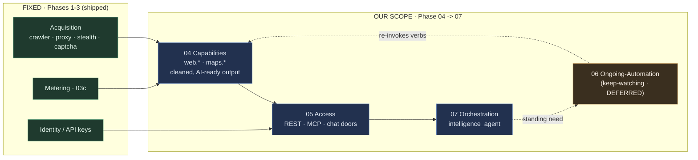
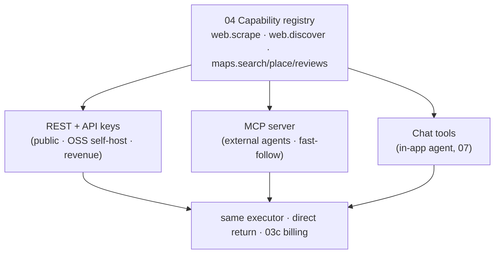
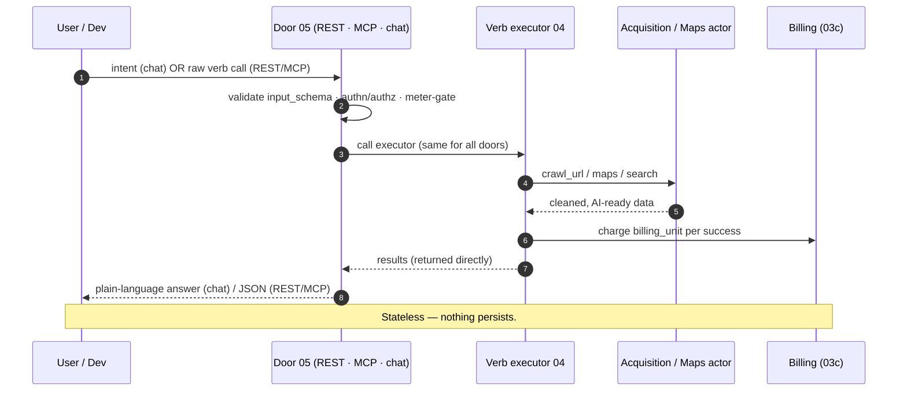
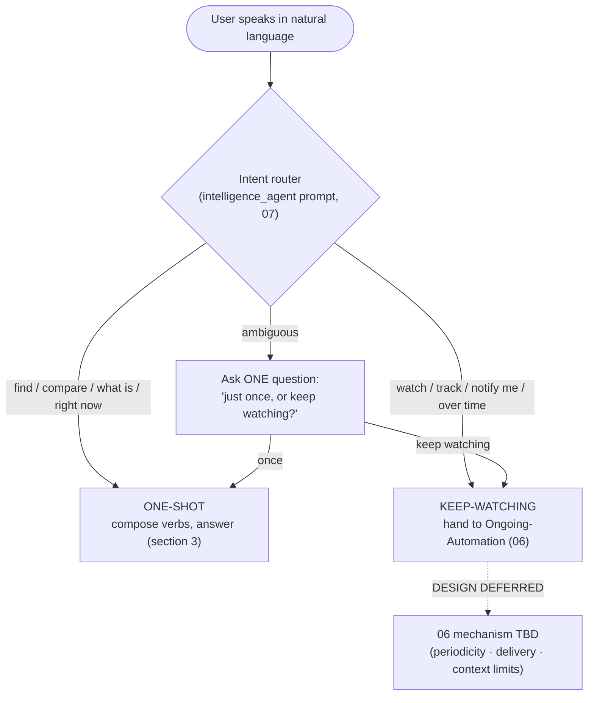
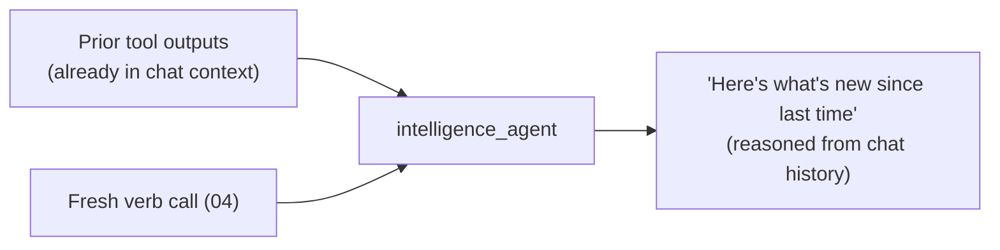
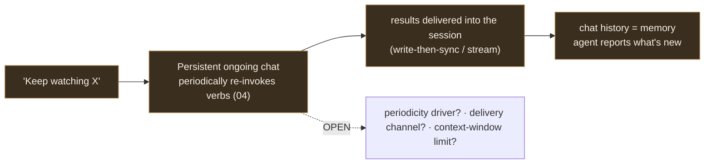

# Pipeline diagrams — end-to-end (scraper-APIs-first, stateless)

> Visual companion to `00-umbrella-plan.md`.
> Phase refs: `04` Capabilities · `05` Access · `06` Ongoing-Automation (design deferred) · `07` Orchestration.

## 1. The shape — scraper APIs + a chat agent (no state)

Memory for "what changed" = the chat history.

## 2. Doors — one registry, three surfaces (generated)

## 3. One-shot scrape (the core path) — direct call, no polling

## 4. Intent fork (in the agent, 07)

## 5. "What changed" — chat history is the memory

## 6. Ongoing-Automation (06) — intent only, mechanism deferred

> Section 6 is a **placeholder** — the periodic mechanism is designed separately (see `06-ongoing-automation.md`).
