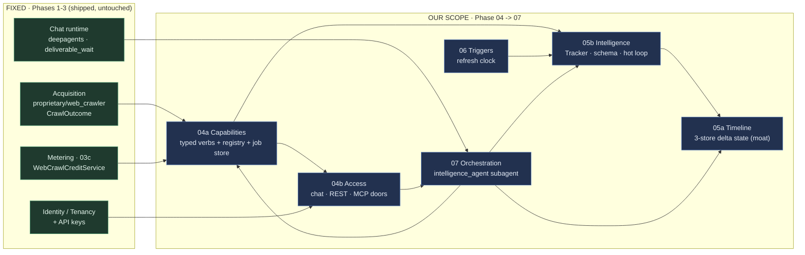
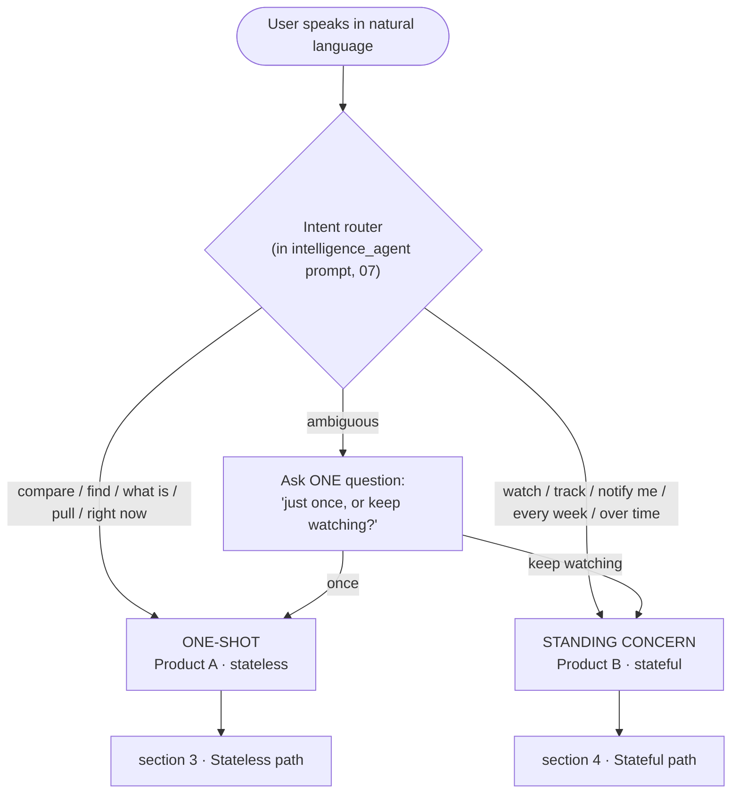
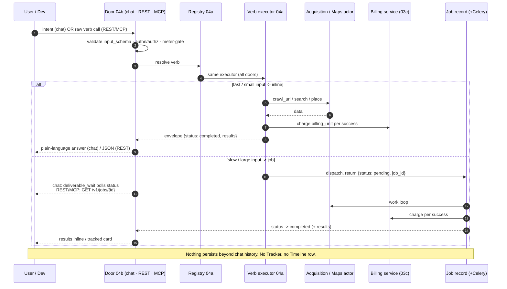
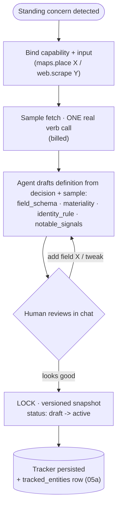
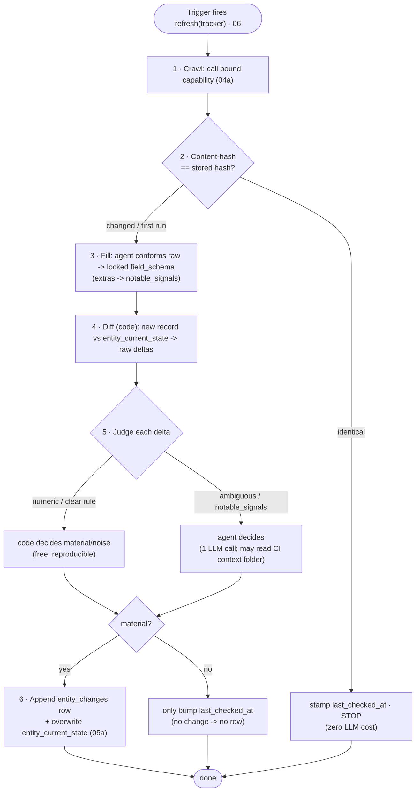
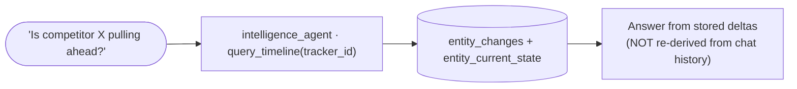
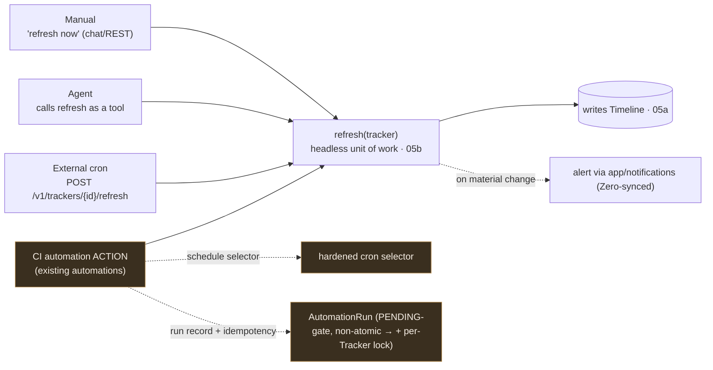
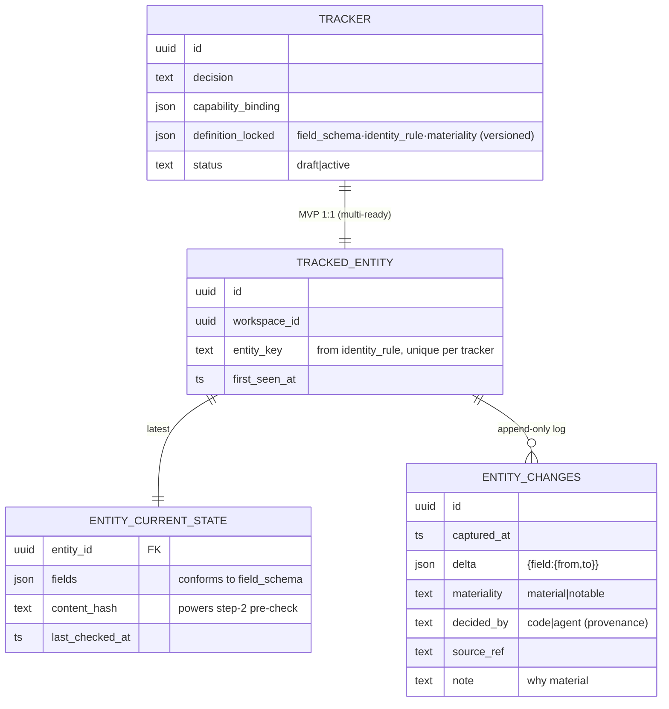

# Pipeline diagrams — end-to-end (stateless & stateful paths)

> Visual companion to `00-overview.md`. Shows the whole CI pipeline across Phases 04–07, with the
> **stateless** (Product A) and **stateful** (Product B) paths called out explicitly. Phase refs:
> `04a` Capabilities · `04b` Access · `05a` Timeline · `05b` Intelligence · `06` Triggers · `07` Orchestration.

## 1. Domain map — the two products

- **Product A (stateless):** `04a Capabilities + 04b Access` — call a verb, get data, bill, nothing persists.
- **Product B (stateful):** `05b Intelligence + 05a Timeline` (driven by `06`, fronted by `07`) — a Tracker
  accumulates structured signal; the Timeline is the moat.

## 2. The fork — intent router (the only human-facing decision)

Raw verbs are exposed only on REST/MCP (devs/external agents). Humans never name a verb.

## 3. Stateless path (Product A) — end to end

## 4. Stateful path (Product B) — setup, then refresh, then read

### 4a. Setup once — craft & lock the Tracker (05b)

### 4b. The hot loop — refresh(tracker) (05b → writes 05a)

### 4c. Read / answer — straight from the Timeline (05a)

## 5. Triggers — who calls refresh(tracker) (06)

CI **core** (`refresh` + Timeline) has **zero** automations dependency — manual/agent/cron all work
standalone. The CI **action** is the *optional* adapter that buys recurrence + audit. **Delivery is not
from automations** (no such path) — alerts on material change ride the separate `app/notifications/`
system; concurrency is guarded by a per-Tracker lock (the automation PENDING-gate is non-atomic).

## 6. The persisted state — Timeline data model (05a)

