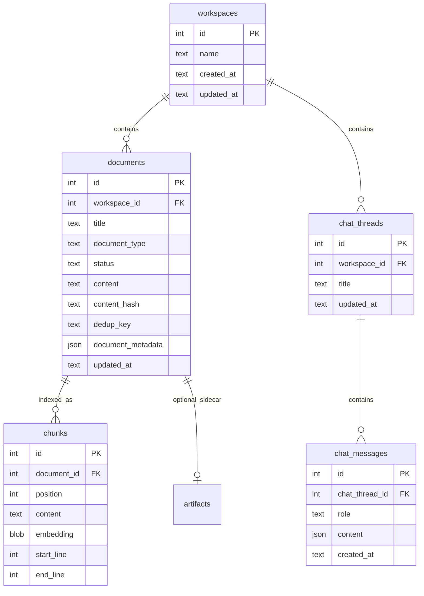

# Community Local — Data model contract

> Schema for API + worker. Field names match pydantic models / `/openapi.json`.
> Community Local is a **subset of the SurfSense domain model** — same words users know; cleaner names and shapes where we fix on paste.

## Principles

1. **Same domain language** — `workspace`, `document`, `chunk`, `artifact`, `chat thread`, `chat message`. Users and devs already know these words from SurfSense cloud.
2. **Subset** — omit tables/columns/features Local does not ship (auth, connectors, Zero, git KB, …).
3. **Fix on paste** — rename `new_*` prefixes, redundant columns, and JSONB status blobs to the Local shapes in the table below.
4. **No auth** — no `users`, memberships, tokens.
5. **SQLite** — one `surfsense.db`; JSON where it still earns its keep.
6. **Huey** — `huey.db` for queue mechanics; **`documents.status`** for user-visible ingest state.

## Naming: keep vs fix

| Concept | Cloud (legacy) | Local (preferred) | Notes |
|---|---|---|---|
| Workspace | `workspaces` | **`workspaces`** | keep |
| Document | `documents` | **`documents`** | keep |
| Chunk | `chunks` | **`chunks`** | keep |
| Chat thread | `new_chat_threads` | **`chat_threads`** | drop stale `new_` prefix |
| Chat message | `new_chat_messages` | **`chat_messages`** | drop stale `new_` prefix |
| FK | `thread_id` | **`chat_thread_id`** | explicit on `chat_messages` |
| Document status | JSONB `{"state":…}` | **`status` TEXT** | enum: `pending` \| `processing` \| `ready` \| `failed` — simpler for SQLite; map from cloud `DocumentStatus` when copying ingest |
| Dedup key | `unique_identifier_hash` | **`dedup_key`** | same role, clearer name; compute same hash when porting dedup logic |
| Body text | `content` + `source_markdown` | **`content`** only | one markdown body field; cloud duplicated for Plate/BlockNote — Local drops editor legacy unless copied |
| Artifact sidecar | `artifacts` | **`artifacts`** | keep (ADR-0003 shape when Studio ships) |

**API routes (Local):** `/workspaces`, `/workspaces/{id}/documents`, `/workspaces/{id}/chat/threads`, … — no `/new_chat`.

**Copy rule:** paste module → rename per table below → Local ORM/SQLite only.

## On-disk layout

```text
~/.surfsense/
├── surfsense.db
├── huey.db
├── settings.json              # or app_settings
├── models/
└── data/
    └── workspaces/{workspace_id}/
        ├── documents/{document_id}/
        │   ├── original.{ext}
        │   └── extracted.md
        └── artifacts/{artifact_id}/
            └── …
```

## Entity graph



## Tables

### `workspaces`

| Column | Local |
|---|---|
| `id`, `name`, `created_at`, `updated_at` | yes |
| billing, seats, `knowledge_store_enabled`, … | **omit** |

First launch may create one default workspace; schema allows many.

### `documents`

| Column | Local |
|---|---|
| `id`, `workspace_id`, `title`, `document_type` | yes |
| `status` | TEXT enum (see above) |
| `content` | markdown / extracted text |
| `content_hash`, `dedup_key` | yes — dedup scoped per workspace |
| `document_metadata` | JSON — file size, mime, page count |
| `updated_at`, `created_at` | yes |
| `folder_id` | defer |
| `created_by_id`, `connector_id`, `path`, doc-level `embedding` | **omit** |
| `blocknote_document`, `source_markdown`, `content_needs_reindexing` | **omit** unless editor copy forces it |

**`document_type` subset:** `FILE`, `NOTE`, `ARTIFACT` (Studio). No connector enum entries.

**Unique:** `(workspace_id, dedup_key)` where dedup applies.

### `chunks`

| Column / index | Purpose |
|---|---|
| Table `chunks` | `document_id`, `content`, `embedding` BLOB (backup/export), `position`, `start_line`, `end_line` |
| **`chunks_fts`** (FTS5) | `content` — BM25 keyword leg |
| **`chunk_vectors`** (sqlite-vec `vec0`) | `embedding float[D]` — cosine KNN leg; rowid = `chunks.id` |

**Indexing (Phase 2):** on ingest, insert row → sync FTS5 → insert/update vec0 with same embedding used at query time.

**Search (Phase 3):** embed query → FTS5 top‑K + vec0 top‑K → **RRF merge** (k=60) → dedupe by `chunk_id` → return hits with scores for citation ranking.

**Embedding dimension `D`:** fixed per configured embedding model; migration fails fast if model change would change `D` without reindex.

### `chat_threads` / `chat_messages`

Clean names; column subset only:

| Keep | Omit (not in Local) |
|---|---|
| `workspace_id`, `title`, timestamps | `visibility`, `created_by_id`, `cloned_*` |
| `role`, `content` (JSON) | `turn_id`, LangGraph bootstrap |
| | `external_chat_*`, comments, token_usage |

No LangGraph checkpoint tables. Citations in assistant `content` / metadata JSON.

### `artifacts` / `artifact_files` (Phase 4)

ADR-0003 shape: the searchable body is a `Document` with `document_type = ARTIFACT`; `artifacts` is a sidecar owning no title, path, body or indexing state. Tables ship in the initial migration so Phase 4 adds behaviour, not schema.

| Column | Local |
|---|---|
| `document_id` | FK, **unique** — one sidecar per document |
| `workspace_id` | FK cascade |
| `chat_thread_id` | FK **set null** — clearing chat must not delete deliverables; renamed from cloud `thread_id` |
| `format` | TEXT, not an enum — suffix inference stores kinds `ArtifactFormat` has no member for |
| `generation` | INTEGER, `CHECK > 0` |
| `created_by_tool_call_id`, `updated_by_tool_call_id` | provenance |
| `artifact_metadata` | JSON — cloud aliases this to a column literally named `metadata`; Local doesn't |
| `created_by_id` | **omit** — no auth |

`artifact_files` keeps one immutable blob per role (`primary` \| `preview`), unique on `(artifact_id, role)` and on `storage_key`, with `CHECK size_bytes > 0`. Cloud's `storage_backend` is **omitted**: Local has one backend, `data/workspaces/{id}/artifacts/{id}/`.

### Local-only

| Store | Purpose |
|---|---|
| `app_settings` or `settings.json` | model URLs, onboarding path, parser pack |
| `huey.db` | Huey queue |

## Tables not in Local scope

`user`, memberships, connectors, revisions, `deliverable_jobs`, external chat, billing, Zero publication, LangGraph stores — unchanged from prior list; Local simply doesn’t have them.

## Phase rollout

| Phase | Tables |
|---|---|
| 1 | `workspaces`, `documents` (stub) |
| 2 | `documents` ingest + `chunks` |
| 3 | `chat_threads`, `chat_messages`, settings |
| 4 | `artifacts` (+ `ARTIFACT` documents) |

## Open items

1. Default workspace on first launch vs empty state.
2. `folders` — add `folder_id` on `documents` when needed.
