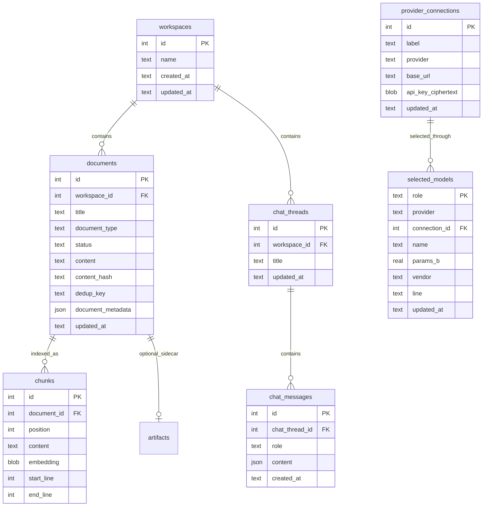

# Community Local — Data model contract

> Schema for API + worker. Field names match pydantic models / `/openapi.json`.
> Community Local is a **subset of the SurfSense domain model** — same words users know; cleaner names and shapes where we fix on paste.

## Principles

1. **Same domain language** — `workspace`, `document`, `chunk`, `artifact`, `chat thread`, `chat message`. Users and devs already know these words from SurfSense cloud.
2. **Subset** — omit tables/columns/features Local does not ship (auth, connectors, Zero, git KB, …).
3. **Fix on paste** — rename `new_*` prefixes, redundant columns, and JSONB status blobs to the Local shapes in the table below.
4. **No auth** — no `users`, memberships, tokens.
5. **SQLite** — one `surfsense.db`; JSON where it still earns its keep.
6. **Huey** — `huey.db` for queue mechanics; **`documents.status`** for user-visible ingest state.

## Naming: keep vs fix

| Concept | Cloud (legacy) | Local (preferred) | Notes |
|---|---|---|---|
| Workspace | `workspaces` | **`workspaces`** | keep |
| Document | `documents` | **`documents`** | keep |
| Chunk | `chunks` | **`chunks`** | keep |
| Chat thread | `new_chat_threads` | **`chat_threads`** | drop stale `new_` prefix |
| Chat message | `new_chat_messages` | **`chat_messages`** | drop stale `new_` prefix |
| FK | `thread_id` | **`chat_thread_id`** | explicit on `chat_messages` |
| Document status | JSONB `{"state":…}` | **`status` TEXT** | enum: `pending` \| `processing` \| `ready` \| `failed` \| `cancelled` — simpler for SQLite; map from cloud `DocumentStatus` when copying ingest. `cancelled` was added in revision `0011` when ingest and Studio jobs became stoppable |
| Dedup key | `unique_identifier_hash` | **`dedup_key`** | same role, clearer name; compute same hash when porting dedup logic |
| Body text | `content` + `source_markdown` | **`content`** only | one markdown body field; cloud duplicated for Plate/BlockNote — Local drops editor legacy unless copied |
| Artifact sidecar | `artifacts` | **`artifacts`** | keep (ADR-0003 shape when Studio ships) |

**API routes (Local):** the surface below is the whole contract for workspaces and
documents. No `/new_chat`.

| Method | Path | Phase |
|---|---|---|
| `GET` | `/workspaces` | 1 |
| `POST` | `/workspaces` | 1 |
| `GET` | `/workspaces/{id}` | 1 |
| `PATCH` | `/workspaces/{id}` | 1 |
| `DELETE` | `/workspaces/{id}` | 1 (rows) / 2 (files) |
| `GET` | `/workspaces/{id}/documents` | 1 |
| `POST` | `/workspaces/{id}/documents` | 1 — writes a `NOTE` |
| `PATCH` | `/workspaces/{id}/documents/{doc}` | 1 |
| `DELETE` | `/workspaces/{id}/documents/{doc}` | 1 (rows) / 2 (files, index) |
| `POST` | `/workspaces/{id}/documents/upload` | 2 |
| `POST` | `/workspaces/{id}/documents/{doc}/retry` | 2 |
| `POST` | `/workspaces/{id}/documents/{doc}/cancel` | stop a pending or running ingest; 409 if nothing is running |
| `GET` | `/workspaces/{id}/documents/{doc}/original` | 2 |
| `GET` | `/workspaces/{id}/documents/by-chunk/{chunk_id}` | 3 — the citation panel: a cited chunk plus its neighbours, workspace-scoped |

**`GET /workspaces/{id}/documents/{doc}` was never built.** This table listed it
as the Phase 1 way to read a body, and the list-semantics note below still
explains the list omitting `content` on the grounds that the detail route adds
it. Both halves of that arrangement exist except the route: `DocumentRead` does
omit the body ("without the body it would bloat every poll with"), and
`DocumentDetail` — the same shape plus `content` — is defined and used, but only
as the response of `POST /documents` when a note is created. Nothing else serves
a body; `by-chunk` answers a different question. So this is one decorator away,
and until it exists the sentence below is describing a route that isn't there.

Later phases add `/workspaces/{id}/chat/threads` (3), `/settings` (3), and the
Studio routes (4).

**List semantics:** filters `?document_type=` and `?status=` (repeatable), paged
with `?limit=` (default 50, max 200) and `?offset=`. ARTIFACT rows are included;
the caller filters them out. The list carries no `content` — it is polled during
ingest, and a body per row would ride along every time. `GET .../{doc}` adds it.

**Editable:** a document's `title` always; its `content` only when
`document_type = NOTE`, since anything else was extracted from bytes and an edit
would vanish on re-ingest. Editing a note's content returns it to `pending`,
because the indexed copy is now stale.

**Copy rule:** paste module → rename per table below → Local ORM/SQLite only.

## On-disk layout

```text
~/.surfsense/
├── surfsense.db
├── huey.db
├── settings.json              # or app_settings
├── models/
└── data/
    └── workspaces/{workspace_id}/
        ├── documents/{document_id}/
        │   ├── original.{ext}
        │   └── extracted.md
        └── artifacts/{artifact_id}/
            └── …
```

## Entity graph



## Tables

### `workspaces`

| Column | Local |
|---|---|
| `id`, `name`, `created_at`, `updated_at` | yes |
| billing, seats, `knowledge_store_enabled`, … | **omit** |

First launch may create one default workspace; schema allows many.

### `documents`

| Column | Local |
|---|---|
| `id`, `workspace_id`, `title`, `document_type` | yes |
| `status` | TEXT enum (see above) |
| `error_message` | TEXT null — why a `failed` ingest failed; cloud hid this in the JSONB status blob, and the documents view renders it |
| `content` | markdown / extracted text |
| `content_hash`, `dedup_key` | yes — dedup scoped per workspace |
| `document_metadata` | JSON — file size, mime, page count |
| `updated_at`, `created_at` | yes |
| `folder_id` | defer |
| `created_by_id`, `connector_id`, `path`, doc-level `embedding` | **omit** |
| `blocknote_document`, `source_markdown`, `content_needs_reindexing` | **omit** unless editor copy forces it |

**`document_type` subset:** `FILE` (upload), `NOTE` (written in the app, no file
behind it), `ARTIFACT` (Studio). No connector enum entries.

**Unique:** `(workspace_id, dedup_key)` where dedup applies.

### `chunks`

| Column / index | Purpose |
|---|---|
| Table `chunks` | `document_id`, `content`, `embedding` BLOB (backup/export), `position`, `start_line`, `end_line` |
| **`chunks_fts`** (FTS5, external content) | `content` — BM25 keyword leg; stores no text of its own, reading it from `chunks` |
| **`chunk_vectors`** (sqlite-vec `vec0`) | `embedding float[D]` — cosine KNN leg; rowid = `chunks.id` |

**Staying in sync:** three triggers on `chunks`. Insert and update mirror the
text into `chunks_fts`; delete removes it from both tables. They fire on cascade
as well, which is the only way a chunk is ever deleted — the user removes a
document or a workspace. Nothing else can reach these two, since a virtual table
takes no foreign key, so without the triggers the index would go on answering
for documents that no longer exist.

**Indexing (Phase 2):** ingest writes `chunks` and the `vec0` row. FTS follows on
its own; the vector cannot, because only ingest holds the embedding.

**Search (Phase 3):** embed query → FTS5 top‑K + vec0 top‑K for recall → **cosine rescore** of the union (`vec_distance_cosine`) → top‑k hits with scores for citation ranking.

**Embedding dimension `D`:** `SURFSENSE_LOCAL_EMBEDDING_DIMENSION`, default 384
for the bundled bge-small-en-v1.5 int8. A `vec0` table is fixed at the width it
was created with, and vectors from another model are not the wrong shape but
unrelated numbers, so startup compares the declared width against the setting and
refuses to open a database that no longer matches.

### `chat_threads` / `chat_messages`

Clean names; column subset only:

| Keep | Omit (not in Local) |
|---|---|
| `workspace_id`, `title`, timestamps | `visibility`, `created_by_id`, `cloned_*` |
| `role`, `content` (JSON) | `turn_id`, LangGraph bootstrap |
| | `external_chat_*`, comments, token_usage |

No LangGraph checkpoint tables. Citations in assistant `content` / metadata JSON.

### `artifacts` / `artifact_files` (Phase 4)

ADR-0003 shape: the searchable body is a `Document` with `document_type = ARTIFACT`; `artifacts` is a sidecar owning no title, path, body or indexing state. Tables ship in the initial migration so Phase 4 adds behaviour, not schema.

| Column | Local |
|---|---|
| `document_id` | FK, **unique** — one sidecar per document |
| `workspace_id` | FK cascade |
| `chat_thread_id` | FK **set null** — clearing chat must not delete deliverables; renamed from cloud `thread_id` |
| `format` | TEXT, not an enum — suffix inference stores kinds `ArtifactFormat` has no member for |
| `generation` | INTEGER, `CHECK > 0` |
| `created_by_tool_call_id`, `updated_by_tool_call_id` | provenance |
| `artifact_metadata` | JSON — cloud aliases this to a column literally named `metadata`; Local doesn't |
| `created_by_id` | **omit** — no auth |

`artifact_files` keeps one immutable blob per role (`primary` \| `preview`), unique on `(artifact_id, role)` and on `storage_key`, with `CHECK size_bytes > 0`. Cloud's `storage_backend` is **omitted**: Local has one backend, `data/workspaces/{id}/artifacts/{id}/`.

### `provider_connections` / `selected_models`

`provider_connections` stores multiple named remote endpoint instances:
`id`, `label`, `provider`, exact `base_url`, **`api_key_ciphertext`**, and
timestamps. The same provider (`openai_compatible`) may have many rows because
organizations often expose separate vLLM or image endpoints. The key belongs to
the connection, not to a model or provider type, and is never returned by the
API. The Phase 6 move happened in revision `0007`, which drops the plaintext
`api_key` column and adds the ciphertext one; connection identity is unchanged,
and the Fernet key comes from the OS keychain through Electron.

`selected_models` stores one active model per `role`: `generation` or
`image_generation`. `provider` chooses the runtime adapter, `name` is the exact
model id, and nullable `connection_id` identifies the remote endpoint. Ollama
**and `sdcpp`**, the bundled local image runtime admitted by revision `0009`,
use no connection; an OpenAI-compatible selection requires one. The FK uses
`ON DELETE CASCADE`, so disconnecting an endpoint clears only roles that use it.
Revision `0010` adds three nullable fingerprint columns — `params_b`, `vendor`,
`line` — recorded when a model is chosen. They are inputs to the prompt tier,
which is computed on read rather than stored, so retuning a threshold needs no
migration ([`api/05a-model-recommendations.md`](api/05a-model-recommendations.md)).

The offerable local catalog, remote `/models` responses, hardware profile,
llmfit scores, install plans, capabilities, and curated models are **not**
stored. Local recommendations are recomputed from the packaged inputs; remote
inventory is fetched live. Persisting either would create synchronization work
without improving inference. See
[`api/05b-openai-compatible-connections.md`](api/05b-openai-compatible-connections.md).

### Local-only

| Store | Purpose |
|---|---|
| `app_settings` or `settings.json` | onboarding path, parser pack, opt-in model overrides |
| `huey.db` | Huey queue — **two queues in one file**, `ingest` and `studio`, each drained by its own worker sidecar |
| `provider_connections` | named OpenAI-compatible endpoints and their connection-scoped secret |
| `selected_models` | chosen model per role (above) |
| `onboarding_completion` | the durable "model onboarding is done" marker (revision `0003`); selecting or clearing a model never writes it |
| `license_state` | singleton (`CHECK id = 1`): the imported certificate, when it was imported, and `clock_watermark`, the highest instant ever seen. Plan and expiry are re-derived from the certificate on every read rather than stored (revision `0006`) |
| `egress_destinations` | one row per destination — `ollama_pull`, `image_model_pull`, or `host:<hostname>` for a BYO provider — with `enabled` defaulting to **false** and `last_call_at` (revision `0008`) |

`workspaces` also gained a nullable `cloud_id` in revision `0005`: cloud-to-local
import looks a workspace up by it and reuses the existing row rather than
creating a second one, which is one of three things that make re-running the same
bundle safe. The other two are the document digest, which skips anything already
imported, and a first-import-only guard on chat threads.
`chat_messages` gained `completed_at` in revision `0002`.

## Tables not in Local scope

`user`, memberships, connectors, revisions, `deliverable_jobs`, external chat, billing, Zero publication, LangGraph stores — unchanged from prior list; Local simply doesn’t have them.

## Phase rollout

| Phase | Tables |
|---|---|
| 1 | `workspaces`, `documents` (stub) |
| 2 | `documents` ingest + `chunks` |
| 3 | `chat_threads`, `chat_messages`, settings; generation-only `selected_models` in initial migration |
| 4 | `artifacts` (+ `ARTIFACT` documents) |
| 5 | `provider_connections`; rebuild `selected_models` for connection identity and image role |
| 6 | `license_state`, `egress_destinations`, `workspaces.cloud_id`; `provider_connections.api_key` becomes `api_key_ciphertext` |

Revisions `0009`-`0011` came after the phases and belong to no single one: the
`sdcpp` provider value, the selected-model fingerprint, and the `cancelled`
document status. Eleven revisions ship as of this writing; all are hand-written,
as the umbrella plan's migration decision requires.

## Open items

1. Default workspace on first launch vs empty state.
2. `folders` — add `folder_id` on `documents` when needed.
