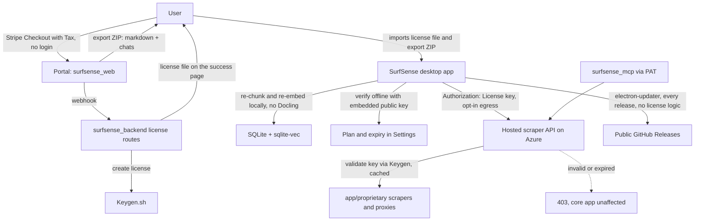
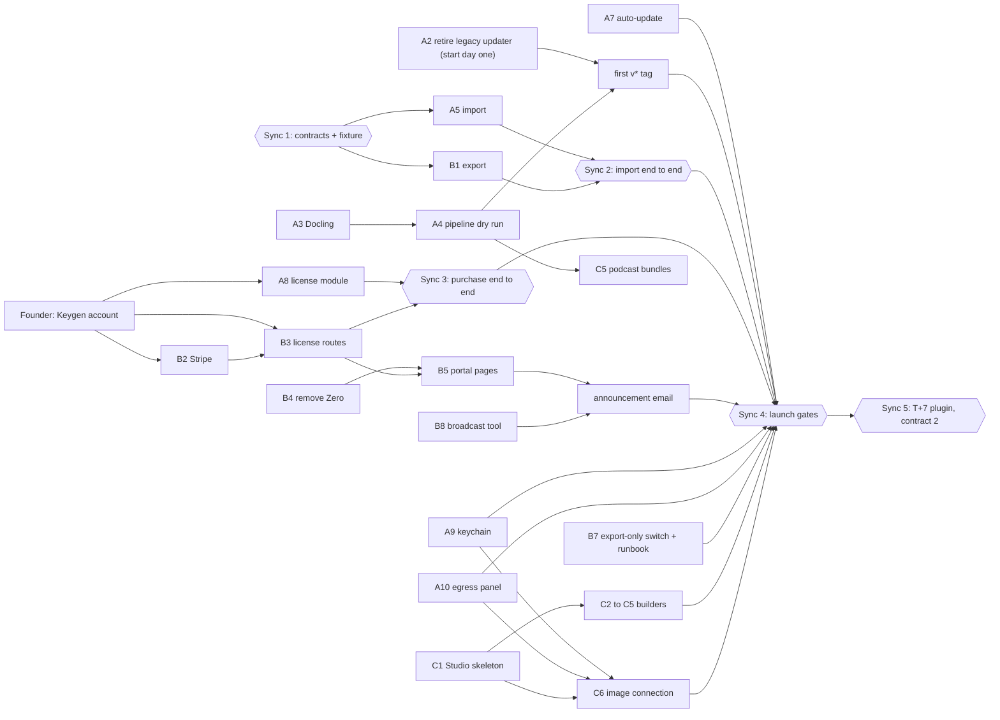

# SurfSense Pivot: Hosted SaaS to Airgapped Open Core

> Sunset the hosted SaaS and relaunch SurfSense as an airgapped open-source desktop app (Apache-2.0, free public installers) monetized through a Keygen-issued license. v1.0.0 ships the app, Studio artifacts, cloud-to-local import, and license purchase; the first plugin (hosted scraper API) lands the week after.

Every item below is a decision, not an assumption. Timeline is intentionally absent; work is ordered, not dated, and launch is the day the launch gates are green. This document is the single source for the pivot. The phase docs in this folder ([`00-umbrella-plan.md`](00-umbrella-plan.md), `api/`, `worker/`, `frontend/`) remain the technical specs for the local app itself; "community-local" stays as the internal folder name, the user-facing name is **SurfSense**.

Three workstreams, joined by three frozen contracts:

| Workstream | Owner | Owns |
|---|---|---|
| **A - the app** | Dev A | `surfsense_local/`: rename, packaging, import, license module, keychain, egress panel, auto-update, Studio review |
| **B - portal and wind-down** | Dev B | `surfsense_backend/`, `surfsense_web/`: export, Stripe, license routes, portal pages, infra scale-down, comms |
| **C - Studio** | Contractors | Studio pipeline and every artifact builder, end to end |

## Decision log

**Product**
- The product is called **SurfSense**. The local app is the product; "Local" is dropped from `productName`, README, and copy. `appId` becomes `com.surfsense.app` before the first public release (nothing has shipped yet, so this is free).
- Positioning: airgapped open-source alternative to NotebookLM.
- Hosted webapp, hosted desktop app, browser extension, and Obsidian plugin are **sunset**. `surfsense_mcp` and the hosted **scraper API stay**.
- No telemetry or crash reporting in the app. Support runs on logs the user sends.

**Licensing**
- `surfsense_local/` stays **Apache-2.0 and public**. Installers are **free and public** on GitHub Releases. **Updates are free for everyone**; the updater has no license logic.
- The license gates exactly two things: **plugins** (first: the hosted scraper API) and **priority support**. It never disables the app. Expiry stops those two things and nothing else. (Gating updates was considered and rejected: with public installers, an expired user could delete the license file and become a free user with every update, so the gate would be theater.)
- **At v1.0.0 the license buys priority support and is the key for plugins arriving the following week.** Purchase is live on launch day; the **trial starts with the plugin release**, since a trial of support alone is meaningless. Pricing copy says so plainly.
- License management is **Keygen.sh**: signed offline license files verified with the account public key embedded in the app, a 14-day trial policy (one per email), individual and team policies. **No machine binding.**
- **Buying needs no account.** Stripe Checkout collects the email; the success page serves the license file by checkout session id. Google login (the only prod auth) is needed only to re-download a license or start a trial.
- Proprietary plugin code lives in a **private repo under BSL 1.1**, reusing [app/proprietary/LICENSE](../../surfsense_backend/app/proprietary/LICENSE) verbatim.
- Legal docs from templates now (EULA, **CLA via CLA Assistant** - not DCO, which grants no relicensing rights); lawyer review before the first enterprise contract.

**Pricing**
- Self-build: free. Trial: 14 days. Individual: **$60/year**. Team: **$80/seat/year, 5-25 seats**, self-serve, delivered as **one shared key with `maxUsers = quantity`**. Enterprise: $80/seat/year, **$3,000 minimum**, invoiced.
- Payments stay on **Stripe with Stripe Tax**. SurfSense-hosted LLM inference is
  **dropped**; users may configure multiple OpenAI-compatible endpoints with
  optional connection-scoped keys.
- Plugins are **flat-included and unlimited**. Usage is instrumented per license so a cap becomes a config change, but no cap ships.
- Enterprise roadmap (all post-MVP): sandboxed artifact generation, priority support and SLA, SSO/SAML, on-prem license and plugin mirror for zero-egress networks (Keygen's self-hosted edition fits), local egress audit log.

**Plugins**
- **No plugin ships in v1.0.0.** The first plugin lands as **v1.1.0 the week after launch** (T+7), delivered through auto-update.
- First plugin = **hosted scraper API** on the existing Azure deployment: all 9 platforms plus the web crawler, already behind REST in `app/capabilities/*` and `app/proprietary/*`, with no Celery dependency.
- The in-app "plugin" is a thin HTTP client authenticating with `Authorization: License <key>`; the backend validates against Keygen with a short cache. MCP reaches the same API via PATs, gated on an active license.
- **Gap week (T-0 to T+7):** MCP and the scraper API keep running **unchanged** - existing PAT auth and credit billing, zero code changes. License-bearer auth and the in-app client land together at T+7.
- Future local plugins run as **separate sidecar processes** under the existing Electron supervisor. No third-party SDK until then; sandboxing is the enterprise feature.

**Artifacts**
- Generation runs **on the user's machine, unsandboxed**; risk accepted, sandboxing sold to enterprise later.
- In MVP: Summary, Mind map, Flashcards, Quiz, Interactive HTML, DOCX, XLSX,
  PPTX, PDF, Podcast, Infographics, and Image. **Video is out.**
- Contractors own Studio **end-to-end** (routes, worker job, UI, builders). Dev A reviews.

**Hosted wind-down**
- Deployment is **Azure VMs with docker-compose**. Prod auth is **Google OAuth only**. 5,000-50,000 registered users. Unspent credit exposure **under $500**.
- Offer to users with balances: **refund, or the balance as a Stripe discount code** on the $60 license. Handled manually in the Stripe dashboard.
- Emails go out by **exporting addresses from the user table into a broadcast tool** (Loops or Resend); no backend email code is written.
- Zero is **removed** (not bypassed): `ZeroProvider` comes out of the root layout.
- **Cloud-to-local import ships in v1.0.0.** The point of the pivot is moving current users, so export and import land together. The bundle is **markdown only**: every document's extracted content, folder structure, titles, and chat threads migrate; original uploaded files and old generated artifacts do not.
- **Launch is readiness-triggered, not dated.** v1.0.0 ships the day the launch gates (below) are green, and the hosted cutover happens the **same day**. Because that day is unknown in advance, the advance notice is undated: an announcement email and banner go out as soon as the copy is ready, and the **30-day export-only tail** is the notice period. Then one **encrypted cold snapshot kept 90 days**, then destroyed.
- Hosted code stays in the monorepo through the tail, then moves to an **archive repo**. Docker self-hosters get a README note.
- Marketing: rewrite **landing, pricing, downloads**; unpublish `/connectors` and `/mcp-server`; keep the blog.

**Distribution**
- **One installer variant** with Docling bundled (~1.7GB+). All five targets: macOS arm64, macOS x64, Windows x64, Linux AppImage, Linux deb. Apple and Azure Trusted Signing are active.
- Release tags move to **`v*`** once the legacy desktop updater is retired (below); [release-local.yml](../../.github/workflows/release-local.yml) switches its trigger from `local-v*` to `v*` at that point.
- If `macos-13` runners are gone, Intel sidecars are built with an **x64 Python under Rosetta** on the arm64 job.
- In MVP hardening: **OS keychain for API keys** and the **network egress panel**. Deferred: SSE freshness, note authoring UI, onboarding screen.

## What is NOT in the MVP

- **Plugins.** The scraper client, license-bearer API auth, and the trial all ship at T+7 as v1.1.0. The license module, purchase flow, and all three frozen contracts still ship at v1.0.0 so T+7 is a drop-in.
- **Original files in the migration.** Import carries markdown content, folder structure, titles, and chats. Original uploads and generated artifacts stay behind.
- **Third-party plugin SDK**, registry, revenue share, sandboxing.
- **Video** artifacts.
- **Deleting** hosted code. Stop serving; archive later.
- **Seat enforcement.** `maxUsers` is a number in the key; enforcement is the audit clause.
- Any **enterprise** feature beyond a contract and an invoice.

## Architecture

The client-side check is UX. The server-side check at the scraper API is the enforcement, and it holds against any fork that strips the client. The `App -> ScraperAPI` edge and the MCP license gate are the T+7 delivery; everything else is v1.0.0.

## The three contracts between workstreams

Freeze all three on day one as files in `plans/community-local/contracts/`; after that no workstream blocks another. Dev B drafts (B owns the producing side of 2 and 3 and the license routes behind 1), Dev A approves, both commit. The second contract is not exercised until T+7, but freezing it now is free and makes the plugin release a drop-in. The third is on the launch critical path from both sides, which is exactly why it is a frozen file with a committed fixture rather than a conversation.

1. **License file** (`contracts/01-license-file.md`). A Keygen license file. The app verifies it offline with the Keygen account public key. Fields the app reads: policy (trial, individual, team), `expiry`, `maxUsers`, licensee email. Nothing else.
2. **Scraper API auth** (`contracts/02-scraper-api-auth.md`). `Authorization: License <key>` on every request. The backend validates with Keygen, caches the result briefly, and returns 403 with a machine-readable reason (`expired`, `invalid`, `revoked`) that the app shows verbatim.
3. **Export bundle** (`contracts/03-export-bundle.md`). One ZIP, markdown only:
   - `manifest.json`: `format: "surfsense-export/1"`, `exported_at`, and per workspace `id`, `name`, `created_at`, its `chats` path, and a document list of `id`, `path`, `title`, `source` (upload, slack, notion, ...), `created_at`.
   - `workspaces/<id>/documents/<folder path>/<title>.md`: the OKF markdown [export_service.py](../../surfsense_backend/app/services/export_service.py) already produces. Folder hierarchy is the directory tree.
   - `workspaces/<id>/chats.json`: `[{id, title, created_at, messages: [{role, text, citations: [{title}], created_at}]}]`. Tool calls and agent steps are dropped; citations are titles, not chunk references.
   - The fixture is committed **unzipped** as `contracts/export-sample/` (reviewable in diffs); each side's tests zip it in a setup step. Dev B produces the bundle, Dev A consumes it, and a `format` bump is the only way the shape changes.

## Day one (before anyone writes feature code)

| Item | Owner |
|---|---|
| Commit this plan; link it from [`00-umbrella-plan.md`](00-umbrella-plan.md) | Founder |
| Create the Keygen.sh account; policies: trial (14d), individual (1y), team (1y, `maxUsers`); export the account public key; confirm volume limits for the tier | Founder |
| Create private repo `surfsense-plugins`; copy [app/proprietary/LICENSE](../../surfsense_backend/app/proprietary/LICENSE) (BSL 1.1) verbatim as its `LICENSE` | Founder |
| Add a CLA via CLA Assistant bot to `.github/` (template now, lawyer review before the first enterprise contract) | Founder |
| EULA and pricing copy from templates: expiry never disables the app, enterprise audit clause, unlimited plugin fair-use language that reserves the right to add caps, trial terms | Founder |
| Freeze the three contracts and the `export-sample/` fixture in `contracts/` | Dev B drafts, Dev A approves |
| Agree the launch gates below; they replace a launch date | Founder, Dev A, Dev B |

## Orchestration

Speed is not the constraint; waste is. With two fast devs the only ways to lose time are waiting on each other, building against an interface that then moves, building the same thing twice, or colliding in the same files. The plan is arranged so none of those happen.

**Ownership.** Each workstream edits only its own tree; anything else is a PR to the owner.

| Tree | Owner |
|---|---|
| `surfsense_local/electron/`, `.github/workflows/release-local.yml`, `surfsense_local/backend/modules/license/` and `modules/migration/`, Settings and import screens in `surfsense_local/frontend/`, `surfsense_desktop/` (v0.0.40 only) | Dev A |
| `surfsense_backend/`, `surfsense_web/`, compose and infra, `plans/community-local/contracts/` | Dev B |
| Studio routes, worker job, builders, Studio panel | Contractors |
| Shared packaging files (`electron-builder.yml`, `worker.spec`) and the `electron/` preload | Dev A owns; contractors change them by PR |

**Dependency graph.** Solid edges block. The five hexagons are the only times two workstreams have to meet; everything else runs in parallel.

**Rules that keep it waste-free.**
- **Start A2 on day one.** Waiting for legacy-client uptake is the only wall-clock wait in the plan; it runs in the background under everything else, and it gates the first real `v*` tag.
- **The founder's Keygen account is on both devs' critical path** (A8, B2, B3). Dev A needs a real signed test file; Dev B needs the API token and policies. Day one, before either dev reaches those steps.
- **Build against the fixture, not against each other.** Nobody waits for the other side of a contract to exist; the two end-to-end syncs are where the sides meet, once.
- **Do not polish what dies in 30 days.** `/sunset`, the export UI, and the hosted redirects are function-only.
- **Contractors' cross-cutting needs are PRs to Dev A**, not edits to Dev A's files: the IPC method for `printToPDF` (C4), `extraResources` entries for Kokoro and ffmpeg (C5), hidden imports in `worker.spec` (C3). C6 waits for A9 and A10 and is last in the contractor list for that reason.
- **Dev A's Studio review is continuous, not a phase.** It checks two things: the spec-to-builder rule and packaging impact. Nothing else.

## Workstream A - the app (Dev A)

Ordered. Each step is independently shippable to `dev`.

1. **Rename.** `productName: SurfSense`, `appId: com.surfsense.app` in [electron-builder.yml](../../surfsense_local/electron/electron-builder.yml). Update [README.md](../../surfsense_local/README.md).
2. **Retire the legacy desktop updater before touching `v*` tags.** `surfsense_desktop` v0.0.39 polls GitHub Releases for anything newer; if SurfSense v1.0.0 lands under `v*`, every legacy client tries to install it. Ship v0.0.40 with the updater disabled and a sunset screen, wait for uptake, then delete [desktop-release.yml](../../.github/workflows/desktop-release.yml) and switch [release-local.yml](../../.github/workflows/release-local.yml) from `local-v*` to `v*`.
3. **Bundle Docling.** [electron-builder.yml](../../surfsense_local/electron/electron-builder.yml) says the parser is not shipped and downloads on first PDF - on an airgapped machine that download fails, not slows. [api/05c-packaging.md](api/05c-packaging.md) already specifies the fix: `extraResources` under `models_dir`, `HF_HOME` already redirected in [parsing.py](../../surfsense_local/backend/worker/ingestion/parsing.py). Verify with networking disabled.
4. **First real dry run.** No `local-v*` tag has ever been cut; [release-local.yml](../../.github/workflows/release-local.yml) has never executed for real. Run it via `workflow_dispatch` on all five targets now, before any feature depends on it. Expect signing, notarization, and size surprises.
5. **Import.** The migration path for every existing user, so it is v1.0.0. New `modules/migration/` (not `import` - reserved word). `POST /migration/import` takes the contract-3 ZIP from an Electron file picker; nothing touches the network. It is a **bulk upload on the API side**, matching the layer boundary in the umbrella plan (upload stream + enqueue is the API's; parse, chunk, embed is the worker's): unpack in a background task, return 202 with the created workspace ids, create one local workspace per cloud workspace, write each markdown file through the existing [documents/storage.py](../../surfsense_local/backend/modules/documents/storage.py) path so it gets a `dedup_key`, store `folder_path`, `source`, and the cloud ids in `document_metadata` (local has no folder table, so the hierarchy is kept as data, not structure), and enqueue the **existing** `ingest_document` for each. Markdown is in `TEXT_SUFFIXES`, so Docling is skipped: this path is chunk and embed only, and a large account is minutes to an hour on a laptop, in the background. Progress is the per-document status the sources panel already shows (polling or SSE invalidation, whichever the frontend has) plus one summary row (workspaces, documents ready and processing). Threads from `chats.json` are inserted as ordinary local threads with title-only citations. Quitting mid-import is safe: re-running the same bundle skips every document the `dedup_key` index already knows and the persistent Huey queue finishes what was enqueued. Entry points: Settings and the empty-workspace state. Build against `contracts/export-sample/` from day one; do not wait for Dev B's real export.
6. **Intel fallback.** If `macos-13` is unavailable, build x64 sidecars with an x64 Python under Rosetta on the `macos-14` job.
7. **Auto-update.** `electron-updater`; `publish: github` already configured. Every user is offered every release; no license logic. This is also the T+7 plugin delivery path, so test v1.0.0 to a dummy v1.0.1 end to end before launch.
8. **License module.** New `modules/license/`: import file, verify offline, persist, clock-rollback watermark (highest timestamp seen in SQLite; earlier clock marks the license untrusted), `GET /license/status`. Settings UI to drop or paste the file. Needs a real Keygen-signed test file, so the founder's Keygen account precedes it. The trial button is added at T+7.
9. **Keychain.** `provider_connections.api_key` is plaintext SQLite in the
   Phase 5 connection schema. Move connection secrets behind Electron
   `safeStorage` through a typed preload method. One hand-written Alembic
   revision drops the plaintext column; no data migration, since nothing has
   shipped.
10. **Egress panel.** One toggle per destination - Keygen (activation), GitHub (updates), each BYO provider - all **off by default**, each showing its last call. This is the answer to "airgapped app with a plugin store" and an enterprise selling point. The scraper API toggle is added at T+7.
11. **Review Studio PRs**, enforcing the rule in Workstream C.

**T+7, v1.1.0 (after launch):** scraper client - thin HTTP module against Dev B's endpoint with the license as bearer; results land as documents; inert unless the toggle is on and a license is present. Plus the trial button and the scraper toggle. Delivered through auto-update, which is why step 7 must be solid at v1.0.0. The client ships **in the public app under Apache-2.0**: enforcement is server-side, so there is nothing to hide, and the private BSL repo is for future plugins that carry real logic.

## Workstream B - portal and wind-down (Dev B)

1. **Export.** First because it is the migration path and Dev A tests import against real bundles. [export_service.py](../../surfsense_backend/app/services/export_service.py) already streams a per-workspace OKF markdown ZIP synchronously, so it needs no Celery. Extend to the contract-3 bundle: all workspaces, `manifest.json`, and a per-workspace `chats.json` flattened from the LangGraph-shaped JSONB in `new_chat_messages` (user and assistant turns as text, citations reduced to document titles, tool calls and agent steps dropped - the UI says so). Markdown only: no original uploads, no artifacts. Regenerate `contracts/export-sample/` from a seeded account once the real exporter runs.
2. **Stripe.** Prices for Individual $60/yr and Team $80/seat/yr (quantity 5-25). Enable Stripe Tax. Checkout Sessions need no login; the webhook creates the Keygen license for the checkout email; team = one key with `maxUsers = quantity`. Disable auto-reload. Pro never went live, so there are no subscriptions to cancel.
3. **License routes.** Stripe webhook handler; one `GET /license/file` that accepts either a Checkout `session_id` (no login; serves that session's license on the success page) or the session cookie (Google login; email must match the licensee), proxying the download from Keygen; a manual-issue script for enterprise invoices. `POST /license/trial` (Google-authed, one per email, reuse the fingerprint gating already in [app/signup_credit/](../../surfsense_backend/app/signup_credit/)) is built now but **enabled at T+7**.
4. **Remove Zero.** Delete `ZeroProvider` from [surfsense_web/app/layout.tsx](../../surfsense_web/app/layout.tsx). It returns `null` for every non-public route when `zero-cache` is down, so it must go rather than be bypassed. Redirect every old app route to `/sunset`. Portal pages use the existing `useSession`.
5. **Portal pages.** `/sunset` (post-login landing: announcement, export button, "install SurfSense and import" steps, refund-or-discount offer), `/pricing` rewritten with buy buttons that go straight to Stripe Checkout and copy stating the first plugin arrives the week after launch, `/license/success` (serves the file, explains where to put it), `/license` (Google login: re-download; trial button appears at T+7), `/downloads`. Unpublish `/connectors` and `/mcp-server`. Keep `/blog`.
6. **Landing rewrite** for the new positioning.
7. **Export-only switch and infra runbook.** The T-0 "flip" is one env flag, `SUNSET_MODE=1`, read by the backend: every write route (chat, uploads, connector syncs, workspace and document mutations) returns `410 Gone` with a pointer to `/sunset`; export, license, MCP, and scraper routes are untouched. Test it on the compose stack before launch. Then the runbook: stop `celery worker`, `celery beat`, `zero-cache`, `searxng`, OpenSandbox, and all LLM and embedding spend. Keep `postgres`, `backend`, `frontend`, `caddy`, and the proxy and captcha providers the scrapers need, so MCP and the scraper API run **unchanged** through the gap week. **Redis:** the recon found it backs the Google Search IP pool - verify that dependency before removing it. **Rollback** is the flag off and `compose up` on the stopped services; nothing is deleted until T+30.
8. **Email and money.** Export addresses into Loops or Resend; warm the sending domain before the announcement. Three sends (below); the announcement carries no date, the launch email carries the real deletion date. Refunds and per-user discount codes done by hand in the Stripe dashboard; exposure is under $500.

**T+7, plugin release:** auth middleware on the capabilities routes accepting `Authorization: License <key>`, validated against Keygen with a short cache. PAT auth for MCP gated on an active license for that user. Per-license usage counters - instrumentation only, no cap. Enable `POST /license/trial`.

## Workstream C - Studio (contractors)

Own [api/04-studio.md](api/04-studio.md), [worker/04-studio.md](worker/04-studio.md), [frontend/04-studio.md](frontend/04-studio.md) end-to-end.

**The one rule:** the cloud sandbox pattern is "LLM writes a script, sandbox runs it." Do not port that. The LLM emits a **structured spec**; a deterministic **builder** renders it. Then nothing LLM-written executes on the user's machine, which turns the accepted risk from "arbitrary code" into "malformed JSON." Interactive HTML renders in a sandboxed iframe exactly as cloud does today.

1. **Pipeline skeleton.** `POST /workspaces/{id}/studio/jobs`, Huey `studio_job(artifact_id)`, artifact list and get routes, Studio panel in the right column. Reuse the `artifacts` and `artifact_files` tables that already exist.
2. **Zero-dependency builders.** Summary, Mind map, Flashcards, Quiz, Interactive HTML. Nothing to bundle.
3. **Office builders.** DOCX, XLSX, PPTX via `python-docx`, `openpyxl`, `python-pptx` from a spec. Add hidden imports to `worker.spec` - PyInstaller only sees what `import` statements name. Download-only; no LibreOffice, so no rendered previews.
4. **PDF** via Electron's `printToPDF`: worker renders HTML, API hands it to the main process over IPC, result stored as the artifact primary file. No extra dependency. The IPC method lives in `electron/`, which Dev A owns: submit it as a PR to Dev A.
5. **Podcast.** LLM script, **Kokoro ONNX** TTS bundled in `extraResources`, **ffmpeg static binary** bundled for MP3 encoding. The `extraResources` entries are a PR to Dev A's `electron-builder.yml`, and both binaries go through Dev A's packaging dry run (A4).
6. **Infographics and Image.** Infographics use the selected generation model
   for a strict spec and a deterministic SVG/HTML builder; they do not depend on
   an image model. Image resolves the optional `image_generation` selection and
   calls `/images/generations`, falling back to `/images` only after a definitive
   404/405 so OpenRouter's current Image API uses the same connection model.
   Its key uses the keychain path and the connection must be enabled in the
   egress panel. Only the Image branch depends on A9 and A10.

## Launch gates

There is no launch date. T-0 is the first day every box below is checked; the runbook that follows starts that day. Step numbers refer to the workstream lists above.

- [ ] Release pipeline green on all five targets from a real tag, signed and notarized (A4).
- [ ] Legacy desktop v0.0.40 shipped, uptake observed, `desktop-release.yml` deleted, `v*` trigger live (A2).
- [ ] PDF ingest verified on a machine with networking disabled (A3).
- [ ] Import: a real export of a seeded prod account imports on a networking-disabled machine; documents searchable, threads present (A5 + B1).
- [ ] Auto-update: v1.0.0 to a dummy v1.0.1 succeeds on all targets (A7).
- [ ] Purchase path end to end in Stripe test mode: Checkout to webhook to Keygen to license file to `GET /license/status` showing the plan (A8 + B2 + B3).
- [ ] Keychain and egress panel merged; every outbound destination off by default (A9, A10).
- [ ] Portal live: `/sunset`, `/pricing`, `/license/success`, `/license`, `/downloads`, landing; Zero removed (B4-B6).
- [ ] Studio: every MVP artifact type builds from the packaged app, not just from the dev tree (C1-C6).
- [ ] `SUNSET_MODE` tested on the compose stack: writes return 410, export and license routes unaffected; scale-down runbook written; Redis dependency verified (B7).
- [ ] Announcement (runbook step 1) sent at least once before this day.

## Cutover runbook

Triggered by readiness, not by a date. The step before T-0 happens as soon as its inputs exist.

- **As soon as the copy and the broadcast tool are ready:** `/sunset` banner live on the hosted app; email 1 - the announcement, with no date: SurfSense is moving to a free local app; when it ships, the hosted app becomes export-only for 30 days; export is available now; refund-or-discount offer for balances; MCP PATs will need a license a week after launch.
- **T-0, the day the launch gates are green:** publish SurfSense v1.0.0 on all five targets; hosted flips to export-only; infra scale-down; auto-reload off; MCP and scraper API keep serving unchanged. Email 2 - launch: download link, import steps, the T+30 deletion date (now a real date), the T+7 MCP change. Users export, install, import - the migration is complete on day one.
- **T+7:** publish v1.1.0 with the scraper plugin via auto-update; license-bearer auth goes live on the scraper API; MCP PATs now require an active license; trial opens.
- **T+23:** email 3 (seven days to deletion).
- **T+30:** Postgres offline; one encrypted snapshot; blob storage destroyed.
- **T+120:** snapshot destroyed.
- **After the tail:** hosted code, desktop app, browser extension, and Obsidian plugin move to an archive repo; README note for Docker self-hosters.

## Risks and mitigations

- **Release pipeline never run.** Dry-run in the first week of Workstream A, before any feature depends on it.
- **Legacy desktop clients pull the new app.** v0.0.40 with the updater disabled ships before the first `v*` tag of the new app.
- **`macos-13` runner availability.** Rosetta x64 Python on the arm64 job.
- **Unlimited flat scraping.** Per-license counters exist from T+7 so a cap is a config change; EULA reserves the right.
- **Auto-update is the plugin delivery path.** If step 7 of Workstream A is flaky at v1.0.0, T+7 becomes a manual reinstall for every user. Test the update path end-to-end (v1.0.0 to a v1.0.1 dummy) before launch.
- **Import is on the launch critical path from both sides.** Contract 3 is a frozen file with a committed fixture, so Dev A and Dev B build in parallel from day one. The end-to-end test (real export of a seeded account, imported on a networking-disabled machine) is a launch gate.
- **Re-embedding large accounts on a laptop.** Markdown skips Docling, so import is embed-bound: minutes to an hour for thousands of documents, in the background, resumable across restarts. The summary row exists so it never looks hung.
- **Lossy migration.** Tool calls, agent steps, live citation links, original files, and old artifacts do not survive. The export UI, the `/sunset` page, and the import summary all say so before the user is surprised.
- **Existing MCP users at T+7.** PATs that worked ungated for a week start requiring a license. Email 1 warns without a date; email 2 (T-0) and the `/sunset` page give it.
- **Undated notice.** Users who skip the announcement meet the freeze on launch day. The 30-day tail is the only grace period, so it is the knob to turn if that proves too abrupt; the launch email carries the real deletion date.
- **Buyer's Stripe email is not a Google account.** They still get the file on the success page; re-download goes through support until SSO or magic links exist. Stated on `/license`.
- **Unsandboxed artifacts.** The spec-to-builder rule bounds the risk to malformed output; HTML stays in a sandboxed iframe.
- **Redis removal breaks the scraper IP pool.** Verified before the scale-down runbook is executed.
- **Large-account export is synchronous.** Acceptable for the tail; add a request timeout and a size warning in the UI.
- **Emailing up to 50k users.** Use a real broadcast tool, not the app; warm the sending domain before the announcement.
- **Keygen tier limits.** Confirm trial and license volume limits at signup.
- **Two devs, same-day cutover.** Rollback is `SUNSET_MODE` off plus `compose up` on the stopped services; the 30-day tail guarantees nothing has been deleted when you need it.

## After the MVP

**T+7:** the scraper plugin (v1.1.0), license-bearer auth, trial. Then: original-file migration if users ask for it (blob download in the export, stored beside the imported markdown; a `format` bump on contract 3). Video artifacts. Local plugin sidecars and the third-party SDK. Enterprise: sandboxed artifacts, SSO, on-prem license and plugin mirror, egress audit log. SSE freshness, note authoring, onboarding.
