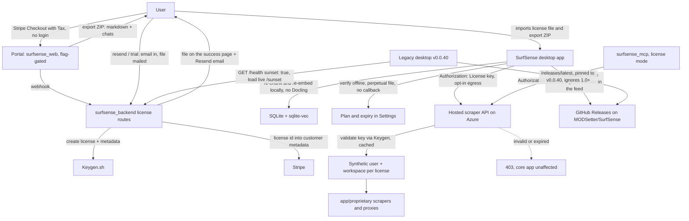
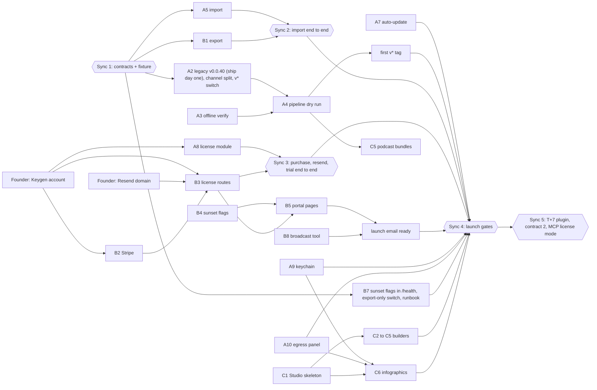

# SurfSense Pivot: Hosted SaaS to Airgapped Open Core

> Sunset the hosted SaaS and relaunch SurfSense as an airgapped open-source desktop app (Apache-2.0, free public installers) monetized through a Keygen-issued license. **SurfSense 2.0.0** ships the app, Studio artifacts, cloud-to-local import, license purchase and the 14-day trial; the first plugin (hosted scraper API) lands the week after as 2.1.0. (1.0.x tags are taken by the old project versioning in this repo, so the new app starts at 2.0.0.) The Docker self-host stack stays open source and community-supported.

Every item below is a decision, not an assumption. Work is ordered, not dated; launch is the day the launch gates are green. The investor-facing target window (Sept 14-18, 2026) lives in `plans/yc-application/`; this document does not repeat it, and the gates decide. This document is the single source for the pivot. The phase docs in this folder ([`00-umbrella-plan.md`](00-umbrella-plan.md), `api/`, `worker/`, `frontend/`) remain the technical specs for the local app itself; "community-local" stays as the internal folder name, the user-facing name is **SurfSense**.

Three workstreams, joined by four frozen contracts:

| Workstream | Owner | Owns |
|---|---|---|
| **A - the app** | Dev A | `surfsense_local/`: rename, packaging, release channel split, import, license module, keychain, egress panel, auto-update, Studio review; legacy `surfsense_desktop` v0.0.40 |
| **B - portal and wind-down** | Dev B | `surfsense_backend/`, `surfsense_web/`, `surfsense_mcp/`: export, Stripe, license routes, transactional email, sunset flags, portal pages, infra scale-down, comms |
| **C - Studio** | Contractors | Studio pipeline and every artifact builder, end to end |

## Decision log

**Product**
- The product is called **SurfSense**. The local app is the product; "Local" is dropped from `productName`, README, and copy. `appId` becomes `com.surfsense.app` before the first public release (nothing has shipped yet, so this is free).
- Positioning: airgapped open-source alternative to NotebookLM.
- **Sunset:** hosted webapp, hosted desktop app (`surfsense_desktop`), browser extension, Obsidian plugin.
- **Stay:** the hosted **scraper API**, hosted **MCP for scrapers only** (knowledge-base tools go with the hosted data), and the **Docker self-host stack** (`surfsense_backend`, `surfsense_web`, compose) as open source, community-supported, **no SLA, no hosted service**. Because the self-host stack shares code with the hosted deployment, **every sunset behaviour is behind a flag** (`SUNSET_MODE` in the backend, `NEXT_PUBLIC_SUNSET_MODE` in web) and nothing is deleted or redirected unconditionally. Self-hosters never set the flags.
- No telemetry or crash reporting in the app. Support runs on logs the user sends.

**Licensing**
- `surfsense_local/` stays **Apache-2.0 and public**. Installers are **free and public** on GitHub Releases of `MODSetter/SurfSense` (monorepo; no separate releases repo). Those releases also belong to the legacy desktop app (latest `v0.0.39`, `autoDownload` on), which resolves updates through GitHub's `/releases/latest` pointer, so the two apps are split by that pointer: legacy `v0.0.40` (updater capped below 1.0.0, shipped day one) is **pinned as the repo's latest release** for good, and the new app's updater walks the releases feed for the highest semver instead (see Distribution). **Updates are free for everyone**; the updater has no license logic.
- The license gates exactly two things: **plugins** (first: the hosted scraper API) and **priority support**. It never disables the app. Expiry stops those two things and nothing else. (Gating updates was considered and rejected: with public installers, an expired user could delete the license file and become a free user with every update, so the gate would be theater.)
- **Purchase and the 14-day trial open on launch day.** At 2.0.0 the license buys priority support and is the key for plugins arriving the following week. Trial licenses issued before the plugin ships get their expiry set explicitly to T+7 plus 14 days, so the gap week does not eat the trial. Pricing copy says all of this plainly.
- License management is **Keygen.sh**: signed license files verified offline with the account public key embedded in the app; policies for trial (14d), individual (1y), team (1y, `maxUsers`). **No machine binding.** Files are checked out **perpetual (`ttl: null`)**: the app never contacts Keygen, the file carries the license expiry, renewal is a new file. Revocation therefore only bites server-side (plugins), which is the enforcement point anyway.
- **No account anywhere on the portal.** Stripe Checkout collects the email. The webhook creates the Keygen license with `metadata: {plan, email, stripe_customer_id, checkout_session_id}` and writes the Keygen license id into the Stripe customer's metadata. Delivery is twice: the success page serves the file by checkout session id, and the file is **emailed** (Resend). **Re-download is "resend my license"**: email in, Keygen lookup by metadata email, files mailed to that same address, rate-limited. **Trial is the same shape**: email in, one per email enforced by a Keygen lookup on the trial policy plus a disposable-domain blocklist, license out by email. Google login remains only inside the hosted app during the tail, for export.
- **No license tables.** Stripe and Keygen are the system of record; Keygen's list endpoint filters by `metadata[...]`, so lookups need no table of ours. Hosted Postgres stays up after the tail only for the scraper API's own operational rows (see wind-down), never for license data.
- Proprietary plugin code lives in a **private repo under BSL 1.1**, reusing [app/proprietary/LICENSE](../../surfsense_backend/app/proprietary/LICENSE) verbatim.
- Legal docs from templates now (EULA, **CLA via CLA Assistant** - not DCO, which grants no relicensing rights); lawyer review before the first enterprise contract.

**Pricing**
- Self-build: free. Trial: 14 days. Individual: **$120/year list, $60 early-bird for the first 30 days after launch (individual only)**, implemented as a Stripe coupon restricted to the individual price with `redeem_by` = T+30. Team: **$80/seat/year, 5-25 seats**, self-serve, delivered as **one shared key with `maxUsers = quantity`**, no early-bird. Enterprise: $80/seat/year, **$3,000 minimum**, invoiced.
- Payments stay on **Stripe with Stripe Tax**. Hosted LLM inference is **dropped**; BYO key via the OpenAI-compatible connections.
- Plugins are **flat-included and unlimited**. Usage is instrumented per license so a cap becomes a config change, but no cap ships.
- Enterprise roadmap (all post-MVP): sandboxed artifact generation, priority support and SLA, SSO/SAML, on-prem license and plugin mirror for zero-egress networks (Keygen's self-hosted edition fits), local egress audit log.

**Plugins**
- **No plugin ships in 2.0.0.** The first plugin lands as **2.1.0 the week after launch** (T+7), delivered through auto-update.
- First plugin = **hosted scraper API** on the existing Azure deployment: all 9 platforms plus the web crawler, already behind REST in `app/capabilities/*` and `app/proprietary/*`, with no Celery dependency. Verified shape of those routes: `POST /workspaces/{id}/scrapers/{platform}/{verb}` with user authn, workspace authz, credit metering and `Run`/event rows in Postgres ([rest.py](../../surfsense_backend/app/capabilities/core/access/rest.py)). **License mode** keeps that path intact: `Authorization: License <key>` is validated against Keygen (short cache) and resolved to a **synthetic user and workspace created for that license on first call** (email = licensee); authz, run storage and rate limits run unchanged; credit metering is off for license callers and per-license counters are on. 403 carries a machine-readable reason.
- The in-app "plugin" is a thin HTTP client sending that header. **MCP** ([`surfsense_mcp`](../../surfsense_mcp)) already talks to the same routes; at T+7 it gains a `SURFSENSE_LICENSE_KEY` env that sends the `License` scheme, and it does not register the knowledge-base tools in license mode (the hosted knowledge base is gone with the tail).
- **Gap week (T-0 to T+7):** MCP and the scraper API keep running **unchanged** on PATs and credit billing; the hosted accounts and Postgres are alive through the tail anyway. License mode lands at T+7. At T+30 PATs are purged with the user data and license mode is the only auth.
- Future local plugins run as **separate sidecar processes** under the existing Electron supervisor. No third-party SDK until then; sandboxing is the enterprise feature.

**Artifacts**
- Generation runs **on the user's machine, unsandboxed**; risk accepted, sandboxing sold to enterprise later.
- In MVP: Summary, Mind map, Flashcards, Quiz, Interactive HTML, DOCX, XLSX, PPTX, PDF, Podcast, Infographics. **Video is out.**
- Contractors own Studio **end-to-end** (routes, worker job, UI, builders). Dev A reviews.

**Hosted wind-down**
- Deployment is **Azure VMs with docker-compose**. Prod auth is **Google OAuth only**. About 19,000 registered users. Unspent credit exposure **under $500**.
- Offer to users with balances: **refund, or the balance as a Stripe discount code** on the license. Handled manually in the Stripe dashboard.
- Two kinds of email, two tools. **Broadcast** (launch email, T+23 reminder) goes out by exporting addresses from the user table into Loops or Resend; no backend code. **Transactional** (license, trial, resend) is one Resend API call from the backend; the backend has no email sender today, so this is the one new dependency. The sending domain is warmed from day one, because launch day is the first send.
- **Zero stays** (the self-host stack needs it). Under `NEXT_PUBLIC_SUNSET_MODE`, `ZeroProvider` renders its children without connecting and every app route redirects to `/sunset`; the hosted `zero-cache` container is stopped. Without the flag nothing changes.
- **Legacy desktop clients learn about the sunset from the backend, not from a release.** v0.0.40 carries no sunset content: it reads `sunset` from `GET /health` (contract 4) on startup and, when true, loads the live `/sunset` page. That is what lets it ship on day one without announcing anything; users see nothing new until `SUNSET_MODE` flips at T-0.
- **Cloud-to-local import ships in 2.0.0.** The point of the pivot is moving current users, so export and import land together. The bundle is **markdown only**: every document's extracted content, folder structure, titles, and chat threads migrate; original uploaded files and old generated artifacts do not.
- **Launch is readiness-triggered.** 2.0.0 ships the day the launch gates (below) are green, and the hosted cutover happens the **same day**. **There is no advance announcement**: the launch email and banner go out on launch day, when the app is ready to install, and the **30-day export-only tail** is the notice period. Then one **encrypted cold snapshot kept 90 days**, then destroyed.
- **Postgres does not go offline.** The backend cannot run without it and the scraper API stores runs in it. At T+30 the runbook snapshots, then **purges user content and PATs**, and keeps the schema and the scraper API's operational rows. Blob storage is destroyed.
- **Hosted code is not archived.** `surfsense_backend` and `surfsense_web` are the self-host stack and the scraper/license backend. Only `surfsense_desktop`, the browser extension and the Obsidian plugin move to an archive repo after the tail. The README states: community-supported, no SLA, no hosted service.
- Marketing: rewrite **landing, pricing, downloads**; unpublish `/connectors`; rewrite `/mcp-server` for license mode at T+7; keep the blog.

**Distribution**
- **One installer variant.** Docling, the embedding model and Kokoro are **already bundled** through `extraResources` (`build:parser`, `build:model`, `build:voice` in [electron-builder.yml](../../surfsense_local/electron/electron-builder.yml)); the gate is verification with networking disabled, not new packaging. Ollama is bundled too and **pulls models from the internet**, so it is an egress destination. All five targets: macOS arm64, macOS x64, Windows x64, Linux AppImage, Linux deb. Apple and Azure Trusted Signing are active.
- **One repo, two update channels.** Both apps publish to `MODSetter/SurfSense`. Legacy clients (`allowPrerelease` off) ask GitHub for `/releases/latest` and read `latest.yml` from it; the new app sets `autoUpdater.allowPrerelease = true`, which in electron-updater means "take the highest semver in the releases feed" (verified in `GitHubProvider.getLatestVersion`), and publishes its manifests under its own channel (`publish.channel: stable` gives `stable.yml`, `stable-mac.yml`, `stable-linux.yml`). Three independent guards keep the new app out of legacy clients: (1) v0.0.40's updater only accepts versions starting with `0.`, so anyone on it ignores 2.x outright; (2) legacy `v0.0.40` is pinned as the repo's latest release (`gh release edit v0.0.40 --latest`) and every 2.x release is published with "Set as the latest release" **unchecked**, so clients still on 0.0.39 are offered v0.0.40, never 2.x; (3) if the pin is ever lost, those clients find no `latest.yml` in a 2.x release and do nothing. Consequences: the new app must never publish a prerelease-semver tag (it would be offered to everyone), any later legacy repair release (0.0.x) is pinned as latest in turn, the GitHub "Latest" badge stays on the legacy release, and `/downloads` links to the new app's release by tag, never to `/releases/latest`. The tag trigger moves from `local-v*` to `v*` **in the same PR that deletes** [desktop-release.yml](../../.github/workflows/desktop-release.yml) (which also fires on `v*`), after v0.0.40 is out. Versions start at **2.0.0**: `v1.0.0` through `v1.0.98` already exist as tags in this repo.
- **macOS target is `[dmg, zip]`**: electron-updater needs the zip. Linux **AppImage auto-updates, deb does not**; `/downloads` says so.
- If `macos-13` runners are gone, Intel sidecars are built with an **x64 Python under Rosetta** on the arm64 job.
- In MVP hardening: **OS keychain for API keys** and the **network egress panel**. Deferred: SSE freshness, note authoring UI, onboarding screen.

## What is NOT in the MVP

- **Plugins.** The scraper client, license mode on the scraper API and on MCP all ship at T+7 as 2.1.0. The license module, purchase flow, trial, and all four frozen contracts ship at 2.0.0 so T+7 is a drop-in.
- **Original files in the migration.** Import carries markdown content, folder structure, titles, and chats. Original uploads and generated artifacts stay behind.
- **Third-party plugin SDK**, registry, revenue share, sandboxing.
- **Video** artifacts.
- **Deleting** hosted code. Stop serving; archive only the hosted-only surfaces later.
- **Seat enforcement.** `maxUsers` is a number in the key; enforcement is the audit clause.
- **MCP knowledge-base tools against the local app.** Post-MVP; MCP is scrapers-only until then.
- Any **enterprise** feature beyond a contract and an invoice.

## Architecture

The client-side check is UX. The server-side check at the scraper API is the enforcement, and it holds against any fork that strips the client. The `App -> ScraperAPI` and `MCP -> ScraperAPI` edges are the T+7 delivery; everything else is 2.0.0.

## The four contracts between workstreams

Freeze all four on day one as files in `plans/community-local/contracts/`; after that no workstream blocks another. Dev A drafts, Dev B approves, both commit; changes after the freeze are a PR both sign off. The second contract is not exercised until T+7, but freezing it now is free and makes the plugin release a drop-in. The third is on the launch critical path from both sides, which is exactly why it is a frozen file with a committed fixture rather than a conversation. The fourth is what lets the legacy desktop v0.0.40 ship on day one without waiting for any portal work.

1. **License file** (`contracts/01-license-file.md`). A Keygen license file, checked out with `ttl: null` (the 30-day default would kill every license a month after purchase). The app verifies it offline with the Keygen account public key and never contacts Keygen. Fields the app reads: the license `key` (the contract-2 bearer), `metadata.plan` (trial, individual, team), `expiry`, `maxUsers`, `metadata.email`, and the file's own `meta.issued`/`meta.expiry`. Nothing else. The webhook also writes `stripe_customer_id` and `checkout_session_id` into metadata for lookups; the app ignores them, and the producer rules in the contract need that one-line addition.
2. **Scraper API auth** (`contracts/02-scraper-api-auth.md`). `Authorization: License <key>` on every request, from the in-app client and from MCP alike. The backend validates with Keygen, caches the result briefly, resolves the key to its synthetic workspace, and returns 403 with a machine-readable reason (`expired`, `invalid`, `revoked`) that the app shows verbatim.
3. **Export bundle** (`contracts/03-export-bundle.md`). One ZIP, markdown only:
   - `manifest.json`: `format: "surfsense-export/1"`, `exported_at`, and per workspace `id`, `name`, `created_at`, its `chats` path, and a document list of `id`, `path`, `title`, `source` (upload, slack, notion, ...), `created_at`.
   - `workspaces/<id>/documents/<folder path>/<title>.md`: the OKF markdown [export_service.py](../../surfsense_backend/app/services/export_service.py) already produces. Folder hierarchy is the directory tree.
   - `workspaces/<id>/chats.json`: `[{id, title, created_at, messages: [{role, text, citations: [{title}], created_at}]}]`. Tool calls and agent steps are dropped; citations are titles, not chunk references.
   - The fixture is committed **unzipped** as `contracts/export-sample/` (reviewable in diffs); each side's tests zip it in a setup step. Dev B produces the bundle, Dev A consumes it, and a `format` bump is the only way the shape changes.
4. **Sunset flag** (`contracts/04-sunset-flag.md`). The existing unauthenticated `GET /health` on the hosted backend ([app.py](../../surfsense_backend/app/app.py)) gains `sunset: boolean` (mirrors `SUNSET_MODE`) and an optional `sunset_url`. Legacy desktop v0.0.40 reads it once on startup; when `true` it loads the live `/sunset` in its window instead of the bundled frontend, and the session cookie keeps the user signed in. Any error, timeout, or missing field is read as `false` (fail open), so v0.0.40 ships before the field exists.

## Day one (before anyone writes feature code)

Ordered. The first three happen in this sequence because each unblocks the next; the rest run alongside.

| Item | Owner |
|---|---|
| Commit this plan; link it from [`00-umbrella-plan.md`](00-umbrella-plan.md) | Founder |
| Create the Keygen.sh account; policies: trial (14d), individual (1y), team (1y, `maxUsers`); export the account public key and an API token; confirm volume limits for the tier. **Requested day one**: A8, B2, and B3 all block on it | Founder |
| Freeze the four contracts and the `export-sample/` fixture in `contracts/` | Dev A drafts, Dev B approves |
| Ship legacy desktop **v0.0.40** (A2) against contract 4. Nothing gates on its uptake any more (the channel split covers clients that never update), but every client that does take it is one less client relying on the pin | Dev A |
| Create the **Resend** account, verify the sending domain, start warming it | Founder |
| Create private repo `surfsense-plugins`; copy [app/proprietary/LICENSE](../../surfsense_backend/app/proprietary/LICENSE) (BSL 1.1) verbatim as its `LICENSE` | Founder |
| Add a CLA via CLA Assistant bot to `.github/` (template now, lawyer review before the first enterprise contract) | Founder |
| EULA and pricing copy from templates: expiry never disables the app, enterprise audit clause, unlimited plugin fair-use language that reserves the right to add caps, trial terms, early-bird end date, "plugins arrive the week after launch" | Founder |
| Stripe: individual and team prices, early-bird coupon, Stripe Tax on | Dev B |
| Agree the launch gates below; they decide the day, the target window in `plans/yc-application/` is the goal | Founder, Dev A, Dev B |

## Orchestration

Speed is not the constraint; waste is. With two fast devs the only ways to lose time are waiting on each other, building against an interface that then moves, building the same thing twice, or colliding in the same files. The plan is arranged so none of those happen.

**Ownership.** Each workstream edits only its own tree; anything else is a PR to the owner.

| Tree | Owner |
|---|---|
| `surfsense_local/electron/`, `.github/workflows/release-local.yml`, `.github/workflows/desktop-release.yml` (deletion), `surfsense_local/backend/modules/license/` and `modules/migration/`, Settings and import screens in `surfsense_local/frontend/`, `surfsense_desktop/` (v0.0.40 only) | Dev A |
| `surfsense_backend/`, `surfsense_web/`, `surfsense_mcp/`, compose and infra | Dev B |
| `plans/community-local/contracts/` | Dev A drafts, Dev B approves; changes after the freeze are a PR both sign off |
| Studio routes, worker job, builders, Studio panel | Contractors |
| Shared packaging files (`electron-builder.yml`, `worker.spec`) and the `electron/` preload | Dev A owns; contractors change them by PR |

**Dependency graph.** Solid edges block. The five hexagons are the only times two workstreams have to meet; everything else runs in parallel.

**Rules that keep it waste-free.**
- **Ship A2 on day one, but nothing waits for it.** v0.0.40 depends on contract 4 only, carries no sunset content, and fails open, so it announces nothing and Dev B cannot delay it. Its uptake runs in the background as extra safety; the channel split (pinned legacy release plus the new app's own manifest names) is what actually protects clients that never update, so there is no wall-clock wait in the plan.
- **The founder's two accounts are on the critical path** (Keygen for A8, B2, B3; Resend for B3). Dev A needs a real signed test file; Dev B needs the API token and policies. Day one, before either dev reaches those steps.
- **Build against the fixture, not against each other.** Nobody waits for the other side of a contract to exist; the two end-to-end syncs are where the sides meet, once.
- **Do not polish what dies in 30 days.** `/sunset`, the export UI, and the hosted redirects are function-only.
- **Flags, not deletions, in shared code.** Anything that would change the self-host app's behaviour goes behind `SUNSET_MODE` / `NEXT_PUBLIC_SUNSET_MODE`. The compose stack with the flags unset is a launch gate.
- **Contractors' cross-cutting needs are PRs to Dev A**, not edits to Dev A's files: the IPC method for `printToPDF` (C4), the ffmpeg `extraResources` entry (C5), hidden imports in `worker.spec` (C3). C6 waits for A9 and A10 and is last in the contractor list for that reason.
- **Dev A's Studio review is continuous, not a phase.** It checks two things: the spec-to-builder rule and packaging impact. Nothing else.

## Workstream A - the app (Dev A)

Ordered. Each step is independently shippable to `dev`.

1. **Rename.** `productName: SurfSense`, `appId: com.surfsense.app` in [electron-builder.yml](../../surfsense_local/electron/electron-builder.yml). Update [README.md](../../surfsense_local/README.md).
2. **Legacy v0.0.40 and the channel split.** `surfsense_desktop` v0.0.39 auto-downloads whatever GitHub calls the latest release, tag name irrelevant, so it must be neutralised before the new app publishes anything. v0.0.40 is deliberately tiny and has **no sunset content of its own**: the legacy app bundles a frozen copy of `surfsense_web` (see `extraResources` in [surfsense_desktop/electron-builder.yml](../../surfsense_desktop/electron-builder.yml)), so any page baked into it would be stale the day Dev B changes the portal. Instead:
   - Updater capped below 1.0.0: `autoDownload` off, and `update-available` only downloads when the offered version starts with `0.`. A future v0.0.41 still reaches every user; 2.x is ignored. This keeps a repair path open for the legacy app without ever pulling the new app into it.
   - On startup, `GET /health` on the hosted backend (contract 4). If `sunset` is `true`, `loadURL` the live `/sunset` in the main window instead of the bundled localhost frontend; the live page then carries export, download, and import steps, and the session cookie keeps the user signed in. On `false`, an error, a timeout, or a missing field, start exactly as before.
   - Bump to 0.0.40 and push the `v0.0.40` tag: [desktop-release.yml](../../.github/workflows/desktop-release.yml) signs Windows only on `v*` tag pushes and leaves a draft. Publish the draft the same day and pin it (`gh release edit v0.0.40 --latest`); the still-active 0.0.39 updater pushes it out. Users on v0.0.40 see nothing change until T-0.

   Then, in one PR: delete `desktop-release.yml` and switch [release-local.yml](../../.github/workflows/release-local.yml) from `local-v*` to `v*`; from here a `v*` tag builds only the new app. In the new app: `publish.channel: stable` in `electron-builder.yml`, `autoUpdater.allowPrerelease = true` in the updater setup, version `2.0.0`. Every 2.x release is published with "Set as the latest release" unchecked; write that into the release checklist. Confirm the bundled electron-updater picks the highest semver in the feed rather than the first entry (older 6.x builds took the first entry, which would break if the legacy release is ever edited after a 2.x release); upgrade it if not.
3. **Offline verify.** Docling is already in `extraResources` (`build:parser`); [api/05c-packaging.md](api/05c-packaging.md) has the details and `HF_HOME` is redirected in [parsing.py](../../surfsense_local/backend/worker/ingestion/parsing.py). Confirm a PDF ingests on a machine with networking disabled. Fix whatever that reveals; this is verification, not packaging.
4. **First real dry run.** No `local-v*` tag has ever been cut; `release-local.yml` has never executed for real. Run it via `workflow_dispatch` on all five targets now, before any feature depends on it, with `publish: never` or by leaving the draft unpublished; either way nothing reaches a client. Expect signing, notarization and size surprises, and check that the artifacts carry `stable*.yml` and no `latest*.yml`.
5. **Import.** The migration path for every existing user, so it is 2.0.0. New `modules/migration/` (not `import` - reserved word). `POST /migration/import` takes the contract-3 ZIP from an Electron file picker; nothing touches the network. It is a **bulk upload on the API side**, matching the layer boundary in the umbrella plan (upload stream + enqueue is the API's; parse, chunk, embed is the worker's): unpack in a background task, return 202 with the created workspace ids, create one local workspace per cloud workspace, write each markdown file through the existing [documents/storage.py](../../surfsense_local/backend/modules/documents/storage.py) path so it gets a `dedup_key`, store `folder_path`, `source`, and the cloud ids in `document_metadata` (local has no folder table, so the hierarchy is kept as data, not structure), and enqueue the **existing** `ingest_document` for each. Markdown is in `TEXT_SUFFIXES`, so Docling is skipped: this path is chunk and embed only, and a large account is minutes to an hour on a laptop, in the background. Progress is the per-document status the sources panel already shows (polling or SSE invalidation, whichever the frontend has) plus one summary row (workspaces, documents ready and processing). Threads from `chats.json` are inserted as ordinary local threads with title-only citations. Quitting mid-import is safe: re-running the same bundle skips every document the `dedup_key` index already knows and the persistent Huey queue finishes what was enqueued. Entry points: Settings and the empty-workspace state. Build against `contracts/export-sample/` from day one; do not wait for Dev B's real export.
6. **Intel fallback.** If `macos-13` is unavailable, build x64 sidecars with an x64 Python under Rosetta on the `macos-14` job.
7. **Auto-update.** `electron-updater` on the `stable` channel with `allowPrerelease = true` (step 2). macOS target becomes `[dmg, zip]` (the zip is required); AppImage updates, deb does not. Every user is offered every release; no license logic. This is also the T+7 plugin delivery path, so test 2.0.0 to a dummy 2.0.1 end to end on Mac, Windows and AppImage before launch, **with the legacy release pinned as the repo's latest** so the test exercises the real feed.
8. **License module.** New `modules/license/`: import file, verify offline with the embedded public key, persist, clock-rollback watermark (highest timestamp seen in SQLite; earlier clock marks the license untrusted), `GET /license/status`. Settings UI: drop or paste the file, plan and expiry, and two links that open the portal in the browser: "Start 14-day trial" and "Buy". The app has no trial or purchase logic of its own; the portal emails the file. Needs a real Keygen-signed test file, so the founder's Keygen account precedes it.
9. **Keychain.** `provider_credentials.api_key` is plaintext SQLite today. Move to Electron `safeStorage` through a typed preload method. One hand-written Alembic revision drops the plaintext column; no data migration, since nothing has shipped.
10. **Egress panel.** One toggle per destination - GitHub Releases (updates), **Ollama model pulls**, each BYO provider - all **off by default**, each showing its last call. There is no Keygen destination: license files are perpetual and verified offline. This is the answer to "airgapped app with a plugin store" and an enterprise selling point. The scraper API toggle is added at T+7.
11. **Review Studio PRs**, enforcing the rule in Workstream C.

**T+7, 2.1.0 (after launch):** scraper client - thin HTTP module against Dev B's endpoint with the license as bearer; results land as documents; inert unless the toggle is on and a license is present. Plus the scraper toggle in the egress panel. Delivered through auto-update, which is why step 7 must be solid at 2.0.0. The client ships **in the public app under Apache-2.0**: enforcement is server-side, so there is nothing to hide, and the private BSL repo is for future plugins that carry real logic.

## Workstream B - portal and wind-down (Dev B)

1. **Export.** First because it is the migration path and Dev A tests import against real bundles. [export_service.py](../../surfsense_backend/app/services/export_service.py) already streams a per-workspace OKF markdown ZIP synchronously, so it needs no Celery. Extend to the contract-3 bundle: all workspaces, `manifest.json`, and a per-workspace `chats.json` flattened from the LangGraph-shaped JSONB in `new_chat_messages` (user and assistant turns as text, citations reduced to document titles, tool calls and agent steps dropped - the UI says so). Markdown only: no original uploads, no artifacts. Regenerate `contracts/export-sample/` from a seeded account once the real exporter runs.
2. **Stripe.** Prices for Individual $120/yr and Team $80/seat/yr (quantity 5-25); an early-bird coupon (50% off, restricted to the individual price, `redeem_by` = T+30). Enable Stripe Tax. Checkout Sessions need no login and use a `success_url` with `{CHECKOUT_SESSION_ID}`. The existing webhook handler in [stripe_routes.py](../../surfsense_backend/app/routes/stripe_routes.py) gains two events: `checkout.session.completed` for the new prices creates the Keygen license (team = one key with `maxUsers = quantity`) with `metadata: {plan, email, stripe_customer_id, checkout_session_id}`, checks it out with `ttl: null`, writes the license id into the Stripe customer metadata, and emails the file; `charge.refunded` revokes the license in Keygen. Disable auto-reload. Pro never went live, so there are no subscriptions to cancel.
3. **License routes, all unauthenticated.** `GET /license/file?session_id=` serves that checkout's file on the success page. `POST /license/resend {email}` lists Keygen licenses by metadata email and mails the files to that address; it always answers 200 so it cannot be used to probe emails. `POST /license/trial {email}` checks the disposable-domain blocklist, checks Keygen for an existing trial on that email, creates the trial license (expiry set explicitly to T+7 plus 14 days while the plugin has not shipped), and mails it. Both POSTs are rate-limited through the existing Redis-backed gateway limiter. A manual-issue script creates enterprise licenses from an invoice. Nothing here reads or writes the user table.
4. **Sunset flags.** Backend `SUNSET_MODE=1`: every write route (chat, uploads, connector syncs, workspace and document mutations) returns `410 Gone` with a pointer to `/sunset`; export, license and scraper routes are untouched; `GET /health` reports `sunset: true` (contract 4). Web `NEXT_PUBLIC_SUNSET_MODE=1`: [ZeroProvider](../../surfsense_web/components/providers/ZeroProvider.tsx) renders children without connecting (it returns `null` for non-public routes when `zero-cache` is down, so a pass-through is required, not a removal), every app route redirects to `/sunset`, portal pages are served. Unset, both are no-ops. `/sunset` uses the existing session because export needs it; the other portal pages use none.
5. **Portal pages.** `/sunset` (post-login landing, in this order: what is happening and the T+30 deletion date, **export** button, **download** links, import steps, refund-or-discount offer, the T+7 MCP change; export comes first because it needs the hosted service and the rest does not). It is also loaded inside the legacy desktop v0.0.40 window from T-0 (contract 4), so it must work with the existing session cookie and no Electron-specific assumptions. `/pricing` rewritten with buy buttons that go straight to Stripe Checkout, the early-bird end date, copy stating the first plugin arrives the week after launch, and a trial email form. `/license/success` (serves the file, explains where to put it, says a copy was emailed). `/license` (resend form and trial form, no login). `/downloads` (links to the new app's release by tag, never `/releases/latest`, which stays on the legacy release; notes that deb does not auto-update). Unpublish `/connectors`. `/mcp-server` is rewritten for license mode at T+7. Keep `/blog`.
6. **Landing rewrite** for the new positioning.
7. **Sunset flag in `/health`, export-only switch and infra runbook.** Ship the `/health` fields (`sunset`, `sunset_url`) returning `false` early so v0.0.40 has something real to hit; the flip is `SUNSET_MODE=1`, read on every request. Test both flags on the compose stack before launch, once with the flags set (sunset behaviour) and once unset (self-host behaviour unchanged). Then the runbook: stop `celery worker`, `celery beat`, `zero-cache`, `searxng`, OpenSandbox, and all LLM and embedding spend. Keep `postgres`, `redis` (verified: it backs the Google Search IP pool in [pool_store.py](../../surfsense_backend/app/proprietary/platforms/google_search/pool_store.py) and the gateway rate limiter), `backend`, `frontend`, `caddy`, and the proxy and captcha providers the scrapers need, so MCP and the scraper API run **unchanged** through the gap week. **Rollback** is the flags off and `compose up` on the stopped services; nothing is deleted until T+30.
8. **Email and money.** Broadcast: export addresses into Loops or Resend for the launch email and the T+23 reminder; both carry real dates because both go out after T-0 is known. Transactional: Resend from the webhook and the license routes, domain warmed from day one. Refunds and per-user discount codes done by hand in the Stripe dashboard; exposure is under $500.
9. **T+30 purge script.** Snapshot first (encrypted, kept 90 days). Then delete user content (documents, chunks, chats, connectors, files, PATs, credit records) while keeping the schema and the scraper API's rows (synthetic users and workspaces, runs, events). Destroy blob storage. Postgres stays up because the backend and the scraper API need it.

**T+7, plugin release:** a license auth context on the capabilities routes: `Authorization: License <key>` validated against Keygen with a short cache, resolved to a synthetic user and workspace created on first use, credit metering off for that context, per-license usage counters on (instrumentation only, no cap). MCP: `SURFSENSE_LICENSE_KEY` env sends the `License` scheme; knowledge-base tools are not registered in license mode. PATs keep working until the T+30 purge removes them.

## Workstream C - Studio (contractors)

Own [api/04-studio.md](api/04-studio.md), [worker/04-studio.md](worker/04-studio.md), [frontend/04-studio.md](frontend/04-studio.md) end-to-end.

**The one rule:** the cloud sandbox pattern is "LLM writes a script, sandbox runs it." Do not port that. The LLM emits a **structured spec**; a deterministic **builder** renders it. Then nothing LLM-written executes on the user's machine, which turns the accepted risk from "arbitrary code" into "malformed JSON." Interactive HTML renders in a sandboxed iframe exactly as cloud does today.

1. **Pipeline skeleton.** `POST /workspaces/{id}/studio/jobs`, Huey `studio_job(artifact_id)`, artifact list and get routes, Studio panel in the right column. Reuse the `artifacts` and `artifact_files` tables that already exist.
2. **Zero-dependency builders.** Summary, Mind map, Flashcards, Quiz, Interactive HTML. Nothing to bundle.
3. **Office builders.** DOCX, XLSX, PPTX via `python-docx`, `openpyxl`, `python-pptx` from a spec. Add hidden imports to `worker.spec` - PyInstaller only sees what `import` statements name. Download-only; no LibreOffice, so no rendered previews.
4. **PDF** via Electron's `printToPDF`: worker renders HTML, API hands it to the main process over IPC, result stored as the artifact primary file. No extra dependency. The IPC method lives in `electron/`, which Dev A owns: submit it as a PR to Dev A.
5. **Podcast.** LLM script, **Kokoro ONNX** TTS (already bundled by `build:voice`), **ffmpeg static binary** bundled for MP3 encoding. The ffmpeg `extraResources` entry is a PR to Dev A's `electron-builder.yml`, and it goes through Dev A's packaging dry run (A4).
6. **Infographics.** BYO image-model key stored through the keychain path; enabled only when its egress toggle is on. Depends on A9 and A10, which is why it is last.

## Launch gates

T-0 is the first day every box below is checked; the runbook that follows starts that day. Step numbers refer to the workstream lists above.

- [ ] Release pipeline green on all five targets from a real `v*` tag, signed and notarized, artifacts carrying `stable*.yml` only (A2, A4).
- [ ] Legacy v0.0.40 shipped and pinned as the repo's latest release; `desktop-release.yml` deleted, `v*` trigger live; a v0.0.40 build pointed at a backend returning `sunset: true` opens the live `/sunset` and stays signed in (A2 + contract 4).
- [ ] PDF ingest verified on a machine with networking disabled (A3).
- [ ] Import: a real export of a seeded prod account imports on a networking-disabled machine; documents searchable, threads present (A5 + B1).
- [ ] Auto-update: 2.0.0 to a dummy 2.0.1 succeeds on Mac (zip), Windows and AppImage with the legacy release pinned as latest; a legacy 0.0.39 client pointed at the same repo is offered v0.0.40 and nothing else (A7).
- [ ] Purchase end to end in Stripe test mode: Checkout to webhook to Keygen to file on the success page **and in the inbox** to `GET /license/status` showing the plan; resend and trial flows end to end (A8 + B2 + B3).
- [ ] Keychain and egress panel merged; every outbound destination off by default (A9, A10).
- [ ] Portal live behind the flags: `/sunset`, `/pricing`, `/license/success`, `/license`, `/downloads`, landing (B4-B6).
- [ ] Compose stack with both flags **unset** behaves exactly as before: Zero connects, app routes work, `/health` says `sunset: false` (B4, B7).
- [ ] Studio: every MVP artifact type builds from the packaged app, not just from the dev tree (C1-C6).
- [ ] `SUNSET_MODE` tested on the compose stack: writes return 410, `/health` says `sunset: true`, export and license routes unaffected; scale-down and purge runbooks written (B7, B9).
- [ ] Launch email written, broadcast tool loaded, transactional domain warmed (B8).

## Cutover runbook

Triggered by readiness. Legacy v0.0.40 is already out (day one); there is no other step before T-0.

- **T-0, the day the launch gates are green:** publish SurfSense 2.0.0 on all five targets with "Set as the latest release" unchecked (the legacy release keeps the pin); set both sunset flags on the hosted deployment, which also turns every legacy v0.0.40 into the live `/sunset` page on next launch; run the scale-down runbook; auto-reload off; purchase and trial open; MCP and scraper API keep serving unchanged. The launch email and the in-app banner go out the same day - the only announcement: what changed, download link, export and import steps, refund-or-discount offer, the T+30 deletion date, and the T+7 MCP change. Users export, install, import - the migration is complete on day one.
- **T+7:** publish 2.1.0 with the scraper plugin via auto-update (latest box unchecked); license mode goes live on the scraper API and MCP; PATs still work.
- **T+23:** reminder email (seven days to deletion).
- **T+30:** snapshot; purge user content and PATs; destroy blob storage; Postgres stays up for the scraper API and license routes; PATs are gone, license mode is the only auth.
- **T+120:** snapshot destroyed.
- **After the tail:** `surfsense_desktop`, browser extension, and Obsidian plugin move to an archive repo. `surfsense_backend` and `surfsense_web` stay as the self-host stack and the scraper/license backend; README updated to say community-supported, no SLA, no hosted service.

## Risks and mitigations

- **Release pipeline never run.** Dry-run in the first week of Workstream A, before any feature depends on it.
- **Legacy desktop clients pull the new app.** Three independent guards: v0.0.40's updater ignores anything that does not start with `0.`; the pinned legacy release keeps `/releases/latest` away from 2.x for clients still on 0.0.39; and the new app ships no `latest.yml`, so a lost pin means a 404 and nothing happens. Residual: users who never open the legacy app keep a client pointing at a dead backend until they do, at which point `/health` sends them to the live `/sunset`. Human step to protect: the "Set as the latest release" box stays unchecked on every 2.x publish.
- **Legacy desktop bundles a frozen frontend.** A sunset page shipped inside v0.0.40 would be stale as soon as the portal changes and would need another legacy release. v0.0.40 therefore carries no page: it reads `sunset` from `/health` (contract 4) and loads the live `/sunset` when true, fail-open otherwise. The portal can change freely without a legacy version bump.
- **macOS auto-update silently broken.** Only `dmg` was configured; `zip` is added and the update gate runs on Mac.
- **`macos-13` runner availability.** Rosetta x64 Python on the arm64 job.
- **Unlimited flat scraping.** Per-license counters exist from T+7 so a cap is a config change; EULA reserves the right.
- **Trial abuse without accounts.** One trial per email via Keygen, disposable domains blocked, counters make abuse visible, and the exposure is bounded to scraper usage for 14 days.
- **Transactional email fails or lands in spam.** The success page serves the file regardless; the resend flow exists; the domain is warmed from day one, not from launch day.
- **Buyer mistypes the Stripe email.** The success page still serves the file; support re-issues from the Stripe record.
- **Auto-update is the plugin delivery path.** If step 7 of Workstream A is flaky at 2.0.0, T+7 becomes a manual reinstall for every user. Test the update path end-to-end before launch.
- **Import is on the launch critical path from both sides.** Contract 3 is a frozen file with a committed fixture, so Dev A and Dev B build in parallel from day one. The end-to-end test is a launch gate.
- **Re-embedding large accounts on a laptop.** Markdown skips Docling, so import is embed-bound: minutes to an hour for thousands of documents, in the background, resumable across restarts. The summary row exists so it never looks hung.
- **Lossy migration.** Tool calls, agent steps, live citation links, original files, and old artifacts do not survive. The export UI, the `/sunset` page, and the import summary all say so before the user is surprised.
- **Existing MCP users.** PATs work unchanged through the tail; license mode is available from T+7; PATs die at T+30 with the purge. The launch email and `/sunset` say so with dates.
- **No advance notice.** Users meet the freeze on launch day. The 30-day export-only tail is the whole grace period and the knob to turn if that proves too abrupt.
- **Sunset flags leak into self-host.** Flags default off; the compose stack with flags unset is a launch gate; the flags are documented as hosted-only.
- **Unsandboxed artifacts.** The spec-to-builder rule bounds the risk to malformed output; HTML stays in a sandboxed iframe.
- **Large-account export is synchronous.** Acceptable for the tail; add a request timeout and a size warning in the UI.
- **Emailing about 19k users.** Use a real broadcast tool, not the app; the domain is warmed before launch day.
- **Keygen tier limits.** Confirm trial and license volume limits at signup; trials count as licenses.
- **Two devs, same-day cutover.** Rollback is the flags off plus `compose up` on the stopped services; the 30-day tail guarantees nothing has been deleted when you need it.

## After the MVP

**T+7:** the scraper plugin (2.1.0), license mode on the scraper API and MCP. Then: original-file migration if users ask for it (blob download in the export, stored beside the imported markdown; a `format` bump on contract 3). Video artifacts. MCP knowledge-base tools against the local app on localhost. Local plugin sidecars and the third-party SDK. Enterprise: sandboxed artifacts, SSO, on-prem license and plugin mirror, egress audit log. SSE freshness, note authoring, onboarding.
