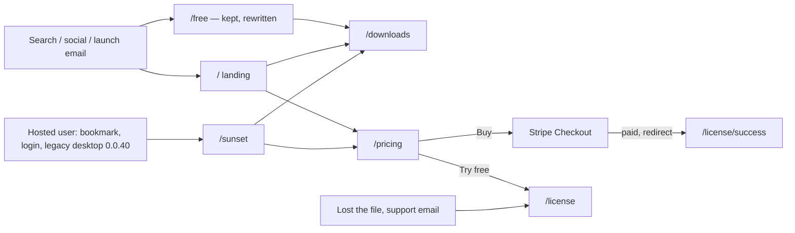
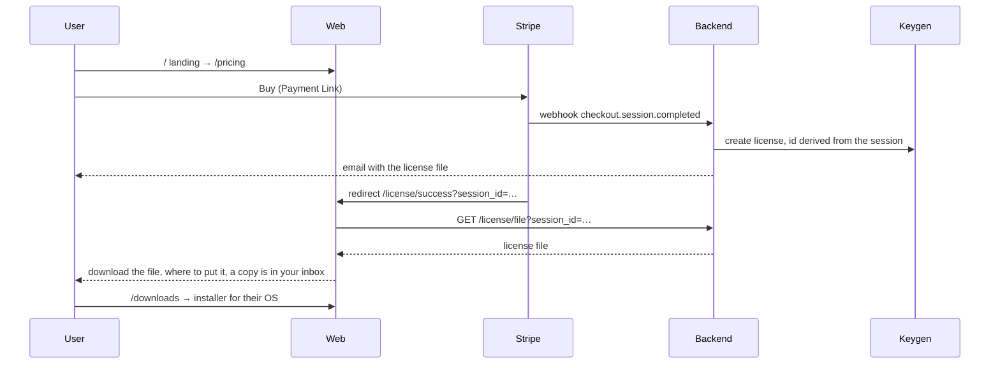
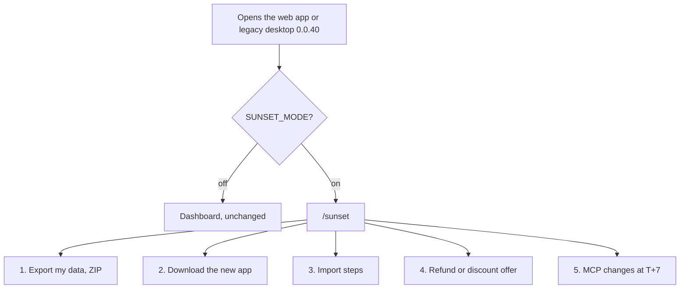
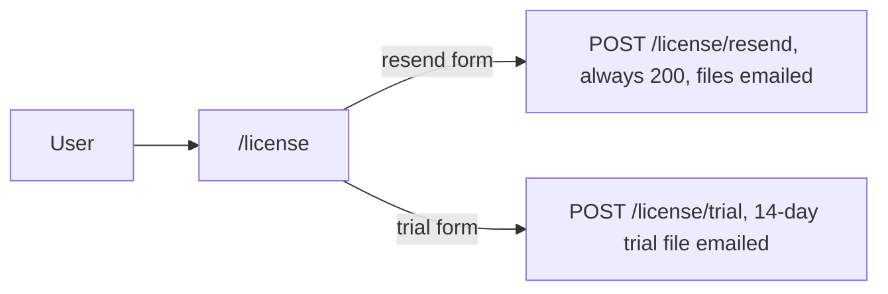

# Portal pages

Seven pages, three journeys: a new buyer, an existing hosted user being wound down, and someone without their license file. Items refer to [00d-pivot-plan.md](../00d-pivot-plan.md), Workstream B.

## Who lands where

| Page | For whom | Reached from | Login | Status |
|---|---|---|---|---|
| `/` landing | new visitors | search, email, social | no | open (B6) |
| `/pricing` | buyers | landing, `/sunset` | no | open (B5) — the route exists but still sells pay-as-you-go credits; no license prices, early-bird date, buy buttons or trial form |
| `/license/success` | just paid | Stripe redirect only | no | done |
| `/license` | resend, trial | pricing, support, email | no | done |
| `/downloads` | anyone installing | landing, `/sunset`, success page, `/free` | no | open (B5), may be a landing section |
| `/free` | search traffic wanting AI without an account | organic search | no | open (B5) — decided (below), but the page still runs on hosted inference and every claim on it is about to become false |
| `/sunset` | existing hosted users | app redirect, legacy desktop | yes, export needs it | export done; download links, import steps, refund offer open |

## 1. New buyer

`/license/success` exists so the buyer never depends on the email arriving. Both paths yield the same file: the Keygen id is derived from the Stripe session, so the webhook and the success page cannot mint two licenses ([01-license-routes.md](01-license-routes.md)).

## 2. Existing hosted user, after T-0

Web: `NEXT_PUBLIC_SUNSET_MODE=1` redirects every app route to `/sunset` and lets `ZeroProvider` render without connecting (B4). Legacy desktop 0.0.40 reads `GET /health`, sees `sunset: true`, and opens `/sunset` in its window (contract 4). `/sunset` keeps the login session because export needs it. Every write route answers 410 during the tail, so nothing new is created.

## 3. Without a license file

No login. Resend always answers 200 so nobody can probe which addresses bought.

## Open items

**Landing content (B6) is unspecified and unowned.** The seven pages above are the ones with content requirements; `/` landing has only "rewrite for the new positioning" in the pivot plan, because the content is deferred to the **founder's landing brief for B6 — which does not exist yet, and no launch gate names it**. The *SEO* skeleton it has to fit inside now exists in [`../seo/02-page-briefs.md`](../seo/02-page-briefs.md) (target keywords, title and meta, H2 order) for this and every other page below. Meanwhile the page is the entry point for search, email and social, and almost none of it survives: of the eight components in [`app/(home)/page.tsx`](../../../surfsense_web/app/\(home\)/page.tsx), `AuthRedirect` (`router.replace("/dashboard")`) and the `HeroSection` primary CTA (`<Link href="/login">Get Started</Link>`) cannot exist without accounts at all; `ConnectorGrid` showcases what becomes a paid T+7 plugin while `/connectors` is being unpublished; `CompareTable`, `HomeFaq`, `LogoCloud` and `SocialProof` are all written for the hosted service. `CommunityStrip` is the only one that mostly survives, and it links to `/login`. Separately, `hero-section.tsx` is one of the two call sites of `desktop-download-utils` (the other is `SidebarUserProfile.tsx`), so the hero's download button currently serves legacy v0.0.40 — see the Dev B status row.

**Seven public routes have no disposition.** Everything under `app/(home)/` that the plan never places: `/external-mcp-connectors`; `/announcements`; `/changelog`; `/contact`; `/privacy` and `/terms` (hosted-service legal text the EULA work does not cover); and the `[slug]` catch-all. Each needs unpublish, redirect or keep. None of them ranks for anything in the site's top 200 keywords, so there is no SEO argument either way ([`../seo/02-page-briefs.md`](../seo/02-page-briefs.md), "Open, and deliberately not answered here"); `/privacy` and `/terms` need a content decision rather than an indexing one. Only `/connectors` is named for unpublishing today. Note that `NEXT_PUBLIC_SUNSET_MODE` is still unread in `surfsense_web` (B4), so none of these redirect anywhere yet and all of them stay live and indexed at T-0 by default.

## Closed: `/free` is kept and rewritten in place

**Decided.** `/free` was the consequential one of the eight unplaced routes, and it is now settled: **keep the URL, rewrite the page, target the no-signup cluster.** Not unpublished, not redirected to `/downloads`. It becomes a B5 page with a full build sheet in [`../seo/02-page-briefs.md`](../seo/02-page-briefs.md), and the numbers behind the call are in [`../seo/01-keyword-research.md`](../seo/01-keyword-research.md), "Our baseline, and the `/free` decision".

Why, in short. The page's headline **193 keywords and ~435,000 monthly volume is mostly position-21+ volume** — four fifths of it sits on page three or worse. Its real value is one cluster: *no sign up / no login / no account*, which is **62.4% of the page's estimated value and 28 of its 31 top-10 positions** (`chat free no sign up` 6,600 at position 6, `free ai no sign-up` at position 3, `ai chat no signup` 9,900 at position 10). The desktop app answers that query **better than the hosted page does today** — there is no account at all rather than a 500,000-token trial behind a "Create Free Account" CTA, no quota, and the bundled Ollama pulls Qwen3 0.6B in 0.5 GB, so a visitor with no email and no API key can chat for free. The hosted-brand terms that cannot survive the pivot (`chatgpt without login` and 26 others) are **3.2% of the volume and 4.9% of the value, $101 total**.

What this means for Dev B, beyond the brief:

- **The page is live and about to start lying.** It currently promises 500,000 free tokens, `$5` of premium credit and Claude access, in body copy *and* in `FAQPage` + `WebApplication` structured data, and it fetches its model list from `/api/v1/public/anon-chat/models` on the hosted backend. When hosted inference stops, that endpoint returns nothing and the model table renders its empty state. **This page has to be rewritten by T-0, not after** — it is the only route where doing nothing ships false claims to 193 ranking keywords.
- **The model table renders from the app's own curated manifest**, vendored at build time with a drift check, so the page cannot advertise a model the app cannot run. Rows link to the planned provider pages, CTA to `/downloads`. The `/free/[model_slug]` routes 301 to `/free`.
- **Ads and the ads-removal banner are a separate founder call.** Two `AdUnit` slots compete with the download CTA on a page whose job is now conversion. The SEO brief recommends removing them and does not block on it.
- **`FreeLayoutDataProvider`, `FreeChatClient` and the anon-chat contracts** go with hosted inference; the rewrite is a static page plus a generated table, so it needs neither.
