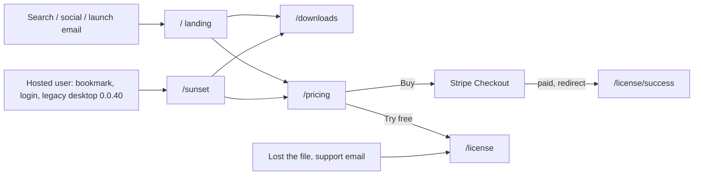
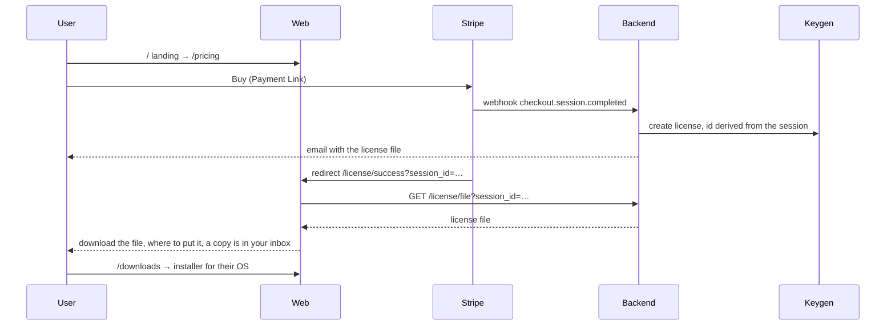
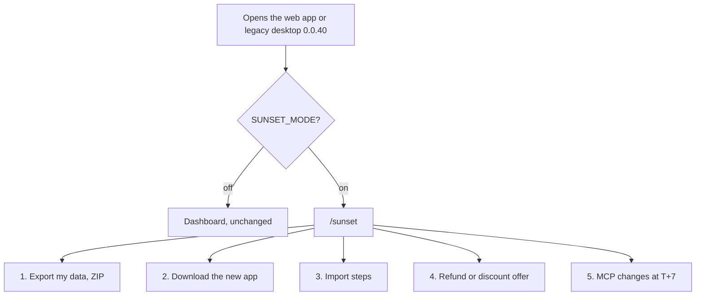
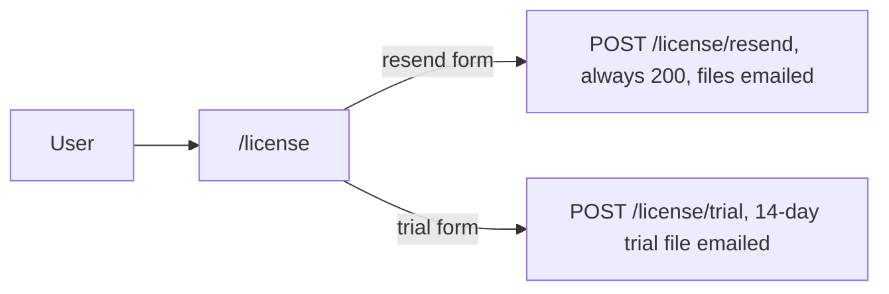

# Portal pages

Six pages, three journeys: a new buyer, an existing hosted user being wound down, and someone without their license file. Items refer to [00d-pivot-plan.md](../00d-pivot-plan.md), Workstream B.

## Who lands where

| Page | For whom | Reached from | Login | Status |
|---|---|---|---|---|
| `/` landing | new visitors | search, email, social | no | open (B6) |
| `/pricing` | buyers | landing, `/sunset` | no | done |
| `/license/success` | just paid | Stripe redirect only | no | done |
| `/license` | resend, trial | pricing, support, email | no | done |
| `/downloads` | anyone installing | landing, `/sunset`, success page | no | open (B5), may be a landing section |
| `/sunset` | existing hosted users | app redirect, legacy desktop | yes, export needs it | export done; download links, import steps, refund offer open |

## 1. New buyer

`/license/success` exists so the buyer never depends on the email arriving. Both paths yield the same file: the Keygen id is derived from the Stripe session, so the webhook and the success page cannot mint two licenses ([01-license-routes.md](01-license-routes.md)).

## 2. Existing hosted user, after T-0

Web: `NEXT_PUBLIC_SUNSET_MODE=1` redirects every app route to `/sunset` and lets `ZeroProvider` render without connecting (B4). Legacy desktop 0.0.40 reads `GET /health`, sees `sunset: true`, and opens `/sunset` in its window (contract 4). `/sunset` keeps the login session because export needs it. Every write route answers 410 during the tail, so nothing new is created.

## 3. Without a license file

No login. Resend always answers 200 so nobody can probe which addresses bought.
