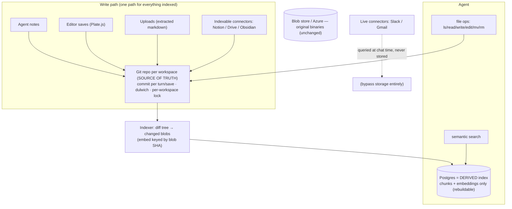
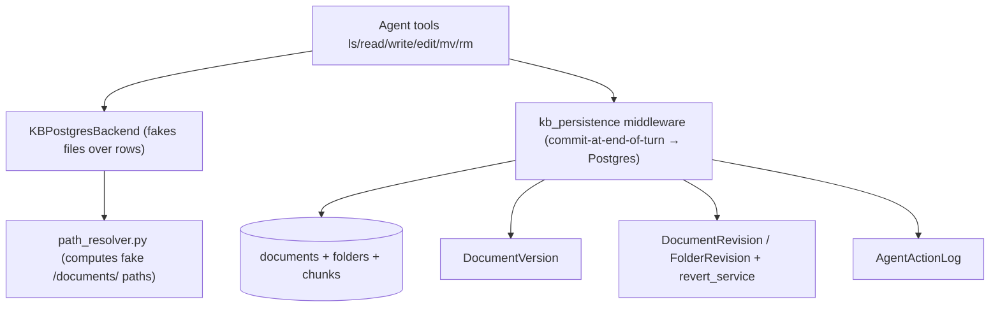

# Git-native Knowledge Base — Umbrella Plan

> Master roadmap for pivoting the Knowledge Base from the custom virtual-filesystem-over-Postgres to **Git as the source of truth**. Each phase becomes its own subplan in this folder (`plans/git-native-kb/`).

This is the high-level roadmap. It is sequenced. Companion diagrams live in [`00b-diagrams.md`](00b-diagrams.md). The design rationale + references live in the ADR: [`docs/adr/0001-git-native-knowledge-base.md`](../../docs/adr/0001-git-native-knowledge-base.md).

> **SCOPE:** BACKEND only (`surfsense_backend`). Frontend (`surfsense_web`), the real-time UI (Zero), and client apps (desktop, Obsidian, browser extension) are touched only where a phase forces it (Phase 6). A dedicated frontend/client umbrella comes LATER, once the backend is working.

> **Origin:** Rohan Verma's meeting proposal to pivot from the custom-built KB "file system" to a Git-based system due to persistent maintenance issues; Thierry Bakera to investigate. This umbrella is the outcome of that investigation.

## Positioning

The KB today has **no real filesystem** — it is a *virtual* `/documents/` namespace faked over Postgres rows, plus three hand-rolled versioning/audit systems. That re-implements — badly — what Git provides natively (tree, atomic commits, history, revert, content-addressed dedup). The pivot makes **Git the single source of truth for all indexed content** and demotes **Postgres to a derived, rebuildable search index (chunks + embeddings only)**. Net effect: large code **deletion**, storage and search **decoupled** (so search can improve independently — Rohan's stated goal), and a real git repo per workspace (unlocking "bring your own remote" later).

## Target architecture (git = truth, Postgres = derived index)

Current (to-be-replaced) architecture — virtual FS over Postgres

## Decisions locked

- **Git = single source of truth** for all *indexed* KB content (agent/editor notes, uploads, indexable connectors — the `is_indexable` ones).
- **Postgres = derived index only** (chunks + embeddings). It is a **cache**: wipe-and-rebuild from Git via one `reindex(workspace)`. Never authoritative.
- **One-way derivation** (Git → Postgres). **Never** two-way sync (this is the Wiki.js anti-pattern we explicitly reject).
- **Live connectors (Slack/Gmail) are untouched** — never stored/indexed, queried at chat time; entirely out of scope.
- **Binary blobs stay in the existing blob store** (local/Azure). Git holds extracted markdown, not raw binaries (Git-LFS deferred).
- **Agent tool interface is unchanged** (`ls/read/write/edit/mv/rm`). Only the backend behind the tools changes (Postgres-fake → real git working tree).
- **History/undo = git log + `git revert`.** The three hand-rolled systems (`DocumentVersion`, `DocumentRevision`/`FolderRevision`+`revert_service`) are **deleted**.
- **Engine = dulwich** (pure Python, deploy-friendly in Docker, real wire protocol for future remotes). Shell out to `git` only for heavy maintenance (`gc`/repack).
- **Per-workspace write lock** is mandatory (git is single-writer) — a data-integrity boundary, not a feature.
- **Rollout behind a feature flag**, per-workspace; no big-bang cutover.

## References we are borrowing from (not inventing)

Every decision traces to a proven source (full list + links in the ADR):

| Decision | Borrowed from |
|---|---|
| Git = truth, Postgres = rebuildable cache | **Fossil SCM** (`fossil rebuild`, production since 2007) |
| Content in git, metadata/index in a DB | **Gollum** (GitHub/GitLab wikis), **kherad** |
| Silent commit-per-save, hide git from users | **kherad** |
| Embeddings keyed by blob SHA, incremental | **Coregit** + vector-index-as-cache best practices (LangChain RecordManager / LlamaIndex docstore) |
| Python git engine | **dulwich** |
| "Don't put a firehose in git" | "Git is not a database" critiques (validates keeping live connectors out) |
| Reject two-way DB↔git sync | **Wiki.js** counter-example (requarks/wiki #7860 silent-sync bug) |

## Backend phases (active — this umbrella)

### Phase 0 — Shared contract [`subplan: 00c-shared-contract.md`]

> **READ FIRST.** Pins the five cross-phase contracts (repo/tree layout, read contract, lock, write path, index/Zero realities) grounded in the current code. Resolves what were per-phase "open questions" and corrects three first-draft oversimplifications: reads are rendered-from-chunks (not raw git blobs), the lock must be Redis (multi-process deploy), and there is no embedding cache to "extend".

### Phase 1 — Git storage core [`subplan: 01-git-storage-core.md`]

> **PLANNED. Build first** — every later phase uses it.

- Add **dulwich**; a `GitRepoService` that opens/creates a **bare-ish repo per workspace** on disk (path derived from workspace id, alongside the existing blob store root).
- Primitives: `read_file`, `write_file`, `list_tree`, `move`, `remove`, `commit(message, author)`, `log`, `read_at(commit)`, `revert`.
- **Per-workspace lock/queue** around all writes (single-writer safety). `ponytail:` mark the lock ceiling (global per-repo lock; upgrade path = queue/worker).
- Key files (new): `surfsense_backend/app/kb_git/` (service, lock, paths). No agent wiring yet.
- Tests: create repo → write/commit → log shows commit → read_at(prev) returns old content → revert works; concurrent writes serialize under the lock.

### Phase 2 — Git-working-tree backend [`subplan: 02-git-working-tree-backend.md`]

> **PLANNED. Build after 01.** Replaces the read-side fake.

- New backend implementing the deepagents `BackendProtocol` (`als_info`/`aread`/`awrite`/`aedit`/`aglob_info`/`agrep_raw`/`alist_tree_listing`) over the **real git working tree** instead of `KBPostgresBackend`.
- Wire into the backend resolver (`.../filesystem/backends/resolver.py`) for cloud mode behind the feature flag.
- **Retire the virtual-FS façade** (`path_resolver.py`, `kb_postgres.py`) for flagged workspaces — paths become real paths.
- Tests: agent `ls`/`read`/`glob`/`grep` return real files identical to the previous fake for a seeded repo.

### Phase 3 — Commit-per-turn write path [`subplan: 03-commit-write-path.md`]

> **PLANNED. Build after 02.** Depends on 01's `commit`.

- Replace `KnowledgeBasePersistenceMiddleware`'s "commit staged ops to Postgres" with **stage in working tree → one `git commit` at end of turn** (author = user/agent).
- Editor saves and upload-extracted markdown route through the same commit path (one write path for all indexed content).
- Tests: an agent turn with N edits produces exactly **one** commit; editor save produces one commit; commit author/message correct.

### Phase 4 — Derived index + reindex [`subplan: 04-derived-index.md`]

> **PLANNED. Can build alongside 03** (both consume 01's `commit`/`log`).

- Post-commit indexer: **diff the commit tree**, re-chunk + re-embed **only changed blobs**, keying embeddings by **blob SHA** (point the existing `chunk_reconciler.py` at blob SHA). `web`/live paths untouched.
- One idempotent **`reindex(workspace)`** that wipes and rebuilds all chunks/embeddings from the current git HEAD (the Fossil `rebuild` discipline).
- **Delete** `document_versioning.py`, `revert_service.py`, `DocumentRevision`/`FolderRevision` (migration to drop tables) — history now = git.
- Tests: change one file → only its chunks re-embed (unchanged blob SHAs reuse vectors); `reindex()` reproduces identical chunk set; search results unchanged vs. baseline.

### Phase 5 — Migration [`subplan: 05-migration.md`]

> **PLANNED. After 01–04.** One-time, per-workspace, flagged.

- Export each existing workspace's Postgres documents/folders → an initial git repo (one seed commit), preserving `unique_identifier_hash` mapping.
- Verify round-trip: seeded repo → `reindex()` → chunk set matches pre-migration search behavior.
- Rollback = keep Postgres content until the flagged workspace is verified.

### Phase 6 — Zero / real-time projection [`subplan: 06-zero-projection.md`]

> **PLANNED. The one net-new integration cost.** Depends on 03/04.

- The web UI is driven by Zero (Postgres logical replication, `zero_publication.py`). Git is not a real-time source, so add a **git → Postgres projection** that keeps the Zero-published `documents`/`folders` rows in sync after each commit (thin metadata rows, not content-authoritative).
- Decide: reuse the indexer's post-commit hook to upsert Zero rows vs. a separate projector.
- Tests: after a commit, the Zero-published rows reflect the new tree within the projection cycle; deleting a file removes its row.

## Sequencing (critical path vs. parallel)

- **Phase 0 first:** `00c` is a design agreement (no code) — sign off on the five contracts before starting `01`.
- **Critical path:** `01 → 02 → 03` (storage → backend → write path). These deliver the core swap.
- **Parallelizable:** `04` (indexer/reindex) can develop alongside `03`; both only need `01`'s `commit`/`log`.
- **After core:** `05` (migration) then `06` (Zero projection). `06` is the only genuinely *new* subsystem (partly offsets the deletions) and must land before flagging a workspace whose UI must stay live.
- Recommended: `01 → 02 → 03` (+`04` in parallel) → `06` → `05` → flip flag per workspace.

## Deferred — out of this umbrella

- **Connect-your-own-remote** (push/pull to user GitHub/GitLab/Gitea). Free later because the repo is real git.
- **CRDT / Yjs real-time collaboration** (multi-writer). Keep single-writer for now.
- **Review / merge workflows** (kherad's reviewer layer).
- **Karpathy `raw/` + `wiki/` content model, contradiction-flagging, lint.**
- **Graphiti / bi-temporal fact graph** (agent memory time-travel).
- **Git-LFS for binaries** (blob store stays).
- **Frontend/client umbrella** (version-history UI removal, any UX changes).

## Open items — resolved in Phase 0 ([`00c-shared-contract.md`](00c-shared-contract.md))

1. ~~Repo location & layout~~ → **persistent working tree at `{blob parent}/.kb_git/{workspace_id}`, layout = virtual path minus `/documents`** (C1).
2. ~~Zero projection owner~~ → **folded into the Phase-4 post-commit indexer** (C5).
3. **Binaries** — keep blob store (confirmed markdown/text-only in git); Git-LFS deferred.
4. ~~Lock granularity~~ → **Redis lock, from v1** (deploy is multi-process: uvicorn + Celery) (C3).
5. ~~`content_hash` vs blob SHA~~ → **different values (content_hash is workspace-salted); key reuse by blob SHA, keep content_hash through migration** (C5).
6. **Migration cutover** — per-workspace flag flip after parity check; rollback = keep Postgres content until verified (Phase 5).

Still genuinely open (non-blocking): commit-message format, `gc`/repack scheduling, `reindex` observability.

## Resolved decisions log

- **(2026-07-24) PIVOT ADOPTED — Git as source of truth, Postgres as derived index.** Outcome of the KB maintenance investigation (ADR 0001). Git owns all *indexed* content; Postgres holds only chunks+embeddings and is rebuildable via `reindex()`. One-way derivation only (git→Postgres); two-way sync explicitly rejected (Wiki.js #7860). Live connectors (Slack/Gmail) unchanged and out of scope. Agent tool interface unchanged; only the backend behind it swaps. Three hand-rolled versioning systems to be deleted in favor of git history/`revert`. Engine = dulwich. Rollout behind a per-workspace feature flag.
- **(2026-07-24) Connectors clarified — only `is_indexable` content enters git.** Document connectors (Notion, Drive, Obsidian) are indexed → they go into git. Live connectors (Slack, Gmail) are queried at chat time and never stored → they never touch git or Postgres chunks. (Corrects an earlier draft that carved *all* connectors out of git.)
- **(2026-07-24) Borrowing, not inventing.** Architecture assembled from proven references (Fossil, Gollum, kherad, Coregit, dulwich, vector-cache best-practices); the only SurfSense-specific work is the adaptation glue. Wiki.js retained as the explicit counter-example.

## Subplan index (backend)

| Phase | Subplan file | Status |
|-------|--------------|--------|
| 0 | `00c-shared-contract.md` | PLANNED — read first |
| 1 | `01-git-storage-core.md` | PLANNED |
| 2 | `02-git-working-tree-backend.md` | PLANNED |
| 3 | `03-commit-write-path.md` | PLANNED |
| 4 | `04-derived-index.md` | PLANNED |
| 5 | `05-migration.md` | PLANNED |
| 6 | `06-zero-projection.md` | PLANNED |
| — | `00b-diagrams.md` | companion flow diagrams |

Frontend & client subplans will be added under a separate umbrella later (see "Deferred").

## Appendix — current implementation file index (what each phase touches)

| Topic | Path |
|---|---|
| Virtual path resolver (retire) | `surfsense_backend/app/agents/chat/runtime/path_resolver.py` |
| Virtual FS read backend (replace) | `.../filesystem/backends/kb_postgres.py` |
| Backend resolver (rewire) | `.../filesystem/backends/resolver.py` |
| Write commit middleware (repoint) | `.../main_agent/middleware/kb_persistence/middleware.py` |
| Hybrid search (unchanged) | `.../shared/retrieval/hybrid_search.py` |
| Chunk reconciliation (key by blob SHA) | `surfsense_backend/app/indexing_pipeline/chunk_reconciler.py` |
| Indexing pipeline | `surfsense_backend/app/indexing_pipeline/indexing_pipeline_service.py` |
| User version history (delete) | `surfsense_backend/app/utils/document_versioning.py` |
| Agent revert (delete) | `surfsense_backend/app/services/revert_service.py` |
| Zero publication (project into) | `surfsense_backend/app/zero_publication.py` |
| ORM models | `surfsense_backend/app/db.py` |
