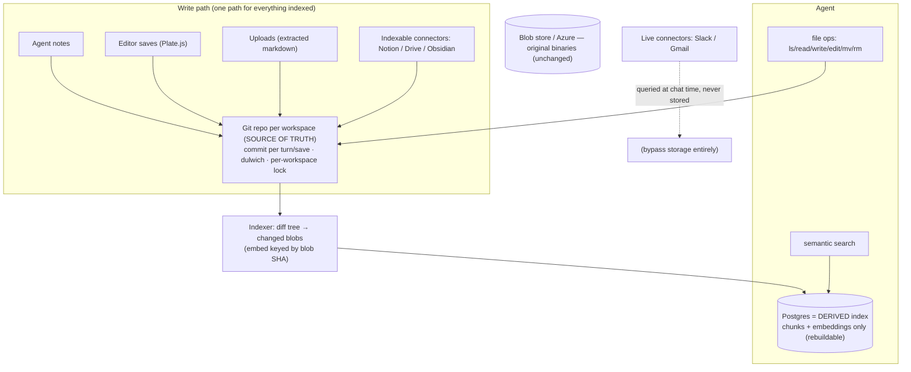
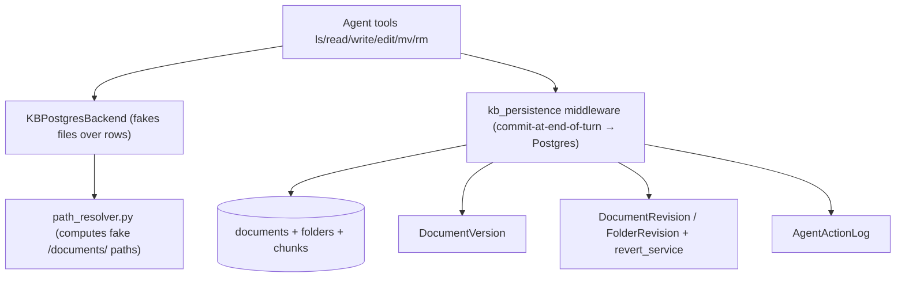

# Git-native Knowledge Base — Umbrella Plan

> Master roadmap for pivoting the Knowledge Base from the custom virtual-filesystem-over-Postgres to **Git as the source of truth**. Each phase becomes its own subplan in this folder (`plans/git-native-kb/`).

This is the high-level roadmap. It is sequenced. Companion diagrams live in [`00b-diagrams.md`](00b-diagrams.md). The design rationale + references live in the ADR: [`docs/adr/0001-git-native-knowledge-base.md`](../../docs/adr/0001-git-native-knowledge-base.md).

> **SCOPE:** BACKEND only (`surfsense_backend`). Frontend (`surfsense_web`), the real-time UI (Zero), and client apps (desktop, Obsidian, browser extension) are touched only where a phase forces it (Phase 6). A dedicated frontend/client umbrella comes LATER, once the backend is working.

> **Origin:** Rohan Verma's meeting proposal to pivot from the custom-built KB "file system" to a Git-based system due to persistent maintenance issues; Thierry Bakera to investigate. This umbrella is the outcome of that investigation.

## Positioning

The KB today has **no real filesystem** — it is a *virtual* `/documents/` namespace faked over Postgres rows, plus three hand-rolled versioning/audit systems. That re-implements — badly — what Git provides natively (tree, atomic commits, history, revert, content-addressed dedup). The pivot makes **Git the single source of truth for all indexed content** and demotes **Postgres to a derived, rebuildable search index (chunks + embeddings only)**. Net effect: large code **deletion**, storage and search **decoupled** (so search can improve independently — Rohan's stated goal), and a real git repo per workspace (unlocking "bring your own remote" later).

## Target architecture (git = truth, Postgres = derived index)

Current (to-be-replaced) architecture — virtual FS over Postgres

