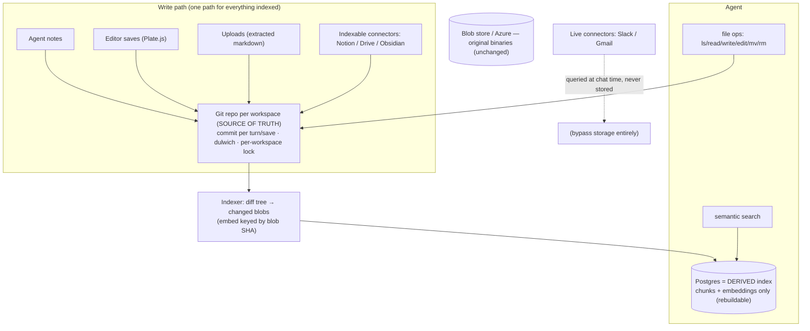
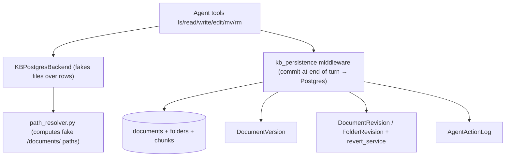

# Git-native Knowledge Base — Umbrella Plan

> Master roadmap for pivoting the Knowledge Base from the custom virtual-filesystem-over-Postgres to **Git as the source of truth**. Each phase becomes its own subplan in this folder (`plans/git-native-kb/`).

This is the high-level roadmap. It is sequenced. Companion diagrams live in [`00b-diagrams.md`](00b-diagrams.md). The design rationale + references live in the ADR: [`docs/adr/0001-git-native-knowledge-base.md`](../../docs/adr/0001-git-native-knowledge-base.md).

> **SCOPE:** BACKEND only (`surfsense_backend`). Frontend (`surfsense_web`), the real-time UI (Zero), and client apps (desktop, Obsidian, browser extension) are touched only where a phase forces it (Phase 6). A dedicated frontend/client umbrella comes LATER, once the backend is working.

> **Origin:** Rohan Verma's meeting proposal to pivot from the custom-built KB "file system" to a Git-based system due to persistent maintenance issues; Thierry Bakera to investigate. This umbrella is the outcome of that investigation.

## Positioning

The KB today has **no real filesystem** — it is a *virtual* `/documents/` namespace faked over Postgres rows, plus three hand-rolled versioning/audit systems. That re-implements — badly — what Git provides natively (tree, atomic commits, history, revert, content-addressed dedup). The pivot makes **Git the single source of truth for all indexed content** and demotes **Postgres to a derived, rebuildable search index (chunks + embeddings only)**. Net effect: large code **deletion**, storage and search **decoupled** (so search can improve independently — Rohan's stated goal), and a real git repo per workspace (unlocking "bring your own remote" later).

## Target architecture (git = truth, Postgres = derived index)

Current (to-be-replaced) architecture — virtual FS over Postgres

## Decisions locked

- **Git = single source of truth** for all *indexed* KB content (agent/editor notes, uploads, indexable connectors — the `is_indexable` ones).
- **Postgres = derived index only** (chunks + embeddings). It is a **cache**: wipe-and-rebuild from Git via one `reindex(workspace)`. Never authoritative.
- **One-way derivation** (Git → Postgres). **Never** two-way sync (this is the Wiki.js anti-pattern we explicitly reject).
- **Live connectors (Slack/Gmail) are untouched** — never stored/indexed, queried at chat time; entirely out of scope.
- **Binary blobs stay in the existing blob store** (local/Azure). Git holds extracted markdown, not raw binaries (Git-LFS deferred).
- **Agent tool interface is unchanged** (`ls/read/write/edit/mv/rm`). Only the backend behind the tools changes (Postgres-fake → real git working tree).
- **History/undo = git log + `git revert`.** The three hand-rolled systems (`DocumentVersion`, `DocumentRevision`/`FolderRevision`+`revert_service`) are **deleted**.
- **Engine = dulwich** (pure Python, deploy-friendly in Docker, real wire protocol for future remotes). Shell out to `git` only for heavy maintenance (`gc`/repack).
- **Per-workspace write lock** is mandatory (git is single-writer) — a data-integrity boundary, not a feature.
- **Rollout behind a feature flag**, per-workspace; no big-bang cutover.

## References we are borrowing from (not inventing)

Every decision traces to a proven source (full list + links in the ADR):

| Decision | Borrowed from |
|---|---|
| Git = truth, Postgres = rebuildable cache | **Fossil SCM** (`fossil rebuild`, production since 2007) |
| Content in git, metadata/index in a DB | **Gollum** (GitHub/GitLab wikis), **kherad** |
| Silent commit-per-save, hide git from users | **kherad** |
| Embeddings keyed by blob SHA, incremental | **Coregit** + vector-index-as-cache best practices (LangChain RecordManager / LlamaIndex docstore) |
| Python git engine | **dulwich** |
| "Don't put a firehose in git" | "Git is not a database" critiques (validates keeping live connectors out) |
| Reject two-way DB↔git sync | **Wiki.js** counter-example (requarks/wiki #7860 silent-sync bug) |

