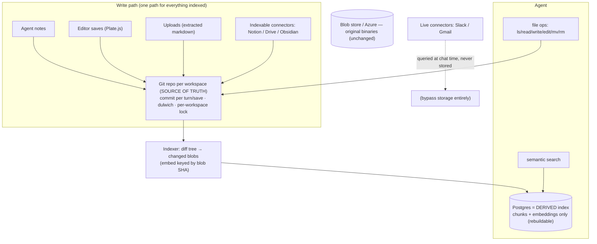
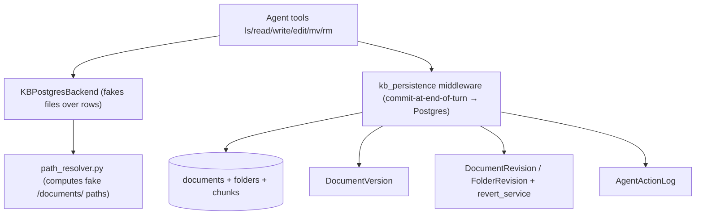
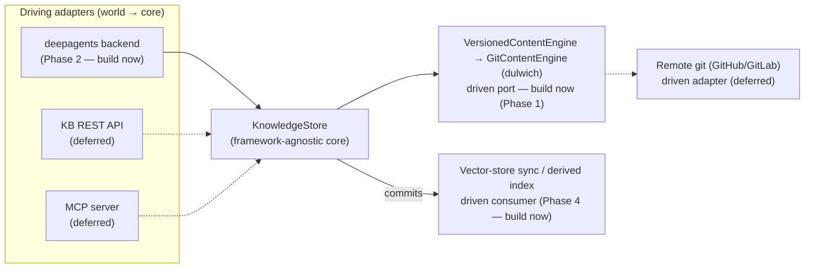

# Git-native Knowledge Base — Umbrella Plan

> Master roadmap for pivoting the Knowledge Base from the custom virtual-filesystem-over-Postgres to **Git as the source of truth**. Each phase becomes its own subplan in this folder (`plans/git-native-kb/`).

This is the high-level roadmap. It is sequenced. Companion diagrams live in [`00b-diagrams.md`](00b-diagrams.md). The design rationale + references live in the ADR: [`docs/adr/0001-git-native-knowledge-base.md`](../../docs/adr/0001-git-native-knowledge-base.md).

> **SCOPE:** BACKEND only (`surfsense_backend`). Frontend (`surfsense_web`), the real-time UI (Zero), and client apps (desktop, Obsidian, browser extension) are touched only where a phase forces it (Phase 6). A dedicated frontend/client umbrella comes LATER, once the backend is working.

> **Origin:** Rohan Verma's meeting proposal to pivot from the custom-built KB "file system" to a Git-based system due to persistent maintenance issues; Thierry Bakera to investigate. This umbrella is the outcome of that investigation.

## Positioning

The KB today has **no real filesystem** — it is a *virtual* `/documents/` namespace faked over Postgres rows, plus three hand-rolled versioning/audit systems. That re-implements — badly — what Git provides natively (tree, atomic commits, history, revert, content-addressed dedup). The pivot makes **Git the single source of truth for all indexed content** and demotes **Postgres to a derived, rebuildable search index (chunks + embeddings only)**. Net effect: large code **deletion**, storage and search **decoupled** (so search can improve independently — Rohan's stated goal), and a real git repo per workspace (unlocking "bring your own remote" later).

## Target architecture (git = truth, Postgres = derived index)

Current (to-be-replaced) architecture — virtual FS over Postgres

## Decisions locked

- **Git = single source of truth** for all *indexed* KB content (agent/editor notes, uploads, indexable connectors — the `is_indexable` ones).
- **Postgres = derived index only** (chunks + embeddings). It is a **cache**: rebuildable from Git via one `index_tree(workspace)`. Never authoritative. (As shipped, a rebuild upserts and prunes rather than wiping — document ids are in the Zero publication and must survive it; only chunk rows are replaced.)
- **One-way derivation** (Git → Postgres). **Never** two-way sync (this is the Wiki.js anti-pattern we explicitly reject).
- **Live connectors (Slack/Gmail) are untouched** — never stored/indexed, queried at chat time; entirely out of scope.
- **Binary blobs stay in the existing blob store** (local/Azure). Git holds extracted markdown, not raw binaries (Git-LFS deferred).
- **Agent tool interface is unchanged** (`ls/read/write/edit/mv/rm`). Only the backend behind the tools changes (Postgres-fake → real git working tree).
- **History/undo = git log + `git revert`.** The three hand-rolled systems (`DocumentVersion`, `DocumentRevision`/`FolderRevision`+`revert_service`) are **deleted**.
- **Engine = dulwich** (pure Python, deploy-friendly in Docker, real wire protocol for future remotes). Shell out to `git` only for heavy maintenance (`gc`/repack).
- **Per-workspace write lock** is mandatory (git is single-writer) — a data-integrity boundary, not a feature.
- **Rollout behind a feature flag**, per-workspace; no big-bang cutover.
- **Ports & Adapters shape** ([ADR 0002](../../docs/adr/0002-knowledge-core-ports-and-adapters.md)): the KB is a framework-agnostic **core** (`KnowledgeStore`); deepagents is one **adapter**, not the core. See "Architecture shape" below.

## Architecture shape — Ports & Adapters (core + adapters)

The KB is a **framework-agnostic core** (`KnowledgeStore`) surrounded by adapters. deepagents is **one driving adapter**, not the core — because the same knowledge already has several consumers (chat agent, a KB REST API, the vector-store sync, later MCP / remote git). Coupling the core to deepagents would force every other consumer through an agent framework. Rationale + sources (Cockburn Hexagonal, git plumbing/porcelain, libgit2): [ADR 0002](../../docs/adr/0002-knowledge-core-ports-and-adapters.md).

| Role | Consumer | v1? |
|---|---|---|
| Driving adapter | deepagents agent backend | ✅ build now (Phase 2) |
| Driving adapter | KB REST API (Rohan's artifact API) | deferred — next adapter after the core |
| Driving adapter | MCP server | deferred |
| Driven port (infra) | storage engine (dulwich via `VersionedContentEngine`) | ✅ built (Phase 1) |
| Driven consumer | vector-store sync / derived index | ✅ build now (Phase 4) |
| Driven adapter | remote git (GitHub/GitLab) | deferred |

**YAGNI:** build only the **core + deepagents adapter + vector-store-sync consumer**. Shape the ports so REST/MCP/remote-git slot in later, but **do not build them now**. Grow the port surface on demand — capabilities (`ls`/`grep`/`glob`, version/diff verbs) live once in the core, and each adapter takes the subset it needs; no speculative methods, no per-consumer reimplementation.

## References we are borrowing from (not inventing)

Every decision traces to a proven source (full list + links in the ADR):

| Decision | Borrowed from |
|---|---|
| Git = truth, Postgres = rebuildable cache | **Fossil SCM** (`fossil rebuild`, production since 2007) |
| Content in git, metadata/index in a DB | **Gollum** (GitHub/GitLab wikis), **kherad** |
| Silent commit-per-save, hide git from users | **kherad** |
| Embeddings keyed by blob SHA, incremental | **Coregit** + vector-index-as-cache best practices (LangChain RecordManager / LlamaIndex docstore) |
| Python git engine | **dulwich** |
| "Don't put a firehose in git" | "Git is not a database" critiques (validates keeping live connectors out) |
| Reject two-way DB↔git sync | **Wiki.js** counter-example (requarks/wiki #7860 silent-sync bug) |

## Backend phases (active — this umbrella)

### Phase 0 — Shared contract [`subplan: 00c-shared-contract.md`]

> **READ FIRST.** Pins the five cross-phase contracts (repo/tree layout, read contract + citation model, lock, write path, index/Zero realities) grounded in the current code. Resolves what were per-phase "open questions". Two contracts were revised on 2026-07-28 after the adapter brainstorm: reads are **raw from the per-turn worktree** with one line-anchored citation pattern (C2), and in-turn writes live in a **per-turn worktree**, not the state overlay (C6).

### Phase 1 — Knowledge store core [`subplan: 01-git-storage-core.md`] ✅ implemented

> **DONE. Built first** — every later phase uses it.

- Added **dulwich**; a `KnowledgeStore` facade that opens/creates a **persistent working tree per workspace** on disk, nested under the shared blob-store volume (`{FILE_STORAGE_LOCAL_PATH}/knowledge_store/{workspace_id}`). Git lives behind the facade (`engines/git.py`).
- API (SQL-transaction vocabulary, no git words; capabilities are verbs): `transaction(message, author)` scope yielding a `Transaction` with `write`/`remove`/`move` that records one atomic revision on clean exit; `read_as_of`, `list_revisions`, `list_changes`, `list_paths`, `get_current_revision`, `compute_content_id`. First use bootstraps the store — no init ceremony. Snapshot/batch is an engine detail. (Structure primitives, if any prove needed → Phase 2; undo/forward-restore → Phase 4.)
- **Per-workspace Redis write lock** around commits (single-writer safety across all OS processes). `ponytail:` lock ceiling = one lock per commit; upgrade path = queue/worker.
- Key files (new): `surfsense_backend/app/knowledge_store/` (`store`, `transaction`, `write_lock`, `store_path`, `settings`, `engines/{base,git}`). No agent wiring yet.
- Tests — unit (`tests/unit/knowledge_store/`): engine behavior on temp repos, pure `Transaction` logic; integration (`tests/integration/knowledge_store/`, real Redis): write-lock semantics and the facade `transaction` end to end.

### Phase 2 — deepagents adapter over the core [`subplan: 02-git-working-tree-backend.md`]

> **SHIPPED (file-op path, 2026-07-28).** The **first driving adapter** ([ADR 0002](../../docs/adr/0002-knowledge-core-ports-and-adapters.md)) — deepagents talking to the core over the real git working tree, replacing the read-side fake. Remaining in-phase: the C2 `read_file` citation envelope (raw reads are line-numbered trivially; the normalizer's `:Lx-Ly` support, including the fail-closed strip for un-numbered entries, lands with it).

- `GitTreeBackend` serves `/documents/...` from the turn's **private working copy** (lazy open on the first KB tool call; copy id = `thread-{thread_id}`), implemented as one `MultiRootLocalFolderBackend` mount — no staging, no state overlay.
- Working-copy lifecycle (`open`/`diff`/`discard`/`prune`) lives in the core behind the port; wired into `resolver.py` behind `KNOWLEDGE_STORE_ENABLED`; mutation tools route down the direct-op branches.
- `path_resolver` + `KBPostgresBackend` retire for flagged workspaces (deleted at the Phase 5 cut).
- Tests: lifecycle on temp repos, adapter behavior on real files, resolver gating.

### Phase 3 — Commit-per-turn write path [`subplan: 03-commit-write-path.md`]

> **SHIPPED (2026-07-29).** See the subplan's work items for the small as-built deviations.

- Persistence middleware `knowledge_store_persistence/` alongside `kb_persistence` (untouched until Phase 5 cut): end of turn → diff the working copy → one `transaction` → receipts → discard. Free-function commit body; the disconnect fallback in `event_loop.py` runs the identical routine (no state markers — the copy on disk is the pending state).
- Model-generated commit subjects with deterministic fallback (`Thread:` trailer); the model seam is wired with the agent LLM until a weak-model role exists. Honest attribution: author = user, committer = agent (`knowledge_store/identities.py`).
- Receipts created post-commit from `list_changes(revision)`, revision id as `external_id`; commit failure returns `failed` receipts and keeps the copy for next-turn recovery. Zero events move with Phase 4/6.
- Editor saves route through `document_revision_recorder`; uploads and all connector indexers record at the `prepare_for_indexing` choke point, one revision per sync batch. Daily Celery beat janitor prunes abandoned copies.
- Tests shipped: commit-turn scenarios against real git + Redis (net changes, no-op turns, contention recovery), message fallback, builder gating, recorder, janitor TTL.

### Phase 4 — Derived index + reindex [`subplan: 04-derived-index.md`]

> **SHIPPED (2026-07-30).** This is the **vector-store-sync driven consumer** ([ADR 0002](../../docs/adr/0002-knowledge-core-ports-and-adapters.md)): it subscribes to revisions one-way; the core has no knowledge of it. As-built record (with **Built as** deviation notes) in the subplan.

- `app/knowledge_store/index/converge.py`: one convergence body behind `index_changes` (paths moved since the stamp, fast queue) and `index_tree` (whole tree, upsert + prune, connectors queue), both converging to the store's current revision under a dedicated index lock; `workspaces.last_indexed_revision` is the stamp. Rows are adopted by ownership marker → NOTE hash → path; prune is keyed on the marker so connector rows are never touched.
- Chunk line spans (`start_line`/`end_line`, migration 176) derived at the cache boundary by `attach_line_spans` — cached embeddings stay valid, no chunker-version bump, reconciler updates spans on moves (C2's consumer).
- Writers enqueue indexing post-commit (`enqueue_index`), and an hourly capped sweep re-drives flipped workspaces whose stamp trails HEAD.
- The three hand-rolled versioning systems are dead code for flagged workspaces (restore returns 409, editor reindex defers to the indexer); their **deletion (code + table drops) is Phase 5 cut time**.

### Phase 5 — Migration [`subplan: 05-migration.md`]

> **TOOLING SHIPPED (2026-07-30); fleet flips pending.** Seeder (`knowledge_store/migrate.py`), fleet runner (`scripts/migrate_knowledge_store.py`, seed → verify byte parity → flip only on pass), per-workspace flag (`workspaces.knowledge_store_enabled`, migration 175), daily drift monitor. No production workspace flipped yet; the cut-time deletion sweep (versioning code + table drops) runs after the fleet is verified.

- Export each existing workspace's Postgres documents/folders → an initial git repo (one seed commit), preserving `unique_identifier_hash` mapping.
- **Adopt, don't rebuild** (amended 2026-07-29): parity = per-document **byte identity** vs Postgres, not `reindex()` — the seed copies bytes out of Postgres, so existing chunks/vectors already are its derived index; a full reindex is the 21-day-class job for zero information. The seed revision is the indexer's starting point, never incrementally indexed (else "every file added" = workspace-wide re-embed storm).
- Rollback = keep Postgres content until the flagged workspace is verified; `reindex()` demoted to disaster recovery + a one-time pilot spot check.

### Phase 6 — Zero / real-time projection [`subplan: 06-zero-projection.md`]

> **SHIPPED (2026-07-31).** The one net-new integration cost. Depends on 03/04. The subplan records the one place the build reversed the plan.

- The web UI is driven by Zero (Postgres logical replication, `zero_publication.py`). Git is not a real-time source, so a **git → Postgres projection** keeps the Zero-published `documents`/`folders` rows in sync after each commit (thin metadata rows, not content-authoritative).
- Owner decided **against** the planned default: the projection runs at **commit time** (`index/project.py`), not inside the Phase-4 indexer. Folding it in had made UI freshness wait on chunking and embedding, because the row — the only thing the UI needs — was written in the same transaction as the vectors. Row work is milliseconds and now runs inline; chunk/vector work stays async. Shared identity logic lives in `index/rows.py` so the two writers cannot disagree.
- The commit path then dispatches `document_created/updated/deleted` with the real row ids, restoring the optimistic sidebar overlay the legacy path had.
- Tests: projection upsert/rename/delete, stamp untouched, a following index adopts the same row, lock contention stands aside, and the turn announces its rows.
- Known gap (documented, out of phase): an emptied `folders` row is never pruned and `folder_deleted` never fires — folders are implicit in git, so no diff announces one emptying. **Closed by Phase 8's folder law** ([`08-store-facade-and-paths.md`](08-store-facade-and-paths.md)): facade folder verbs + a `.keep` keep-file make folders first-class, so projection can prune an implied folder and persist an explicit empty one.

### Phase 7 — Direct-caller adapter [`subplan: 07-direct-caller-adapter.md`]

> **IN PROGRESS (2026-07-31).** Not planned as a phase; forced by the canary. Blocks the Phase 5 flip.

- The agent reaches git through the Phase-3 commit path, and the editor and the four ingestion flows reach it through `services/document_revision_recorder.py`. **About twenty other writers do not** — every delete, every move and rename, and the creates that skip `prepare_for_indexing`. A delete leaves its file behind, so the next rebuild resurrects the document and the drift check then reports `ok`.
- Fixed at the adapter, not at the twenty call sites: the recorder grows `remove` and `move` verbs and the callers hand it documents, never paths. Twenty handlers each remembering is how six got wired and twenty did not.
- A move records as `tx.move` so Phase 4's rename detection keeps the document id; deletes and moves record *before* the Postgres commit, because the path is read from the row that is about to disappear.
- The two Core-level bulk deletes (connector, workspace) bypass the ORM entirely and are wired by hand — which is also why a session-event chokepoint was rejected.

### Phase 8 — Store facade & path law [`subplan: 08-store-facade-and-paths.md`]

> **DESIGN (2026-07-31).** Facade reshaped (`knowledge_store/service.py`); this phase locks the path law and heals it per-workspace through the seed. Prerequisite of the Phase-5 fleet flip.

- One law for naming, layout, and resolution, obeyed identically on the git tree (truth) and the Postgres rows (UI). **Id is identity; the path is an authored-once label** — the Notion/Dendron model, chosen over Obsidian's path-as-identity after surveying both (references are already id-keyed; git can't durably track renames).
- Postgres gets git's structural guarantee: the path moves off the un-indexed `document_metadata` marker onto a `documents.path` column with a **partial unique index on `(workspace_id, path)`**, healed lazily and finished by the seed. `unique_identifier_hash` demotes to a fallback, which is what makes `.md` safe (retires C1's `.xml` rule).
- The **migration seed is the debt-fix vehicle**: it re-authors every path canonically in one deterministic pass (`.xml`→`.md`, id-suffix collisions → ` (2)` by `created_at` then `id`), so a workspace crosses the flip already healed. Path logic lives in one submodule (`knowledge_store/paths/`); an import-boundary test keeps it there.

## Sequencing (critical path vs. parallel)

- **Phase 0 first:** `00c` is a design agreement (no code) — sign off on the five contracts before starting `01`.
- **Critical path:** `01 → 02 → 03` (storage → backend → write path). These deliver the core swap.
- **Parallelizable:** `04` (indexer/reindex) can develop alongside `03`; both only need `01`'s `commit`/`log`.
- **After core:** `05` (migration) then `06` (Zero projection). `06` is the only genuinely *new* subsystem (partly offsets the deletions) and must land before flagging a workspace whose UI must stay live.
- Recommended: `01 → 02 → 03` (+`04` in parallel) → `06` → `05` → flip flag per workspace.

## Deferred — out of this umbrella

- **Connect-your-own-remote** (push/pull to user GitHub/GitLab/Gitea). Free later because the repo is real git.
- **CRDT / Yjs real-time collaboration** (multi-writer). Keep single-writer for now.
- **Review / merge workflows** (kherad's reviewer layer).
- **Karpathy `raw/` + `wiki/` content model, contradiction-flagging, lint.**
- **Graphiti / bi-temporal fact graph** (agent memory time-travel).
- **Git-LFS for binaries** (blob store stays).
- **Frontend/client umbrella** (version-history UI removal, any UX changes).
- **KB REST/HTTP read side** (ADR 0002, named-but-deferred): serving document content from
  git over HTTP. Rows still answer reads. The *write* half stopped being deferrable — see
  Phase 7.

## Open items — resolved in Phase 0 ([`00c-shared-contract.md`](00c-shared-contract.md))

1. ~~Repo location & layout~~ → **persistent working tree at `{FILE_STORAGE_LOCAL_PATH}/knowledge_store/{workspace_id}`, layout = the full virtual path (`documents/...`), as shipped by the Phase-3 recorder and matched by the Phase-5 seeder** (C1).
2. ~~Zero projection owner~~ → ~~folded into the Phase-4 post-commit indexer~~ (C5) → **reversed at build time (2026-07-31): the projection runs at commit, the indexer keeps converging the same rows.** Folding it in coupled UI freshness to embedding latency; see [`06-zero-projection.md`](06-zero-projection.md).
3. **Binaries** — keep blob store (confirmed markdown/text-only in git); Git-LFS deferred.
4. ~~Lock granularity~~ → **Redis lock, from v1** (deploy is multi-process: uvicorn + Celery) (C3).
5. ~~`content_hash` vs blob SHA~~ → **different values (content_hash is workspace-salted); key reuse by blob SHA, keep content_hash through migration** (C5).
6. **Migration cutover** — per-workspace flag flip after parity check; rollback = keep Postgres content until verified (Phase 5).

Still genuinely open (non-blocking): commit-message format, `gc`/repack scheduling, `reindex` observability.

## Resolved decisions log

- **(2026-07-24) PIVOT ADOPTED — Git as source of truth, Postgres as derived index.** Outcome of the KB maintenance investigation (ADR 0001). Git owns all *indexed* content; Postgres holds only chunks+embeddings and is rebuildable via `reindex()`. One-way derivation only (git→Postgres); two-way sync explicitly rejected (Wiki.js #7860). Live connectors (Slack/Gmail) unchanged and out of scope. Agent tool interface unchanged; only the backend behind it swaps. Three hand-rolled versioning systems to be deleted in favor of git history/`revert`. Engine = dulwich. Rollout behind a per-workspace feature flag.
- **(2026-07-24) Connectors clarified — only `is_indexable` content enters git.** Document connectors (Notion, Drive, Obsidian) are indexed → they go into git. Live connectors (Slack, Gmail) are queried at chat time and never stored → they never touch git or Postgres chunks. (Corrects an earlier draft that carved *all* connectors out of git.)
- **(2026-07-24) Borrowing, not inventing.** Architecture assembled from proven references (Fossil, Gollum, kherad, Coregit, dulwich, vector-cache best-practices); the only SurfSense-specific work is the adaptation glue. Wiki.js retained as the explicit counter-example.
- **(2026-07-28) Ports & Adapters — deepagents is an adapter, not the core** ([ADR 0002](../../docs/adr/0002-knowledge-core-ports-and-adapters.md)). The KB is a framework-agnostic core (`KnowledgeStore`); consumers (deepagents, the KB REST API, the vector-store sync, later MCP/remote-git) are adapters at the edge. **YAGNI:** v1 builds only the core + the deepagents adapter (Phase 2) + the vector-store-sync consumer (Phase 4); REST/MCP/remote-git are named-but-deferred. Ports grow on demand. Borrowed from Cockburn (Hexagonal), git plumbing/porcelain, libgit2.
- **(2026-08-06) Generated artifacts are store citizens, and forward-only.** The artifacts overhaul ([`plans/artifacts/artifacts-overhaul.md`](../artifacts/artifacts-overhaul.md) §4.4) puts each artifact's markdown representation in the store via the turn's working copy (binaries stay in the blob store — the same split as uploads) with destructive replace-on-revise and no version history. No store or indexer changes needed; the constraint this umbrella inherits is on **future verbs**: the revert verb excludes `generated: true` documents' paths from its inverse diff, and any version-history UI excludes generated documents — an old entry for one is a description whose deliverable no longer exists.

## Subplan index (backend)

| Phase | Subplan file | Status |
|-------|--------------|--------|
| 0 | `00c-shared-contract.md` | LOCKED — read first |
| 1 | `01-git-storage-core.md` (core) | ✅ SHIPPED |
| 2 | `02-git-working-tree-backend.md` (deepagents adapter) | ✅ SHIPPED (2026-07-28) — C2 `read_file` citation envelope still open |
| 3 | `03-commit-write-path.md` | ✅ SHIPPED (2026-07-29) |
| 4 | `04-derived-index.md` | ✅ SHIPPED (2026-07-30) |
| 5 | `05-migration.md` | TOOLING SHIPPED (2026-07-30) — fleet flips + cut-time deletion pending |
| 5a | `05a-seed-runbook.md` | operational runbook for the production seed + flip |
| 6 | `06-zero-projection.md` | ✅ SHIPPED (2026-07-31) — projection split out of the indexer, not folded in |
| 7 | `07-direct-caller-adapter.md` | IN PROGRESS (2026-07-31) — blocks the Phase 5 flip |
| 8 | `08-store-facade-and-paths.md` | DESIGN (2026-07-31) — path law + per-workspace heal via the seed; prerequisite of the fleet flip |
| — | `00b-diagrams.md` | companion flow diagrams |

Frontend & client subplans will be added under a separate umbrella later (see "Deferred").

## Appendix — current implementation file index (what each phase touches)

| Topic | Path |
|---|---|
| Virtual path resolver (retire) | `surfsense_backend/app/agents/chat/runtime/path_resolver.py` |
| Virtual FS read backend (replace) | `.../filesystem/backends/kb_postgres.py` |
| Backend resolver (rewire) | `.../filesystem/backends/resolver.py` |
| Write commit middleware (repoint) | `.../main_agent/middleware/kb_persistence/middleware.py` |
| Hybrid search (unchanged) | `.../shared/retrieval/hybrid_search.py` |
| Chunk reconciliation (key by blob SHA) | `surfsense_backend/app/indexing_pipeline/chunk_reconciler.py` |
| Indexing pipeline | `surfsense_backend/app/indexing_pipeline/indexing_pipeline_service.py` |
| User version history (delete) | `surfsense_backend/app/utils/document_versioning.py` |
| Agent revert (delete) | `surfsense_backend/app/services/revert_service.py` |
| Zero publication (project into) | `surfsense_backend/app/zero_publication.py` |
| ORM models | `surfsense_backend/app/db.py` |
