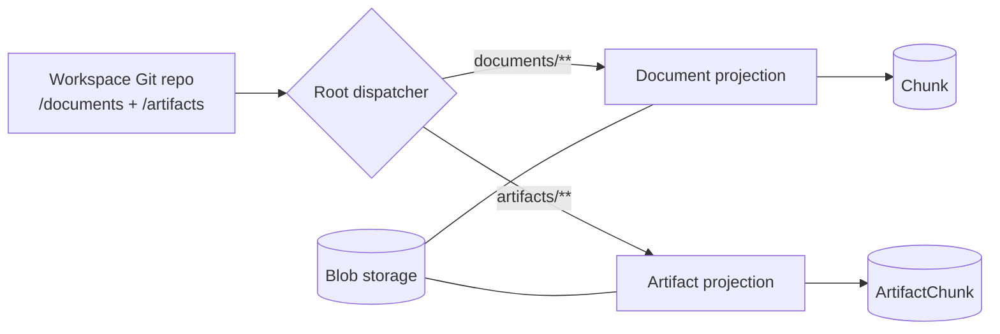
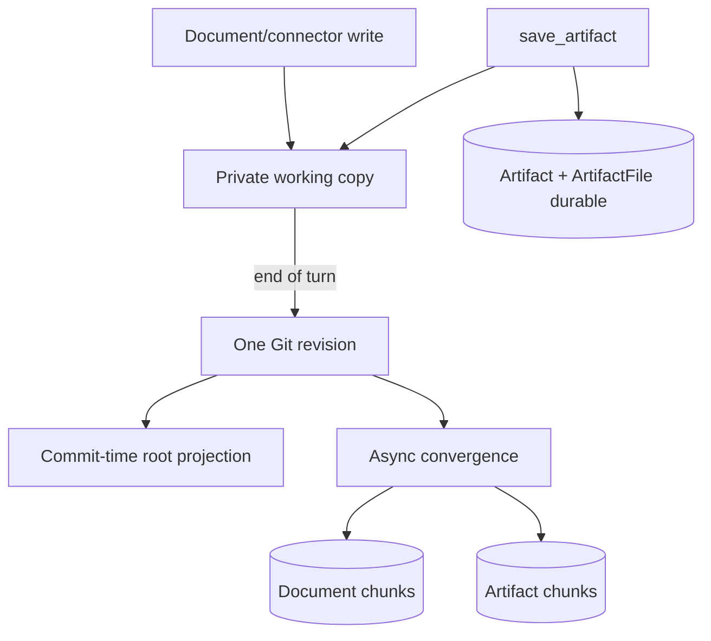
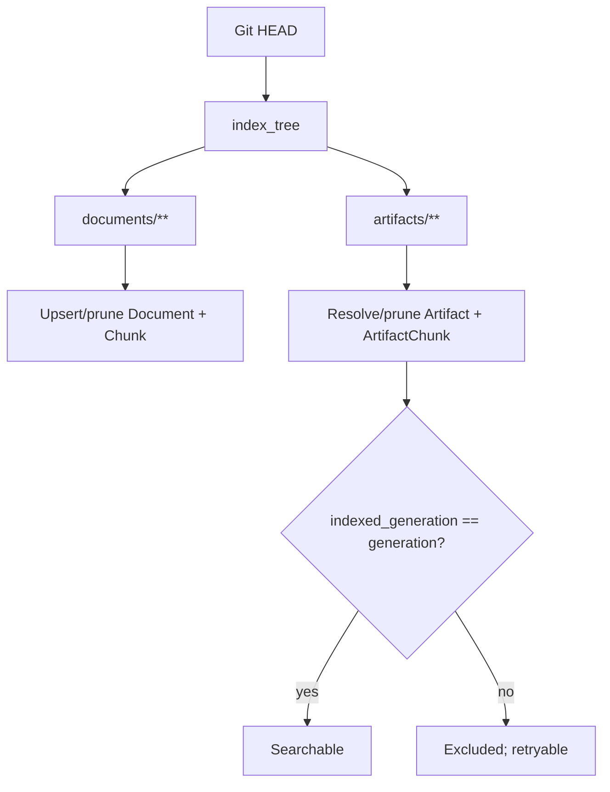
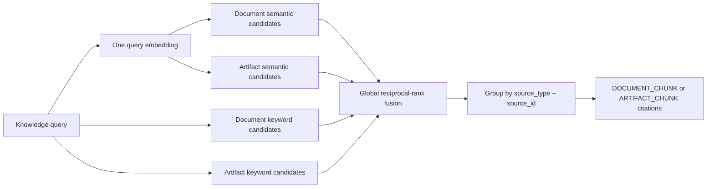

# Git-native KB — Current Flow Diagrams

> Visual companion to [`00-umbrella-plan.md`](00-umbrella-plan.md).

## 1. Shared Git revisions, separate domains



Git stores committed searchable text. Postgres owns domain identity/metadata and blob references. Artifact and document rows are never converted or adopted across roots.

## 2. Write timing



Artifact metadata and bytes are durable before the tool succeeds on Git-backed workspaces. Git commit and search convergence may occur later, and convergence failure does not roll back the artifact. Non-git workspaces index in the save transaction.

## 3. Full-tree convergence



The rebuild upserts/prunes; it does not wipe UI-visible identities. Folder reconciliation is document-only. Artifact removal purges artifact blobs and cascades artifact chunks.

## 4. Search



Artifact candidates compete globally with documents. Namespaced citation kinds prevent collisions between independent chunk ID sequences.

## 5. Revision and deletion

```mermaid
sequenceDiagram
  participant Agent
  participant API as Artifact service
  participant DB as Artifact tables
  participant Git
  participant Blob

  Agent->>API: revise(artifact_id, expected_generation)
  API->>DB: lock + compare generation
  alt stale
    DB-->>Agent: fail; load source again
  else current
    API->>Blob: stage new role blobs
    API->>DB: replace role rows + increment generation
    API->>Git: update /artifacts representation in working copy
    API-->>Agent: artifact_id + new generation
    API->>Blob: best-effort purge old blobs
  end
```

API deletion removes the Git artifact representation where enabled, deletes the artifact row/chunks/files, then best-effort purges captured blobs. Convergence deletion currently purges best-effort before its row-delete commit; the blob store and database are not atomic. Neither path calls document deletion.

## 6. Document migration

The legacy workspace seed exports documents only. Existing document chunks are adopted by byte parity and incremental indexing starts after the seed revision. Dedicated artifacts are created/indexed by the artifact service and are not migrated or adopted as documents.
