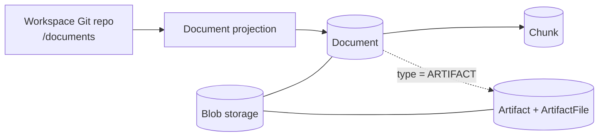
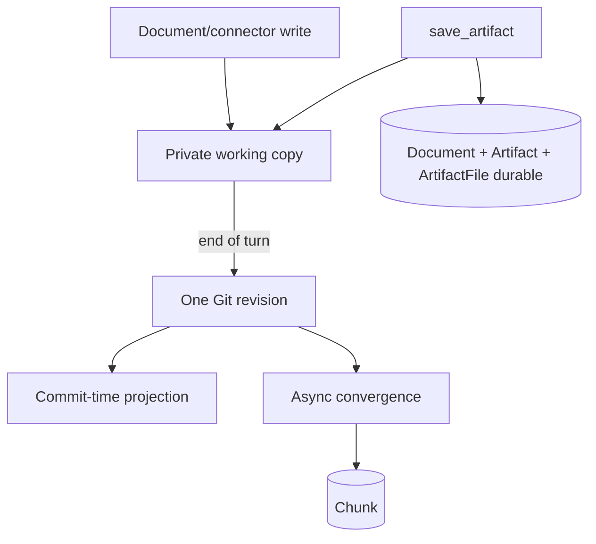
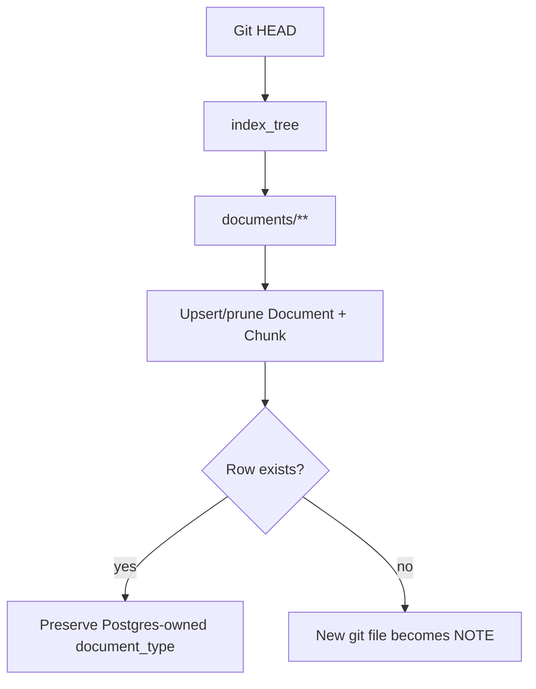
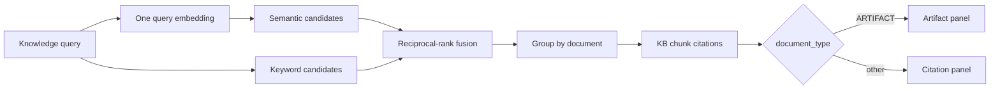

# Git-native KB — Current Flow Diagrams

> Visual companion to [`00-umbrella-plan.md`](00-umbrella-plan.md).

## 1. One tree, one corpus, sidecars in Postgres



Git stores committed searchable text under one root. Postgres owns identity, metadata, and blob references. A generated deliverable is a document of type `ARTIFACT` with an artifact sidecar carrying format, generation, roles, and receipts; `document_type` is the only thing that distinguishes it.

## 2. Write timing



Artifact rows and bytes are durable before the tool succeeds on Git-backed workspaces. Git commit and search convergence may occur later, and convergence failure does not roll back the artifact. Non-git workspaces index through the document pipeline inside the save.

## 3. Full-tree convergence



The rebuild upserts/prunes; it does not wipe UI-visible identities. There is no root dispatch and no artifact branch: an artifact document is scanned, chunked, renamed, and pruned by the same code as every other document. Preserving the existing row's `document_type` is what keeps a saved artifact an artifact across every rebuild.

## 4. Search



One corpus, one embedding, one fusion. Artifacts compete with documents because they are documents, which also makes them type-filterable and `@`-mentionable. Chunk ids need no namespacing because there is one sequence; type routing happens at the panel, after resolution.

## 5. Revision and deletion

```mermaid
sequenceDiagram
  participant Agent
  participant API as Artifact service
  participant DB as Document + Artifact rows
  participant Git
  participant Blob

  Agent->>API: revise(artifact_id, expected_generation)
  API->>DB: lock + compare generation
  alt stale
    DB-->>Agent: fail; load source again
  else current
    API->>Blob: stage new role blobs
    API->>DB: replace role rows, update markdown, increment generation
    API->>Git: update the document file in the working copy
    API-->>Agent: artifact_id + new generation
    API->>Blob: best-effort purge old blobs
  end
```

Deletion is the document deletion path: the row is marked `deleting`, the purge records the Git removal, then chunks, artifact, and file rows cascade and every reachable blob is purged — `DocumentFile` keys for the document and `ArtifactFile` keys through `artifact.document_id`. Marking first drops the deliverable out of search immediately; the blob store and database are not atomic, so a purge failure leaves an unreachable blob and a warning.

## 6. Document migration

The legacy workspace seed exports documents only. Existing document chunks are adopted by byte parity and incremental indexing starts after the seed revision. Artifacts are created by the artifact service with their type already set, so they are never subject to that adoption rule.
