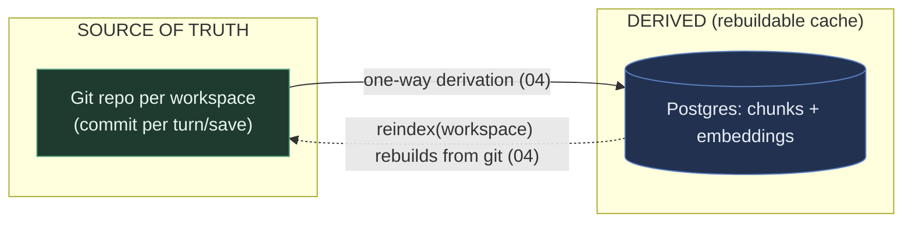
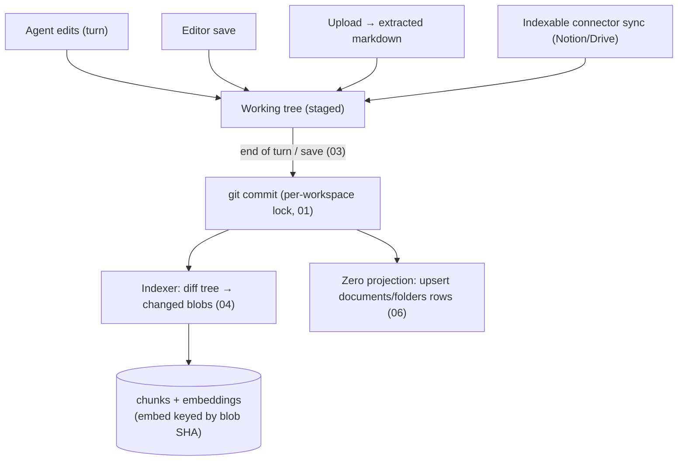
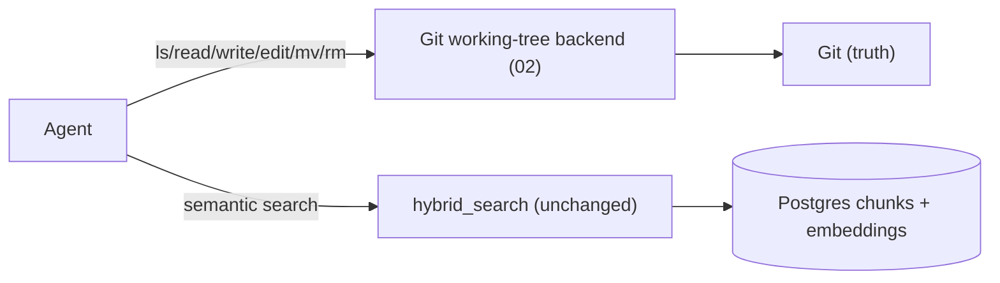
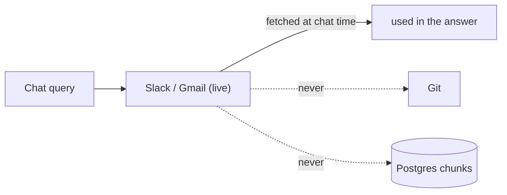
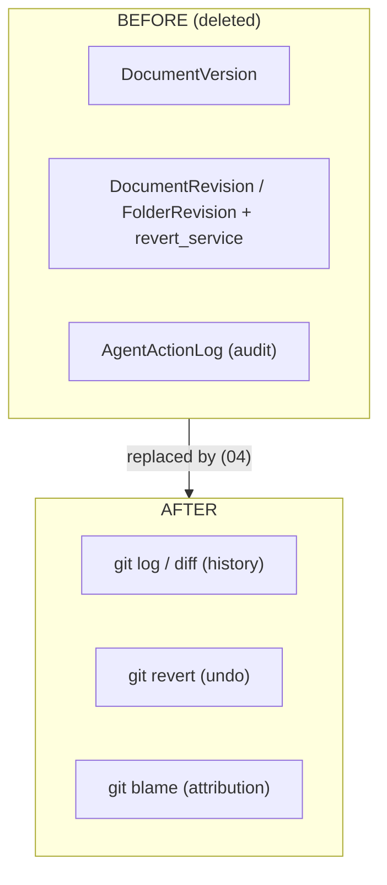
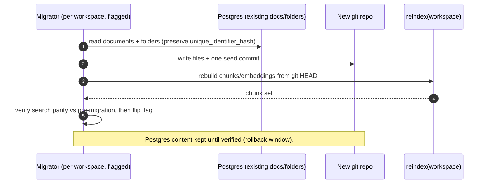
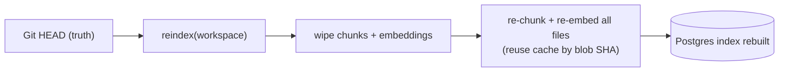

# Git-native KB — flow diagrams (end-to-end)

> Visual companion to [`00-umbrella-plan.md`](00-umbrella-plan.md).
> Phase refs: `01` storage core · `02` working-tree backend · `03` commit write path · `04` derived index · `05` migration · `06` Zero projection.

## 1. The shape — one source of truth, one derived index

There is **no arrow from Postgres back into Git**. Postgres is disposable.

## 2. Write path — everything indexed becomes a commit

## 3. Read path — file ops vs. search hit different stores

## 4. Live connectors — never stored (out of scope)

## 5. History / undo — git replaces the three hand-rolled systems

## 6. Migration (05) — Postgres KB → seed git repo

## 7. Reindex (04) — the safety net (Fossil `rebuild`)

