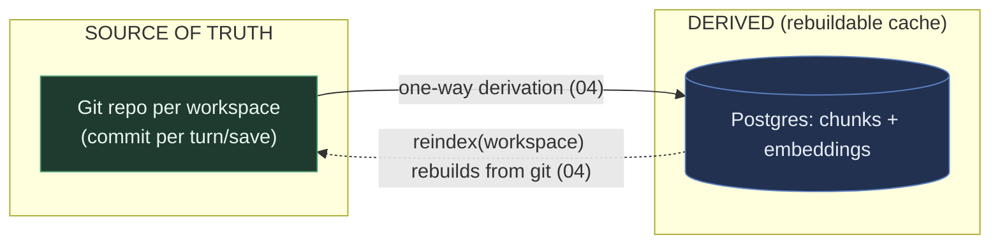
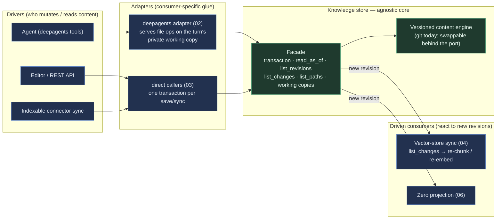
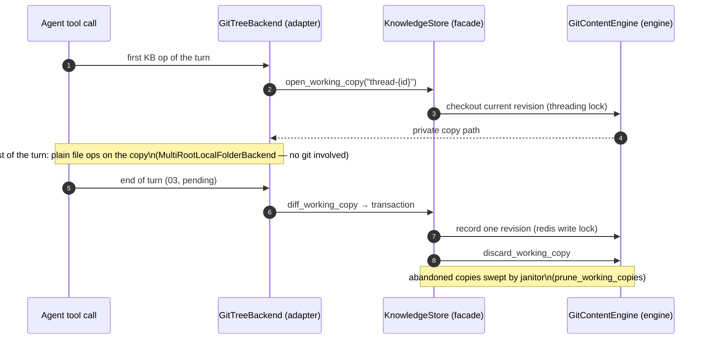
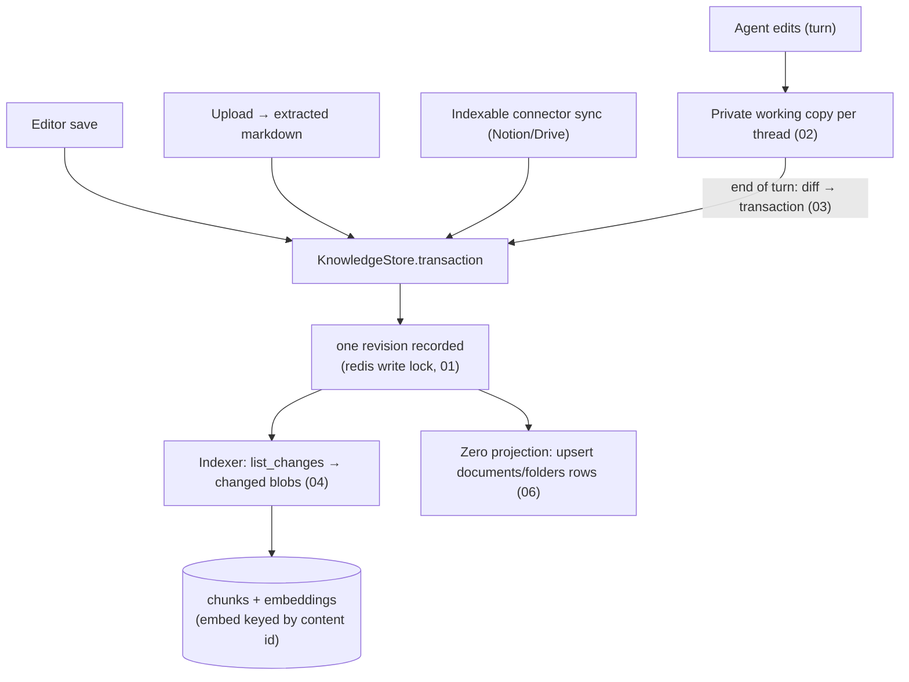
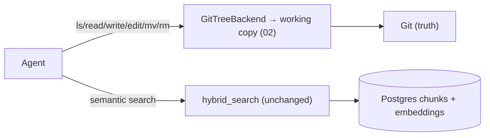
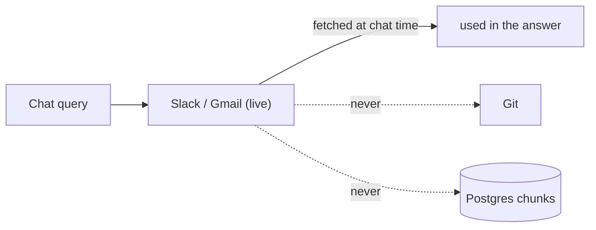
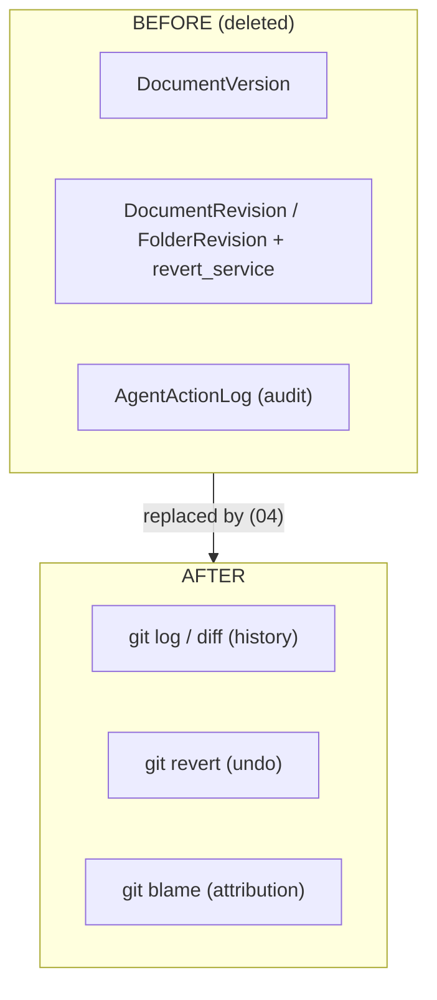
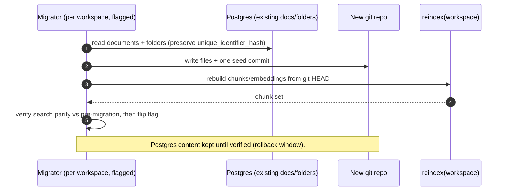
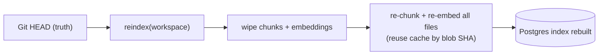

# Git-native KB — flow diagrams (end-to-end)

> Visual companion to [`00-umbrella-plan.md`](00-umbrella-plan.md).
> Phase refs: `01` storage core · `02` working-tree backend · `03` commit write path · `04` derived index · `05` migration · `06` Zero projection.

## 1. The shape — one source of truth, one derived index

There is **no arrow from Postgres back into Git**. Postgres is disposable.

## 2. The system — hexagon: agnostic core, one adapter per consumer

Where each component lives (the code follows the dependency rule: the core
never knows its consumers, so adapters sit with their consumer):

| Component | Location |
| --- | --- |
| Facade, transaction, write lock, layout | `app/knowledge_store/` |
| Engine port + git engine | `app/knowledge_store/engines/` |
| deepagents adapter (`GitTreeBackend`) + resolver | `app/agents/.../middleware/filesystem/backends/` |
| End-of-turn commit middleware (03, pending) | `app/agents/.../middleware/` |

## 3. Turn lifecycle — git at the boundaries, plain files in between

Two locks, two different races:
**threading lock** (process-local, in `GitContentEngine`) serializes parallel tool
calls creating the same copy; **redis lock** (cross-process) serializes revision
recording against other workers.

## 4. Write path — everything indexed becomes a commit

## 5. Read path — file ops vs. search hit different stores

## 6. Live connectors — never stored (out of scope)

## 7. History / undo — git replaces the three hand-rolled systems

## 8. Migration (05) — Postgres KB → seed git repo

## 9. Reindex (04) — the safety net (Fossil `rebuild`)

