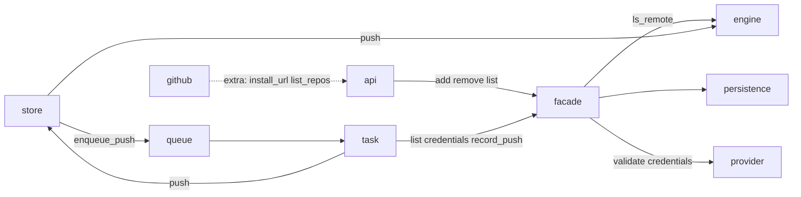

# Phase 12 — Connect-your-own remote (push only)

**Status:** DESIGN. Do not implement until explicit go.
**Umbrella:** [`00-umbrella-plan.md`](00-umbrella-plan.md).
**Narrows** the deferred “connect-your-own-remote (push/pull to user GitHub/GitLab/Gitea)” bullet: **v1 is connect + push.** Pull, merge, force-push, front-matter, and restore-from-clone are out.

## 0. Goal

A git-native workspace can attach **one** GitHub or GitLab repository the user owns. After every durable store revision, SurfSense **pushes HEAD** to that remote. The remote is an export of `documents/**` markdown. Postgres still owns type, identity, and connector metadata.

Not a connector. Not a knowledge source. Not bidirectional.

## 0b. Borrowed from, not invented

Same discipline as ADR 0001: every decision traces to a product that already ships this. SurfSense-only work is the glue (workspace row, Celery next to `enqueue_index`, existing `TokenEncryption`).

| What we do | Borrowed from | Why that source |
|---|---|---|
| The KB **is** a git repo; remote is optional | **Gollum** (GitHub/GitLab wikis). Remotes are not the store; hooks push after commit. | We already are this. Phase 1 picked dulwich *because* the wire protocol makes “bring your own remote” free. |
| After a local commit, push to origin (no merge) | **Gollum `post_commit` hook** → `git push`. Hosted: we cannot `system('git push')` in-request. | Celery `enqueue_push` is our hook. Same event, same semantics, async because uvicorn+workers (C3). |
| First connect = **this product → empty repo/branch** | **GitBook Git Sync** “initial sync direction”: GitBook → GitHub vs GitHub → GitBook. They warn the other direction can wipe the space. Missing branch is **created** on first sync. | We offer only the first direction. Non-empty remote → 409, no history merge. Branch may be absent; first push creates it. |
| Fast-forward only, never `--force` | **git receive-pack** default + GitBook (“allow the app to bypass branch protection” — they still do not force-push). | A diverged GitHub commit is a user edit we do not overwrite. Surface the error; retry later. |
| HTTPS token as password, never in `remote.url` | **Obsidian Git / Git Vault Sync** (PAT in plugin storage, not in `.git/config`). **GitHub App docs**: `x-access-token:TOKEN` for HTTP git. **dulwich#1505**: pass username/password, strip embedded userinfo. | Hosted we store the secret in PG via existing `TokenEncryption` (Linear OAuth already does this). |
| Status: last SHA / last error / manual retry | **Obsidian Git** status bar + **GitBook** sync error panel. | Do not invent a sync state machine. Stamp `last_pushed_revision` / `last_push_error`. |
| One remote per workspace, disconnect does not delete GitHub | **GitBook** unlink / **Obsidian** remove remote. | The user’s repo is theirs. |
| Hide git from the editor; silent commits stay | **kherad** + our Phase 3 commit-per-save. | Remote is a publish step, not a new UX for history. |

**Auth — copy the market split, not one knob for both forges.**

| Forge | What hosted products actually use | PAT? |
|---|---|---|
| **GitHub** | **GitHub App** (Install + Authorize). GitBook, Mintlify, ReadMe Sync, Glean, Dependabot. GitHub docs: Apps over OAuth Apps (fine-grained, 1h installation tokens, repo picker). Classic OAuth App is the old broad-scope cousin. | Local tools only (Obsidian Git, `gh`). |
| **GitLab** | **PAT** (or project/group token). **GitBook GitLab Sync still pastes a PAT** (`api` + `read_repository` + `write_repository`). Glean GitLab: group token. GitLab OAuth access tokens expire in **~2 hours** — a bad fit for a background `git push` worker. | Yes — this *is* the hosted default. |

GitHub = a **GitHub App we register on github.com** (Install on selected repos → store `installation_id` → mint a 1h installation token at push time). Not a GitHub OAuth App. Not our `OAuthConnectorRoute` dressed up as an App. GitLab stays a PAT field, same as GitBook.

`engine.push` is what sends objects. `GitRemote.credentials()` supplies the HTTPS username/password (1h installation token or PAT). The remote does not push.

### Explicitly not copying

| Source | What they do | Why we do not |
|---|---|---|
| **GitBook** (full product) | Bidirectional; GitHub commits import; `SUMMARY.md`; folder mapping; live-edit lock; change-request merge = one GitHub commit | That is a second product (conflict UI, webhooks). Our lock is “SurfSense is the only writer.” |
| **Wiki.js git module** | DB is truth, git is a two-way mirror | ADR 0001. We push **git → git**, never DB ↔ git. |
| **Decap / Tina CMS** | GitHub Contents API *is* the store | Fights local dulwich + Redis lock. We already have a store. |
| **Obsidian Git** (full) | commit → **pull** → push | Pull is the conflict. We skip it on purpose (Gollum-without-the-pull-hook). |
| **Mintlify / docs-as-code** | GitHub is the source, product is a renderer | Opposite direction. |

## 1. Locked decisions

| Decision | Lock |
|---|---|
| Direction | **Push only.** Remote edits are not pulled. |
| Front-matter | **Not this phase.** Lands when PG metadata is retired (PG = chunks + embeddings only). A clone is a readable export, not a restore. |
| Who may connect | Git-native workspaces only (`knowledge_store_enabled` **and** global `KNOWLEDGE_STORE_ENABLED`). Unflipped KBs: 409. |
| How many remotes | **One per workspace.** Disconnect then reconnect to change. |
| Auth (v1) | **GitHub App** (`contents:write`; store `installation_id`; mint in `credentials()`). **GitLab PAT**. Not a GitHub OAuth App. Not `OAuthConnectorRoute`. |
| Hosts (v1) | `github.com` and `gitlab.com` HTTPS clone URLs. Self-hosted / GHE = later (base-URL field). |
| First connect | Remote branch must be **absent or empty** (no commits). Non-empty → 409, do not merge unrelated histories. |
| Push policy | **Fast-forward only.** Never `--force`. Non-fast-forward → record error, leave local HEAD alone, retry on next enqueue. |
| What is pushed | Full local history of the workspace store (honest git). No squash/orphan in v1. |
| Credentials in git | **Never.** Do not write the token into `remote.origin.url`. Pass URL + username/password at push time. |
| Write lock | **Do not hold** the Redis write lock during push. Commits stay atomic; push reads objects. If HEAD moves mid-push, the extra `enqueue_push` catches it. |
| Save latency | Push is **fire-and-forget** (Celery), same shape as `enqueue_index`. A failed/missing push must not fail the editor or agent turn. |
| Coalescing | The worker pushes **current HEAD**, then stamps `last_pushed_revision` to that SHA. Piled-up tasks no-op when stamp already equals HEAD. No extra debounce. |
| Force-push / pull / webhooks / subdirectory mapping / Gitea | Out of v1. |

## 2. Data flow

```
editor / agent / ingest
        │
        ▼
KnowledgeStore.record  (Redis write lock, local dulwich)
        │  revision durable
        ├──────────► enqueue_index   (existing)
        └──────────► enqueue_push    (this phase; no-op if no remote)
                          │
                          ▼
              Celery: if no remote or last_pushed == HEAD → return
                      else remote.credentials() → engine.push
                      remote.mark_pushed / mark_failed
```

## 3. Module — `knowledge_store/remote/`

Same layout idea as `notifications/` and `etl_pipeline/cache/`: **folder = intent**, one job per file, package `__init__` is the door. Sibling of `index/` (another driven consumer). Not a single `remote.py`.

Git verbs on `GitRemote` (`add` / `remove` / `list`). Forge differences behind `RemoteProvider` (`validate` / `credentials`). `push` / `ls_remote` stay on the local engine. No `publish`. v1: at most one remote; that one is the push target.

### 3.1 Talks to the engine how

```
  routes / GitHub callback          after record
           │                              │
           ▼                              ▼
      GitRemote.api                   remote/queue.enqueue_push
           │                              │
           ▼                              ▼
      GitRemote (facade)              Celery push_task
           │                              │
           ├─ add: validate + ls_remote   ├─ remote.list / credentials
           ├─ persistence                 ├─ KnowledgeStore.push  ──► engine.push
           └─ RemoteProvider.credentials  └─ remote.record_push*
```

Rules:

- `GitRemote` never calls `push`.
- Outside the package never imports `engines` (existing import-boundary test). The worker hops through `KnowledgeStore.push` → `GitContentEngine.push` (`asyncio.to_thread`, same as `head`).
- `GitRemote.add` may call `ls_remote` on the engine it was given (same package).
- Credentials are an input to `push`, not a git-remote verb. `credentials()` is the helper; HTTP never returns it.
- Do not write `origin` into `.git/config`. URL + username/password at `push` time.

```python
store = KnowledgeStore.for_workspace(id).with_session(session)
await store.remote.add(spec)
# worker:
target = (await store.remote.list())[0]
user, password = await store.remote.credentials()
sha = await store.push(url=target.url, ref=target.ref, username=user, password=password)
await store.remote.record_push(sha)
```

### 3.2 Tree

```
knowledge_store/remote/
  __init__.py                 # door: GitRemote, RemoteSpec, RemoteStatus
  facade.py                   # add, remove, list, credentials, record_push*
  queue.py                    # enqueue_push — cheap import, like index/queue.py
  exceptions.py               # RemoteError (already exists, non-empty, …)
  schemas/
    spec.py                   # add() input
    status.py                 # list() item; no secrets
    credentials.py            # username + password
  persistence/
    repository.py             # workspace git_remote_* columns only
  forges/
    base.py                   # RemoteProvider ABC
    github.py                 # validate, credentials; install_url, list_repos
    gitlab.py                 # validate, credentials
    __init__.py               # provider_for("github" | "gitlab")
  api/
    routes.py                 # driving adapter
    schemas.py                # HTTP DTOs → RemoteSpec / RemoteStatus
```

| Folder | Intent |
|---|---|
| `facade.py` | git-remote verbs + credential helper + push stamps |
| `queue.py` | ask a worker to push HEAD |
| `schemas/` | value objects the facade speaks |
| `persistence/` | PG columns; no git, no GitHub HTTP |
| `forges/` | `RemoteProvider` contract + one file per forge |
| `api/` | HTTP. Product copy (“Connect”) lives here, not on the facade |

Celery stays where index already lives: `app/tasks/celery_tasks/knowledge_store/push_task.py` (glue: list → credentials → `store.push` → record). Sweep: sibling of the index sweep, or the same hourly job with a second query.

`KnowledgeStore.remote` → `GitRemote(workspace_id, engine, session)`.

### 3.3 Facade + provider

```python
class RemoteProvider(ABC):
    """How this forge authenticates and accepts a remote."""

    @abstractmethod
    def validate(self, spec: RemoteSpec) -> None: ...

    @abstractmethod
    async def credentials(self, spec: RemoteSpec) -> RemoteCredentials: ...
```

GitHub: mint installation token; `install_url` / `list_repos` live on `GithubProvider` only (not on the ABC). GitLab: decrypt PAT. `provider_for(name)` in `forges/__init__.py`.

```python
class GitRemote:
    """Destinations for this workspace. v1: at most one."""

    async def list(self) -> list[RemoteStatus]: ...
    async def add(self, spec: RemoteSpec) -> RemoteStatus: ...
    async def remove(self) -> None: ...
    async def credentials(self) -> RemoteCredentials: ...
    async def record_push(self, sha: str) -> None: ...
    async def record_push_failure(self, error: str) -> None: ...
```

- `add`: not git-native → error; `list()` non-empty → error; `provider.validate`; `ls_remote` with `provider.credentials`; persist; `enqueue_push`.
- `remove`: clear the row. Does not delete their GitHub/GitLab repo.
- `list` / `RemoteStatus`: provider, url, branch, last SHA / at / error. Never token or PAT.
- `GitRemote.credentials`: the connected row → `provider_for(row.provider).credentials`. HTTP never returns it.
- `api/` calls `GithubProvider.install_url` / `list_repos` for the App round-trip. Not extra `GitRemote` verbs.

### 3.4 Engine

On `GitContentEngine` only (not the ABC until a second engine):

```python
def ls_remote(self, *, url: str, username: str, password: str) -> dict[str, str]: ...
def push(self, *, url: str, ref: str, username: str, password: str) -> str: ...
```

`push`: fast-forward HEAD to `url` at `refs/heads/{branch}`. Credential-free URL (dulwich#1505). Raise on non-fast-forward. Do not add `pull` / `fetch` / `remote_add`.

`KnowledgeStore.push` / `ls_remote`: thread hop only.

### 3.5 Persistence

Columns on `workspaces`, not a new table (one remote):

| Column | Notes |
|---|---|
| `git_remote_provider` | `github` / `gitlab` / NULL |
| `git_remote_url` | HTTPS, no userinfo |
| `git_remote_branch` | default `main` |
| `git_remote_installation_id` | GitHub App; no user token |
| `git_remote_token` | GitLab PAT, `TokenEncryption` |
| `git_remote_last_pushed_revision` | local SHA last sent |
| `git_remote_last_pushed_at` | |
| `git_remote_last_push_error` | cleared on success |

Env: `GITHUB_APP_ID`, `GITHUB_APP_PRIVATE_KEY`, `GITHUB_APP_SLUG`.

### 3.6 HTTP (`remote/api/`)

Not `PUT /workspaces/{id}`. Not `OAuthConnectorRoute`.

| Method | Path | Calls |
|---|---|---|
| `GET` | `/workspaces/{id}/git-remotes` | `list` |
| `POST` | `/workspaces/{id}/git-remotes` | `add` |
| `DELETE` | `/workspaces/{id}/git-remotes` | `remove` |
| `POST` | `/workspaces/{id}/git-remotes/push` | `enqueue_push` |
| `GET` | `/workspaces/{id}/git-remotes/github/install` | `forges.github.install_url` |
| `GET` | `/workspaces/git-remotes/github/callback` | state → `installation_id` → `list_repos` |

UI: Settings → General. “Connect GitHub” / GitLab PAT form in the adapter. Hide if not git-native.

### 3.7 Docstrings / names

Match `index/queue.py`, `etl_pipeline/cache/service.py`, `paths/__init__.py`:

- Module docstring: **one intent sentence**. No history, no “this file is responsible for”.
- Package `__init__.py`: door + bullet list of subfolders by intent (`paths/__init__.py`).
- `queue.py` must stay cheap to import (no forges, no facade). Same reason as `index/__init__.py`.
- Verbs: `add` `remove` `list` `push` `ls_remote` `enqueue_push` `record_push`. Not connect/disconnect/publish/sync.
- `ponytail:` only on a known ceiling (one remote, `if provider` in `credentials`).

### 3.8 After-record

`enqueue_index` today: `_commit_files`, `commit_turn`. Call `enqueue_push` next to both, or one `_enqueue_after_revision`. Fire-and-forget; save still succeeds if enqueue fails.

Worker: no remote or `last_pushed == HEAD` → return. No Redis write lock during push. Sweep if stamp ≠ HEAD. Cap like `SWEEP_ENQUEUE_CAP`.

## 4. Execution slices (TDD, one behavior at a time)

Do not write the suite up front. Vertical: one test → one implementation.

1. **Engine push.** Two temp repos. Record on A, `push` to empty B, B’s HEAD bytes match. Unit, no Redis.
2. **Non-fast-forward raises.** B has a diverging commit; push fails; A’s HEAD unchanged.
3. **After-record enqueues push.** Facade commit calls `enqueue_push`; commit still succeeds if enqueue raises (same as index).
4. **Worker no-op.** `list()` empty, or `last_pushed == HEAD` → no `push`.
5. **add.** Unflipped → error. Second remote → error. Non-empty branch → error. `list` never includes a token. GitHub stores installation id; GitLab PAT encrypted.
6. **remove.** Columns NULL; further commits enqueue no-ops.
7. **Sweep.** Stamp behind HEAD + a remote → enqueues.
8. **UI.** General settings: add / list / remove / retry.

## 5. Out of scope (do not sneak in)

- Pull, merge, conflict UI, webhooks
- Front-matter / `.surfsense` manifest / disaster-recovery-from-git
- Classic GitHub OAuth App; GitLab OAuth (2h tokens); deploy keys; SSH
- Self-hosted GitLab, GitHub Enterprise, Gitea
- Pushing blob-store binaries or connector secrets (they are not in the store tree today — keep it that way)
- Mapping to a subdirectory of a non-empty repo
- Making the user’s repo *the* store (clone-as-origin, Contents API)
- Squash / orphan / rewrite of agent-turn history
- Desktop local-folder mode (different “user owns files” path)

## 6. Files

| Area | Path |
|---|---|
| Engine | `engines/git.py` (`push`, `ls_remote`) |
| Store hop | `service.py` (`push`, `ls_remote`, `.remote`) |
| Remote package | `knowledge_store/remote/` (tree in §3.2) |
| After record | `service.py` calls `remote.queue.enqueue_push` next to `enqueue_index` |
| Worker | `app/tasks/celery_tasks/knowledge_store/push_task.py` |
| Model | `app/db.py` Workspace columns + alembic |
| UI | `general-settings-manager.tsx` |
| Tests | `tests/unit/knowledge_store/engines/`, `tests/unit/knowledge_store/remote/` |

## 7. Do not add

- `GitRemote.push` / `publish`, `KnowledgeStore.publish`
- `GitHubRemote` / `GitLabRemote` as the collection (add/remove/list stay on `GitRemote`)
- A remotes table, InstallSession table, credential port
- Writing `origin` into `.git/config`
- `pull` / `fetch` on the engine



## 8. Go / no-go

Execution starts only when the user says **go**. Until then this file is the spec; no engine method, no migration, no UI.
