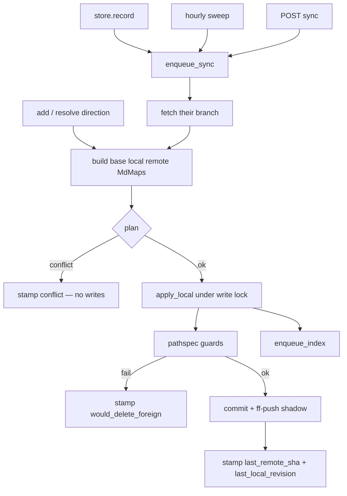

# Phase 13 — Bidirectional folder sync (one repo = one folder)

**Status:** DESIGN. Do not implement until explicit go.
**Umbrella:** [`00-umbrella-plan.md`](00-umbrella-plan.md).
**Supersedes** the *product* of [`12-connect-own-remote.md`](12-connect-own-remote.md) (push whole KB `HEAD` onto an empty branch). Phase 12 code (GitHub App, GitLab PAT, `WorkspaceRemotes`, Celery hook) stays; the **mirror** replaces “push our store history.”
**Product lock:** Rohan — option **2 now, 3 later**. One connected GitHub/GitLab repo lands as one folder under `/documents`. Several remotes later is the same row twice, disjoint folders. v1 product allows **one** connection; the table is already a collection (`ponytail` on `uq_workspace_git_remotes_workspace`).

Not a connector. Not gitingest. Not Wiki.js (DB ↔ git). Postgres stays a one-way projection of **our** store after we write it.

---

## 0. Goal

A git-native workspace attaches **one** user-owned GitHub or GitLab repo under a **reserved mount** in the documents tree (`documents/GitHub/…` or `documents/GitLab/…`). Markdown under that mount and markdown under `{sourcepath}` on their repo stay in bijection. User notes, artifacts, and uploads stay **outside** that mount and never leave SurfSense. The rest of their repo (`src/`, lockfiles, images in `docs/`) is never imported and never deleted.

Users clone **their** forge repo, edit `{sourcepath}`, push; SurfSense pulls into the mount. We do not host git. The folder name is **derived** (forge + `owner/repo` + sourcepath), not a user-picked `app` slug — so it cannot clash with `documents/app/` and a second repo named `app` cannot collide with the first.

UI: **Connect GitHub/GitLab** next to Upload; the result is a normal folder. Settings keep status / retry / disconnect / conflict resolve.

---

## 0b. Borrowed from, not invented

| What we do | Borrowed from | Why |
|---|---|---|
| `(repo, branch, sourcepath)` ↔ one space folder | **GitBook** `content.directory` / project directory; **Mintlify** docs subdirectory | Monorepo-safe. Siblings are out of scope by construction. |
| First sync picks a winner | **GitBook** initial direction (they warn the destination can be replaced) | No base → 3-way is undefined. Silent merge of two md sets is how notes vanish. |
| Escape hatch = overwrite Git or overwrite us | **ReadMe** conflict: “Overwrite Git changes” or cancel | No conflict-editor product in v1. Two explicit buttons, never auto-merge file bytes. |
| Fast-forward only, never `--force` | git receive-pack default; GitBook; Phase 12 | A race on their branch is an error, not a wipe. |
| HTTPS token at push time, never in `remote.url` | Phase 12 / dulwich#1505 | Already shipped. |
| Status stamps + retry, not a sync state machine | Phase 12, Obsidian Git status bar | Add pull/conflict codes next to push stamps. |
| Unlink does not delete their GitHub | **GitBook** unlink | Their repo is theirs. Local folder stays as notes. |
| Do **not** share one git object graph | GitBook synthesizes a commit on GitHub; we already have a store | Path mapping (`documents/GitHub/acme/app/docs/x.md` vs `docs/x.md`) makes `git push` of *our* repo destructive or ugly. |
| Do **not** two-way DB ↔ git | **Wiki.js** #7860 (ADR 0001) | Pull writes **git store** then converge. Same one-way derivation as every other writer. |

### Explicitly not copying

| Source | What they do | Why we do not |
|---|---|---|
| Phase 12 | Push full local history; empty branch required | That dumps `documents/` onto GitHub and forbids a real docs folder in a monorepo. |
| **ReadMe** (setup) | Empty **repo** required | Kills monorepos. We own a *prefix*, not the tree. |
| **GitBook** (full) | Live-edit lock, change requests, block-level conflict UI | Second product. v1 fails closed + overwrite buttons. |
| **Mintlify** | GitHub is the store; they own the whole docs folder including mdx/json/images | Our KB is md-only. We pathspec `.md` so a png in `docs/` is not deleted. |
| **Obsidian Git** | `<<<<<<<` markers, commit-pull-push with weak conflict UX | Hosted + agent. We never write conflict markers into the KB. |
| Literal **git submodules** | gitlink + nested `.git` | Fights one store, one lock, per-turn worktrees. The *folder* is the UX. |
| GitHub **Contents API** as the store | Decap / Tina | We already have dulwich + Redis lock. |

---

## 1. Locked decisions

| Decision | Lock |
|---|---|
| Shape | One connection = mount `documents/{GitHub\|GitLab}/{full_name}/{sourcepath}/` ↔ `{sourcepath}/` on `{url}` `{branch}`. |
| How many (product) | **One** per workspace in v1 (`already_exists` if a row exists). Table unique stays. Drop unique later for option 3 — mounts stay disjoint by construction (`full_name` + `sourcepath`). |
| Auth / hosts | Unchanged from Phase 12: GitHub App, GitLab PAT, `github.com` / `gitlab.com` HTTPS. |
| Clone | Users clone the **forge** URL. We never expose the workspace store as a clone URL. |
| File set | **`.md` only** (case-sensitive paths). Bijection is the relative path of every `.md` under the two prefixes. |
| Empty folders / `.keep` | Not in the bijection. Empty dirs may not round-trip. |
| Non-md under `sourcepath` | Out of the bijection: never import, never stage, never delete. |
| Outside `sourcepath` | Never read, never write, never delete. |
| Outside the mount | Never pushed. `documents/notes/`, `documents/Artifacts/`, and any folder not under `GitHub/` or `GitLab/` stay here. |
| Mount (local path) | **Derived, not a picker.** `documents/{GitHub\|GitLab}/{full_name}/{sourcepath}/`. `full_name` is `owner/repo` (GitLab may be `group/sub/repo`). Each URL path segment sanitized; `..` rejected. Empty `sourcepath` omits that segment (files sit in the repo folder). Reserved top-level names, same class as `Artifacts`: **`GitHub`**, **`GitLab`**. Users do not create those folders by hand; connect owns them. |
| `sourcepath` | Relative, no `..`, no leading `/`. Default **`docs`**. Empty = repo root (docs-only repos). |
| Histories | **Independent.** Mirror copies bytes; we commit on *their* checkout and on *our* store separately. |
| 3-way | After first successful sync, every pull/push runs the same planner (`plan()`, §4). Same path edited on both sides with different bytes → **conflict**, apply **nothing**. |
| First sync | No base. User passes `direction`: `from_remote` \| `from_local`. Missing → 409 `need_direction` if both sides have md. |
| Conflict resolve | Same two directions, whole prefix (not per-file). `theirs` = replace local folder md with remote md set. `ours` = replace remote md set with local folder. Then a normal sync stamps a new base. |
| Force-push | **Never.** |
| Push of our store `HEAD` | **Never** (that is Phase 12). Push is the shadow checkout of *their* repo, md pathspec only. |
| Write lock | Hold the workspace Redis lock for **store** writes (pull apply). Do **not** hold it for fetch/push network. If a turn worktree exists, **defer** pull (retry); never mutate `documents/` under an open copy. |
| Save latency | Sync is Celery, fire-and-forget. Editor/agent commit still succeeds if enqueue fails (Phase 12 queue contract). |
| Webhooks | **Not v1.** Fetch-before-sync + the existing hourly sweep is enough for correctness. GitHub App `push` webhook is a later latency cut. |
| Existing Phase 12 rows | No `sourcepath` (legacy export) → worker stamps `reconnect_required`, does not push `HEAD`. User disconnects and reconnects. |

---

## 2. Path map

Local prefix is **computed** from the connection (no `local_folder` column, no user slug):

```
mount  = documents/{GitHub|GitLab}/{full_name}/{sourcepath}/
         # {sourcepath}/ omitted when sourcepath is empty

local:  {mount}{rel}
remote: {sourcepath}/{rel}          # sourcepath empty ⇒ {rel} at repo root
```

`rel` is posix, no `..`, must end in `.md`. Reject (`unsafe_path`) on connect and on every sync tick if any listed path escapes the mount or the remote prefix.

Why a reserved parent + `owner/repo` + `sourcepath`, not `documents/app/`:

| Clash | `documents/app/` | `documents/GitHub/acme/app/docs/` |
|---|---|---|
| User already has a notes folder `app` | Connect overwrites or 409 | Mount is under `GitHub/`, notes stay |
| Two remotes both named `app` (option 3) | Second wins / overlap | `acme/app` vs `other/app` are different mounts |
| Same repo, two docs dirs later | Need another slug | `…/app/docs` vs `…/app/handbook` |
| Agent / humans spotting synced files | Looks like any folder | Everything synced lives under `GitHub/` or `GitLab/` |

One reserved root `documents/git/` with `github` nested inside would also work. Two roots (`GitHub`, `GitLab`) match the sidebar: you see which forge, no extra wrapper. Same idea as `documents/Artifacts/` — a **kind**, not a repo nickname.

```
github.com/acme/app  @ main  @ docs/
  src/                 (untouched)
  docs/intro.md     ←──►  documents/GitHub/acme/app/docs/intro.md
  docs/guides/a.md  ←──►  documents/GitHub/acme/app/docs/guides/a.md
  docs/logo.png        (untouched)
documents/app/notes.md     (untouched — user's folder, not the mount)
documents/notes/x.md       (untouched)
documents/Artifacts/       (untouched — reserved, like GitHub/GitLab)
```

---

## 3. Architecture

**Constraints:** one workspace git store, one write lock, hosted multi-process (uvicorn + Celery). Lifespan: long-term; v1 is one remote.

```
                    ┌─────────────────────────────────────────┐
  editor/agent/     │  KnowledgeStore (documents/**)          │
  ingest            │  one dulwich repo, Redis lock           │
        │           └──────────┬──────────────────────────────┘
        ▼                      │ after record: if prefix dirty
  store.record                 │
        ├─ enqueue_index       ▼
        └─ enqueue_sync ──► Celery sync_task
                                 │
                    ┌────────────┴────────────┐
                    ▼                         ▼
             shadow clone               store (our git)
             of THEIR repo              documents/GitHub\|GitLab/…/
             fetch branch
             list {sourcepath}/**/*.md
                    │                         │
                    └────────► plan() ◄───────┘
                               │
                    conflict ──► stamp, write nothing
                    ok ──► apply to store (lock)
                           write md pathspec on shadow
                           commit + ff-push their branch
                           stamp base
```

**Boundaries**

| Boundary | Reason |
|---|---|
| `plan()` is pure | All paths (first sync, pull, push, resolve) share one function. Tests do not need git. |
| Shadow clone ≠ store | Their `.git` must not live inside our working tree. Path: `{KNOWLEDGE_STORE_ROOT}/{ws}/remotes/{remote_id}/`. |
| Forge credentials | Unchanged Phase 12 `RemoteProvider`. Sync never sees a token in a URL. |
| Converge | Pull is just another store writer. Index/Zero stay one-way git → PG. |

**Trade-off:** directory mirror + 3-way instead of `git pull` on our repo — because the path prefixes differ. Accepted: we do not share commit SHAs with GitHub. Gained: monorepo-safe pathspec, no force-push of `documents/`.

**Complexity:** `plan()` is required (evidence: ignore-then-push deletes files; push-without-fetch deletes remote-only md). Conflict UI, webhooks, N remotes are not.

---

## 4. The planner (one function, every path)

```python
# relpath → bytes. Missing key = file does not exist.
MdMap = dict[str, bytes]

@dataclass(frozen=True)
class SyncPlan:
    apply_local: MdMap   # writes/deletes on documents/{folder}/ ; None-as-delete via tombstone
    # ponytail: use a small Apply op {path, bytes | None} if a tombstone in the dict is unclear.

@dataclass(frozen=True)
class SyncConflict:
    paths: tuple[str, ...]

def plan(base: MdMap, local: MdMap, remote: MdMap) -> SyncPlan | SyncConflict:
    """3-way on the md bijection. Equal bytes = equal. No textual merge."""
```

Per path in `union(base, local, remote)`:

| local vs base | remote vs base | local vs remote | Result |
|---|---|---|---|
| equal | equal | — | skip |
| equal | changed | — | take remote (add/update/delete) |
| changed | equal | — | keep local (will push) |
| changed | changed | equal | skip (same edit) |
| changed | changed | different | **conflict** that path |

If any conflict: return `SyncConflict`, **do not apply a subset**.

Deletes: path in `base` and missing on one side is a change. Remote deleted + local unchanged → delete local. Both deleted → skip. Local deleted + remote edited → conflict.

**Base** after a successful sync is reconstructible — do not persist the whole map:

- `last_remote_sha` — their branch tip we last agreed with
- `last_local_revision` — our store HEAD after we applied that sync

`base` = md files at `sourcepath` on `last_remote_sha` (shadow) **or** equivalently `documents/{folder}` at `last_local_revision` (store). They must match after a successful sync; if they do not, stamp `base_drift` and refuse (reconnect / overwrite). That guard is cheaper than a silent split-brain.

**First sync / resolve:** no `plan()`. `from_remote` sets local folder md := remote md set (delete local md not on remote, write the rest). `from_local` sets remote md set := local folder md (pathspec add/update/delete `.md` only). Then stamp base.

---

## 5. Bidirectional paths

Every path either calls `plan()` or an explicit direction. Nothing else writes the bijection.

### 5.1 Connect (`add`)

1. Git-native? else `not_git_native`.
2. v1: no existing row, else `already_exists`.
3. Validate `sourcepath`, URL (Phase 12 forge `validate`). Derive `full_name` from the URL; build `mount`.
4. If `documents/GitHub/` or `documents/GitLab/` already has files **outside** this mount (user-created, or another remote when unique is dropped) → `prefix_forbidden`. Empty reserved roots are fine.
5. Fetch their branch into a new shadow (create branch on first `from_local` if missing — same as GitBook).
6. Count md on both sides of the map.
7. Direction:
   - both empty → stamp row, base = empty, done (later edits push).
   - only remote has md → default `from_remote` (or require it in the API; UI can omit the picker).
   - only local has md (folder already exists with files) → default `from_local`.
   - both have md → require `direction`, else `need_direction` (409). UI shows the GitBook warning.
8. Apply direction, `enqueue_index`, stamp base, clear errors.

Do **not** 409 `not_empty` on the branch. Non-empty is normal.

### 5.2 After a store revision (push side)

`enqueue_sync` next to `enqueue_index` (replace `enqueue_push` as the after-record hook).

Worker:

1. No remotes / not git-native → no-op.
2. If `last_error` is `conflict` \| `need_direction` \| `reconnect_required` → no-op until resolve (do not push; that is the destructive path).
3. Changed paths in this revision ∩ `{mount}/**` empty → no-op for that remote.
4. If a turn worktree exists → retry later (`worktree_busy`).
5. Fetch their branch. Non-ff we will see after we try to push; fetch always.
6. Build `base`, `local`, `remote` maps. `plan()`.
7. Conflict → stamp `conflict` + paths, **write nothing**.
8. Else apply `apply_local` under the write lock (one `transaction`). Then write the **merged** local md set onto the shadow prefix (`git add` only `sourcepath/**/*.md` and deletions of those). Guard §7. Commit if dirty. `push` ff-only. Failure → `diverged` or `forge`, store unchanged from this step’s apply… **ordering:**

**Durability order (no 2PC):**

- Prefer: fetch + `plan()` **before** any store write. If conflict, stop.
- Apply local, then shadow write + push.
- If apply succeeds and push fails (`diverged`): local already has remote-only files (good). Stamp error, **do not** roll back the store (those files are the right pull). Retry will fetch and `plan()` again.
- If apply fails: no push. Store unchanged.

Never: push first then pull (that is Phase 12 and deletes remote-only md).

### 5.3 Sweep / manual retry (pull side)

Same worker as 5.2. Sweep: remotes whose `last_remote_sha` ≠ `ls_remote` tip (or stamp behind), cap like index sweep. Manual: `POST .../sync` (replaces retry-push).

GitLab v1 = sweep only. GitHub v1 = sweep too (webhook later).

### 5.4 GitHub push while we also saved

3-way: different files → both kept. Same file different bytes → `conflict`, both sides unchanged from the planner’s point of view (we apply nothing). User hits **Use GitHub** or **Use SurfSense** (5.5).

### 5.5 Resolve

`POST .../git-remotes/resolve` `{ "direction": "from_remote" | "from_local" }`. Same body as first-sync direction. Clears `conflict`. Then `enqueue_sync` is a no-op until the resolve worker runs the replace and stamps base.

### 5.6 Disconnect (`remove`)

Delete the row, delete the shadow clone. **Do not** delete `{mount}/`. **Do not** delete GitHub. The mount becomes ordinary notes (still under `GitHub/` / `GitLab/` until they move or delete it).

### 5.7 Delete / rename an `.md` on one side

In the bijection; `plan()` sees add/delete. Rename without git rename detection = delete + add (two paths). If the other side edited the old path → conflict on the old path; new path is local-only (or remote-only). Acceptable v1.

### 5.8 Agent / editor inside the folder

Normal store writes. After record, 5.2. Silent commits stay. GitHub history is “a commit when we sync,” not one commit per keystroke — we may coalesce: worker always mirrors **current** folder md set, not each store revision. (`ponytail:` one sync per enqueue; extra enqueues no-op if maps already match and `last_remote_sha` is tip.)

### 5.9 Files we must never touch

| Location | Pull | Push |
|---|---|---|
| `src/app.ts` | ignore | not staged |
| `docs/logo.png` | ignore | not staged (still on GitHub after push) |
| `documents/notes/x.md` | — | not in this remote’s mount |
| `documents/GitHub/acme/app/docs/secret.md` created here | — | **is** in the bijection (will appear on GitHub under `docs/`). Expected: the mount *is* the synced set. |

### 5.10 Worktree vs pull

Open `thread-*` copy → skip apply, retry (Celery countdown). Do not rebase the copy. The turn commits against the old base; the next sync 3-ways that commit against GitHub.

---

## 6. Error catalog (fail closed, never silent)

HTTP on verbs; worker stamps `last_error_code` + `last_error` (human) + optional `last_conflict_paths` (newline or JSON list). UI shows the code’s copy, not a raw traceback. Retry is safe: worker no-ops until the blocking code is cleared or the user resolves.

| code | HTTP | Who writes | Store | GitHub | User |
|---|---|---|---|---|---|
| `not_git_native` | 409 | add | — | — | flip workspace |
| `already_exists` | 409 | add | — | — | disconnect first (v1) |
| `invalid_spec` | 400 | add | — | — | fix URL / sourcepath |
| `prefix_forbidden` | 409 | add | — | — | move files out of `documents/GitHub/` or `GitLab/` that are not this mount |
| `unsafe_path` | 400 / stamp | add, sync | no write | no push | path escaped prefix |
| `need_direction` | 409 | add | — | — | pick GitHub→here or here→GitHub |
| `conflict` | stamp | sync | **no apply** | **no push** | Use GitHub / Use SurfSense, or edit one side so bytes match |
| `diverged` | stamp | push | keep last apply | not updated | retry (fetch + plan again) |
| `worktree_busy` | stamp (soft) | sync | no apply | no push | retry; not shown as a red error if it clears |
| `reconnect_required` | stamp | legacy row | no Phase-12 push | — | disconnect + connect as a folder |
| `base_drift` | stamp | sync | no apply | no push | overwrite either side (resolve) |
| `would_delete_foreign` | stamp | pre-push guard | no push | — | bug if hit; do not continue |
| `auth` / `forge` | 401/503 / stamp | creds, fetch, push | no apply if before plan | — | reconnect token / App |
| `missing` | 404 | get | — | — | — |

**Conflict copy (settings + toast on retry):**  
“SurfSense and GitHub both changed: `docs/intro.md`. Nothing was overwritten. Use GitHub, use SurfSense, or edit that file on one side and retry.”

**Direction copy (connect, both have md):**  
“Both the folder and `{sourcepath}` already have markdown. One side will be replaced.” (GitBook’s warning.)

Never write `<<<<<<<` into a document.

---

## 7. Destructive-sync guards (pre-push checklist)

Run on the shadow repo **after** staging, **before** `commit`/`push`. Any fail → `would_delete_foreign` or `unsafe_path`, abort, no commit.

1. Every staged path is under `{sourcepath}/` (or repo root if sourcepath empty).
2. Every staged path is `*.md` (adds, mods, deletes).
3. `git diff --cached` does not include a non-md path (png, `.js`, `src/`).
4. `force=False` on push.
5. `plan()` was `SyncPlan` this tick, or this tick is an explicit `from_local` resolve.
6. `last_error_code` was not `conflict` at the start of the tick unless this is resolve.

These are the mechanical version of “we only manage md in that folder.”

---

## 8. Module — still `knowledge_store/remote/`

Phase 12 layout stays. Add the mirror; stop treating `engine.push` of **our** store as the product.

```
knowledge_store/remote/
  facade.py          # add/remove/list/credentials + resolve(direction)
  queue.py           # enqueue_sync (rename from enqueue_push; same cheap import)
  planner.py         # plan() — pure, no git, no PG
  paths.py           # mount() from provider+url+sourcepath; validate segments
  shadow.py          # fetch/list md/write pathspec/commit/ff-push on THEIR clone
  guards.py          # §7 checklist
  sync.py            # worker body: maps → plan → apply → guard → push → stamp
  exceptions.py      # extend RemoteErrorCode
  schemas/           # spec grows sourcepath, direction (mount is derived)
  persistence/       # columns below
  forges/            # unchanged
  api/               # add sourcepath/direction; POST sync; POST resolve
```

Celery: `push_task.py` becomes `sync_task.py` (or the same file, new name). After-record calls `enqueue_sync`.

`GitContentEngine.push` of the **store** is unused by this phase. Leave the method; do not call it from the worker.

Shadow is **not** the store engine. Small dulwich helper in `shadow.py` (fetch, checkout, pathspec add). If it grows, it is still not `VersionedContentEngine` — different tree, different lock.

### Persistence (new columns on `workspace_git_remotes`)

| Column | Notes |
|---|---|
| `sourcepath` | `docs` or `""` |
| `last_remote_sha` | their tip we last agreed |
| `last_local_revision` | our store SHA after that agree |
| `last_synced_at` | |
| `last_error_code` | catalog §6, nullable |
| `last_conflict_paths` | text, nullable |
| existing push stamps | keep or fold into last_error; do not invent a second status UI |

`last_pushed_revision` can remain as “last sha we sent to them” (= `last_remote_sha` after a push). Prefer one pair: `last_remote_sha` + `last_local_revision`.

### HTTP

Keep list/add/delete/github install. Change add body. Replace push-retry with sync.

| Method | Path | |
|---|---|---|
| `POST` | `/workspaces/{id}/git-remotes` | `add` (+ `sourcepath`, optional `direction`) |
| `POST` | `/workspaces/{id}/git-remotes/sync` | `enqueue_sync` |
| `POST` | `/workspaces/{id}/git-remotes/resolve` | `{direction}` then enqueue |

### UI

- `DocumentsFilters`: button next to Upload → opens the same connect dialog as settings (or navigates to git-remote with a query). Do not invent a second connect API.
- Tree: no new type. After connect, `documents/GitHub/{full_name}/{sourcepath}/` (or `GitLab/…`) appears.
- Settings: sourcepath (default `docs`); last sync; error copy; **Use GitHub** / **Use SurfSense** when `conflict` or `need_direction`; disconnect; retry sync. **No folder-name field** — the tree path is derived from forge + repo + sourcepath.
- Copy: stop saying “empty repo / push only.”

---

## 9. Execution slices (TDD, one behavior at a time)

Do not write the suite up front. Vertical.

1. **`plan()` unit.** Tables in §4: take remote, keep local, equal skip, same-edit skip, conflict applies nothing, delete vs edit conflict.
2. **Path map + validate.** `documents/GitHub/acme/app/docs/a.md` ↔ `docs/a.md`; empty sourcepath omits the extra segment; `..` rejected; user folder `documents/app/` is not the mount.
3. **Guards.** Staged png or `src/` fails; md-only under prefix passes.
4. **Shadow pathspec.** Two temp repos. Write md + a png on B under `docs/`. Sync from A’s mount: png still on B, extra md on B that is not in the bijection stays, md set matches.
5. **First sync `from_remote`.** Non-empty `docs/` lands as `documents/GitHub/acme/app/docs/**`. Store revision + index enqueue.
6. **First sync both dirty without direction.** 409 `need_direction`. Nothing written.
7. **After-record sync.** Commit under the mount enqueues; commit under `notes/` does not push that remote.
8. **Conflict.** Same relpath different bytes vs base → stamp `conflict`, local bytes and remote bytes unchanged.
9. **Resolve `from_remote`.** Mount md set becomes remote md set; base stamped; error cleared.
10. **Worktree busy.** Open copy → no apply; retry does.
11. **Legacy row.** Missing `sourcepath` (Phase-12 export) → `reconnect_required`, no `engine.push` of store HEAD.
12. **UI.** Upload-adjacent button; settings fields; conflict buttons.

---

## 10. Out of scope

- Option 3 (N remotes) as a product — unique constraint stays; overlap check is written so dropping unique is enough
- Option 1 (whole `/documents` = the repo)
- Hosting git / clone-SurfSense
- Git submodules, subtree split, Contents API
- Webhooks, GitHub Enterprise, self-hosted GitLab, Gitea
- Conflict editor, live-edit lock, change requests
- Front-matter / disaster-recovery-from-clone
- Syncing binaries / images / `.keep`
- Mapping two remotes onto overlapping folders
- Squash of agent-turn history on GitHub

---

## 11. Files

| Area | Path |
|---|---|
| Planner | `knowledge_store/remote/planner.py` |
| Paths / guards / shadow / sync | `remote/paths.py`, `guards.py`, `shadow.py`, `sync.py` |
| Queue | `remote/queue.py` (`enqueue_sync`) |
| Facade | `add` / `resolve`; stop `enqueue_push` of store HEAD |
| Worker | `tasks/celery_tasks/knowledge_store/sync_task.py` (replace push_task body) |
| After record | `service.py` → `enqueue_sync` |
| Model | alembic: `sourcepath`, base SHAs, `last_error_code` |
| HTTP / UI | `remote/api/`, `git-remote-settings.tsx`, `DocumentsFilters.tsx` |
| Tests | `tests/unit/knowledge_store/remote/test_planner.py` first; integration shadow+store |

---

## 12. Do not add

- `GitRemote.push` that pushes **our** store onto origin
- Writing `origin` into the **store** `.git/config`
- Textual merge or `<<<<<<<` in KB files
- `git add -A` on the shadow (including `sourcepath/`)
- Per-file keep-ours/theirs in v1 (whole-prefix resolve only)
- A second connect protocol besides `WorkspaceRemotes.add`
- Treating this as `GITHUB_CONNECTOR`



---

## 13. Go / no-go

Execution starts only when the user says **go**. Until then this file is the spec.

**Ready to implement when:** option 2 is still the product, Phase 12 GitHub App env still works, and we accept fail-closed conflicts (no merge UI in v1).
